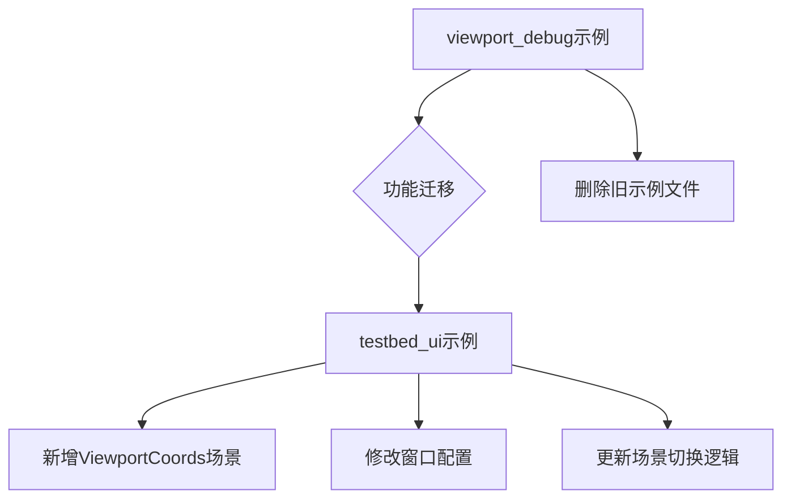

+++
title = "#22050 Adds ViewportCoords Scene to examples/testbed/ui, Removes viewport_debug example"
date = "2025-12-16T00:00:00"
draft = false
template = "pull_request_page.html"
in_search_index = false

[extra]
current_language = "zh-cn"
available_languages = {"en" = { name = "English", url = "/pull_request/bevy/2025-12/pr-22050-en-20251216" }, "zh-cn" = { name = "中文", url = "/pull_request/bevy/2025-12/pr-22050-zh-cn-20251216" }}
+++

# 标题

## 基本信息
- **标题**: Adds ViewportCoords Scene to examples/testbed/ui, Removes viewport_debug example
- **PR链接**: https://github.com/bevyengine/bevy/pull/22050
- **作者**: kfc35
- **状态**: 已合并
- **标签**: C-Examples, A-UI, S-Ready-For-Final-Review, C-Testing, X-Uncontroversial, D-Straightforward, M-Deliberate-Rendering-Change
- **创建时间**: 2025-12-06T22:04:35Z
- **合并时间**: 2025-12-16T17:17:37Z
- **合并者**: alice-i-cecile

## 描述翻译

# 目标

- 关闭 #21806

## 解决方案

- 将 `viewport_debug` 示例中的 `spawn_with_viewport_coords` 包含的设置复制到 ui testbed 中的独立场景。Testbed 默认生成 1280 x 720 分辨率的窗口，因此看起来相同。我仍明确设置了大小并将 resizable 设置为 false 以适应此新场景。
- 移除 `viewport_debug` 示例（不过，说实话，我在考虑是否真的值得保留它，因为它可能在某些情况下对调试有用。**欢迎就删除 `viewport_debug` 提出第二意见**）。

## 测试

运行 `cargo run --example testbed_ui` 并通过截图将新的 `ViewportCoords` 场景与 `viewport_debug` 示例（`cargo run --example viewport_debug`）进行比较。它们看起来相同。

---

## 展示

要查看该场景，检出该分支并运行 `cargo run --example testbed_ui`。按空格键 12 次以查看新场景。


## 本Pull Request的技术分析

这个PR主要处理了两个问题：UI示例的整合和代码库的简化。PR #22050通过将 `viewport_debug` 示例的功能迁移到 `testbed_ui` 示例中，解决了示例代码重复的问题，同时保持了相同的功能展示。

### 问题与背景

在Bevy的示例代码中，存在一个名为 `viewport_debug` 的独立示例，专门用于展示和调试视口坐标系（viewport coordinates）的使用。同时，`testbed_ui` 示例是一个综合性的UI测试平台，包含多个UI场景，用户可以通过空格键在不同场景间切换。这两个示例都展示了UI布局功能，但维护两个独立的示例导致了代码重复和管理开销。

### 解决方案

开发者选择了最直接的解决方案：将 `viewport_debug` 示例的核心功能集成到 `testbed_ui` 示例中，作为一个新的场景（Scene）。这样做的优势包括：
1. 减少代码重复：不再需要维护两个独立的示例文件
2. 统一用户体验：用户可以在一个应用中查看所有UI相关示例
3. 简化构建过程：减少了一个独立的可执行文件

### 具体实现

实现过程分为三个主要部分：

首先，修改了 `testbed_ui` 示例的窗口配置。由于原来的 `viewport_debug` 示例依赖特定的窗口尺寸（1280x720）并且禁止窗口调整大小，新的集成场景也需要相同的配置。开发者修改了窗口插件的设置：

```rust
app.add_plugins(DefaultPlugins.set(WindowPlugin {
    primary_window: Some(Window {
        // The ViewportCoords scene relies on these specific viewport dimensions,
        // so let's explicitly define them and set resizable to false
        resolution: (1280, 720).into(),
        resizable: false,
        ..Default::default()
    }),
    ..Default::default()
}))
```

其次，在场景枚举中增加了 `ViewportCoords` 场景，并在场景切换逻辑中将其插入到正确的位置：

```rust
enum Scene {
    // ... 其他场景
    Transformations,
    #[cfg(feature = "bevy_ui_debug")]
    DebugOutlines,
    ViewportCoords,  // 新增场景
}
```

第三，从原来的 `viewport_debug` 示例中提取了 `spawn_with_viewport_coords` 函数的核心逻辑，将其重新组织为一个独立的模块 `viewport_coords`：

```rust
mod viewport_coords {
    use bevy::{color::palettes::css::*, prelude::*};

    const PALETTE: [Srgba; 9] = [RED, WHITE, BEIGE, AQUA, CRIMSON, NAVY, AZURE, LIME, BLACK];

    pub fn setup(mut commands: Commands) {
        // 核心UI布局代码
        commands.spawn((Camera2d, DespawnOnExit(super::Scene::ViewportCoords)));
        // ... UI节点创建逻辑
    }
}
```

这个新模块展示了各种视口单位（viewport units）的使用，包括：
- `vw()`: 视口宽度的百分比
- `vh()`: 视口高度的百分比  
- `vmin()`: 视口较小尺寸的百分比
- `vmax()`: 视口较大尺寸的百分比

### 技术细节

值得注意的是，开发者只保留了原来 `viewport_debug` 示例中的视口坐标系部分，移除了像素坐标系的对比展示。这是因为 `testbed_ui` 示例主要是为了展示功能而非对比测试。同时，颜色调色板也从原来的10种颜色减少到9种，移除了用于对比的黄色。

### 影响与结果

这个PR的主要影响是：
1. 代码库更简洁：移除了222行的示例代码文件
2. 功能未丢失：所有视口坐标系的功能都得到了保留
3. 更好的组织结构：相关功能被整合到统一的测试平台中

开发者还在PR描述中提出了一个值得讨论的问题：是否应该完全删除 `viewport_debug` 示例？虽然最终决定是删除，但这个考虑显示了开发团队对代码维护性的关注。

## 可视化关系图



## 关键文件变更

### 1. `examples/ui/viewport_debug.rs` (+0/-222)
这个文件被完全删除。原来它包含一个完整的独立示例，展示了视口坐标系和像素坐标系的对比。

**之前的内容**：
```rust
//! A simple example for debugging viewport coordinates
//!
//! This example creates two UI node trees, one using viewport coordinates and one using pixel coordinates,
//! and then switches between them once per second using the `Display` style property.
//! If there are no problems both layouts should be identical, except for the color of the margin changing which is used to signal that the displayed UI node tree has changed
//! (red for viewport, yellow for pixel).
use bevy::{color::palettes::css::*, prelude::*};

const PALETTE: [Srgba; 10] = [
    RED, YELLOW, WHITE, BEIGE, AQUA, CRIMSON, NAVY, AZURE, LIME, BLACK,
];

// ... 完整示例代码
```

### 2. `examples/testbed/ui.rs` (+113/-16)
这是主要的修改文件，增加了新场景并修改了配置。

**关键变更**：
- 窗口配置：设置了固定分辨率1280x720并禁用窗口调整大小
- 场景枚举：添加了`ViewportCoords`变体
- 场景切换逻辑：更新了`Next` trait的实现
- 新模块：添加了`viewport_coords`模块，包含UI布局逻辑

```rust
// 窗口配置变更（新增）
app.add_plugins(DefaultPlugins.set(WindowPlugin {
    primary_window: Some(Window {
        resolution: (1280, 720).into(),
        resizable: false,
        ..Default::default()
    }),
    ..Default::default()
}))

// 场景枚举变更（新增ViewportCoords）
enum Scene {
    // ... 其他场景
    ViewportCoords,
}

// 场景切换逻辑变更
impl Next for Scene {
    fn next(&self) -> Self {
        match self {
            // ... 其他场景切换
            Scene::Transformations => Scene::ViewportCoords,
            Scene::ViewportCoords => Scene::Image,
        }
    }
}
```

### 3. `Cargo.toml` (+0/-11)
移除了`viewport_debug`示例的配置条目。

**删除的内容**：
```toml
[[example]]
name = "viewport_debug"
path = "examples/ui/viewport_debug.rs"
doc-scrape-examples = true

[package.metadata.example.viewport_debug]
name = "Viewport Debug"
description = "An example for debugging viewport coordinates"
category = "UI (User Interface)"
wasm = false
```

### 4. `examples/README.md` (+0/-1)
更新了示例列表，移除了对`Viewport Debug`示例的引用。

## 进一步阅读

1. **Bevy UI系统文档**: 了解Bevy的UI系统和视口坐标系
2. **视口单位规范**: CSS视口单位（vw, vh, vmin, vmax）的工作方式
3. **示例代码组织**: 软件项目中示例代码的最佳实践和组织模式
4. **测试驱动开发**: 如何通过示例和测试用例来验证功能