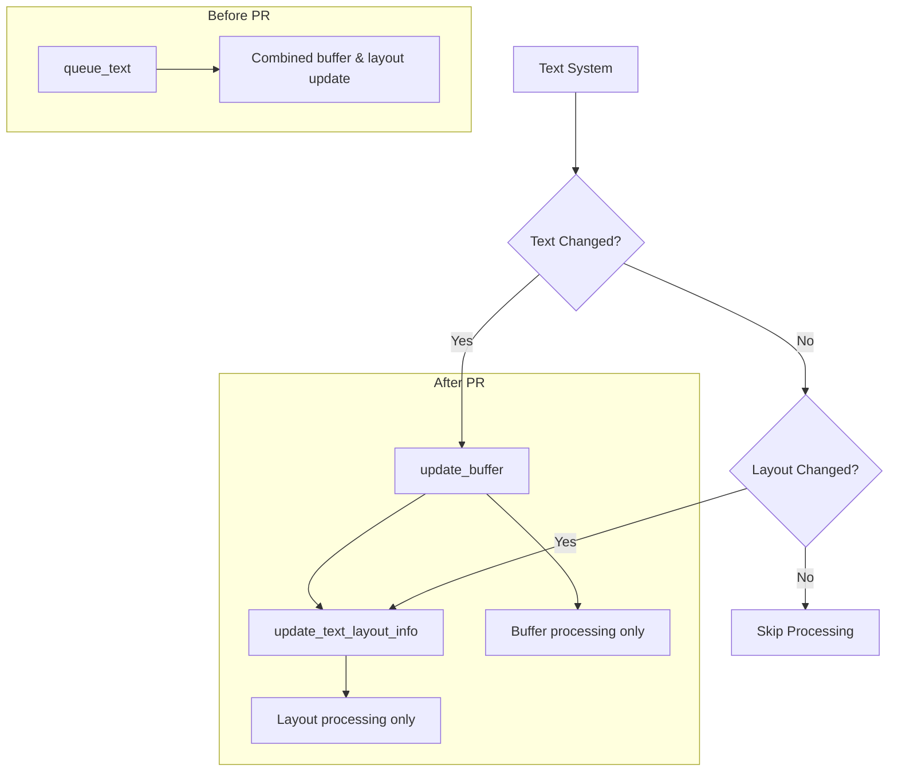

+++
title = "#22051 Remove queue text"
date = "2025-12-10T00:00:00"
draft = false
template = "pull_request_page.html"
in_search_index = true

[taxonomies]
list_display = ["show"]

[extra]
current_language = "en"
available_languages = {"en" = { name = "English", url = "/pull_request/bevy/2025-12/pr-22051-en-20251210" }, "zh-cn" = { name = "中文", url = "/pull_request/bevy/2025-12/pr-22051-zh-cn-20251210" }}
labels = ["C-Code-Quality", "A-Text", "D-Straightforward"]
+++

# Title
Remove queue text

## Basic Information
- **Title**: Remove queue text
- **PR Link**: https://github.com/bevyengine/bevy/pull/22051
- **Author**: ickshonpe
- **Status**: MERGED
- **Labels**: C-Code-Quality, S-Ready-For-Final-Review, A-Text, D-Straightforward
- **Created**: 2025-12-06T22:47:26Z
- **Merged**: 2025-12-10T20:11:24Z
- **Merged By**: alice-i-cecile

## Description Translation

# Objective

Remove the `queue_text` function as redundant.

## Solution

* Remove `queue_text` from `TextPipeline`.
* In `update_text2d_layout`, instead of `queue_text`, call `TextPipeline::update_buffer` and then `TextPipeline::update_text_layout`.

## The Story of This Pull Request

This PR addresses a code quality issue in Bevy's text rendering system by removing redundant functionality. The `queue_text` function in `TextPipeline` was identified as unnecessary because its responsibilities could be handled more directly by existing methods. This change simplifies the text rendering pipeline while maintaining the same functionality.

The problem stemmed from having two different approaches to text processing that essentially did the same thing. The `queue_text` function was a convenience wrapper that combined two operations: updating the text buffer and updating the layout information. However, these operations were already available as separate functions (`update_buffer` and `update_text_layout_info`), and in some cases, callers needed more control over when each operation occurred.

The implementation approach was straightforward: remove the redundant function and update its callers to use the two separate functions directly. This required changes in two key systems: the 2D text layout system (`update_text2d_layout`) and the UI text system (`text_system`). Both systems were performing similar text processing but with slightly different requirements.

In `update_text2d_layout`, the logic was refactored to separate the buffer update from the layout update. This separation is important because buffer updates are only needed when the text content changes, while layout updates might be needed when other factors change (like bounds or scale). The system now checks for text changes separately and only updates the buffer when necessary:

```rust
let text_changed = scale_factor != text_layout_info.scale_factor
    || block.is_changed()
    || computed.needs_rerender()
    || (!reprocess_queue.is_empty() && reprocess_queue.remove(&entity));

if !(text_changed || bounds.is_changed()) {
    continue;
}

if text_changed {
    match text_pipeline.update_buffer(...) {
        // Handle errors and queue reprocessing if fonts aren't loaded
    }
}

match text_pipeline.update_text_layout_info(...) {
    // Update layout with the current buffer state
}
```

The technical insight here is that by separating these concerns, we gain several benefits. First, we avoid unnecessary buffer updates when only layout parameters change. Second, we make the error handling more explicit - if a font isn't loaded during buffer update, the entity gets queued for reprocessing in the next frame. Third, the code becomes more maintainable because each function has a single responsibility.

One important implementation detail is the addition of a workaround for text alignment in unbounded text. The `update_text_layout_info` function now handles the case where text justification needs to work even when no explicit width bounds are provided:

```rust
// Workaround for alignment not working for unbounded text.
// See https://github.com/pop-os/cosmic-text/issues/343
let width = (bounds.width.is_none() && justify != Justify::Left)
    .then(|| buffer_dimensions(buffer).x)
    .or(bounds.width);
buffer.set_size(font_system, width, bounds.height);
```

This workaround addresses a limitation in the underlying cosmic-text library where text alignment doesn't work properly for unbounded text.

The impact of these changes is primarily code quality improvement. The text rendering system becomes more modular and easier to understand. There's no functional change for users, but developers working on the text system will benefit from clearer separation of concerns. The removal of 213 lines of code from the `queue_text` function represents a significant simplification.

From an architectural perspective, this change aligns with the single responsibility principle. Each function now has a clear purpose: `update_buffer` handles text content processing, while `update_text_layout_info` handles layout and glyph positioning. This separation makes the system more flexible and easier to test and debug.

## Visual Representation



## Key Files Changed

### `crates/bevy_text/src/pipeline.rs` (+10/-213)
This file saw the most significant changes with the removal of the entire `queue_text` function. The function was 213 lines long and combined buffer updates with layout processing. After the change, callers use `update_buffer` and `update_text_layout_info` separately.

```rust
// Before (simplified):
pub fn queue_text<'a>(
    &mut self,
    layout_info: &mut TextLayoutInfo,
    fonts: &Assets<Font>,
    text_spans: impl Iterator<Item = (Entity, usize, &'a str, &'a TextFont, Color, LineHeight)>,
    // ... many parameters
) -> Result<(), TextError> {
    // Combined buffer update and layout processing
    self.update_buffer(...)?;
    // ... layout processing logic
}

// After:
// Function removed entirely - callers use update_buffer and update_text_layout_info separately
```

### `crates/bevy_sprite/src/text2d.rs` (+65/-32)
The 2D text layout system was refactored to use the separate functions. The key change was splitting the text processing into two distinct phases and improving the condition checking.

```rust
// Key change in the main processing loop:
if text_changed {
    match text_pipeline.update_buffer(...) {
        // Error handling for missing fonts
    }
}

match text_pipeline.update_text_layout_info(...) {
    // Layout processing with its own error handling
}
```

### `crates/bevy_text/src/glyph.rs` (+1/-1)
Updated documentation to reference the new function name.

```rust
// Before:
// Used in [`TextPipeline::queue_text`] and [`TextLayoutInfo`] for rendering glyphs.

// After:
// Used in [`TextPipeline::update_text_layout_info`] and [`TextLayoutInfo`] for rendering glyphs.
```

### `crates/bevy_text/src/lib.rs` (+1/-1)
Updated the module documentation to reflect the new text processing flow.

### `crates/bevy_ui/src/widget/text.rs` (+1/-0)
Updated the UI text system to pass the `justify` parameter to `update_text_layout_info`, which was previously handled internally by the removed `queue_text` function.

## Further Reading

1. [Bevy Text Rendering Documentation](https://docs.rs/bevy_text/latest/bevy_text/) - Official documentation for Bevy's text system
2. [cosmic-text Library](https://github.com/pop-os/cosmic-text) - The underlying text layout library used by Bevy
3. [Single Responsibility Principle](https://en.wikipedia.org/wiki/Single-responsibility_principle) - The design principle that motivated this refactoring
4. [Bevy Engine Architecture](https://bevyengine.org/learn/book/introduction/) - General information about Bevy's ECS architecture and systems