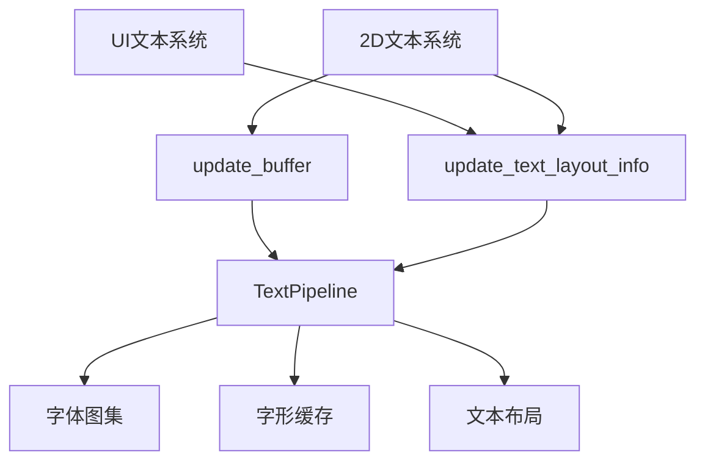

+++
title = "#22051 Remove queue text"
date = "2025-12-10T00:00:00"
draft = false
template = "pull_request_page.html"
in_search_index = false

[extra]
current_language = "zh-cn"
available_languages = {"en" = { name = "English", url = "/pull_request/bevy/2025-12/pr-22051-en-20251210" }, "zh-cn" = { name = "中文", url = "/pull_request/bevy/2025-12/pr-22051-zh-cn-20251210" }}
+++

# Remove queue text

## 基本信息
- **标题**: Remove queue text
- **PR链接**: https://github.com/bevyengine/bevy/pull/22051
- **作者**: ickshonpe
- **状态**: 已合并
- **标签**: C-代码质量, S-准备最终审查, A-文本, D-直接
- **创建时间**: 2025-12-06T22:47:26Z
- **合并时间**: 2025-12-10T20:11:24Z
- **合并者**: alice-i-cecile

## 描述翻译

# 目标

移除冗余的 `queue_text` 函数。

## 解决方案

* 从 `TextPipeline` 中移除 `queue_text`。
* 在 `update_text2d_layout` 中，不再调用 `queue_text`，而是调用 `TextPipeline::update_buffer` 和 `TextPipeline::update_text_layout`。

## 本PR的故事

这个PR的主要目标是清理Bevy引擎的文本渲染管道中的代码冗余。具体来说，它移除了`TextPipeline::queue_text`这个大型函数，将其职责分解为两个更专注的函数：`update_buffer`和`update_text_layout_info`。

### 问题背景

在Bevy的文本渲染系统中，`queue_text`函数负责处理文本布局的完整流程，包括：
1. 更新文本缓冲区(update buffer)
2. 计算字形(glyph)位置和样式信息
3. 将字形添加到字体图集(atlas)中
4. 生成最终的文本布局信息

这个函数有两个主要问题：
1. **职责过于集中**：单个函数处理了太多不同的任务
2. **代码重复**：UI系统和2D文本系统都调用这个函数，但需要类似但略有不同的处理

函数签名也过于复杂，接收11个参数，这使得代码难以理解和维护。

### 解决方案

开发者采取了一个直接的解决方案：将`queue_text`函数分解。原有的功能被拆分到两个函数中：

1. `update_buffer` - 专注于更新文本缓冲区，处理文本内容的变化
2. `update_text_layout_info` - 专注于计算布局信息和处理字形

这种分解有几个好处：
- **关注点分离**：每个函数都有明确的单一职责
- **代码复用**：UI和2D文本系统可以共享相同的底层操作
- **可维护性**：较小的函数更容易理解、测试和调试

### 实现细节

在`update_text2d_layout`系统中，原来的调用方式：
```rust
text_pipeline.queue_text(...)
```

被替换为两个独立的调用：
```rust
text_pipeline.update_buffer(...)
text_pipeline.update_text_layout_info(...)
```

这种分离允许系统在文本内容变化时只更新缓冲区，而在布局相关参数变化时只更新布局信息，提供了更细粒度的控制。

一个重要的技术细节是处理字体加载失败的情况。原来的`queue_text`函数使用一个`queue`本地变量来跟踪需要重新处理的实体。在新的实现中，这个变量被重命名为`reprocess_queue`，并且逻辑更加清晰：

```rust
// 在update_buffer中如果字体不存在
Err(TextError::NoSuchFont) => {
    // 将实体加入队列，下一帧重新处理
    reprocess_queue.insert(entity);
    continue;
}
```

这种分离也使得错误处理更加明确，每个阶段可以单独处理自己的错误情况。

### 技术洞察

这个重构揭示了一个重要的架构模式：将大型的、多步骤的过程分解为更小的、可组合的操作。在文本渲染这种复杂领域，这种分解特别有价值，因为：
1. 文本渲染涉及多个阶段（文本解析、字形定位、图集管理）
2. 不同的使用场景可能需要跳过某些阶段
3. 调试和性能分析更容易在细粒度函数上进行

`update_text_layout_info`函数还修复了一个对齐问题。原来的`queue_text`函数在处理无边界文本（unbounded text）和对齐方式（justify）时存在问题。新实现通过一个条件逻辑来解决：

```rust
// 对无边界文本且对齐方式不是左对齐的情况特殊处理
let width = (bounds.width.is_none() && justify != Justify::Left)
    .then(|| buffer_dimensions(buffer).x)
    .or(bounds.width);
```

这是一个很好的例子，说明重构不仅能改善代码结构，还能发现并修复隐藏的问题。

### 影响

这个PR带来的主要影响包括：
1. **代码清晰度提升**：通过分解大型函数，使代码更易于理解
2. **维护性改善**：较小的函数更容易修改和测试
3. **潜在性能优化**：系统现在可以只重新计算必要的部分
4. **错误处理改进**：更细粒度的错误处理逻辑

从架构角度来看，这个PR展示了如何通过关注点分离来改进复杂的渲染系统。这种模式可以在引擎的其他部分推广应用。

## 可视化表示



## 关键文件变更

### `crates/bevy_text/src/pipeline.rs` (+10/-213)
这是本PR中最重要的变更，移除了213行的`queue_text`函数，并添加了10行新代码到`update_text_layout_info`函数。

**关键修改**：
```rust
// 之前：大型的queue_text函数
pub fn queue_text<'a>(...) -> Result<(), TextError> {
    // 213行的复杂实现
}

// 之后：queue_text被完全移除，其功能被拆分
// update_text_layout_info现在处理布局计算
pub fn update_text_layout_info(...) -> Result<(), TextError> {
    // 更专注的实现
}
```

这个变更将原来集中在一个函数中的职责分解到多个函数中，提高了代码的可维护性。

### `crates/bevy_sprite/src/text2d.rs` (+65/-32)
2D文本布局系统被重构以使用新的API。

**关键修改**：
```rust
// 之前：使用queue_text
if scale_factor != text_layout_info.scale_factor
    || computed.needs_rerender()
    || bounds.is_changed()
    || (!queue.is_empty() && queue.remove(&entity))
{
    text_pipeline.queue_text(...);
}

// 之后：分别调用update_buffer和update_text_layout_info
if text_changed {
    text_pipeline.update_buffer(...);
}

match text_pipeline.update_text_layout_info(...) {
    // 处理结果
}
```

这种分离允许系统更精细地控制何时更新缓冲区vs何时更新布局。

### `crates/bevy_ui/src/widget/text.rs` (+1/-0)
UI文本系统也更新为使用新的API。

**关键修改**：
```rust
// 添加了justify参数
match text_pipeline.update_text_layout_info(
    // ...
    physical_node_size,
    block.justify, // 新增参数
) {
    // 处理结果
}
```

这个变更确保UI系统也能正确处理文本对齐问题。

### `crates/bevy_text/src/glyph.rs` (+1/-1)
更新了文档注释以反映API变更。

### `crates/bevy_text/src/lib.rs` (+1/-1)
更新了库级文档以反映新的函数调用流程。

## 进一步阅读

对于想要深入了解这些概念的开发者，建议阅读：

1. **Bevy官方文档**：了解Bevy的ECS架构和渲染系统
2. **Cosmic-text库**：Bevy使用的底层文本布局引擎
3. **字体渲染基础知识**：了解字形、字体图集和文本布局的基本概念
4. **软件重构模式**：学习如何安全地重构大型代码库

这个PR是一个很好的案例研究，展示了如何通过关注点分离和函数分解来改进复杂系统的可维护性。