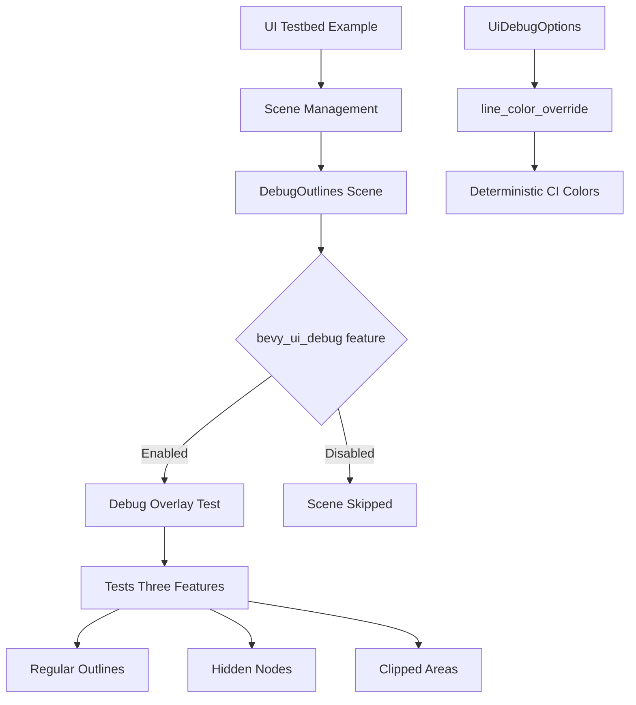

+++
title = "#22052 Adds UIDebug Overlay centered scene to examples/testbed/ui"
date = "2025-12-08T00:00:00"
draft = false
template = "pull_request_page.html"
in_search_index = true

[taxonomies]
list_display = ["show"]

[extra]
current_language = "en"
available_languages = {"en" = { name = "English", url = "/pull_request/bevy/2025-12/pr-22052-en-20251208" }, "zh-cn" = { name = "中文", url = "/pull_request/bevy/2025-12/pr-22052-zh-cn-20251208" }}
labels = ["A-UI", "C-Testing"]
+++

# Title

## Basic Information
- **Title**: Adds UIDebug Overlay centered scene to examples/testbed/ui
- **PR Link**: https://github.com/bevyengine/bevy/pull/22052
- **Author**: kfc35
- **Status**: MERGED
- **Labels**: A-UI, S-Ready-For-Final-Review, C-Testing
- **Created**: 2025-12-07T03:14:50Z
- **Merged**: 2025-12-08T22:56:05Z
- **Merged By**: alice-i-cecile

## Description Translation

# Objective

- Fixes #22019 

## Solution

- Adds a new scene in the ui testbed that tests the generation of the Ui Debug Overlay. It only is viewable if you run the example with `--features bevy_ui_debug`.
- Added a way to override the color used by the overlay to ensure that screenshots are consistent between CI runs (the line colors are generated based on the `Entity`, which changes every time you change the scene.)
- Added the `--features bevy_ui_debug` flag to `example-run.yml`, ensuring that screenshots and their validations take this new scene into account. (I assumed I'm not supposed to add this to `validation-jobs.yml` under `run-examples-on-wasm`, but if I'm supposed to, let me know and I can add it. I figured a debug feature does not need that specific validation).

## Testing

- I ran the command `cargo run --example testbed_ui --features bevy_ui_debug` and verified that debug lines showed up for regular outlines, for a node with `Visibility::Hidden` with `show_hidden = true`, and that clipped areas have outlines with `show_clipped = true`. I carouseled through all the scenes a couple of times
- I also ran `cargo run --example testbed_ui ` and made sure nothing was ruined after multiple carousels through all the scenes.

---

## Showcase

`cargo run --example testbed_ui --features bevy_ui_debug` , press spacebar 11x to see the scene.


## The Story of This Pull Request

This PR addresses a missing test scenario for the UI debug overlay feature in Bevy's testbed UI example. The core problem was straightforward: while Bevy had a UI debug overlay system for visualizing UI node boundaries, clipping regions, and hidden elements, there wasn't a dedicated test scene in the main UI testbed example to verify this functionality worked correctly.

The implementation needed to solve two related challenges. First, creating a proper test scene that demonstrates the debug overlay's capabilities. Second, ensuring that CI screenshot tests would be consistent across runs, since the debug overlay's default color generation depended on entity indices that could change between runs.

The developer approached this by adding a new `DebugOutlines` scene to the existing UI testbed example, but with a key constraint: this scene should only be compiled and available when the `bevy_ui_debug` feature flag is enabled. This keeps the default example clean for users who don't need debug functionality.

The architectural challenge was in the debug overlay's color generation. By default, the system uses `Hsla::sequential_dispersed(entity.index_u32())` to generate colors, which creates visually distinct colors based on entity indices. While useful for debugging, this creates non-deterministic colors for CI screenshot comparison because entity indices can change when the scene structure changes. The solution was to add an optional color override field to `UiDebugOptions` that, when set, bypasses the entity-based color generation.

Looking at the implementation, the changes follow Bevy's established patterns. In `debug_overlay.rs`, the `UiDebugOptions` struct gains a new `line_color_override` field of type `Option<LinearRgba>`. The extraction system then checks for this override:

```rust
color: debug_options
    .line_color_override
    .unwrap_or_else(|| Hsla::sequential_dispersed(entity.index_u32()).into()),
```

This maintains backward compatibility while providing deterministic color control for testing.

The test scene implementation demonstrates three key debug overlay features:
1. Regular UI node outlines
2. Outlines for hidden nodes (when `show_hidden` is enabled)
3. Outlines for clipped areas (when `show_clipped` is enabled)

The scene setup configures the debug options appropriately:

```rust
debug_options.enabled = true;
debug_options.line_width = 5.;
debug_options.line_color_override = Some(LinearRgba::GREEN);
debug_options.show_hidden = true;
debug_options.show_clipped = true;
```

Notably, the teardown system resets the debug options to defaults when leaving the scene, preventing debug settings from leaking into other scenes.

For CI integration, the PR adds the `bevy_ui_debug` feature to three different CI job configurations in `.github/workflows/example-run.yml`, ensuring the new scene is exercised during automated testing. This is important because without this flag, the scene wouldn't be compiled or executed in CI.

From a testing perspective, this PR demonstrates good practice: it adds a dedicated test for existing functionality, ensures deterministic behavior for automated testing, and properly isolates debug features behind feature flags. The implementation avoids breaking changes while extending functionality in a clean, maintainable way.

## Visual Representation



## Key Files Changed

### `examples/testbed/ui.rs` (+97/-0)
**What changed**: Added a new `DebugOutlines` scene with setup and teardown systems, conditionally compiled behind the `bevy_ui_debug` feature flag.

**Key modifications**:
```rust
#[cfg(feature = "bevy_ui_debug")]
{
    app.add_systems(OnEnter(Scene::DebugOutlines), debug_outlines::setup);
    app.add_systems(OnExit(Scene::DebugOutlines), debug_outlines::teardown);
}

// In the Scene enum:
#[cfg(feature = "bevy_ui_debug")]
DebugOutlines,

// Scene transition logic includes the new scene when the feature is enabled
#[cfg(feature = "bevy_ui_debug")]
Scene::RadialGradient => Scene::DebugOutlines,
#[cfg(feature = "bevy_ui_debug")]
Scene::DebugOutlines => Scene::Transformations,
#[cfg(not(feature = "bevy_ui_debug"))]
Scene::RadialGradient => Scene::Transformations,
```

**Why it matters**: This adds comprehensive testing for the debug overlay system while keeping it optional. The conditional compilation ensures the debug scene doesn't affect users who don't need it.

### `crates/bevy_ui_render/src/debug_overlay.rs` (+7/-1)
**What changed**: Added `line_color_override` field to `UiDebugOptions` and modified the color extraction logic to use it when present.

**Key modifications**:
```rust
pub struct UiDebugOptions {
    pub enabled: bool,
    pub line_width: f32,
    /// Override Color for the overlay's lines
    pub line_color_override: Option<LinearRgba>,
    pub show_hidden: bool,
    pub show_clipped: bool,
}

// In extract_debug_overlay function:
color: debug_options
    .line_color_override
    .unwrap_or_else(|| Hsla::sequential_dispersed(entity.index_u32()).into()),
```

**Why it matters**: This enables deterministic color output for CI screenshot testing while maintaining the useful entity-based color coding for manual debugging.

### `.github/workflows/example-run.yml` (+3/-3)
**What changed**: Added `bevy_ui_debug` feature to the example run commands in CI workflows.

**Key modifications**:
```bash
# Changed from:
time TRACE_CHROME=trace-$example_name.json CI_TESTING_CONFIG=$example cargo run --example $example_name --features "bevy_ci_testing,trace,trace_chrome"

# To:
time TRACE_CHROME=trace-$example_name.json CI_TESTING_CONFIG=$example cargo run --example $example_name --features "bevy_ci_testing,trace,trace_chrome,bevy_ui_debug"
```

**Why it matters**: Ensures the new debug scene is compiled and tested in CI, maintaining test coverage for the debug overlay functionality.

## Further Reading

- [Bevy UI System Documentation](https://docs.rs/bevy_ui/latest/bevy_ui/) - Comprehensive guide to Bevy's UI system
- [Feature Flags in Cargo](https://doc.rust-lang.org/cargo/reference/features.html) - How to use conditional compilation in Rust projects
- [Entity Component System Pattern](https://en.wikipedia.org/wiki/Entity_component_system) - Background on ECS architecture used by Bevy
- [Deterministic Testing in Game Engines](https://gafferongames.com/post/deterministic_lockstep/) - Importance of deterministic behavior for testing