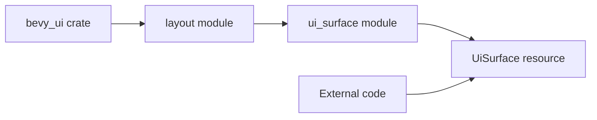

+++
title = "#22056 Make the ui_surface module public."
date = "2025-12-10T00:00:00"
draft = false
template = "pull_request_page.html"
in_search_index = true

[taxonomies]
list_display = ["show"]

[extra]
current_language = "en"
available_languages = {"en" = { name = "English", url = "/pull_request/bevy/2025-12/pr-22056-en-20251210" }, "zh-cn" = { name = "中文", url = "/pull_request/bevy/2025-12/pr-22056-zh-cn-20251210" }}
labels = ["C-Docs", "D-Trivial", "A-UI", "C-Code-Quality", "C-Usability", "A-Dev-Tools"]
+++

# Make the ui_surface module public.

## Basic Information
- **Title**: Make the ui_surface module public.
- **PR Link**: https://github.com/bevyengine/bevy/pull/22056
- **Author**: IQuick143
- **Status**: MERGED
- **Labels**: C-Docs, D-Trivial, A-UI, C-Code-Quality, C-Usability, S-Ready-For-Final-Review, A-Dev-Tools
- **Created**: 2025-12-07T13:32:52Z
- **Merged**: 2025-12-10T00:19:59Z
- **Merged By**: alice-i-cecile

## Description Translation
# Objective

- Fix #17909

## Solution

- Make the `ui_surface` module public (not just pub(crate)), so that UiSurface can be queried and used with the function.

## Notes
Making this public may break encapsulation (notably it could allow removing the Resource), but given how lax the guarantees of ECS state are, I don't think that (a resource existing) is an assumption anyone can truly rely on.

## The Story of This Pull Request

This PR addresses a straightforward but impactful accessibility issue in Bevy's UI system. The problem was documented in issue #17909: developers couldn't query for the `UiSurface` resource in their systems because the module containing it was only visible within the crate itself.

The `ui_surface` module is part of Bevy's UI layout system and contains the `UiSurface` resource, which manages the surfaces for UI rendering. When a module is marked as `pub(crate)`, it's only accessible within the same crate, which prevents external code from referencing types defined within it. This creates a problem for developers who need to write systems that interact with the UI system at a lower level.

The solution was simple but required careful consideration. Changing the visibility from `pub(crate)` to `pub` makes the entire `ui_surface` module publicly accessible. This one-character change (`crate` to just the module name) resolves the immediate issue but comes with trade-offs around encapsulation.

From an engineering perspective, this change illustrates a common tension in API design: balancing encapsulation against usability. The `UiSurface` resource is an internal implementation detail of the UI system, and exposing it could theoretically allow users to manipulate it in ways that break assumptions. However, as the PR author notes, the ECS (Entity Component System) architecture already provides weak guarantees about resource existence - any system could potentially remove a resource, so the UI system can't truly rely on `UiSurface` always being present anyway.

The implementation is minimal but significant. By making the module public, developers can now write systems like:
```rust
fn my_system(ui_surface: Res<UiSurface>) {
    // Now possible because UiSurface is publicly accessible
}
```

This change aligns with Bevy's philosophy of providing flexible, low-level access when needed while maintaining sensible defaults. The risk of breaking encapsulation is acknowledged but considered acceptable given the existing architectural constraints and the practical need for this functionality.

## Visual Representation



The diagram shows the visibility change: previously, external code couldn't access `UiSurface` because the `ui_surface` module had `pub(crate)` visibility. After this change, the module is fully public (`pub`), creating a direct access path from external code to the `UiSurface` resource.

## Key Files Changed

**File: `crates/bevy_ui/src/layout/mod.rs`** (+1/-1)

This is the only file modified in the PR. The change is a one-line modification to the module visibility declaration:

```rust
// Before:
pub(crate) mod ui_surface;

// After:
pub mod ui_surface;
```

The change removes the `(crate)` visibility restriction, making the `ui_surface` module accessible from outside the `bevy_ui` crate. This allows the `UiSurface` resource (and any other public types within that module) to be used in external code, particularly in system queries.

This single-line change resolves the reported issue #17909 where developers couldn't query for `UiSurface` in their ECS systems due to the type not being publicly exposed.

## Further Reading

1. **Rust Module System**: Understanding `pub`, `pub(crate)`, and other visibility modifiers is essential for API design. The Rust Book's chapter on modules provides comprehensive coverage.

2. **Bevy ECS Resources**: The Bevy documentation on Resources explains how to work with global data in the ECS architecture, which is what `UiSurface` represents.

3. **API Design Trade-offs**: Articles on API design principles, particularly around encapsulation versus accessibility, provide context for understanding decisions like this one.

4. **Issue #17909**: The original issue provides additional context about the specific use cases that required access to `UiSurface`.

## Full Code Diff
```
diff --git a/crates/bevy_ui/src/layout/mod.rs b/crates/bevy_ui/src/layout/mod.rs
index f4a814cc257c8..68b8c69dbd9e9 100644
--- a/crates/bevy_ui/src/layout/mod.rs
+++ b/crates/bevy_ui/src/layout/mod.rs
@@ -25,7 +25,7 @@ use bevy_text::CosmicFontSystem;
 
 mod convert;
 pub mod debug;
-pub(crate) mod ui_surface;
+pub mod ui_surface;
 
 pub struct LayoutContext {
     pub scale_factor: f32,
```