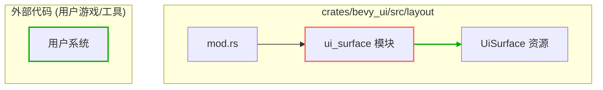

+++
title = "#22056 Make the ui_surface module public."
date = "2025-12-10T00:00:00"
draft = false
template = "pull_request_page.html"
in_search_index = false

[extra]
current_language = "zh-cn"
available_languages = {"en" = { name = "English", url = "/pull_request/bevy/2025-12/pr-22056-en-20251210" }, "zh-cn" = { name = "中文", url = "/pull_request/bevy/2025-12/pr-22056-zh-cn-20251210" }}
labels = ["C-Docs", "D-Trivial", "A-UI", "C-Code-Quality", "C-Usability", "A-Dev-Tools"]
+++

# Title

## Basic Information
- **Title**: Make the ui_surface module public.
- **PR Link**: https://github.com/bevyengine/bevy/pull/22056
- **Author**: IQuick143
- **Status**: MERGED
- **Labels**: C-Docs, D-Trivial, A-UI, C-Code-Quality, C-Usability, S-Ready-For-Final-Review, A-Dev-Tools
- **Created**: 2025-12-07T13:32:52Z
- **Merged**: 2025-12-10T00:19:59Z
- **Merged By**: alice-i-cecile

## Description Translation
### 目标
- 修复 #17909

### 解决方案
- 将 `ui_surface` 模块设为公有（而不仅仅是 pub(crate)），以便能够通过函数查询并使用 UiSurface。

### 说明
将此模块设为公有可能会破坏封装（特别是它可能允许移除 Resource），但考虑到 ECS 状态的保证相对宽松，我认为（资源存在）这个假设并非任何人都能真正依赖的。

## The Story of This Pull Request

这个 PR 的故事始于一个外部开发者（或者说，任何试图与 Bevy 的 UI 系统进行特定交互的人）遇到的一个具体问题。这个问题在 Issue #17909 中被记录。问题的核心是 API 的可访问性：开发者想要通过 `World` 的 `get_resource` 或类似的方法查询 `UiSurface` 资源，但却无法做到，因为定义它的模块 `ui_surface` 的可见性被限制为 `pub(crate)`。

在 Rust 中，模块可见性是一个关键的访问控制机制。`pub(crate)` 意味着该模块和其中的公有项（`pub` items）仅在当前 crate（即 `bevy_ui` 库）内部可见。对于 crate 外部的代码，包括用户编写的游戏或工具代码，这个模块就像不存在一样。因此，即使 `UiSurface` 结构体本身被标记为 `pub`，但由于它位于一个 `pub(crate)` 的模块内，外部的代码路径无法到达它。这导致了开发者无法编写依赖于查询 `UiSurface` 资源的系统或逻辑。

开发者 `IQuick143` 提出的解决方案直截了当：将模块的可见性从 `pub(crate)` 提升到完全公开的 `pub`。这是一个非常小的、单行的代码变更，但其影响是实质性的。它解除了对 `UiSurface` 资源的访问封锁，使得它像 Bevy ECS 世界中的其他公共资源一样，可以被用户代码查询、引用和使用。

在实现时，开发者考虑到了潜在的副作用。将内部实现细节公开确实存在理论上的风险，例如破坏了模块的封装性。正如 PR 说明中所指出的，最显著的风险是外部代码现在可以随意地 `remove`（移除）这个资源，这可能会破坏 UI 系统其他部分对其存在的假设。然而，作者做出了一个合理的工程权衡。在 Bevy 基于 ECS 的架构中，资源的生命周期管理本就是动态的，系统不能绝对依赖某个资源在任何时刻都存在。因此，将这个风险与解决用户无法访问一个可能需要的核心 UI 资源所带来的不便相权衡，选择开放访问是合理的。

这个更改本身是微小的，但它反映了库设计中的一个常见考量：如何在保持内部灵活性和提供稳定公共 API 之间找到平衡。通过将 `ui_surface` 模块公开，Bevy 团队承认了 `UiSurface` 作为 UI 布局管道中一个稳定且有用的组成部分的地位，值得被纳入公共 API 表面。这个改动最终被合并，表明团队认可这个权衡，并优先考虑了用户的功能需求（修复 Issue #17909）和代码的可用性。

## Visual Representation

这个 PR 的核心变更非常聚焦，主要涉及模块可见性的层级变化。



**图例说明**:
*   **实线箭头** 表示模块包含关系。
*   **高亮方框**:
    *   红色边框 (`B`) 表示被修改的 `ui_surface` 模块的可见性从 `pub(crate)` 变为 `pub`。
    *   绿色边框 (`D`) 表示外部用户代码。
*   **绿色加粗箭头** (`C --> D`) 表示此次修改后新建立的访问路径：外部代码现在可以直接引用并查询 `UiSurface` 资源。

## Key Files Changed

仅有一个文件被修改，但它是解决访问问题的关键。

- `crates/bevy_ui/src/layout/mod.rs` (+1/-1)

这个文件是 `bevy_ui` crate 中布局模块的根模块文件。它负责导出（`pub use`）或声明（`mod`）所有子模块。在这里，对 `ui_surface` 模块的可见性声明进行了修改。

1.  **修改内容及原因**: 此行修改将 `ui_surface` 模块的可见性从仅限于当前 crate 内部访问 (`pub(crate)`) 更改为完全公开 (`pub`)。这使得依赖 `bevy_ui` 库的外部代码能够通过路径 `bevy_ui::layout::ui_surface` 访问到该模块及其内部标记为 `pub` 的项（最主要的就是 `UiSurface` 资源）。

2.  **代码片段**:
    ```rust
    // File: crates/bevy_ui/src/layout/mod.rs
    // 修改前:
    pub(crate) mod ui_surface;

    // 修改后:
    pub mod ui_surface;
    ```

3.  **与 PR 目标的关联**: 这是实现 PR 描述中“解决方案”部分的唯一且直接的代码变更。通过这一行修改，成功解决了 Issue #17909 中报告的用户无法查询 `UiSurface` 资源的问题。

## Further Reading

1.  **相关 Issue**: [Issue #17909](https://github.com/bevyengine/bevy/issues/17909) - 这是本 PR 旨在修复的原始问题。阅读它可以更深入地理解用户遇到的具体场景和需求。
2.  **Rust 模块与可见性**: Rust 官方书籍中关于 [模块](https://doc.rust-lang.org/book/ch07-02-defining-modules-to-control-scope-and-privacy.html) 和 [路径](https://doc.rust-lang.org/book/ch07-03-paths-for-referring-to-an-item-in-the-module-tree.html) 的章节，可以帮助理解 `pub`, `pub(crate)` 等可见性修饰符的确切含义和作用范围。
3.  **Bevy ECS 资源**: Bevy 官方手册中关于 [Resources](https://bevyengine.org/learn/book/0.15/programming/ecs#resources) 的部分，解释了资源（Resource）在 Bevy ECS 中是如何存储、访问和管理的，这有助于理解为何查询 `UiSurface` 是一个合理的需求。