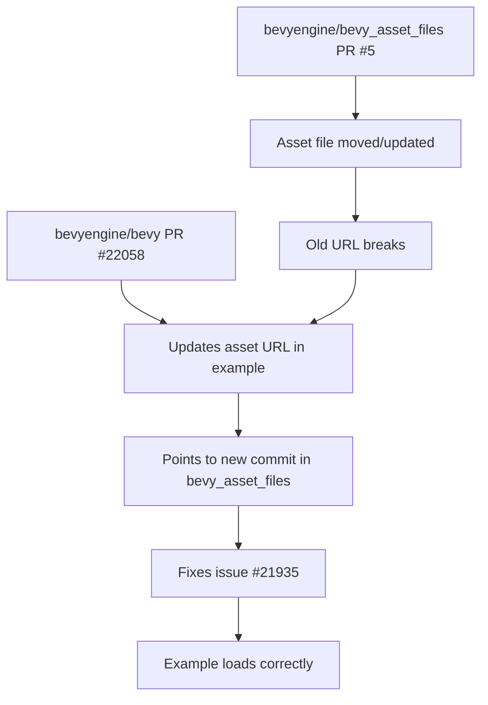

+++
title = "#22058 Update meshlet asset URL"
date = "2025-12-07T00:00:00"
draft = false
template = "pull_request_page.html"
in_search_index = true

[taxonomies]
list_display = ["show"]

[extra]
current_language = "en"
available_languages = {"en" = { name = "English", url = "/pull_request/bevy/2025-12/pr-22058-en-20251207" }, "zh-cn" = { name = "中文", url = "/pull_request/bevy/2025-12/pr-22058-zh-cn-20251207" }}
labels = ["D-Trivial", "C-Examples"]
+++

# Title
**Update meshlet asset URL**

## Basic Information
- **Title**: Update meshlet asset URL
- **PR Link**: https://github.com/bevyengine/bevy/pull/22058
- **Author**: JMS55
- **Status**: MERGED
- **Labels**: D-Trivial, C-Examples
- **Created**: 2025-12-07T18:05:00Z
- **Merged**: 2025-12-07T23:10:35Z
- **Merged By**: mockersf

## Description Translation
Update URL after https://github.com/bevyengine/bevy_asset_files/pull/5

Fixes https://github.com/bevyengine/bevy/issues/21935

## The Story of This Pull Request

This is a straightforward maintenance PR that fixes a broken asset reference in the Bevy game engine's examples. The issue was that an example file was referencing a meshlet asset at a specific commit hash in the `bevy_asset_files` repository, and that asset had been moved or updated, breaking the example.

The problem was reported in issue #21935. When users ran the meshlet example, the asset load would fail because the URL pointed to a resource that no longer existed at that location. This is a common issue in projects that reference external assets at specific commit points - when those assets get moved or updated, the links break.

The developer's solution was simple and direct: update the URL to point to the new location of the asset. This required changing just one line in one file. The new URL points to the same asset but at a different commit hash (`6dccaef517bde74d1969734703709aead7211dbc` instead of `9bf88c42b9d06a3634eed633d90ce5fab02c31da`), which reflects the changes made in bevyengine/bevy_asset_files#5.

The implementation is minimal - only the `ASSET_URL` constant needed updating. This constant is used by the example to load a 3D bunny model that demonstrates Bevy's meshlet rendering capabilities. Meshlets are a rendering optimization technique that groups triangles into smaller clusters for more efficient culling and rendering.

From an engineering perspective, this change highlights the challenge of managing external asset dependencies in examples. While using raw GitHub URLs for assets in examples is convenient for demonstration purposes, it creates brittleness when those assets change. The alternative would be to bundle the assets with the example code, but that would increase the repository size. The current approach represents a reasonable trade-off, though it requires occasional maintenance when assets are updated.

The fix ensures that developers can run the meshlet example without errors, which is important for demonstrating Bevy's meshlet rendering capabilities. The example shows how to use meshlets for rendering complex 3D models efficiently, and having it work correctly is essential for users evaluating or learning this feature.

## Visual Representation



## Key Files Changed

### `examples/3d/meshlet.rs` (+1/-1)
This file contains an example demonstrating meshlet rendering in Bevy. The change updates the URL constant that points to an external meshlet asset file.

**Key change:**
```rust
// File: examples/3d/meshlet.rs
// Before:
const ASSET_URL: &str =
    "https://github.com/bevyengine/bevy_asset_files/raw/9bf88c42b9d06a3634eed633d90ce5fab02c31da/meshlet/bunny.meshlet_mesh";

// After:
const ASSET_URL: &str =
    "https://github.com/bevyengine/bevy_asset_files/raw/6dccaef517bde74d1969734703709aead7211dbc/meshlet/bunny.meshlet_mesh";
```

The change updates the commit hash in the URL from `9bf88c42b9d06a3634eed633d90ce5fab02c31da` to `6dccaef517bde74d1969734703709aead7211dbc`. This reflects the new location of the asset file after the changes in bevyengine/bevy_asset_files#5.

The `ASSET_URL` constant is used later in the example to load the meshlet asset:
```rust
let asset_server = world.resource::<AssetServer>();
let meshlet_mesh_handle: Handle<MeshletMesh> = asset_server.load(ASSET_URL);
```

This fix is minimal but essential - without it, the example would fail to load the required asset and wouldn't demonstrate the meshlet rendering functionality properly.

## Further Reading

1. [Bevy Meshlet Rendering Documentation](https://bevyengine.org/learn/quick-start/3d/meshlets/) - Official documentation on using meshlets in Bevy
2. [Mesh Shading Technology](https://www.nvidia.com/en-us/geforce/technologies/mesh-shaders/) - NVIDIA's overview of mesh shading technology (which meshlets are part of)
3. [GitHub Raw URLs](https://docs.github.com/en/repositories/working-with-files/using-files/viewing-a-file#viewing-or-copying-the-raw-file-content) - Documentation on GitHub's raw file URLs used for asset references
4. [Bevy Asset System](https://bevyengine.org/learn/book/next/assets/) - How Bevy handles asset loading and management