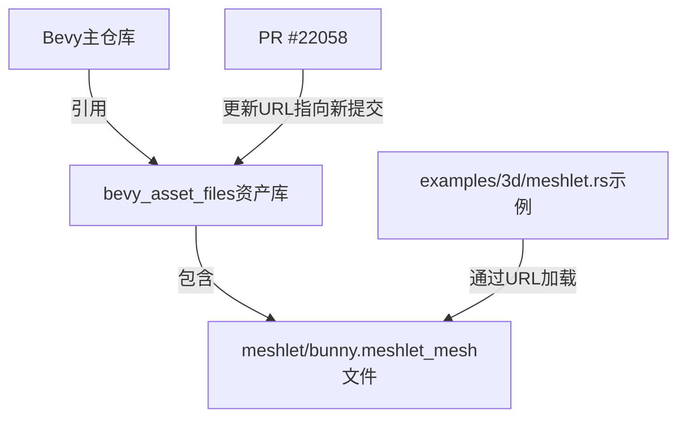

+++
title = "#22058 Update meshlet asset URL"
date = "2025-12-07T00:00:00"
draft = false
template = "pull_request_page.html"
in_search_index = false

[extra]
current_language = "zh-cn"
available_languages = {"en" = { name = "English", url = "/pull_request/bevy/2025-12/pr-22058-en-20251207" }, "zh-cn" = { name = "中文", url = "/pull_request/bevy/2025-12/pr-22058-zh-cn-20251207" }}
+++

# Update meshlet asset URL

## Basic Information
- **标题**: Update meshlet asset URL
- **PR链接**: https://github.com/bevyengine/bevy/pull/22058
- **作者**: JMS55
- **状态**: 已合并
- **标签**: D-Trivial（简单修复）, C-Examples（示例相关）
- **创建时间**: 2025-12-07T18:05:00Z
- **合并时间**: 2025-12-07T23:10:35Z
- **合并者**: mockersf

## 描述翻译
在 https://github.com/bevyengine/bevy_asset_files/pull/5 之后更新URL

修复 https://github.com/bevyengine/bevy/issues/21935

## 此Pull Request的技术说明

这是一个非常直接的技术修复，主要解决的是示例代码中的外部资源链接失效问题。在Bevy游戏引擎的代码库中，有一个展示Meshlet（网格分块）技术的3D示例程序，这个示例需要从外部加载一个预处理的meshlet网格文件。

问题的根源在于，Bevy团队使用一个专门的资产存储库（bevy_asset_files）来管理示例和测试所需的外部资源文件。当这个资产库中的文件被移动或重新组织时，指向这些文件的URL会发生变化，导致依赖这些URL的示例代码无法正常工作。

具体来说，PR #22058修复的是示例代码中的硬编码URL。这个URL指向的是bevy_asset_files仓库中特定提交版本的文件。当资产库的结构发生变化（可能是文件移动、分支合并或其他仓库维护操作），原有的URL就失效了，导致示例运行时无法加载必需的资产文件。

从技术角度来看，这种设计模式在大型开源项目中很常见：将二进制资产与源代码分离，使用单独的仓库管理，并通过提交哈希（commit hash）来确保引用的确定性。这种做法的好处是：
1. 源代码仓库保持轻量，不包含大型二进制文件
2. 资产版本控制独立于代码版本控制
3. 通过提交哈希确保可复现性

然而，这种设计也带来了维护成本：当资产库更新时，所有引用这些资产的代码都需要相应更新URL。这正是此次PR需要解决的问题。

修复方案非常简单直接：更新URL中的提交哈希值。从技术实现上看，这只是修改了一个字符串常量：
- 旧哈希: `9bf88c42b9d06a3634eed633d90ce5fab02c31da`
- 新哈希: `6dccaef517bde74d1969734703709aead7211dbc`

虽然这个改动看似微不足道，但它对用户体验有实际影响。如果这个链接不修复，运行meshlet示例的用户会遇到资产加载失败的错误，影响他们对Meshlet功能的理解和测试。

从工程实践的角度看，这种类型的维护工作体现了开源项目中的持续集成和持续部署理念。当资产库发生变化时，相应的代码引用必须及时更新，以确保整个系统的各个部分保持同步。

## 可视化表示



## 主要文件变更

**修改的文件**: `examples/3d/meshlet.rs` (+1/-1)

这个文件是Bevy引擎中展示Meshlet技术的3D示例程序。Meshlet是一种渲染优化技术，通过将大型网格分割成更小的块（meshlets）来提高渲染性能，特别是对于GPU驱动的渲染管道。

**变更详情**：
修改了`ASSET_URL`常量的值，更新了指向外部meshlet资产文件的URL。这个URL指向bevy_asset_files仓库中的特定提交，确保示例能够加载到正确的测试数据。

```rust
// 文件: examples/3d/meshlet.rs
// 变更前:
const ASSET_URL: &str =
    "https://github.com/bevyengine/bevy_asset_files/raw/9bf88c42b9d06a3634eed633d90ce5fab02c31da/meshlet/bunny.meshlet_mesh";

// 变更后:
const ASSET_URL: &str =
    "https://github.com/bevyengine/bevy_asset_files/raw/6dccaef517bde74d1969734703709aead7211dbc/meshlet/bunny.meshlet_mesh";
```

**变更关系**：
这个变更直接修复了示例程序无法加载外部资产的问题。当用户运行meshlet示例时，程序会尝试从指定的GitHub URL下载网格数据。如果URL指向不存在的资源，示例将无法正常工作。

## 进一步阅读建议

1. **Meshlet技术介绍**:
   - [原始论文: "Mesh Shading: Towards Efficient Use of GPU Resources in Graphics Pipelines"](https://research.nvidia.com/publication/2020-07_mesh-shading-towards)
   - [Bevy Meshlet模块文档](https://docs.rs/bevy/latest/bevy/render/meshlet/index.html)

2. **Bevy资产系统**:
   - [Bevy Asset System架构](https://bevyengine.org/learn/quick-start/assets/)
   - [Git LFS与大型资产管理的实践](https://docs.github.com/en/repositories/working-with-files/managing-large-files/about-git-large-file-storage)

3. **相关PR和Issue**:
   - [bevy_asset_files PR #5](https://github.com/bevyengine/bevy_asset_files/pull/5) - 导致此URL需要更新的原始变更
   - [Bevy Issue #21935](https://github.com/bevyengine/bevy/issues/21935) - 报告此问题的原始issue

# 完整代码差异

```diff
diff --git a/examples/3d/meshlet.rs b/examples/3d/meshlet.rs
index e707de6ed8837..299df303cf263 100644
--- a/examples/3d/meshlet.rs
+++ b/examples/3d/meshlet.rs
@@ -12,7 +12,7 @@ use bevy::{
 use std::f32::consts::PI;
 
 const ASSET_URL: &str =
-    "https://github.com/bevyengine/bevy_asset_files/raw/9bf88c42b9d06a3634eed633d90ce5fab02c31da/meshlet/bunny.meshlet_mesh";
+    "https://github.com/bevyengine/bevy_asset_files/raw/6dccaef517bde74d1969734703709aead7211dbc/meshlet/bunny.meshlet_mesh";
 
 fn main() {
     App::new()
```