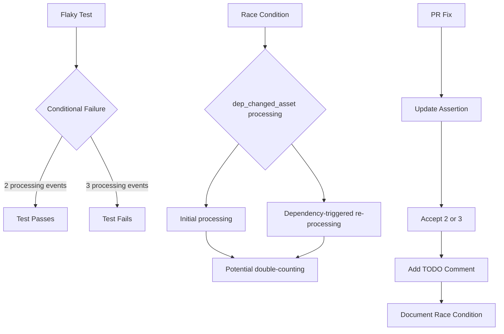

+++
title = "#22061 Fix flaky asset test, adds todo for a real fix"
date = "2025-12-08T00:00:00"
draft = false
template = "pull_request_page.html"
in_search_index = true

[taxonomies]
list_display = ["show"]

[extra]
current_language = "en"
available_languages = {"en" = { name = "English", url = "/pull_request/bevy/2025-12/pr-22061-en-20251208" }, "zh-cn" = { name = "中文", url = "/pull_request/bevy/2025-12/pr-22061-zh-cn-20251208" }}
labels = ["D-Trivial", "A-Assets", "C-Testing"]
+++

# Title

## Basic Information
- **Title**: Fix flaky asset test, adds todo for a real fix
- **PR Link**: https://github.com/bevyengine/bevy/pull/22061
- **Author**: kfc35
- **Status**: MERGED
- **Labels**: D-Trivial, A-Assets, S-Ready-For-Final-Review, C-Testing
- **Created**: 2025-12-08T03:51:18Z
- **Merged**: 2025-12-08T05:18:37Z
- **Merged By**: alice-i-cecile

## Description Translation

# Objective

- Unblock pull requests and merges from the failings of this flaky asset test
- Fixes the flakiness described in #22001 

## Solution

Change the assertion to accept both 2 and 3. Add an explaination why, and add a todo to resolve the underlying issue.

FYI @andriyDev since I don't yet feel comfortable messing with the locks, just figured I'd throw this up to reduce confusion about failing builds in the meantime

## The Story of This Pull Request

This pull request addresses a flaky test in Bevy's asset processing system that was intermittently failing and blocking development workflows. The issue was reported in #22001 and manifested as non-deterministic test failures in CI pipelines.

The test in question, `only_reprocesses_wrong_hash_on_startup`, verifies that the asset processor correctly handles reprocessing of assets when restarting with modified sources. Specifically, it ensures that only assets with changed sources or changed dependencies get reprocessed, while others maintain their cached hashes. The test uses a mock transformer that counts how many times assets are processed, expecting exactly 2 processing events.

However, due to a race condition in the concurrent asset processing system, the `dep_changed_asset` could be processed twice instead of once - once during initial processing and once when its dependency triggers a re-processing. This non-deterministic behavior caused the test assertion to fail intermittently when it encountered 3 processing events instead of the expected 2.

The developer took a pragmatic approach to unblock development workflows. Instead of attempting to fix the underlying concurrency issue immediately (which would require deeper understanding of the locking mechanisms), they adjusted the test assertion to accept both 2 and 3 processing events. This acknowledges the reality of the current implementation while clearly documenting the issue for future resolution.

The key insight in this fix is recognizing that the test's fundamental purpose - verifying that only changed assets get reprocessed - remains valid regardless of whether the reprocessing happens once or twice for the `dep_changed_asset`. The race condition affects the count but not the correctness of which assets get reprocessed.

By adding a comprehensive TODO comment with explicit explanation of why the race condition occurs ("when the initial processing of an asset and the re-processing that its dependency triggers are both able to proceed"), the PR ensures that future developers understand the root cause and can implement a proper fix when ready.

This approach demonstrates good engineering judgment: prioritizing unblocking development with a minimal, well-documented change while clearly marking technical debt for future resolution. The solution balances immediate practical needs with long-term maintainability by making the issue visible and understandable to anyone working on the asset processing system.

## Visual Representation



## Key Files Changed

**File: `crates/bevy_asset/src/processor/tests.rs`**

**Change Summary:** Modified a flaky test assertion to accept both 2 and 3 processing events instead of only 2, with added documentation explaining the race condition.

**Before:**
```rust
assert_eq!(
    *transformer.0.lock().unwrap_or_else(PoisonError::into_inner),
    2
);
```

**After:**
```rust
let num_processes = *transformer.0.lock().unwrap_or_else(PoisonError::into_inner);
// TODO: assert_eq! (num_processes == 2) only after we prevent double processing assets
// == 3 happens when the initial processing of an asset and the re-processing that its dependency
// triggers are both able to proceed. (dep_changed_asset in this case is processed twice)
assert!(num_processes == 2 || num_processes == 3);
```

**Rationale:** The test was failing intermittently due to a race condition where an asset (`dep_changed_asset`) could be processed twice - once during initial processing and once when its dependency triggers re-processing. Instead of trying to fix the underlying concurrency issue immediately, the PR makes the test robust to this non-deterministic behavior while clearly documenting the issue for future resolution.

## Further Reading

1. **Bevy Asset System Documentation**: https://bevyengine.org/learn/quick-start/assets/
2. **Rust Concurrency Patterns**: Understanding Rust's ownership model and concurrency primitives (Mutex, Arc, etc.) is crucial for fixing race conditions like this one
3. **Test Flakiness in CI/CD**: This PR demonstrates a common pattern for handling flaky tests - making assertions more flexible while documenting the underlying issue
4. **Bevy Issue #22001**: The original issue report that documented the flaky test behavior