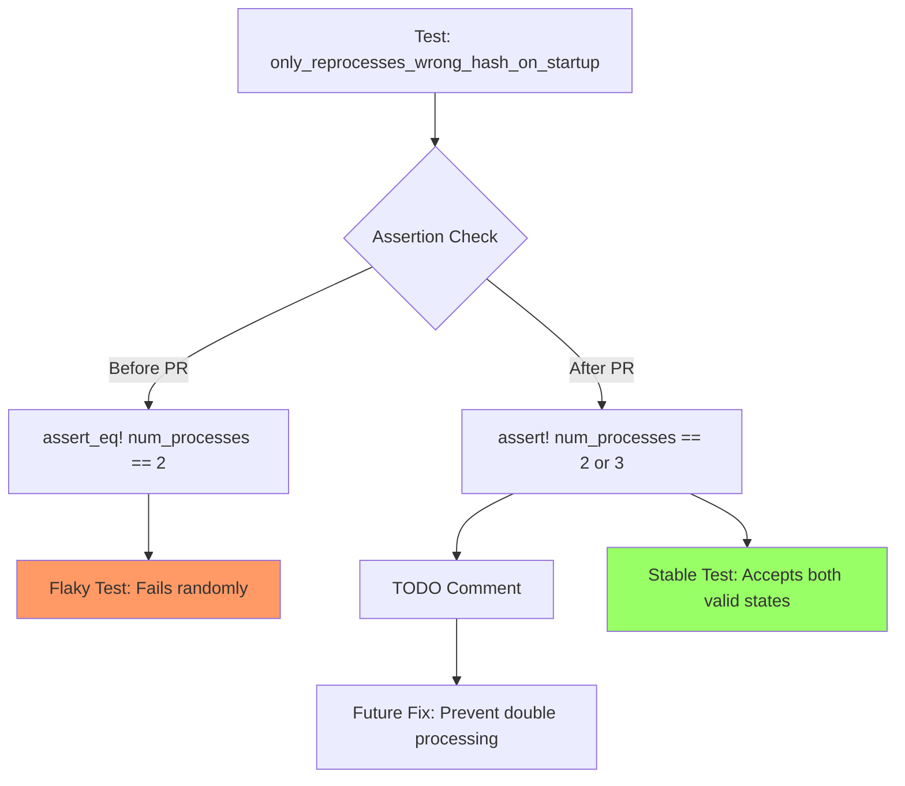

+++
title = "#22061 Fix flaky asset test, adds todo for a real fix"
date = "2025-12-08T00:00:00"
draft = false
template = "pull_request_page.html"
in_search_index = false

[extra]
current_language = "zh-cn"
available_languages = {"en" = { name = "English", url = "/pull_request/bevy/2025-12/pr-22061-en-20251208" }, "zh-cn" = { name = "中文", url = "/pull_request/bevy/2025-12/pr-22061-zh-cn-20251208" }}
labels = ["D-Trivial", "A-Assets", "C-Testing"]
+++

# Title
Fix flaky asset test, adds todo for a real fix

## Basic Information
- **Title**: Fix flaky asset test, adds todo for a real fix
- **PR Link**: https://github.com/bevyengine/bevy/pull/22061
- **Author**: kfc35
- **Status**: MERGED
- **Labels**: D-Trivial, A-Assets, S-Ready-For-Final-Review, C-Testing
- **Created**: 2025-12-08T03:51:18Z
- **Merged**: 2025-12-08T05:18:37Z
- **Merged By**: alice-i-cecile

## Description Translation
# 目标

- 解决这个不稳定的资产测试导致的拉取请求和合并受阻问题
- 修复 #22001 中描述的测试不稳定性问题

## 解决方案

修改断言以同时接受 2 和 3。添加解释说明原因，并添加一个 todo 来根本解决底层问题。

FYI @andriyDev 由于我目前对处理锁还不太熟悉，所以先提交这个临时修复以减少构建失败的困惑

## The Story of This Pull Request

这个拉取请求处理的是一个在 CI 流水线中出现的测试不稳定问题。具体来说，测试 `only_reprocesses_wrong_hash_on_startup` 在某些运行中会失败，导致其他开发者的拉取请求被阻塞。测试不稳定是软件开发中常见但麻烦的问题，因为它们会破坏构建的可信度。

问题的根源在于测试中资产处理次数的计数逻辑。测试期望在特定场景下只有 2 个资产被重新处理，但在并发条件下，当依赖资产触发重新处理时，`dep_changed_asset` 可能会被处理两次，导致总处理次数变为 3 次。这是典型的竞态条件问题，在测试环境中尤其难以复现和稳定。

开发者 kfc35 采取了一个务实的方法。考虑到立即修复底层竞态条件需要对锁机制有深入理解，他们选择先缓解问题，让 CI 能够继续运行。这种方法在工程实践中很常见：先通过放宽测试条件来解除阻塞，同时通过 TODO 注释标记需要根本解决的问题。

解决方案很简单但有效。测试原来使用 `assert_eq!` 严格检查处理次数等于 2，现在改为 `assert!` 并接受 2 或 3 两种情况。更重要的是，开发者添加了详细的注释来解释为什么会出现两种可能的值，这为后续的彻底修复提供了清晰的上下文。

这种处理方式有几个优点：1) 快速解除了 CI 阻塞；2) 没有隐藏问题而是通过 TODO 标记了技术债务；3) 详细的注释帮助后续开发者理解问题的本质；4) 保持了测试的核心验证逻辑（验证正确的资产被重新处理）不变。

从工程角度看，这是一个典型的"创可贴式修复"（band-aid fix），但它正确地权衡了短期需求和长期解决方案。测试不稳定问题通常需要在彻底修复和保持开发流程畅通之间找到平衡点。

## Visual Representation



## Key Files Changed

### `crates/bevy_asset/src/processor/tests.rs` (+5/-4)

这个文件包含资产处理器的测试。修改发生在测试函数 `only_reprocesses_wrong_hash_on_startup` 中，该测试验证资产系统在启动时是否正确地只重新处理哈希不匹配的资产。

#### 关键修改：

**修改前：**
```rust
assert_eq!(
    *transformer.0.lock().unwrap_or_else(PoisonError::into_inner),
    2
);
```

**修改后：**
```rust
let num_processes = *transformer.0.lock().unwrap_or_else(PoisonError::into_inner);
// TODO: assert_eq! (num_processes == 2) only after we prevent double processing assets
// == 3 happens when the initial processing of an asset and the re-processing that its dependency
// triggers are both able to proceed. (dep_changed_asset in this case is processed twice)
assert!(num_processes == 2 || num_processes == 3);
```

修改的核心是将严格的相等断言改为更宽松的条件检查。原来的代码要求处理次数必须是 2，但现在允许 2 或 3 两种情况。注释清楚地解释了为什么会出现值 3：当资产的初始处理及其依赖触发重新处理同时进行时，`dep_changed_asset` 会被处理两次。

这个修改保持了测试的基本验证逻辑（验证只有哈希不匹配的资产被重新处理），同时避免了由于竞态条件导致的随机失败。TODO 注释明确指出了未来需要解决的问题是防止资产被重复处理。

## Further Reading

1. **测试不稳定问题（Flaky Tests）**：
   - Martin Fowler 关于不稳定测试的文章：https://martinfowler.com/articles/nonDeterminism.html
   - Google Testing Blog 关于不稳定测试的系列文章

2. **Bevy 资产系统**：
   - Bevy Asset System 文档：https://bevy-cheatbook.github.io/features/assets.html
   - Bevy 资产处理器源码：`crates/bevy_asset/src/processor/`

3. **并发测试中的竞态条件**：
   - Rust 并发编程模式
   - 使用锁进行同步的最佳实践

4. **相关 Issue**：
   - #22001 - 原始问题报告