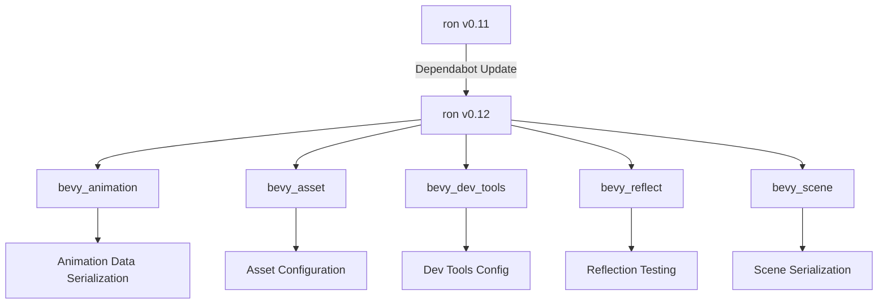

+++
title = "#22063 Update ron requirement from 0.11 to 0.12"
date = "2025-12-08T00:00:00"
draft = false
template = "pull_request_page.html"
in_search_index = true

[taxonomies]
list_display = ["show"]

[extra]
current_language = "en"
available_languages = {"en" = { name = "English", url = "/pull_request/bevy/2025-12/pr-22063-en-20251208" }, "zh-cn" = { name = "中文", url = "/pull_request/bevy/2025-12/pr-22063-zh-cn-20251208" }}
labels = ["C-Dependencies"]
+++

# Update ron requirement from 0.11 to 0.12

## Basic Information
- **Title**: Update ron requirement from 0.11 to 0.12
- **PR Link**: https://github.com/bevyengine/bevy/pull/22063
- **Author**: app/dependabot
- **Status**: MERGED
- **Labels**: C-Dependencies
- **Created**: 2025-12-08T06:30:56Z
- **Merged**: 2025-12-08T08:00:55Z
- **Merged By**: mockersf

## Description Translation
Updates the requirements on [ron](https://github.com/ron-rs/ron) to permit the latest version.
<details>
<summary>Release notes</summary>
<p><em>Sourced from <a href="https://github.com/ron-rs/ron/releases">ron's releases</a>.</em></p>
<blockquote>
<h2>v0.12.0</h2>
<h2>What's Changed</h2>
<ul>
<li>Add Serializer::into_inner method to extract the writer by <a href="https://github.com/Thomas-Mewily"><code>@​Thomas-Mewily</code></a> in <a href="https://redirect.github.com/ron-rs/ron/pull/588">ron-rs/ron#588</a></li>
<li>Add <code>ron-lsp</code> to README by <a href="https://github.com/jasonjmcghee"><code>@​jasonjmcghee</code></a> in <a href="https://redirect.github.com/ron-rs/ron/pull/589">ron-rs/ron#589</a></li>
<li>Fixed serde content detection for serde &gt;= 1.0.220 by <a href="https://github.com/juntyr"><code>@​juntyr</code></a> in <a href="https://redirect.github.com/ron-rs/ron/pull/582">ron-rs/ron#582</a></li>
<li>Further deprecate base64 byte strings by removing parsing support outside the error path by <a href="https://github.com/juntyr"><code>@​juntyr</code></a> in <a href="https://redirect.github.com/ron-rs/ron/pull/566">ron-rs/ron#566</a></li>
<li>Bump ron to v0.12.0 by <a href="https://github.com/juntyr"><code>@​juntyr</code></a> in <a href="https://redirect.github.com/ron-rs/ron/pull/591">ron-rs/ron#591</a></li>
</ul>
<h2>New Contributors</h2>
<ul>
<li><a href="https://github.com/Thomas-Mewily"><code>@​Thomas-Mewily</code></a> made their first contribution in <a href="https://redirect.github.com/ron-rs/ron/pull/588">ron-rs/ron#588</a></li>
<li><a href="https://github.com/jasonjmcghee"><code>@​jasonjmcghee</code></a> made their first contribution in <a href="https://redirect.github.com/ron-rs/ron/pull/589">ron-rs/ron#589</a></li>
</ul>
<p><strong>Full Changelog</strong>: <a href="https://github.com/ron-rs/ron/compare/v0.11.0...v0.12.0">https://github.com/ron-rs/ron/compare/v0.11.0...v0.12.0</a></p>
</blockquote>
</details>
<details>
<summary>Changelog</summary>
<p><em>Sourced from <a href="https://github.com/ron-rs/ron/blob/master/CHANGELOG.md">ron's changelog</a>.</em></p>
<blockquote>
<h2>[0.12.0] - 2025-11-12</h2>
<h3>API Changes</h3>
<ul>
<li>Breaking: Removed the <code>ron::error::Error::Base64Error</code> variant. (<a href="https://redirect.github.com/ron-rs/ron/pull/566">#566</a>)</li>
<li>Added <code>into_inner()</code> method to <code>ron::ser::Serializer</code> to retrieve the inner writer. (<a href="https://redirect.github.com/ron-rs/ron/pull/588">#588</a>)</li>
<li>Removed the <code>base64</code> dependency. (<a href="https://redirect.github.com/ron-rs/ron/pull/566">#566</a>)</li>
</ul>
<h3>Format Changes</h3>
<ul>
<li><strong>Format-Breaking:</strong> Remote base64-encoded byte strings deserialisation, replaced by Rusty byte strings in v0.9.0 (<a href="https://redirect.github.com/ron-rs/ron/pull/566">#566</a>)</li>
</ul>
<h3>Bug Fixes</h3>
<ul>
<li>Fixed untagged enum deserialisation for serde &gt;= 1.0.220 with better serde content detection (<a href="https://redirect.github.com/ron-rs/ron/pull/582">#582</a>)</li>
</ul>
<h2>[0.11.0] - 2025-08-27</h2>
<h3>API Changes</h3>
<ul>
<li>Breaking: <code>SpannedError</code> now stores the full error span in span: Span { start: Position, end: Position }`, to facilitate, e.g., language server highlighting of syntax errors.</li>
<li>Breaking: Added <code>no_std</code> support via a new <code>std</code> feature (enabled by default). With default features disabled, you must enable the <code>std</code> feature to access <code>de::from_reader</code>, and the <code>std::io</code> operations on <code>Options</code>, such as <code>from_reader</code>, <code>from_reader_seed</code>, <code>to_io_writer</code>, and <code>to_io_writer_pretty</code> (<a href="https://redirect.github.com/ron-rs/ron/pull/567">#567</a>)</li>
<li>Breaking: Fixed (again) <code>ron::value::Number</code> to ensure it is non-exhaustive, to avoid breaking <code>match</code>es when feature unification enables more of its variants than expected (<a href="https://redirect.github.com/ron-rs/ron/pull/568">#568</a>)</li>
</ul>
<h3>Examples</h3>
<ul>
<li>Add a new example <code>file_read_write_vec.rs</code> for reading and writing <code>Vec&lt;T&gt;</code> to/from files. (<a href="https://redirect.github.com/ron-rs/ron/pull/573">#573</a>)</li>
</ul>
<h2>[0.10.1] - 2025-04-08</h2>
<h3>API Changes</h3>
<ul>
<li>Add <code>ron::Options::to_io_writer</code> and <code>ron::Options::to_io_writer_pretty</code> to allow writing into an <code>io::Writer</code> (<a href="https://redirect.github.com/ron-rs/ron/pull/561">#561</a>)</li>
<li>Breaking: <code>ron::value::Number</code> is now non-exhaustive, to avoid breaking <code>match</code>es when feature unification enables more of its variants than expected (<a href="https://redirect.github.com/ron-rs/ron/pull/564">#564</a>)</li>
</ul>
<h2>[0.9.0] - 2025-03-18</h2>
<h3>API Changes</h3>
<ul>
<li>Add <code>ron::value::RawValue</code> helper type which can (de)serialize any valid RON (<a href="https://redirect.github.com/ron-rs/ron/pull/407">#407</a>)</li>
<li>Add <code>escape_strings</code> option to <code>PrettyConfig</code> to allow serialising with or without escaping (<a href="https://redirect.github.com/ron-rs/ron/pull/426">#426</a>)</li>
<li>Add <code>compact_maps</code> and <code>compact_structs</code> options to <code>PrettyConfig</code> to allow serialising maps and structs on a single line (<a href="https://redirect.github.com/ron-rs/ron/pull/448">#448</a>)</li>
<li>Add minimal support for <code>#[serde(flatten)]</code> with roundtripping through RON maps (<a href="https://redirect.github.com/ron-rs/ron/pull/455">#455</a>)</li>
<li>Add minimal roundtripping support for <code>#[serde(tag = &quot;tag&quot;)]</code>, <code>#[serde(tag = &quot;tag&quot;, content = &quot;content&quot;)]</code>, and <code>#[serde(untagged)]</code> enums (<a href="https://redirect.github.com/ron-rs/ron/pull/451">#451</a>)</li>
<li>Breaking: Expand the <code>value::Number</code> enum to explicitly encode all possible number types (<a href="https://redirect.github.com/ron-rs/ron/pull/479">#479</a>)</li>
<li>Add <code>number_suffixes</code> option to <code>PrettyConfig</code> to allow serialising numbers with their explicit type suffix, e.g. <code>42i32</code> (<a href="https://redirect.github.com/ron-rs/ron/pull/481">#481</a>)</li>
<li>Allow <code>ron::value::RawValue</code> to capture any whitespace to the left and right of a ron value (<a href="https://redirect.github.com/ron-rs/ron/pull/487">#487</a>)</li>
<li>Breaking: Enforce that ron always writes valid UTF-8 (<a href="https://redirect.github.com/ron-rs/ron/pull/488">#488</a>)</li>
<li>Add convenient <code>Value::from</code> impls (<a href="https://redirect.github.com/ron-rs/ron/pull/498">#498</a>)</li>
<li>Add new extension <code>explicit_struct_names</code> which requires that struct names are included during deserialization (<a href="https://redirect.github.com/ron-rs/ron/pull/522">#522</a>)</li>
</ul>
<!-- raw HTML omitted -->
</blockquote>
<p>... (truncated)</p>
</details>
<details>
<summary>Commits</summary>
<ul>
<li><a href="https://github.com/ron-rs/ron/commit/c6a8cff1eff986cc1ad9b026e838335187d411f0"><code>c6a8cff</code></a> Bump ron to v0.12.0 (<a href="https://redirect.github.com/ron-rs/ron/issues/591">#591</a>)</li>
<li><a href="https://github.com/ron-rs/ron/commit/f2c17284b4df666437614db57f5334c963dba201"><code>f2c1728</code></a> v0.12: Further deprecate base64 byte strings by removing parsing support outs...</li>
<li><a href="https://github.com/ron-rs/ron/commit/5630b0f1843b2e3cb1c856961dfc941326bd225e"><code>5630b0f</code></a> Fixed serde content detection for serde &gt;= 1.0.220 (<a href="https://redirect.github.com/ron-rs/ron/issues/582">#582</a>)</li>
<li><a href="https://github.com/ron-rs/ron/commit/3184df3d2c778cba512bcb3ae9ee4109ca7c01ea"><code>3184df3</code></a> Add <code>ron-lsp</code> to README (<a href="https://redirect.github.com/ron-rs/ron/issues/589">#589</a>)</li>
<li><a href="https://github.com/ron-rs/ron/commit/9b9b88e70d64e24805fd7824192348d695480ee7"><code>9b9b88e</code></a> Add Serializer::into_inner method to extract the writer (<a href="https://redirect.github.com/ron-rs/ron/issues/588">#588</a>)</li>
<li>See full diff in <a href="https://github.com/ron-rs/ron/compare/v0.11.0...v0.12.0">compare view</a></li>
</ul>
</details>
<br />


Dependabot will resolve any conflicts with this PR as long as you don't alter it yourself. You can also trigger a rebase manually by commenting `@dependabot rebase`.

[//]: # (dependabot-automerge-start)
[//]: # (dependabot-automerge-end)

---

<details>
<summary>Dependabot commands and options</summary>
<br />

You can trigger Dependabot actions by commenting on this PR:
- `@dependabot rebase` will rebase this PR
- `@dependabot recreate` will recreate this PR, overwriting any edits that have been made to it
- `@dependabot merge` will merge this PR after your CI passes on it
- `@dependabot squash and merge` will squash and merge this PR after your CI passes on it
- `@dependabot cancel merge` will cancel a previously requested merge and block automerging
- `@dependabot reopen` will reopen this PR if it is closed
- `@dependabot close` will close this PR and stop Dependabot recreating it. You can achieve the same result by closing it manually
- `@dependabot show <dependency name> ignore conditions` will show all of the ignore conditions of the specified dependency
- `@dependabot ignore this major version` will close this PR and stop Dependabot creating any more for this major version (unless you reopen the PR or upgrade to it yourself)
- `@dependabot ignore this minor version` will close this PR and stop Dependabot creating any more for this minor version (unless you reopen the PR or upgrade to it yourself)
- `@dependabot ignore this dependency` will close this PR and stop Dependabot creating any more for this dependency (unless you reopen the PR or upgrade to it yourself)


</details>

## The Story of This Pull Request

This is a routine dependency maintenance PR created by Dependabot, the automated dependency management service. The PR updates Bevy's dependency on the RON (Rusty Object Notation) crate from version 0.11 to 0.12 across multiple locations in the codebase. RON is a data serialization format similar to JSON but designed to be more readable for humans while maintaining support for Rust data structures.

The primary challenge with dependency updates like this is ensuring backward compatibility and verifying that the breaking changes in the new version don't affect the existing codebase. According to the release notes, RON 0.12 includes several important changes:
1. **Breaking API changes**: Removal of the `ron::error::Error::Base64Error` variant and the `base64` dependency
2. **Format-breaking changes**: Complete removal of base64-encoded byte strings deserialization support
3. **Bug fixes**: Improved serde content detection for untagged enum deserialization
4. **New features**: Addition of `Serializer::into_inner()` method

The key technical consideration here is that RON 0.12 removes support for base64-encoded byte strings, which had been deprecated since version 0.9.0 and replaced with "Rusty byte strings." Bevy needs to ensure that it's not using this deprecated feature in any of its serialization code. The fact that this PR was merged without requiring any code changes beyond the version bump suggests that Bevy was already using the newer format or wasn't using byte string serialization at all.

The implementation approach is straightforward: update the version string in all `Cargo.toml` files that reference the RON dependency. This includes both direct dependencies and dev-dependencies. The changes are minimal but widespread, affecting 5 different crates within the Bevy ecosystem. Each crate uses RON for different purposes:
- `bevy_animation`: For animation data serialization
- `bevy_asset`: For asset metadata and configuration
- `bevy_dev_tools`: For development tool configuration (optional feature)
- `bevy_reflect`: For reflection and serialization testing
- `bevy_scene`: For scene serialization (optional feature)

The maintenance of dependencies like RON is critical for several reasons:
1. **Security**: Updated dependencies often include security patches
2. **Bug fixes**: New versions fix known issues in the library
3. **Performance**: Optimizations in the dependency can improve overall system performance
4. **Compatibility**: Staying current with dependencies helps maintain compatibility with other libraries in the Rust ecosystem

The automated nature of this PR demonstrates the value of tools like Dependabot in managing dependency updates in large projects. The PR was quickly reviewed and merged within 1.5 hours of creation, indicating that the Bevy maintainers have confidence in both the RON upgrade and their test suite's ability to catch any potential issues.

## Visual Representation



## Key Files Changed

### Root `Cargo.toml`
This file contains the development dependencies for the entire workspace. The change updates RON from version 0.11 to 0.12 for development and testing purposes.

```toml
# File: Cargo.toml
# Before:
[dev-dependencies]
rand = "0.9.0"
rand_chacha = "0.9.0"
ron = "0.11"
flate2 = "1.0"
serde = { version = "1", features = ["derive"] }
serde_json = "1.0.140"

# After:
[dev-dependencies]
rand = "0.9.0"
rand_chacha = "0.9.0"
ron = "0.12"
flate2 = "1.0"
serde = { version = "1", features = ["derive"] }
serde_json = "1.0.140"
```

### `crates/bevy_animation/Cargo.toml`
This crate uses RON for serializing animation data. The update ensures it uses the latest version with bug fixes and improvements.

```toml
# File: crates/bevy_animation/Cargo.toml
# Before:
# other
petgraph = { version = "0.8", features = ["serde-1"] }
ron = "0.11"
serde = "1"
blake3 = { version = "1.0" }

# After:
# other
petgraph = { version = "0.8", features = ["serde-1"] }
ron = "0.12"
serde = "1"
blake3 = { version = "1.0" }
```

### `crates/bevy_asset/Cargo.toml`
This crate uses RON for asset metadata and configuration files. The update includes disabling default features, which is maintained in the new version.

```toml
# File: crates/bevy_asset/Cargo.toml
# Before:
futures-lite = { version = "2.0.1", default-features = false }
blake3 = { version = "1.5", default-features = false }
ron = { version = "0.11", default-features = false }
serde = { version = "1", default-features = false, features = ["derive"] }

# After:
futures-lite = { version = "2.0.1", default-features = false }
blake3 = { version = "1.5", default-features = false }
ron = { version = "0.12", default-features = false }
serde = { version = "1", default-features = false, features = ["derive"] }
```

### `crates/bevy_dev_tools/Cargo.toml`
This crate uses RON as an optional dependency for development tools configuration. The optional flag is preserved.

```toml
# File: crates/bevy_dev_tools/Cargo.toml
# Before:
# other
serde = { version = "1.0", features = ["derive"], optional = true }
ron = { version = "0.11", optional = true }
tracing = { version = "0.1", default-features = false, features = ["std"] }

# After:
# other
serde = { version = "1.0", features = ["derive"], optional = true }
ron = { version = "0.12", optional = true }
tracing = { version = "0.1", default-features = false, features = ["std"] }
```

### `crates/bevy_reflect/Cargo.toml`
This crate uses RON in its development dependencies for testing reflection and serialization functionality.

```toml
# File: crates/bevy_reflect/Cargo.toml
# Before:
[dev-dependencies]
ron = "0.11"
rmp-serde = "1.1"
bincode = { version = "2.0", features = ["serde"] }
serde_json = "1.0.140"

# After:
[dev-dependencies]
ron = "0.12"
rmp-serde = "1.1"
bincode = { version = "2.0", features = ["serde"] }
serde_json = "1.0.140"
```

### `crates/bevy_scene/Cargo.toml`
This crate uses RON as an optional dependency for scene serialization, maintaining the disabled default features.

```toml
# File: crates/bevy_scene/Cargo.toml
# Before:
# other
ron = { version = "0.11", default-features = false, optional = true }
serde = { version = "1.0", features = ["derive"], optional = true }
uuid = { version = "1.13.1", features = ["v4"] }

# After:
# other
ron = { version = "0.12", default-features = false, optional = true }
serde = { version = "1.0", features = ["derive"], optional = true }
uuid = { version = "1.13.1", features = ["v4"] }
```

## Further Reading

1. **RON Documentation**: https://github.com/ron-rs/ron - The official RON repository with documentation and examples
2. **Serde Documentation**: https://serde.rs/ - Understanding serialization in Rust, which RON builds upon
3. **Dependabot Documentation**: https://docs.github.com/en/code-security/dependabot - How automated dependency updates work
4. **Semantic Versioning**: https://semver.org/ - Understanding version numbers and breaking changes
5. **Rust Dependency Management**: https://doc.rust-lang.org/cargo/reference/specifying-dependencies.html - How Cargo handles dependencies

# Full Code Diff
diff --git a/Cargo.toml b/Cargo.toml
index aa3982b0c3a12..4a1143d51cee7 100644
--- a/Cargo.toml
+++ b/Cargo.toml
@@ -708,7 +708,7 @@ bevy_dylib = { path = "crates/bevy_dylib", version = "0.18.0-dev", default-featu
 [dev-dependencies]
 rand = "0.9.0"
 rand_chacha = "0.9.0"
-ron = "0.11"
+ron = "0.12"
 flate2 = "1.0"
 serde = { version = "1", features = ["derive"] }
 serde_json = "1.0.140"
diff --git a/crates/bevy_animation/Cargo.toml b/crates/bevy_animation/Cargo.toml
index 27338adbb444a..047609fd84f07 100644
--- a/crates/bevy_animation/Cargo.toml
+++ b/crates/bevy_animation/Cargo.toml
@@ -33,7 +33,7 @@ bevy_platform = { path = "../bevy_platform", version = "0.18.0-dev", default-fea
 
 # other
 petgraph = { version = "0.8", features = ["serde-1"] }
-ron = "0.11"
+ron = "0.12"
 serde = "1"
 blake3 = { version = "1.0" }
 downcast-rs = { version = "2", default-features = false, features = ["std"] }
diff --git a/crates/bevy_asset/Cargo.toml b/crates/bevy_asset/Cargo.toml
index 39a363433dfbf..d20e9c0974ee7 100644
--- a/crates/bevy_asset/Cargo.toml
+++ b/crates/bevy_asset/Cargo.toml
@@ -59,7 +59,7 @@ futures-util = { version = "0.3", default-features = false, features = [
 futures-io = { version = "0.3", default-features = false }
 futures-lite = { version = "2.0.1", default-features = false }
 blake3 = { version = "1.5", default-features = false }
-ron = { version = "0.11", default-features = false }
+ron = { version = "0.12", default-features = false }
 serde = { version = "1", default-features = false, features = ["derive"] }
 thiserror = { version = "2", default-features = false }
 derive_more = { version = "2", default-features = false, features = ["from"] }
diff --git a/crates/bevy_dev_tools/Cargo.toml b/crates/bevy_dev_tools/Cargo.toml
index e3e063cdcfc79..9d8567af0a6eb 100644
--- a/crates/bevy_dev_tools/Cargo.toml
+++ b/crates/bevy_dev_tools/Cargo.toml
@@ -34,7 +34,7 @@ bevy_state = { path = "../bevy_state", version = "0.18.0-dev" }
 
 # other
 serde = { version = "1.0", features = ["derive"], optional = true }
-ron = { version = "0.11", optional = true }
+ron = { version = "0.12", optional = true }
 tracing = { version = "0.1", default-features = false, features = ["std"] }
 
 [lints]
diff --git a/crates/bevy_reflect/Cargo.toml b/crates/bevy_reflect/Cargo.toml
index 2308719106112..5d5dfe1bc3249 100644
--- a/crates/bevy_reflect/Cargo.toml
+++ b/crates/bevy_reflect/Cargo.toml
@@ -133,7 +133,7 @@ wgpu-types = { version = "26", features = [
 inventory = { version = "0.3", optional = true }
 
 [dev-dependencies]
-ron = "0.11"
+ron = "0.12"
 rmp-serde = "1.1"
 bincode = { version = "2.0", features = ["serde"] }
 serde_json = "1.0.140"
diff --git a/crates/bevy_scene/Cargo.toml b/crates/bevy_scene/Cargo.toml
index f61bfd2357093..fe716124d8774 100644
--- a/crates/bevy_scene/Cargo.toml
+++ b/crates/bevy_scene/Cargo.toml
@@ -33,7 +33,7 @@ bevy_platform = { path = "../bevy_platform", version = "0.18.0-dev", default-fea
 ] }
 
 # other
-ron = { version = "0.11", default-features = false, optional = true }
+ron = { version = "0.12", default-features = false, optional = true }
 serde = { version = "1.0", features = ["derive"], optional = true }
 uuid = { version = "1.13.1", features = ["v4"] }
 thiserror = { version = "2", default-features = false }