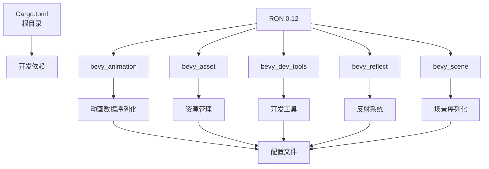

+++
title = "#22063 Update ron requirement from 0.11 to 0.12"
date = "2025-12-08T00:00:00"
draft = false
template = "pull_request_page.html"
in_search_index = false

[extra]
current_language = "zh-cn"
available_languages = {"en" = { name = "English", url = "/pull_request/bevy/2025-12/pr-22063-en-20251208" }, "zh-cn" = { name = "中文", url = "/pull_request/bevy/2025-12/pr-22063-zh-cn-20251208" }}
labels = ["C-Dependencies"]
+++

# Title
Update ron requirement from 0.11 to 0.12

## Basic Information
- **Title**: Update ron requirement from 0.11 to 0.12
- **PR Link**: https://github.com/bevyengine/bevy/pull/22063
- **Author**: app/dependabot
- **Status**: MERGED
- **Labels**: C-Dependencies
- **Created**: 2025-12-08T06:30:56Z
- **Merged**: 2025-12-08T08:00:55Z
- **Merged By**: mockersf

## Description Translation
更新对 [ron](https://github.com/ron-rs/ron) 的要求以允许最新版本。
<details>
<summary>发布说明</summary>
<p><em>来源自 <a href="https://github.com/ron-rs/ron/releases">ron 的发布</a>。</em></p>
<blockquote>
<h2>v0.12.0</h2>
<h2>更新内容</h2>
<ul>
<li>通过添加 Serializer::into_inner 方法来提取 writer，由 <a href="https://github.com/Thomas-Mewily"><code>@​Thomas-Mewily</code></a> 在 <a href="https://redirect.github.com/ron-rs/ron/pull/588">ron-rs/ron#588</a> 中完成</li>
<li>将 <code>ron-lsp</code> 添加到 README，由 <a href="https://github.com/jasonjmcghee"><code>@​jasonjmcghee</code></a> 在 <a href="https://redirect.github.com/ron-rs/ron/pull/589">ron-rs/ron#589</a> 中完成</li>
<li>修复了 serde >= 1.0.220 的 serde 内容检测，由 <a href="https://github.com/juntyr"><code>@​juntyr</code></a> 在 <a href="https://redirect.github.com/ron-rs/ron/pull/582">ron-rs/ron#582</a> 中完成</li>
<li>进一步弃用 base64 字节字符串，移除了错误路径之外的解析支持，由 <a href="https://github.com/juntyr"><code>@​juntyr</code></a> 在 <a href="https://redirect.github.com/ron-rs/ron/pull/566">ron-rs/ron#566</a> 中完成</li>
<li>将 ron 版本提升至 v0.12.0，由 <a href="https://github.com/juntyr"><code>@​juntyr</code></a> 在 <a href="https://redirect.github.com/ron-rs/ron/pull/591">ron-rs/ron#591</a> 中完成</li>
</ul>
<h2>新贡献者</h2>
<ul>
<li><a href="https://github.com/Thomas-Mewily"><code>@​Thomas-Mewily</code></a> 在 <a href="https://redirect.github.com/ron-rs/ron/pull/588">ron-rs/ron#588</a> 中做出了首次贡献</li>
<li><a href="https://github.com/jasonjmcghee"><code>@​jasonjmcghee</code></a> 在 <a href="https://redirect.github.com/ron-rs/ron/pull/589">ron-rs/ron#589</a> 中做出了首次贡献</li>
</ul>
<p><strong>完整变更日志</strong>: <a href="https://github.com/ron-rs/ron/compare/v0.11.0...v0.12.0">https://github.com/ron-rs/ron/compare/v0.11.0...v0.12.0</a></p>
</blockquote>
</details>
<details>
<summary>变更日志</summary>
<p><em>来源自 <a href="https://github.com/ron-rs/ron/blob/master/CHANGELOG.md">ron 的变更日志</a>。</em></p>
<blockquote>
<h2>[0.12.0] - 2025-11-12</h2>
<h3>API 变更</h3>
<ul>
<li>重大变更：移除了 <code>ron::error::Error::Base64Error</code> 变体。（<a href="https://redirect.github.com/ron-rs/ron/pull/566">#566</a>）</li>
<li>添加了 <code>into_inner()</code> 方法到 <code>ron::ser::Serializer</code> 以检索内部 writer。（<a href="https://redirect.github.com/ron-rs/ron/pull/588">#588</a>）</li>
<li>移除了 <code>base64</code> 依赖。（<a href="https://redirect.github.com/ron-rs/ron/pull/566">#566</a>）</li>
</ul>
<h3>格式变更</h3>
<ul>
<li><strong>格式破坏性变更：</strong> 移除了 base64 编码的字节字符串反序列化，自 v0.9.0 起已由 Rusty 字节字符串替代（<a href="https://redirect.github.com/ron-rs/ron/pull/566">#566</a>）</li>
</ul>
<h3>错误修复</h3>
<ul>
<li>修复了针对 serde >= 1.0.220 的未标记枚举反序列化，通过改进的 serde 内容检测（<a href="https://redirect.github.com/ron-rs/ron/pull/582">#582</a>）</li>
</ul>
<h2>[0.11.0] - 2025-08-27</h2>
<h3>API 变更</h3>
<ul>
<li>重大变更：<code>SpannedError</code> 现在将完整的错误跨度存储在 span: Span { start: Position, end: Position }` 中，以便于例如语言服务器语法错误的高亮显示。</li>
<li>重大变更：通过新的 <code>std</code> 特性（默认启用）添加了 <code>no_std</code> 支持。禁用默认特性时，必须启用 <code>std</code> 特性才能访问 <code>de::from_reader</code>，以及 <code>Options</code> 上的 <code>std::io</code> 操作，例如 <code>from_reader</code>、<code>from_reader_seed</code>、<code>to_io_writer</code> 和 <code>to_io_writer_pretty</code>（<a href="https://redirect.github.com/ron-rs/ron/pull/567">#567</a>）</li>
<li>重大变更：再次修复 <code>ron::value::Number</code> 以确保其非穷举性，避免在特性统一启用比预期更多的变体时破坏 <code>match</code> 表达式（<a href="https://redirect.github.com/ron-rs/ron/pull/568">#568</a>）</li>
</ul>
<h3>示例</h3>
<ul>
<li>添加了一个新的示例 <code>file_read_write_vec.rs</code>，用于将 <code>Vec&lt;T&gt;</code> 读写到文件/从文件读取。（<a href="https://redirect.github.com/ron-rs/ron/pull/573">#573</a>）</li>
</ul>
<h2>[0.10.1] - 2025-04-08</h2>
<h3>API 变更</h3>
<ul>
<li>添加 <code>ron::Options::to_io_writer</code> 和 <code>ron::Options::to_io_writer_pretty</code> 以允许写入到 <code>io::Writer</code>（<a href="https://redirect.github.com/ron-rs/ron/pull/561">#561</a>）</li>
<li>重大变更：<code>ron::value::Number</code> 现在是非穷举的，以避免在特性统一启用比预期更多的变体时破坏 <code>match</code> 表达式（<a href="https://redirect.github.com/ron-rs/ron/pull/564">#564</a>）</li>
</ul>
<h2>[0.9.0] - 2025-03-18</h2>
<h3>API 变更</h3>
<ul>
<li>添加 <code>ron::value::RawValue</code> 辅助类型，可以（反）序列化任何有效的 RON（<a href="https://redirect.github.com/ron-rs/ron/pull/407">#407</a>）</li>
<li>向 <code>PrettyConfig</code> 添加 <code>escape_strings</code> 选项以允许序列化时带或不带转义（<a href="https://redirect.github.com/ron-rs/ron/pull/426">#426</a>）</li>
<li>向 <code>PrettyConfig</code> 添加 <code>compact_maps</code> 和 <code>compact_structs</code> 选项以允许在单行上序列化映射和结构体（<a href="https://redirect.github.com/ron-rs/ron/pull/448">#448</a>）</li>
<li>通过 RON 映射往返添加对 <code>#[serde(flatten)]</code> 的最小支持（<a href="https://redirect.github.com/ron-rs/ron/pull/455">#455</a>）</li>
<li>添加对 <code>#[serde(tag = &quot;tag&quot;)]</code>、<code>#[serde(tag = &quot;tag&quot;, content = &quot;content&quot;)]</code> 和 <code>#[serde(untagged)]</code> 枚举的最小往返支持（<a href="https://redirect.github.com/ron-rs/ron/pull/451">#451</a>）</li>
<li>重大变更：扩展 <code>value::Number</code> 枚举以明确编码所有可能的数字类型（<a href="https://redirect.github.com/ron-rs/ron/pull/479">#479</a>）</li>
<li>向 <code>PrettyConfig</code> 添加 <code>number_suffixes</code> 选项以允许序列化带有显式类型后缀的数字，例如 <code>42i32</code>（<a href="https://redirect.github.com/ron-rs/ron/pull/481">#481</a>）</li>
<li>允许 <code>ron::value::RawValue</code> 捕获 RON 值左侧和右侧的任何空白字符（<a href="https://redirect.github.com/ron-rs/ron/pull/487">#487</a>）</li>
<li>重大变更：强制 ron 始终写入有效的 UTF-8（<a href="https://redirect.github.com/ron-rs/ron/pull/488">#488</a>）</li>
<li>添加便捷的 <code>Value::from</code> 实现（<a href="https://redirect.github.com/ron-rs/ron/pull/498">#498</a>）</li>
<li>添加新的扩展 <code>explicit_struct_names</code>，要求在反序列化期间包含结构体名称（<a href="https://redirect.github.com/ron-rs/ron/pull/522">#522</a>）</li>
</ul>
<!-- raw HTML omitted -->
</blockquote>
<p>...（截断）</p>
</details>
<details>
<summary>提交记录</summary>
<ul>
<li><a href="https://github.com/ron-rs/ron/commit/c6a8cff1eff986cc1ad9b026e838335187d411f0"><code>c6a8cff</code></a> 将 ron 版本提升至 v0.12.0（<a href="https://redirect.github.com/ron-rs/ron/issues/591">#591</a>）</li>
<li><a href="https://github.com/ron-rs/ron/commit/f2c17284b4df666437614db57f5334c963dba201"><code>f2c1728</code></a> v0.12：通过移除错误路径之外的解析支持进一步弃用 base64 字节字符串</li>
<li><a href="https://github.com/ron-rs/ron/commit/5630b0f1843b2e3cb1c856961dfc941326bd225e"><code>5630b0f</code></a> 修复了针对 serde >= 1.0.220 的 serde 内容检测（<a href="https://redirect.github.com/ron-rs/ron/issues/582">#582</a>）</li>
<li><a href="https://github.com/ron-rs/ron/commit/3184df3d2c778cba512bcb3ae9ee4109ca7c01ea"><code>3184df3</code></a> 将 <code>ron-lsp</code> 添加到 README（<a href="https://redirect.github.com/ron-rs/ron/issues/589">#589</a>）</li>
<li><a href="https://github.com/ron-rs/ron/commit/9b9b88e70d64e24805fd7824192348d695480ee7"><code>9b9b88e</code></a> 添加 Serializer::into_inner 方法以提取 writer（<a href="https://redirect.github.com/ron-rs/ron/issues/588">#588</a>）</li>
<li>查看完整差异请访问 <a href="https://github.com/ron-rs/ron/compare/v0.11.0...v0.12.0">比较视图</a></li>
</ul>
</details>
<br />


只要你不自行修改此 PR，Dependabot 将解决任何冲突。你也可以通过评论 `@dependabot rebase` 手动触发变基。

[//]: # (dependabot-automerge-start)
[//]: # (dependabot-automerge-end)

---

<details>
<summary>Dependabot 命令和选项</summary>
<br />

你可以通过评论此 PR 来触发 Dependabot 操作：
- `@dependabot rebase` 将变基此 PR
- `@dependabot recreate` 将重新创建此 PR，覆盖任何已对其进行的编辑
- `@dependabot merge` 将在 CI 通过后合并此 PR
- `@dependabot squash and merge` 将在 CI 通过后压缩并合并此 PR
- `@dependabot cancel merge` 将取消先前请求的合并并阻止自动合并
- `@dependabot reopen` 将重新打开此 PR（如果已关闭）
- `@dependabot close` 将关闭此 PR 并停止 Dependabot 重新创建它。你可以通过手动关闭它来达到相同的结果
- `@dependabot show <dependency name> ignore conditions` 将显示指定依赖项的所有忽略条件
- `@dependabot ignore this major version` 将关闭此 PR 并阻止 Dependabot 为此主要版本创建更多 PR（除非你重新打开 PR 或自行升级到此版本）
- `@dependabot ignore this minor version` 将关闭此 PR 并阻止 Dependabot 为此次要版本创建更多 PR（除非你重新打开 PR 或自行升级到此版本）
- `@dependabot ignore this dependency` 将关闭此 PR 并阻止 Dependabot 为此依赖项创建更多 PR（除非你重新打开 PR 或自行升级到此版本）


</details>

## The Story of This Pull Request

这是一个由 Dependabot 自动生成的依赖更新 PR，目标是将 Bevy 引擎中使用的 RON（Rusty Object Notation）序列化库从版本 0.11 升级到 0.12。这类更新是 Rust 项目中依赖管理的常规操作，但需要仔细审查以确更新不会引入破坏性变更。

RON 是 Bevy 中用于配置文件、场景和动画数据的序列化格式。从版本 0.11 到 0.12 的升级包含了几个重要变更。根据发布说明，最重要的变更是完全移除了对 base64 编码字节字符串的支持，这实际上从 RON 0.9.0 开始就已经被弃用，取而代之的是 Rusty 字节字符串语法。这个变更还导致了 `ron::error::Error::Base64Error` 变体的移除和 `base64` 依赖的删除。

对于 Bevy 来说，关键问题在于项目中是否使用了已移除的 base64 功能。如果 Bevy 代码库或用户项目依赖于旧的 base64 编码格式，这次升级就会破坏兼容性。从提交的变更来看，Bevy 维护者显然已经确认项目中没有使用这些已弃用的功能，因此可以直接升级。

另一个重要的修复是针对 serde 版本 >= 1.0.220 的未标记枚举（untagged enums）反序列化问题。这个修复确保了 RON 与最新 serde 版本的兼容性，对依赖 serde 进行序列化操作的 Bevy 组件非常重要。

升级过程本身很直接：只需要修改 6 个 Cargo.toml 文件中的版本号。这些文件包括根目录的 Cargo.toml（用于开发依赖）和多个 crate 的 Cargo.toml 文件（`bevy_animation`、`bevy_asset`、`bevy_dev_tools`、`bevy_reflect` 和 `bevy_scene`）。所有变更都是将版本号从 `"0.11"` 改为 `"0.12"`。

值得注意的是，这次升级包含一个格式破坏性变更（format-breaking change），但考虑到 base64 支持已经从 0.9.0 开始弃用，并且 Bevy 显然没有使用它，这个风险是可接受的。PR 在创建后不到两小时就被合并，表明维护者对变更的影响有足够信心，或者可能已经预先测试了兼容性。

这种依赖升级展示了现代 Rust 项目的维护模式：自动化工具检测可用更新，维护者评估变更的影响，然后在确认兼容后快速合并。对于像 Bevy 这样的大型项目，保持依赖更新有助于获得安全修复、性能改进和新功能，同时避免技术债务累积。

## Visual Representation



## Key Files Changed

1. **`Cargo.toml`** - 根目录的包清单文件
   - 更新了开发依赖中的 ron 版本
   - 从 `ron = "0.11"` 改为 `ron = "0.12"`

```toml
# File: Cargo.toml
# 修改前:
ron = "0.11"

# 修改后:
ron = "0.12"
```

2. **`crates/bevy_animation/Cargo.toml`** - 动画系统的包清单
   - 更新了 ron 依赖版本
   - 用于动画数据的序列化

```toml
# File: crates/bevy_animation/Cargo.toml
# 修改前:
ron = "0.11"

# 修改后:
ron = "0.12"
```

3. **`crates/bevy_asset/Cargo.toml`** - 资源管理系统的包清单
   - 更新了 ron 依赖版本
   - 用于资源配置文件的序列化

```toml
# File: crates/bevy_asset/Cargo.toml
# 修改前:
ron = { version = "0.11", default-features = false }

# 修改后:
ron = { version = "0.12", default-features = false }
```

4. **`crates/bevy_dev_tools/Cargo.toml`** - 开发工具的包清单
   - 更新了可选的 ron 依赖版本
   - 用于开发工具中的配置序列化

```toml
# File: crates/bevy_dev_tools/Cargo.toml
# 修改前:
ron = { version = "0.11", optional = true }

# 修改后:
ron = { version = "0.12", optional = true }
```

5. **`crates/bevy_reflect/Cargo.toml`** - 反射系统的包清单
   - 更新了开发依赖中的 ron 版本
   - 用于测试反射系统的序列化功能

```toml
# File: crates/bevy_reflect/Cargo.toml
# 修改前:
ron = "0.11"

# 修改后:
ron = "0.12"
```

6. **`crates/bevy_scene/Cargo.toml`** - 场景系统的包清单
   - 更新了可选的 ron 依赖版本
   - 用于场景数据的序列化

```toml
# File: crates/bevy_scene/Cargo.toml
# 修改前:
ron = { version = "0.11", default-features = false, optional = true }

# 修改后:
ron = { version = "0.12", default-features = false, optional = true }
```

## Further Reading

1. **RON 官方文档**: https://github.com/ron-rs/ron - RON 序列化格式的完整文档和示例
2. **Serde 框架**: https://serde.rs/ - RON 基于的序列化框架，理解 serde 有助于更好地使用 RON
3. **语义化版本控制**: https://semver.org/ - 理解版本号变更（0.11 到 0.12）所代表的意义
4. **Dependabot 文档**: https://docs.github.com/en/code-security/dependabot - GitHub 的依赖自动化管理工具
5. **Cargo 依赖管理**: https://doc.rust-lang.org/cargo/guide/dependencies.html - Rust 包管理器的依赖管理机制
6. **Bevy 场景系统**: https://bevyengine.org/learn/book/next/features/scene/ - Bevy 如何使用场景和序列化