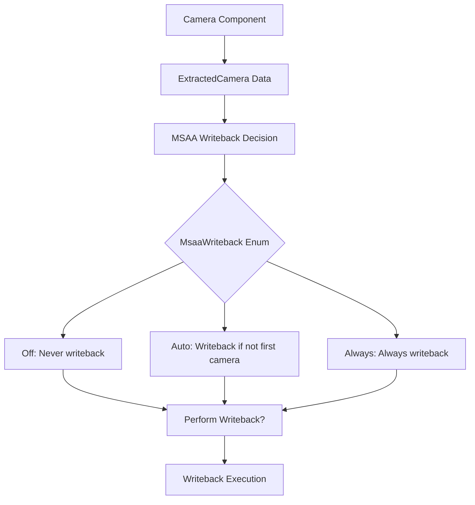

+++
title = "#22066 Add flag to force MSAA writeback"
date = "2025-12-09T00:00:00"
draft = false
template = "pull_request_page.html"
in_search_index = true

[taxonomies]
list_display = ["show"]

[extra]
current_language = "en"
available_languages = {"en" = { name = "English", url = "/pull_request/bevy/2025-12/pr-22066-en-20251209" }, "zh-cn" = { name = "中文", url = "/pull_request/bevy/2025-12/pr-22066-zh-cn-20251209" }}
labels = ["C-Feature", "A-Rendering", "D-Modest"]
+++

# Title: Add flag to force MSAA writeback

## Basic Information
- **Title**: Add flag to force MSAA writeback
- **PR Link**: https://github.com/bevyengine/bevy/pull/22066
- **Author**: tychedelia
- **Status**: MERGED
- **Labels**: C-Feature, A-Rendering, D-Modest, S-Needs-Review
- **Created**: 2025-12-08T23:03:30Z
- **Merged**: 2025-12-09T00:20:22Z
- **Merged By**: mockersf

## Description Translation
For Processing, we sometimes need to write out of band to the main view target, which will get clobbered if it's the first camera and writeback doesn't occur.

## The Story of This Pull Request

### The Problem and Context
The issue stems from how Bevy handles Multi-Sample Anti-Aliasing (MSAA) writeback between cameras. MSAA writeback is the process where a camera's render output is copied into the MSAA-sampled texture before rendering begins, allowing multiple cameras to layer their results when MSAA is enabled. This is particularly important for rendering pipelines where multiple cameras render to the same target.

Prior to this PR, the system had a binary choice: either MSAA writeback was enabled (default) or disabled. When enabled, writeback would only occur if the camera wasn't the first one rendering to that target. This logic made sense for typical camera stacking scenarios where the first camera has no previous content to preserve. However, it created a problem for advanced rendering techniques where content might be written directly to the main texture via low-level operations like `write_texture` before any camera renders.

In these advanced use cases, developers needed to preserve this pre-written content through the MSAA render pass, but the existing logic would skip writeback for the first camera, effectively clobbering the manually written data. The binary boolean flag `msaa_writeback` didn't provide enough granularity to handle this scenario.

### The Solution Approach
The developer implemented a more flexible control mechanism by replacing the boolean `msaa_writeback` field with an enum that offers three distinct modes of operation. This approach maintains backward compatibility while adding the necessary flexibility for advanced use cases.

The key insight was that instead of just enabling or disabling writeback, cameras need different policies for when writeback should occur:
- Some cameras should never do writeback
- Some should follow the default automatic behavior (writeback only if not first camera)
- Some should always do writeback, even when they're the first camera

This enum-based approach provides explicit control while keeping the API intuitive and self-documenting.

### The Implementation
The implementation involved changes across five files, with the core change being the introduction of the `MsaaWriteback` enum. The enum was added to the `bevy_camera` crate with proper serialization, reflection, and default implementations:

```rust
#[derive(Reflect, Serialize, Deserialize, Copy, Clone, Debug, Default, PartialEq, Eq)]
#[reflect(Serialize, Deserialize, Default, Clone)]
pub enum MsaaWriteback {
    /// Never perform MSAA writeback for this camera.
    Off,
    /// Perform MSAA writeback only when this camera is not the first one rendering to the target.
    /// This is the default behavior - the first camera has nothing to write back.
    #[default]
    Auto,
    /// Always perform MSAA writeback, even if this is the first camera rendering to the target.
    /// This is useful when content has been written directly to the main texture (e.g., via
    /// `write_texture`) and needs to be preserved through the MSAA render pass.
    Always,
}
```

The `Camera` component was updated to use this enum instead of a boolean:

```rust
pub struct Camera {
    // ... other fields
    /// Controls when MSAA writeback occurs for this camera.
    /// See [`MsaaWriteback`] for available options.
    pub msaa_writeback: MsaaWriteback,
    // ... other fields
}
```

The rendering logic in `msaa_writeback.rs` was updated to handle the three cases:

```rust
let should_writeback = match camera.msaa_writeback {
    MsaaWriteback::Off => false,
    MsaaWriteback::Auto => camera.sorted_camera_index_for_target > 0,
    MsaaWriteback::Always => true,
};
```

This cleanly separates the decision logic into three distinct branches, making the code more maintainable and easier to understand than the previous boolean logic with an implicit condition.

### Technical Insights
The implementation demonstrates several good engineering practices:

1. **Backward Compatibility**: By setting `Auto` as the default variant, existing code continues to work exactly as before without any changes.

2. **Explicit over Implicit**: The enum makes the different behaviors explicit and self-documenting. Developers can clearly see what each option does without having to trace through conditional logic.

3. **Proper API Design**: The enum is placed in the appropriate module (`bevy_camera`) and exported through the prelude, making it easily accessible to users.

4. **Separation of Concerns**: The decision logic for whether to perform writeback is cleanly separated from the actual writeback implementation, making both easier to test and maintain.

One important consideration is that this change affects both the ECS component (`Camera`) and the extracted rendering data (`ExtractedCamera`), requiring updates in both `bevy_camera` and `bevy_render` crates. The implementation handles this consistently across both representations.

### The Impact
This change provides several concrete benefits:

1. **Advanced Rendering Support**: Developers can now use low-level texture writing operations (like `write_texture`) and preserve that content through MSAA rendering passes, enabling more complex rendering pipelines.

2. **Flexible Camera Control**: The three modes provide fine-grained control over MSAA writeback behavior, accommodating a wider range of use cases without workarounds.

3. **Cleaner Code**: The enum-based approach makes the code more readable and maintainable. The match statement in the rendering logic is clearer than the previous compound boolean condition.

4. **Future Extensibility**: If additional writeback policies are needed in the future, they can be added as new enum variants without breaking existing code.

The change is relatively small in scope but addresses a real pain point for developers implementing advanced rendering techniques. It demonstrates how thoughtful API design can solve specific problems while maintaining simplicity for common use cases.

## Visual Representation



## Key Files Changed

### `crates/bevy_camera/src/clear_color.rs` (+19/-0)
This file now contains the definition of the `MsaaWriteback` enum. The enum provides three options for controlling MSAA writeback behavior with clear documentation for each variant.

```rust
/// Controls when MSAA writeback occurs for a camera.
///
/// MSAA writeback copies the previous camera's output into the MSAA sampled texture before
/// rendering, allowing multiple cameras to layer their results when MSAA is enabled.
#[derive(Reflect, Serialize, Deserialize, Copy, Clone, Debug, Default, PartialEq, Eq)]
#[reflect(Serialize, Deserialize, Default, Clone)]
pub enum MsaaWriteback {
    /// Never perform MSAA writeback for this camera.
    Off,
    /// Perform MSAA writeback only when this camera is not the first one rendering to the target.
    /// This is the default behavior - the first camera has nothing to write back.
    #[default]
    Auto,
    /// Always perform MSAA writeback, even if this is the first camera rendering to the target.
    /// This is useful when content has been written directly to the main texture (e.g., via
    /// `write_texture`) and needs to be preserved through the MSAA render pass.
    Always,
}
```

### `crates/bevy_post_process/src/msaa_writeback.rs` (+9/-4)
This file contains the logic that determines whether to perform MSAA writeback. The boolean check was replaced with a match statement that handles all three enum variants.

```rust
// Before:
if msaa.samples() > 1 && camera.msaa_writeback && camera.sorted_camera_index_for_target > 0

// After:
let should_writeback = match camera.msaa_writeback {
    MsaaWriteback::Off => false,
    MsaaWriteback::Auto => camera.sorted_camera_index_for_target > 0,
    MsaaWriteback::Always => true,
};

if msaa.samples() > 1 && should_writeback
```

### `crates/bevy_camera/src/camera.rs` (+5/-7)
The `Camera` struct was updated to use the `MsaaWriteback` enum instead of a boolean, and the documentation was updated to reference the new enum.

```rust
// Before:
pub msaa_writeback: bool,

// After:
pub msaa_writeback: MsaaWriteback,
```

### `crates/bevy_render/src/camera.rs` (+3/-3)
The `ExtractedCamera` struct was updated to match the change in the `Camera` component, ensuring consistency between the ECS representation and the extracted rendering data.

```rust
// Before:
pub msaa_writeback: bool,

// After:
pub msaa_writeback: MsaaWriteback,
```

### `crates/bevy_camera/src/lib.rs` (+2/-2)
The `MsaaWriteback` enum was added to the prelude exports, making it easily accessible to users without needing to know its exact module path.

```rust
// Added to prelude:
MsaaWriteback,
```

## Further Reading

1. **Bevy Render Graph Documentation**: For understanding how cameras and render targets work in Bevy's rendering system
2. **MSAA Techniques in Computer Graphics**: For background on multi-sample anti-aliasing and why writeback is necessary
3. **Bevy Camera Component Documentation**: For details on camera configuration and rendering options
4. **GPU Texture Operations**: For understanding low-level texture operations like `write_texture` that motivated this change
5. **Enum-driven Configuration Patterns**: For learning more about using enums for flexible configuration APIs in Rust