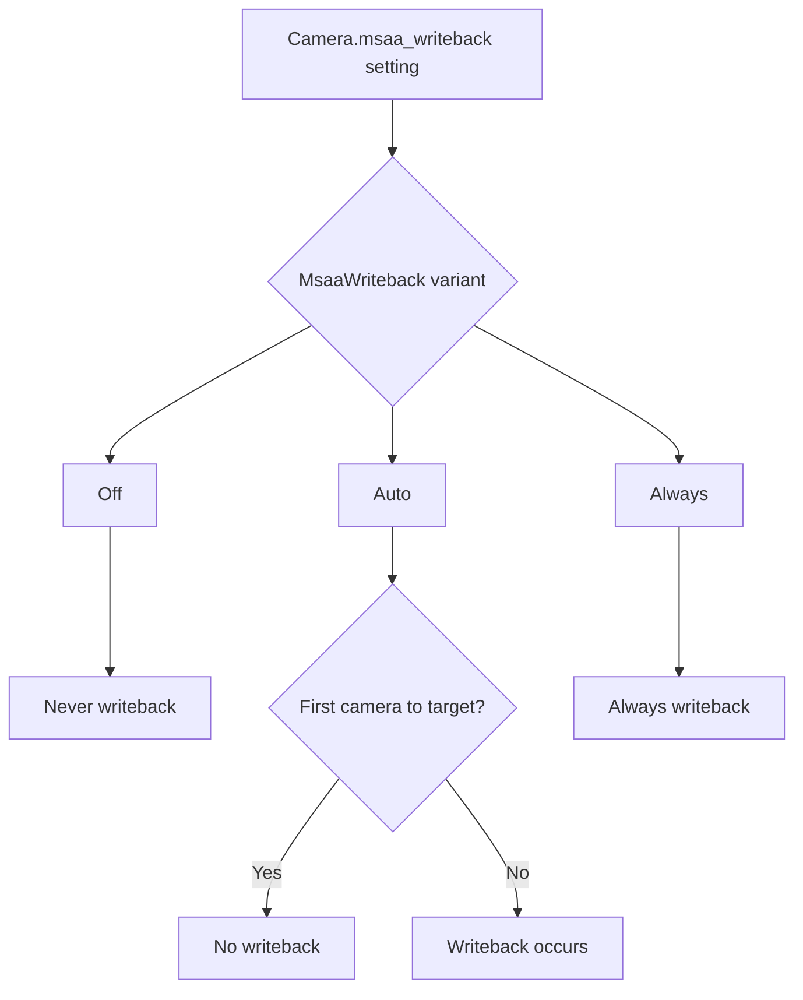

+++
title = "#22066 Add flag to force MSAA writeback"
date = "2025-12-09T00:00:00"
draft = false
template = "pull_request_page.html"
in_search_index = false

[extra]
current_language = "zh-cn"
available_languages = {"en" = { name = "English", url = "/pull_request/bevy/2025-12/pr-22066-en-20251209" }, "zh-cn" = { name = "中文", url = "/pull_request/bevy/2025-12/pr-22066-zh-cn-20251209" }}
labels = ["C-Feature", "A-Rendering", "D-Modest"]
+++

# Title
Add flag to force MSAA writeback

## Basic Information
- **Title**: Add flag to force MSAA writeback  
- **PR Link**: https://github.com/bevyengine/bevy/pull/22066
- **Author**: tychedelia
- **Status**: MERGED
- **Labels**: C-Feature, A-Rendering, D-Modest, S-Needs-Review
- **Created**: 2025-12-08T23:03:30Z
- **Merged**: 2025-12-09T00:20:22Z
- **Merged By**: mockersf

## Description Translation
在某些处理场景中，我们需要脱离主渲染目标进行写入（out of band writes）。如果这是第一个摄像机（camera）且写回（writeback）没有发生，那么这些写入的内容将被覆盖。

## The Story of This Pull Request

### 问题背景
这个PR解决了一个具体的渲染管线问题，涉及MSAA（多重采样抗锯齿）写回机制。在Bevy的渲染系统中，当多个摄像机渲染到同一个目标时，系统需要处理MSAA的中间纹理。默认情况下，如果启用了MSAA，且一个摄像机不是渲染到特定目标的第一个摄像机，那么前一个摄像机的输出会通过"写回"（writeback）操作复制到当前摄像机的MSAA纹理中。这样，多个摄像机的结果可以正确地分层叠加。

然而，在某些高级渲染技术中，开发者可能需要通过`write_texture`等方法直接在渲染目标上写入数据。如果这些操作发生在第一个摄像机渲染之前，并且第一个摄像机启用了MSAA，由于默认写回逻辑只在非第一个摄像机时触发，这些预先写入的数据就会被第一个摄像机的渲染清除，导致数据丢失。

### 解决方案
开发者引入了`MsaaWriteback`枚举类型来提供更细粒度的控制，替换了原来简单的布尔标志。这个枚举提供了三个选项：
1. `Off`：完全禁用MSAA写回
2. `Auto`：仅在非第一个摄像机时执行写回（默认行为）
3. `Always`：总是执行MSAA写回

新增的`Always`选项解决了核心问题：即使对于第一个摄像机，也强制进行写回操作，从而保留通过非标准方式预先写入的内容。

### 实现细节
实现主要分为几个步骤：

首先，在`clear_color.rs`中定义了新的枚举类型：
```rust
pub enum MsaaWriteback {
    Off,
    #[default]
    Auto,
    Always,
}
```

然后将`Camera`结构体的`msaa_writeback`字段从布尔类型改为这个枚举类型：
```rust
// Before:
pub msaa_writeback: bool,

// After:
pub msaa_writeback: MsaaWriteback,
```

更新默认值从`true`改为`MsaaWriteback::default()`（即`Auto`）。

在渲染管线的写回准备阶段，更新了判断逻辑：
```rust
// Before:
if msaa.samples() > 1 && camera.msaa_writeback && camera.sorted_camera_index_for_target > 0

// After:
let should_writeback = match camera.msaa_writeback {
    MsaaWriteback::Off => false,
    MsaaWriteback::Auto => camera.sorted_camera_index_for_target > 0,
    MsaaWriteback::Always => true,
};

if msaa.samples() > 1 && should_writeback
```

这个变化使得逻辑更加明确，支持了三种不同的行为模式。

### 技术考量
这个PR的设计体现了良好的API演化原则。用枚举替代布尔值有几个优势：
1. 更清晰地表达了意图，避免了布尔参数常见的"magic boolean"问题
2. 为将来可能的扩展留下了空间
3. 保持了向后兼容性（通过将之前的`true`行为对应到`Auto`，`false`对应到`Off`）

枚举的命名也很直观，遵循了Bevy代码库的命名约定。`Always`选项的描述清楚地说明了使用场景："当内容已直接写入主纹理（例如通过`write_texture`）并需要在MSAA渲染过程中保留时很有用"。

### 影响
这个变化使得渲染管线更加灵活，支持了更高级的渲染技术。开发者现在可以安全地在第一个摄像机渲染之前向目标写入数据，同时仍然享受MSAA的好处。

值得注意的是，这个更改是向后兼容的。之前设置`msaa_writeback: true`的代码现在等价于`msaa_writeback: MsaaWriteback::Auto`，行为完全一致。

## Visual Representation



## Key Files Changed

### `crates/bevy_camera/src/clear_color.rs` (+19/-0)
**目的**：定义新的`MsaaWriteback`枚举类型。

**关键修改**：
```rust
/// Controls when MSAA writeback occurs for a camera.
///
/// MSAA writeback copies the previous camera's output into the MSAA sampled texture before
/// rendering, allowing multiple cameras to layer their results when MSAA is enabled.
#[derive(Reflect, Serialize, Deserialize, Copy, Clone, Debug, Default, PartialEq, Eq)]
#[reflect(Serialize, Deserialize, Default, Clone)]
pub enum MsaaWriteback {
    /// Never perform MSAA writeback for this camera.
    Off,
    /// Perform MSAA writeback only when this camera is not the first one rendering to the target.
    /// This is the default behavior - the first camera has nothing to write back.
    #[default]
    Auto,
    /// Always perform MSAA writeback, even if this is the first camera rendering to the target.
    /// This is useful when content has been written directly to the main texture (e.g., via
    /// `write_texture`) and needs to be preserved through the MSAA render pass.
    Always,
}
```

### `crates/bevy_camera/src/camera.rs` (+5/-7)
**目的**：将`Camera`的`msaa_writeback`字段类型从`bool`改为`MsaaWriteback`。

**关键修改**：
```rust
// 字段类型变更：
// Before:
pub msaa_writeback: bool,

// After:
pub msaa_writeback: MsaaWriteback,

// 默认值变更：
// Before:
msaa_writeback: true,

// After:
msaa_writeback: MsaaWriteback::default(),
```

### `crates/bevy_post_process/src/msaa_writeback.rs` (+9/-4)
**目的**：更新写回逻辑，根据新的枚举类型决定是否进行写回。

**关键修改**：
```rust
// 逻辑判断从简单的布尔检查变为模式匹配：
let should_writeback = match camera.msaa_writeback {
    MsaaWriteback::Off => false,
    MsaaWriteback::Auto => camera.sorted_camera_index_for_target > 0,
    MsaaWriteback::Always => true,
};

if msaa.samples() > 1 && should_writeback {
    // ... 执行写回操作
}
```

### `crates/bevy_render/src/camera.rs` (+3/-3)
**目的**：更新提取摄像机（ExtractedCamera）结构体中的字段类型。

**关键修改**：
```rust
// 字段类型从bool改为MsaaWriteback
pub msaa_writeback: MsaaWriteback,
```

### `crates/bevy_camera/src/lib.rs` (+2/-2)
**目的**：在预导出模块中添加`MsaaWriteback`。

## Further Reading

1. [Bevy Camera and Rendering Documentation](https://docs.rs/bevy/latest/bevy/render/camera/index.html) - 了解Bevy摄像机系统的基础知识
2. [MSAA (Multisample Anti-Aliasing) Wikipedia](https://en.wikipedia.org/wiki/Multisample_anti-aliasing) - 理解MSAA的基本原理
3. [Rust Enum Pattern Matching](https://doc.rust-lang.org/book/ch06-02-match.html) - Rust枚举和模式匹配的使用
4. [Bevy Render Graph Documentation](https://bevyengine.org/learn/book/quick-start/rendering/render-graph/) - 理解Bevy渲染图如何组织渲染操作