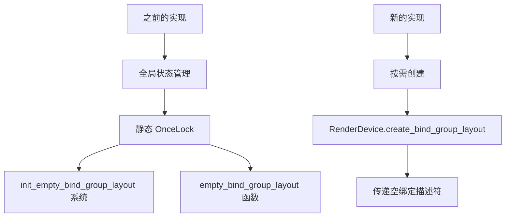

+++
title = "#22068 remove empty_bind_group_layout"
date = "2025-12-09T00:00:00"
draft = false
template = "pull_request_page.html"
in_search_index = false

[extra]
current_language = "zh-cn"
available_languages = {"en" = { name = "English", url = "/pull_request/bevy/2025-12/pr-22068-en-20251209" }, "zh-cn" = { name = "中文", url = "/pull_request/bevy/2025-12/pr-22068-zh-cn-20251209" }}
labels = ["D-Trivial", "A-Rendering", "C-Code-Quality"]
+++

# Title
## 移除 empty_bind_group_layout

## Basic Information
- **Title**: remove empty_bind_group_layout
- **PR Link**: https://github.com/bevyengine/bevy/pull/22068
- **Author**: ecoskey
- **Status**: MERGED
- **Labels**: D-Trivial, A-Rendering, C-Code-Quality, S-Ready-For-Final-Review
- **Created**: 2025-12-09T04:27:37Z
- **Merged**: 2025-12-09T11:57:23Z
- **Merged By**: mockersf

## Description Translation
**目标**

- 现在我们有了 `BindGroupLayoutDescriptor`，不再需要这个丑陋的 hack

**解决方案**

- 移除这个丑陋的 hack

## The Story of This Pull Request

这个 PR 讲述了一个简单的代码清理故事。在 Bevy 渲染系统的早期实现中，开发者在 `bind_group_layout.rs` 模块中创建了一个全局的空绑定组布局（empty bind group layout）。这个布局通过一个静态的 `OnceLock` 来存储，并通过 `init_empty_bind_group_layout` 函数在系统启动时初始化，然后通过 `empty_bind_group_layout` 函数提供给其他代码使用。

这个实现方式有几个问题。首先，它引入了全局状态，这在 Rust 中通常被视为一种反模式，特别是在并发环境下。其次，它增加了代码的复杂性，需要显式的初始化步骤，并且在未初始化时访问会导致 panic。最重要的是，这个实现现在已经是多余的，因为 Bevy 已经有了 `BindGroupLayoutDescriptor`，可以直接创建空的绑定组布局，而不需要这个全局的 hack。

从技术角度来看，移除这个 hack 使得代码更简洁、更安全。现在当需要空的绑定组布局时，可以直接使用 `RenderDevice::create_bind_group_layout` 方法并传递一个空的切片作为绑定描述符列表，例如：

```rust
render_device.create_bind_group_layout(Some("empty_bind_group_layout"), &[])
```

这种方法更符合 Rust 的所有权模型，也更容易理解和维护。它消除了全局状态带来的潜在问题，比如竞争条件和初始化顺序问题。同时，这也减少了 API 的复杂性，开发者不再需要记住调用初始化函数。

这个 PR 的影响是积极的，它移除了 19 行代码，只增加了 1 行（修正导入），净减少 18 行代码。更重要的是，它简化了渲染模块的初始化过程，从 `RenderPlugin` 中移除了一个系统注册。

这个变化是一个典型的代码质量改进示例：识别出因历史原因存在的冗余代码，在新的、更简洁的 API 可用时，及时清理旧实现。这种清理工作对于保持代码库的健康和可维护性非常重要。

## Visual Representation



## Key Files Changed

1. **`crates/bevy_render/src/lib.rs` (+1/-3)**
   - 移除了 `init_empty_bind_group_layout` 的导入
   - 移除了在 `RenderPlugin` 中注册的 `init_empty_bind_group_layout` 系统

   关键修改：
   ```rust
   // 之前：
   use render_resource::{init_empty_bind_group_layout, PipelineCache};
   // ...
   render_app.add_systems(RenderStartup, init_empty_bind_group_layout);
   
   // 之后：
   use render_resource::PipelineCache;
   // init_empty_bind_group_layout 系统注册被移除
   ```

2. **`crates/bevy_render/src/render_resource/bind_group_layout.rs` (+1/-19)**
   - 移除了整个 `EMPTY_BIND_GROUP_LAYOUT` 静态变量
   - 移除了 `init_empty_bind_group_layout` 和 `empty_bind_group_layout` 函数

   关键修改：
   ```rust
   // 之前：
   static EMPTY_BIND_GROUP_LAYOUT: OnceLock<BindGroupLayout> = OnceLock::new();
   
   pub(crate) fn init_empty_bind_group_layout(render_device: Res<RenderDevice>) {
       let layout = render_device.create_bind_group_layout(Some("empty_bind_group_layout"), &[]);
       EMPTY_BIND_GROUP_LAYOUT
           .set(layout)
           .expect("init_empty_bind_group_layout was called more than once");
   }
   
   pub fn empty_bind_group_layout() -> BindGroupLayout {
       EMPTY_BIND_GROUP_LAYOUT
           .get()
           .expect("init_empty_bind_group_layout was not called")
           .clone()
   }
   
   // 之后：
   // 所有这些代码都被移除，现在可以直接使用 create_bind_group_layout(&[])
   ```

## Further Reading

1. **Rust 中的静态初始化模式**：
   - [OnceLock 文档](https://doc.rust-lang.org/std/sync/struct.OnceLock.html)
   - [LazyLock 和 OnceLock 的比较](https://doc.rust-lang.org/std/sync/index.html#lazy-initialization)

2. **Bevy 渲染系统架构**：
   - [Bevy 渲染器设计](https://bevy-cheatbook.github.io/programming/rendering.html)
   - [绑定组和管线布局](https://wgpu.rs/guide/pipeline/#bind-groups)

3. **代码质量改进的最佳实践**：
   - [识别和移除技术债务](https://martinfowler.com/bliki/TechnicalDebt.html)
   - [简化复杂系统的策略](https://refactoring.guru/simplifying-conditional-expressions)