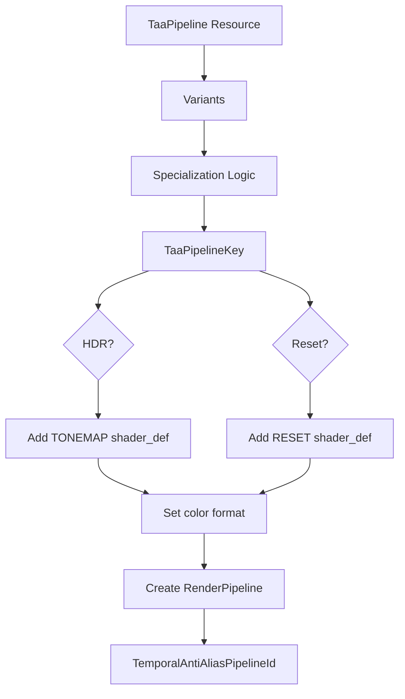

+++
title = "#22070 `spec_v2`: migrate TAA"
date = "2025-12-15T00:00:00"
draft = false
template = "pull_request_page.html"
in_search_index = true

[taxonomies]
list_display = ["show"]

[extra]
current_language = "en"
available_languages = {"en" = { name = "English", url = "/pull_request/bevy/2025-12/pr-22070-en-20251215" }, "zh-cn" = { name = "中文", url = "/pull_request/bevy/2025-12/pr-22070-zh-cn-20251215" }}
labels = ["A-Rendering", "C-Code-Quality", "D-Modest"]
+++

# Title

## Basic Information
- **Title**: `spec_v2`: migrate TAA
- **PR Link**: https://github.com/bevyengine/bevy/pull/22070
- **Author**: ecoskey
- **Status**: MERGED
- **Labels**: A-Rendering, C-Code-Quality, S-Ready-For-Final-Review, D-Modest
- **Created**: 2025-12-09T04:36:08Z
- **Merged**: 2025-12-15T00:53:55Z
- **Merged By**: alice-i-cecile

## Description Translation

# Objective

- Migrate TAA to `spec_v2`

## Testing

- Ran `anti_aliasing` example, seems fine

## The Story of This Pull Request

This PR migrates the Temporal Anti-Aliasing (TAA) render pipeline from Bevy's old specialization system to the new `spec_v2` system. The work focuses on refactoring the pipeline specialization logic without changing TAA's core functionality, maintaining the same visual output while adopting a more modern and maintainable architecture.

The old specialization system used the `SpecializedRenderPipeline` trait with `SpecializedRenderPipelines` resource. This system had limitations: each pipeline specialization required separate storage, and the specialization logic was tightly coupled with the pipeline state management. The `spec_v2` system introduces a more flexible approach using the `Variants` type and `Specializer` trait, separating the specialization logic from pipeline storage.

The implementation began by updating imports and removing the old system's infrastructure. The `SpecializedRenderPipelines<TaaPipeline>` resource initialization was removed, as was the dependency on the `SpecializedRenderPipelines` type. Instead, the code now uses `Variants<RenderPipeline, TaaPipelineSpecializer>` to manage pipeline specializations.

The `TaaPipeline` struct was restructured to store a `Variants` instance instead of separate shader handles and specialization logic:

```rust
struct TaaPipeline {
    taa_bind_group_layout: BindGroupLayoutDescriptor,
    nearest_sampler: Sampler,
    linear_sampler: Sampler,
    variants: Variants<RenderPipeline, TaaPipelineSpecializer>,
}
```

A new `TaaPipelineSpecializer` struct was created to implement the `Specializer<RenderPipeline>` trait. This separation of concerns makes the specialization logic more testable and reusable. The `SpecializerKey` derive macro was added to the `TaaPipelineKey` struct to enable proper key handling in the new system.

The specialization logic itself remained functionally identical but was restructured to work with the new API. Instead of building a complete `RenderPipelineDescriptor` from scratch, the specializer now modifies an existing descriptor:

```rust
impl Specializer<RenderPipeline> for TaaPipelineSpecializer {
    type Key = TaaPipelineKey;

    fn specialize(
        &self,
        key: Self::Key,
        descriptor: &mut RenderPipelineDescriptor,
    ) -> Result<Canonical<Self::Key>, BevyError> {
        let fragment = descriptor.fragment_mut()?;
        let format = if key.hdr {
            fragment.shader_defs.push("TONEMAP".into());
            ViewTarget::TEXTURE_FORMAT_HDR
        } else {
            TextureFormat::bevy_default()
        };

        if key.reset {
            fragment.shader_defs.push("RESET".into());
        }

        let color_target_state = ColorTargetState {
            format,
            blend: None,
            write_mask: ColorWrites::ALL,
        };

        fragment.set_target(0, color_target_state.clone());
        fragment.set_target(1, color_target_state);

        Ok(key)
    }
}
```

This change required updating the `prepare_taa_pipelines` system to use the new `Variants` API and handle the `Result` return type properly. Error handling was added where previously panics might have occurred implicitly:

```rust
fn prepare_taa_pipelines(
    mut commands: Commands,
    pipeline_cache: Res<PipelineCache>,
    mut pipeline: ResMut<TaaPipeline>,
    views: Query<(Entity, &ExtractedView, &TemporalAntiAliasing)>,
) -> Result<(), BevyError> {
    for (entity, view, taa_settings) in &views {
        let mut pipeline_key = TaaPipelineKey {
            hdr: view.hdr,
            reset: taa_settings.reset,
        };
        let pipeline_id = pipeline
            .variants
            .specialize(&pipeline_cache, pipeline_key.clone())?;

        // Prepare non-reset pipeline anyways - it will be necessary next frame
        if pipeline_key.reset {
            pipeline_key.reset = false;
            pipeline
                .variants
                .specialize(&pipeline_cache, pipeline_key)?;
        }

        commands
            .entity(entity)
            .insert(TemporalAntiAliasPipelineId(pipeline_id));
    }

    Ok(())
}
```

The migration maintains all existing functionality: TAA still supports both HDR and non-HDR rendering, and the reset functionality for temporal accumulation remains intact. The visual output and performance characteristics should be identical to the previous implementation.

This refactoring demonstrates the practical application of the `spec_v2` system in a real rendering pipeline. The changes improve code organization by separating specialization logic from pipeline management, making the system more maintainable and aligned with Bevy's evolving rendering architecture. The error handling improvements also make the code more robust by explicitly handling potential failures during pipeline specialization.

## Visual Representation



## Key Files Changed

### `crates/bevy_anti_alias/src/taa/mod.rs` (+57/-47)

This is the only file modified in the PR. It contains the complete TAA implementation that was migrated from the old specialization system to `spec_v2`.

Key changes:

1. **Updated imports** - Removed old specialization system imports and added new `spec_v2` imports
2. **Refactored `TaaPipeline` struct** - Changed from storing separate shader handles to using `Variants`
3. **Added `TaaPipelineSpecializer`** - New struct implementing the `Specializer` trait
4. **Updated `prepare_taa_pipelines` system** - Modified to use the new `Variants` API with proper error handling

Code snippets showing the transition:

```rust
// Before - Old specialization system:
impl Plugin for TemporalAntiAliasPlugin {
    fn build(&self, app: &mut App) {
        // ...
        render_app
            .init_resource::<SpecializedRenderPipelines<TaaPipeline>>()
            // ...
    }
}

struct TaaPipeline {
    taa_bind_group_layout: BindGroupLayoutDescriptor,
    nearest_sampler: Sampler,
    linear_sampler: Sampler,
    fullscreen_shader: FullscreenShader,
    fragment_shader: Handle<Shader>,
}

impl SpecializedRenderPipeline for TaaPipeline {
    type Key = TaaPipelineKey;
    
    fn specialize(&self, key: Self::Key) -> RenderPipelineDescriptor {
        // Build complete descriptor from scratch
        // ...
    }
}
```

```rust
// After - New spec_v2 system:
impl Plugin for TemporalAntiAliasPlugin {
    fn build(&self, app: &mut App) {
        // ...
        render_app
            // No init_resource for SpecializedRenderPipelines
            // ...
    }
}

struct TaaPipeline {
    taa_bind_group_layout: BindGroupLayoutDescriptor,
    nearest_sampler: Sampler,
    linear_sampler: Sampler,
    variants: Variants<RenderPipeline, TaaPipelineSpecializer>,
}

struct TaaPipelineSpecializer;

impl Specializer<RenderPipeline> for TaaPipelineSpecializer {
    type Key = TaaPipelineKey;
    
    fn specialize(
        &self,
        key: Self::Key,
        descriptor: &mut RenderPipelineDescriptor,
    ) -> Result<Canonical<Self::Key>, BevyError> {
        // Modify existing descriptor
        // ...
    }
}
```

## Further Reading

1. [Bevy Render Pipeline Specialization Documentation](https://docs.rs/bevy_render/latest/bevy_render/render_resource/trait.SpecializedRenderPipeline.html) - Old system documentation
2. [Bevy Variants and Specializer API](https://github.com/bevyengine/bevy/tree/main/crates/bevy_render/src/render_resource/specialize) - New spec_v2 system implementation
3. [Temporal Anti-Aliasing Techniques](https://en.wikipedia.org/wiki/Temporal_anti-aliasing) - Background on TAA algorithms
4. [Bevy Rendering Architecture](https://bevyengine.org/learn/quick-start/getting-started/systems/) - Overview of Bevy's ECS and rendering systems