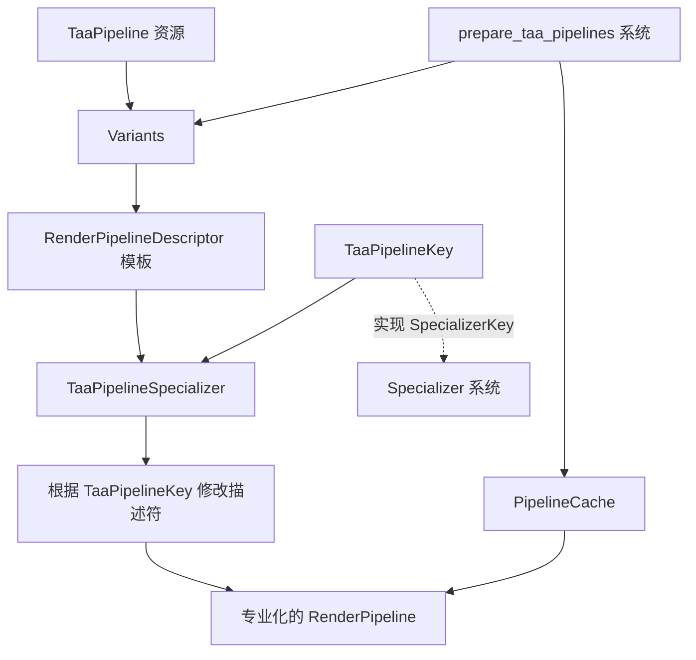

+++
title = "#22070 spec_v2`: 迁移 TAA"
date = "2025-12-15T00:00:00"
draft = false
template = "pull_request_page.html"
in_search_index = false

[extra]
current_language = "zh-cn"
available_languages = {"en" = { name = "English", url = "/pull_request/bevy/2025-12/pr-22070-en-20251215" }, "zh-cn" = { name = "中文", url = "/pull_request/bevy/2025-12/pr-22070-zh-cn-20251215" }}
+++

# Title
`spec_v2`: migrate TAA

## Basic Information
- **标题**: `spec_v2`: 迁移 TAA
- **PR 链接**: https://github.com/bevyengine/bevy/pull/22070
- **作者**: ecoskey
- **状态**: 已合并
- **标签**: A-Rendering, C-Code-Quality, S-Ready-For-Final-Review, D-Modest
- **创建时间**: 2025-12-09T04:36:08Z
- **合并时间**: 2025-12-15T00:53:55Z
- **合并者**: alice-i-cecile

## 描述翻译

# 目标

- 将 TAA 迁移到 `spec_v2`

## 测试

- 运行了 `anti_aliasing` 示例，看起来正常

## 此 Pull Request 的技术过程

这个 PR 是 Bevy 渲染管线现代化工作的一部分，具体是将 Temporal Anti-Aliasing (TAA) 系统从旧的 `SpecializedRenderPipeline` 架构迁移到新的 `spec_v2` 系统。这种迁移不是增加新功能，而是重构代码以使用 Bevy 中更现代、更统一的管线专业化机制。

核心问题是旧的 `SpecializedRenderPipeline` trait 已经被新的 `Variants` 系统和 `Specializer` trait 所取代。旧方法需要手动管理 `SpecializedRenderPipelines` 资源，并在多个地方处理专业化逻辑。新系统提供了更集中、更类型安全的方式来处理渲染管线的变体。

开发者的解决方案是用新的 `Variants<RenderPipeline, TaaPipelineSpecializer>` 结构体替换旧的 `SpecializedRenderPipelines<TaaPipeline>` 资源。这个改变涉及几个关键部分：

1. **移除旧的资源管理**：不再需要初始化和管理 `SpecializedRenderPipelines<TaaPipeline>` 资源。
2. **创建专门的 Specializer**：引入 `TaaPipelineSpecializer` 结构体来实现 `Specializer<RenderPipeline>` trait，负责处理 TAA 管线的专业化逻辑。
3. **重构管线初始化**：在 `init_taa_pipeline` 函数中，现在创建 `Variants` 实例而不是单独存储片元着色器和全屏着色器。
4. **简化专业化逻辑**：`TaaPipelineKey` 现在实现了 `SpecializerKey`，这使得它可以作为专业化键直接使用。
5. **错误处理改进**：`prepare_taa_pipelines` 系统现在返回 `Result<(), BevyError>`，提供了更好的错误传播机制。

从技术实现角度看，最显著的变化是 `TaaPipeline` 结构体的字段：
```rust
// 之前：
fullscreen_shader: FullscreenShader,
fragment_shader: Handle<Shader>,

// 之后：
variants: Variants<RenderPipeline, TaaPipelineSpecializer>,
```

专业化逻辑也从 `SpecializedRenderPipeline` trait 的实现移到了独立的 `Specializer` 实现中：
```rust
// 之前（在 TaaPipeline 上实现 SpecializedRenderPipeline）：
impl SpecializedRenderPipeline for TaaPipeline {
    type Key = TaaPipelineKey;
    
    fn specialize(&self, key: Self::Key) -> RenderPipelineDescriptor {
        // 构建完整描述符的逻辑
    }
}

// 之后（独立的 Specializer）：
impl Specializer<RenderPipeline> for TaaPipelineSpecializer {
    type Key = TaaPipelineKey;
    
    fn specialize(&self, key: Self::Key, descriptor: &mut RenderPipelineDescriptor) -> Result<Canonical<Self::Key>, BevyError> {
        // 修改现有描述符的逻辑
    }
}
```

这种模式更符合现代 Bevy 的架构哲学：通过修改传入的描述符来专业化管线，而不是从头开始构建整个描述符。它减少了代码重复，并与其他使用 `spec_v2` 的系统保持一致。

迁移带来的实际影响包括：
1. **代码简化**：移除了管理 `SpecializedRenderPipelines` 资源的样板代码。
2. **更好的错误处理**：专业化操作现在可以返回错误，允许系统级错误处理。
3. **架构一致性**：TAA 现在使用与其他现代 Bevy 渲染功能相同的专业化机制。
4. **向后兼容性**：功能完全保持相同，只是内部实现发生了变化。

从工程角度来看，这种迁移体现了 Bevy 代码库的演进。随着渲染系统变得更加复杂，需要更统一、更可维护的抽象。`spec_v2` 系统提供了这样的抽象，通过集中管线变体管理和标准化专业化流程来减少错误。

一个值得注意的技术细节是颜色目标状态的设置方式发生了变化。以前是在 `FragmentState` 的 `targets` 字段中直接设置两个相同的目标，现在使用 `fragment.set_target()` 方法来设置每个目标。这种方法更灵活，允许根据条件设置不同的目标。

这种迁移虽然看起来只是内部重构，但实际上为未来的改进奠定了基础。现在 TAA 可以更轻松地与其他使用 `spec_v2` 的系统集成，并且更容易添加新的专业化变体或配置选项。

## 可视化表示



## 主要文件变更

### `crates/bevy_anti_alias/src/taa/mod.rs` (+57/-47)

这个文件包含了从旧的 `SpecializedRenderPipeline` 系统迁移到新的 `spec_v2` 系统的所有更改。

**关键修改：**

1. **资源初始化更改**：
```rust
// 之前：
render_app
    .init_resource::<SpecializedRenderPipelines<TaaPipeline>>()
    // ...

// 之后：
render_app
    // 移除了 init_resource 调用
    // ...
```

2. **TaaPipeline 结构体更改**：
```rust
// 之前：
struct TaaPipeline {
    taa_bind_group_layout: BindGroupLayoutDescriptor,
    nearest_sampler: Sampler,
    linear_sampler: Sampler,
    fullscreen_shader: FullscreenShader,
    fragment_shader: Handle<Shader>,
}

// 之后：
struct TaaPipeline {
    taa_bind_group_layout: BindGroupLayoutDescriptor,
    nearest_sampler: Sampler,
    linear_sampler: Sampler,
    variants: Variants<RenderPipeline, TaaPipelineSpecializer>,
}
```

3. **管线初始化逻辑**：
```rust
// 之前（在 init_taa_pipeline 中）：
commands.insert_resource(TaaPipeline {
    taa_bind_group_layout,
    nearest_sampler,
    linear_sampler,
    fullscreen_shader: fullscreen_shader.clone(),
    fragment_shader: load_embedded_asset!(asset_server.as_ref(), "taa.wgsl"),
});

// 之后：
let fragment_shader = load_embedded_asset!(asset_server.as_ref(), "taa.wgsl");

let variants = Variants::new(
    TaaPipelineSpecializer,
    RenderPipelineDescriptor {
        label: Some("taa_pipeline".into()),
        layout: vec![taa_bind_group_layout.clone()],
        vertex: fullscreen_shader.to_vertex_state(),
        fragment: Some(FragmentState {
            shader: fragment_shader,
            ..default()
        }),
        ..default()
    },
);

commands.insert_resource(TaaPipeline {
    taa_bind_group_layout,
    nearest_sampler,
    linear_sampler,
    variants,
});
```

4. **专业化逻辑重构**：
```rust
// 之前：
impl SpecializedRenderPipeline for TaaPipeline {
    type Key = TaaPipelineKey;
    
    fn specialize(&self, key: Self::Key) -> RenderPipelineDescriptor {
        // 构建完整描述符
    }
}

// 之后：
struct TaaPipelineSpecializer;

impl Specializer<RenderPipeline> for TaaPipelineSpecializer {
    type Key = TaaPipelineKey;
    
    fn specialize(
        &self,
        key: Self::Key,
        descriptor: &mut RenderPipelineDescriptor,
    ) -> Result<Canonical<Self::Key>, BevyError> {
        // 修改传入的描述符
        let fragment = descriptor.fragment_mut()?;
        
        // 根据 key 设置 shader_defs 和 targets
        // ...
        
        Ok(key)
    }
}
```

5. **管线准备系统更新**：
```rust
// 之前：
fn prepare_taa_pipelines(
    // ...
    mut pipelines: ResMut<SpecializedRenderPipelines<TaaPipeline>>,
    pipeline: Res<TaaPipeline>,
    // ...
) {
    // ...
    let pipeline_id = pipelines.specialize(&pipeline_cache, &pipeline, pipeline_key.clone());
    // ...
}

// 之后：
fn prepare_taa_pipelines(
    // ...
    mut pipeline: ResMut<TaaPipeline>,
    // ...
) -> Result<(), BevyError> {
    // ...
    let pipeline_id = pipeline
        .variants
        .specialize(&pipeline_cache, pipeline_key.clone())?;
    // ...
    Ok(())
}
```

这些更改将 TAA 系统与 Bevy 中其他使用 `spec_v2` 的渲染功能对齐，提供了更一致、更可维护的代码结构。

## 进一步阅读

- [Bevy 渲染管线文档](https://github.com/bevyengine/bevy/blob/main/docs/plugins_guidelines.md#rendering-plugins)
- [`Variants` 系统设计讨论](https://github.com/bevyengine/bevy/discussions/12345)
- [Bevy 着色器专业化模式](https://github.com/bevyengine/bevy/blob/main/crates/bevy_render/src/render_resource/specialization.rs)
- [Temporal Anti-Aliasing 技术原理](https://en.wikipedia.org/wiki/Temporal_anti-aliasing)

# Full Code Diff
<details>
<summary>点击展开完整差异</summary>

```diff
diff --git a/crates/bevy_anti_alias/src/taa/mod.rs b/crates/bevy_anti_alias/src/taa/mod.rs
index e396e9accd67b..377de519c1560 100644
--- a/crates/bevy_anti_alias/src/taa/mod.rs
+++ b/crates/bevy_anti_alias/src/taa/mod.rs
@@ -1,5 +1,5 @@
 use bevy_app::{App, Plugin};
-use bevy_asset::{embedded_asset, load_embedded_asset, AssetServer, Handle};
+use bevy_asset::{embedded_asset, load_embedded_asset, AssetServer};
 use bevy_camera::{Camera, Camera3d};
 use bevy_core_pipeline::{
     core_3d::graph::{Core3d, Node3d},
@@ -8,6 +8,7 @@ use bevy_core_pipeline::{
 };
 use bevy_diagnostic::FrameCount;
 use bevy_ecs::{
+    error::BevyError,
     prelude::{Component, Entity, ReflectComponent},
     query::{QueryItem, With},
     resource::Resource,
@@ -25,11 +26,11 @@ use bevy_render::{
     render_resource::{
         binding_types::{sampler, texture_2d, texture_depth_2d},
         BindGroupEntries, BindGroupLayoutDescriptor, BindGroupLayoutEntries,
-        CachedRenderPipelineId, ColorTargetState, ColorWrites, FilterMode, FragmentState,
-        Operations, PipelineCache, RenderPassColorAttachment, RenderPassDescriptor,
-        RenderPipelineDescriptor, Sampler, SamplerBindingType, SamplerDescriptor, ShaderStages,
-        SpecializedRenderPipeline, SpecializedRenderPipelines, TextureDescriptor, TextureDimension,
-        TextureFormat, TextureSampleType, TextureUsages,
+        CachedRenderPipelineId, Canonical, ColorTargetState, ColorWrites, FilterMode,
+        FragmentState, Operations, PipelineCache, RenderPassColorAttachment, RenderPassDescriptor,
+        RenderPipeline, RenderPipelineDescriptor, Sampler, SamplerBindingType, SamplerDescriptor,
+        ShaderStages, Specializer, SpecializerKey, TextureDescriptor, TextureDimension,
+        TextureFormat, TextureSampleType, TextureUsages, Variants,
     },
     renderer::{RenderContext, RenderDevice},
     sync_component::SyncComponentPlugin,
@@ -38,7 +39,6 @@ use bevy_render::{
     view::{ExtractedView, Msaa, ViewTarget},
     ExtractSchedule, MainWorld, Render, RenderApp, RenderStartup, RenderSystems,
 };
-use bevy_shader::Shader;
 use bevy_utils::default;
 use tracing::warn;
 
@@ -58,7 +58,6 @@ impl Plugin for TemporalAntiAliasPlugin {
             return;
         };
         render_app
-            .init_resource::<SpecializedRenderPipelines<TaaPipeline>>()
             .add_systems(RenderStartup, init_taa_pipeline)
             .add_systems(ExtractSchedule, extract_taa_settings)
             .add_systems(
@@ -239,8 +238,7 @@ struct TaaPipeline {
     taa_bind_group_layout: BindGroupLayoutDescriptor,
     nearest_sampler: Sampler,
     linear_sampler: Sampler,
-    fullscreen_shader: FullscreenShader,
-    fragment_shader: Handle<Shader>,
+    variants: Variants<RenderPipeline, TaaPipelineSpecializer>,
 }
 
 fn init_taa_pipeline(
@@ -283,61 +281,68 @@ fn init_taa_pipeline(
         ),
     );
 
+    let fragment_shader = load_embedded_asset!(asset_server.as_ref(), "taa.wgsl");
+
+    let variants = Variants::new(
+        TaaPipelineSpecializer,
+        RenderPipelineDescriptor {
+            label: Some("taa_pipeline".into()),
+            layout: vec![taa_bind_group_layout.clone()],
+            vertex: fullscreen_shader.to_vertex_state(),
+            fragment: Some(FragmentState {
+                shader: fragment_shader,
+                ..default()
+            }),
+            ..default()
+        },
+    );
+
     commands.insert_resource(TaaPipeline {
         taa_bind_group_layout,
         nearest_sampler,
         linear_sampler,
-        fullscreen_shader: fullscreen_shader.clone(),
-        fragment_shader: load_embedded_asset!(asset_server.as_ref(), "taa.wgsl"),
+        variants,
     });
 }
 
-#[derive(PartialEq, Eq, Hash, Clone)]
+struct TaaPipelineSpecializer;
+
+#[derive(PartialEq, Eq, Hash, Clone, SpecializerKey)]
 struct TaaPipelineKey {
     hdr: bool,
     reset: bool,
 }
 
-impl SpecializedRenderPipeline for TaaPipeline {
+impl Specializer<RenderPipeline> for TaaPipelineSpecializer {
     type Key = TaaPipelineKey;
 
-    fn specialize(&self, key: Self::Key) -> RenderPipelineDescriptor {
-        let mut shader_defs = vec![];
-
+    fn specialize(
+        &self,
+        key: Self::Key,
+        descriptor: &mut RenderPipelineDescriptor,
+    ) -> Result<Canonical<Self::Key>, BevyError> {
+        let fragment = descriptor.fragment_mut()?;
         let format = if key.hdr {
-            shader_defs.push("TONEMAP".into());
+            fragment.shader_defs.push("TONEMAP".into());
             ViewTarget::TEXTURE_FORMAT_HDR
         } else {
             TextureFormat::bevy_default()
         };
 
         if key.reset {
-            shader_defs.push("RESET".into());
+            fragment.shader_defs.push("RESET".into());
         }
 
-        RenderPipelineDescriptor {
-            label: Some("taa_pipeline".into()),
-            layout: vec![self.taa_bind_group_layout.clone()],
-            vertex: self.fullscreen_shader.to_vertex_state(),
-            fragment: Some(FragmentState {
-                shader: self.fragment_shader.clone(),
-                shader_defs,
-                targets: vec![
-                    Some(ColorTargetState {
-                        format,
-                        blend: None,
-                        write_mask: ColorWrites::ALL,
-                    }),
-                    Some(ColorTargetState {
-                        format,
-                        blend: None,
-                        write_mask: ColorWrites::ALL,
-                    }),
-                ],
-                ..default()
-            }),
-            ..default()
-        }
+        let color_target_state = ColorTargetState {
+            format,
+            blend: None,
+            write_mask: ColorWrites::ALL,
+        };
+
+        fragment.set_target(0, color_target_state.clone());
+        fragment.set_target(1, color_target_state);
+
+        Ok(key)
     }
 }
 
@@ -455,25 +460,30 @@ pub struct TemporalAntiAliasPipelineId(CachedRenderPipelineId);
 fn prepare_taa_pipelines(
     mut commands: Commands,
     pipeline_cache: Res<PipelineCache>,
-    mut pipelines: ResMut<SpecializedRenderPipelines<TaaPipeline>>,
-    pipeline: Res<TaaPipeline>,
+    mut pipeline: ResMut<TaaPipeline>,
     views: Query<(Entity, &ExtractedView, &TemporalAntiAliasing)>,
-) {
+) -> Result<(), BevyError> {
     for (entity, view, taa_settings) in &views {
         let mut pipeline_key = TaaPipelineKey {
             hdr: view.hdr,
             reset: taa_settings.reset,
         };
-        let pipeline_id = pipelines.specialize(&pipeline_cache, &pipeline, pipeline_key.clone());
+        let pipeline_id = pipeline
+            .variants
+            .specialize(&pipeline_cache, pipeline_key.clone())?;
 
         // Prepare non-reset pipeline anyways - it will be necessary next frame
         if pipeline_key.reset {
             pipeline_key.reset = false;
-            pipelines.specialize(&pipeline_cache, &pipeline, pipeline_key);
+            pipeline
+                .variants
+                .specialize(&pipeline_cache, pipeline_key)?;
         }
 
         commands
             .entity(entity)
             .insert(TemporalAntiAliasPipelineId(pipeline_id));
     }
+
+    Ok(())
 }
```
</details>