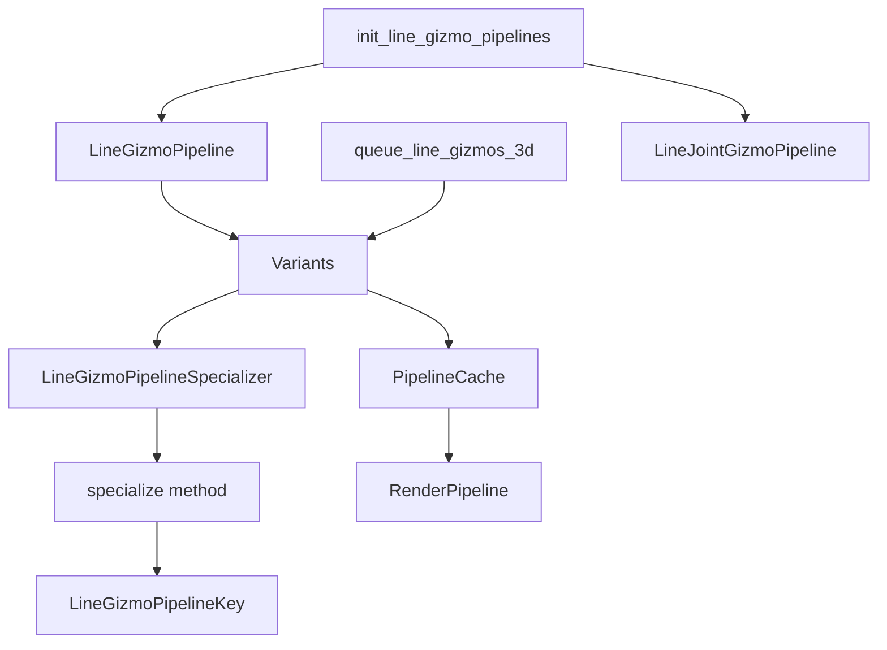

+++
title = "#22072 `spec_v2`: migrate line gizmos"
date = "2025-12-14T00:00:00"
draft = false
template = "pull_request_page.html"
in_search_index = true

[taxonomies]
list_display = ["show"]

[extra]
current_language = "en"
available_languages = {"en" = { name = "English", url = "/pull_request/bevy/2025-12/pr-22072-en-20251214" }, "zh-cn" = { name = "中文", url = "/pull_request/bevy/2025-12/pr-22072-zh-cn-20251214" }}
labels = ["A-Rendering", "C-Code-Quality", "D-Modest"]
+++

# Title

## Basic Information
- **Title**: `spec_v2`: migrate line gizmos
- **PR Link**: https://github.com/bevyengine/bevy/pull/22072
- **Author**: ecoskey
- **Status**: MERGED
- **Labels**: A-Rendering, C-Code-Quality, S-Ready-For-Final-Review, D-Modest
- **Created**: 2025-12-09T04:39:09Z
- **Merged**: 2025-12-14T22:07:30Z
- **Merged By**: alice-i-cecile

## Description Translation

# Objective

- Migrate line gizmos to `spec_v2`

## Testing

- Ran example

## The Story of This Pull Request

This PR represents a straightforward but important infrastructure upgrade in Bevy's rendering system. The core task was migrating the line gizmo rendering pipeline from the older specialization system to the newer `spec_v2` system, which provides a more maintainable and type-safe approach to pipeline specialization.

The problem being addressed was architectural rather than functional. The line gizmo system needed to be updated to align with Bevy's evolving rendering architecture. Before this change, line gizmos used the legacy `SpecializedRenderPipeline` trait and `SpecializedRenderPipelines` resource. The new `spec_v2` system, which uses the `Variants` struct and `Specializer` trait, offers better error handling and a cleaner separation of concerns.

The developer took a systematic approach to this migration. First, they updated the `LineGizmoPipeline` struct to use the new `Variants` container instead of storing individual pipeline components. This change required creating a new `LineGizmoPipelineSpecializer` struct that implements the `Specializer` trait. The specialization logic that was previously in the `specialize` method of `SpecializedRenderPipeline` was moved to the new `Specializer` implementation.

One key technical insight is how the migration separates concerns. The `LineGizmoPipeline` now acts as a container for the `Variants`, while the `LineGizmoPipelineSpecializer` handles the actual specialization logic. This separation makes the code more modular and easier to test. The migration also introduced proper error handling through the `Result` return type in the `specialize` method, which improves robustness compared to the previous approach that would panic on errors.

The implementation shows careful attention to preserving existing functionality while modernizing the codebase. The `LineGizmoPipelineKey` struct gained a `SpecializerKey` derivation, which is required by the new system. The pipeline initialization was updated to construct the `Variants` with the appropriate specializer and base pipeline descriptor.

From a performance perspective, this change is neutral - it doesn't improve or degrade rendering performance but maintains existing functionality while improving code maintainability. The impact is primarily architectural: the line gizmo system now aligns with Bevy's modern rendering infrastructure, making future maintenance and feature development easier. This migration also sets a pattern for other rendering systems that still need to be migrated to `spec_v2`.

The changes demonstrate good software engineering practices: the PR is focused (only one file modified), the implementation follows established patterns from other `spec_v2` migrations in the codebase, and it includes proper error propagation. The fact that the PR was labeled "D-Modest" and "C-Code-Quality" reflects its nature as a focused infrastructure improvement rather than a feature addition.

## Visual Representation



## Key Files Changed

### `crates/bevy_gizmos_render/src/pipeline_3d.rs` (+78/-63)

This file contains the complete migration of the line gizmo rendering system from the legacy specialization system to `spec_v2`. The changes include:

1. **Updated `LineGizmoPipeline` struct**: Changed from storing individual components to using the `Variants` container.

```rust
// Before:
#[derive(Clone, Resource)]
struct LineGizmoPipeline {
    mesh_pipeline: MeshPipeline,
    uniform_layout: BindGroupLayoutDescriptor,
    shader: Handle<Shader>,
}

// After:
#[derive(Resource)]
struct LineGizmoPipeline {
    variants: Variants<RenderPipeline, LineGizmoPipelineSpecializer>,
}
```

2. **New `LineGizmoPipelineSpecializer` struct**: Created to implement the `Specializer` trait.

```rust
struct LineGizmoPipelineSpecializer {
    mesh_pipeline: MeshPipeline,
}

impl Specializer<RenderPipeline> for LineGizmoPipelineSpecializer {
    type Key = LineGizmoPipelineKey;
    
    fn specialize(
        &self,
        key: Self::Key,
        descriptor: &mut RenderPipelineDescriptor,
    ) -> Result<Canonical<Self::Key>, BevyError> {
        // Specialization logic moved here from old SpecializedRenderPipeline
    }
}
```

3. **Updated pipeline initialization**: The `init_line_gizmo_pipelines` function now creates `Variants` instead of storing raw components.

```rust
// Key section of the updated initialization:
let variants_line = Variants::new(
    LineGizmoPipelineSpecializer {
        mesh_pipeline: mesh_pipeline.clone(),
    },
    RenderPipelineDescriptor {
        // Base pipeline descriptor
    },
);

commands.insert_resource(LineGizmoPipeline {
    variants: variants_line,
});
```

4. **Updated queue function**: The `queue_line_gizmos_3d` function now uses the `Variants` to specialize pipelines and returns a `Result`.

```rust
// Before:
let pipeline = pipelines.specialize(
    &pipeline_cache,
    &pipeline,
    LineGizmoPipelineKey { /* ... */ },
);

// After:
let pipeline = pipeline.variants.specialize(
    &pipeline_cache,
    LineGizmoPipelineKey { /* ... */ },
)?;
```

These changes collectively migrate the line gizmo system to use the modern `spec_v2` infrastructure while preserving all existing functionality.

## Further Reading

- [Bevy Render Pipelines Documentation](https://bevyengine.org/learn/advanced-topics/rendering/pipelines/)
- [Specialization in Bevy Rendering](https://bevyengine.org/learn/advanced-topics/rendering/specialization/)
- [The `spec_v2` Migration Guide](https://github.com/bevyengine/bevy/wiki/spec_v2-Migration-Guide)
- [Bevy ECS Error Handling](https://bevyengine.org/learn/advanced-topics/ecs/error-handling/)