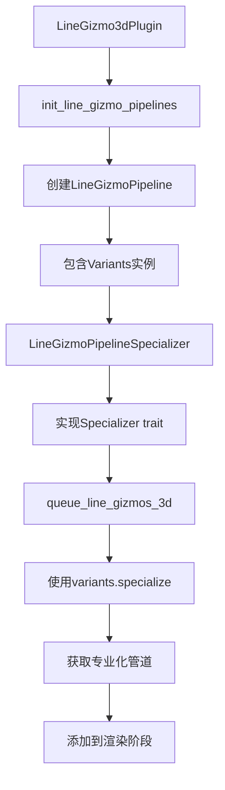

+++
title = "#22072 spec_v2`: migrate line gizmos"
date = "2025-12-14T00:00:00"
draft = false
template = "pull_request_page.html"
in_search_index = false

[extra]
current_language = "zh-cn"
available_languages = {"en" = { name = "English", url = "/pull_request/bevy/2025-12/pr-22072-en-20251214" }, "zh-cn" = { name = "中文", url = "/pull_request/bevy/2025-12/pr-22072-zh-cn-20251214" }}
+++

# spec_v2：迁移线形Gizmo

## 基本信息
- **标题**: `spec_v2`: migrate line gizmos
- **PR链接**: https://github.com/bevyengine/bevy/pull/22072
- **作者**: ecoskey
- **状态**: 已合并
- **标签**: A-Rendering, C-Code-Quality, S-Ready-For-Final-Review, D-Modest
- **创建时间**: 2025-12-09T04:39:09Z
- **合并时间**: 2025-12-14T22:07:30Z
- **合并者**: alice-i-cecile

## 描述翻译

# 目标

- 将线形gizmo迁移到`spec_v2`

## 测试

- 运行了示例

## 这个Pull Request的故事

这次PR的核心任务是将Bevy引擎中的线形gizmo渲染系统从旧的管道专业化系统迁移到新的`spec_v2`系统。这是一项技术债务清理工作，旨在统一代码库的渲染架构，使其更一致、更高效。

### 问题和背景

在Bevy的渲染系统中，渲染管道（render pipeline）需要根据不同的渲染条件（如MSAA样本数、HDR设置、线条样式等）进行专业化（specialization）。旧的`SpecializedRenderPipeline`系统为每个不同的配置创建一个完整的`RenderPipelineDescriptor`，这种方法存在代码重复和维护复杂的问题。

新的`spec_v2`系统通过引入`Specializer`特性和`Variants`结构体，提供了更高效的专业化机制。它允许管道在基础描述符上进行修改，而不是每次都从头创建整个描述符。在这次PR之前，线形gizmo是少数仍然使用旧系统的渲染组件之一。

### 解决方案

开发者采用了直接的迁移策略：将`LineGizmoPipeline`从实现`SpecializedRenderPipeline`改为使用新的`Variants`系统。这涉及到几个关键变化：

1. 用`Variants<RenderPipeline, LineGizmoPipelineSpecializer>`替换旧的管道存储结构
2. 引入`LineGizmoPipelineSpecializer`结构体来封装专业化逻辑
3. 将`queue_line_gizmos_3d`函数改为使用新的专业化API

### 实现细节

最大的变化在`LineGizmoPipeline`结构体的重构中。以前，它存储了管道所需的所有组件：

```rust
// 迁移前：
#[derive(Clone, Resource)]
struct LineGizmoPipeline {
    mesh_pipeline: MeshPipeline,
    uniform_layout: BindGroupLayoutDescriptor,
    shader: Handle<Shader>,
}
```

迁移后，结构体简化为仅包含一个`Variants`实例：

```rust
// 迁移后：
#[derive(Resource)]
struct LineGizmoPipeline {
    variants: Variants<RenderPipeline, LineGizmoPipelineSpecializer>,
}
```

专业化逻辑被提取到新的`LineGizmoPipelineSpecializer`结构体中。旧的`specialize`方法返回一个完整的`RenderPipelineDescriptor`，而新的实现在现有描述符上进行修改：

```rust
impl Specializer<RenderPipeline> for LineGizmoPipelineSpecializer {
    type Key = LineGizmoPipelineKey;

    fn specialize(
        &self,
        key: Self::Key,
        descriptor: &mut RenderPipelineDescriptor,
    ) -> Result<Canonical<Self::Key>, BevyError> {
        // 获取视图布局
        let view_layout = self
            .mesh_pipeline
            .get_view_layout(key.view_key.into())
            .clone();

        // 设置描述符的布局
        descriptor.set_layout(0, view_layout.main_layout.clone());
        descriptor.vertex.buffers = line_gizmo_vertex_buffer_layouts(key.strip);
        descriptor.multisample.count = key.view_key.msaa_samples();

        // 配置片段着色器
        let fragment = descriptor.fragment_mut()?;
        
        #[cfg(feature = "webgl")]
        fragment.shader_defs.push("SIXTEEN_BYTE_ALIGNMENT".into());

        if key.perspective {
            fragment.shader_defs.push("PERSPECTIVE".into());
        }

        // 根据线条样式设置入口点
        let fragment_entry_point = match key.line_style {
            GizmoLineStyle::Solid => "fragment_solid",
            GizmoLineStyle::Dotted => "fragment_dotted",
            GizmoLineStyle::Dashed => "fragment_dashed",
            _ => unimplemented!(),
        };

        fragment.entry_point = Some(fragment_entry_point.into());

        // 设置渲染目标
        fragment.set_target(
            0,
            ColorTargetState {
                format: if key.view_key.contains(MeshPipelineKey::HDR) {
                    ViewTarget::TEXTURE_FORMAT_HDR
                } else {
                    TextureFormat::bevy_default()
                },
                blend: Some(BlendState::ALPHA_BLENDING),
                write_mask: ColorWrites::ALL,
            },
        );

        Ok(key)
    }
}
```

这种方法的优势在于减少了代码重复。基础管道描述符在初始化时创建一次，然后根据不同的键值进行修改，而不是每次都从头构建完整的描述符。

### 技术洞察

这次迁移展示了Bevy渲染系统演进的几个关键方面：

1. **架构一致性**：通过将线形gizmo迁移到`spec_v2`，整个代码库的渲染管道专业化机制变得更加统一。

2. **错误处理改进**：新的`queue_line_gizmos_3d`函数现在返回`Result`类型，这提供了更好的错误传播机制。如果管道专业化失败，错误可以向上传播而不是导致panic。

3. **资源管理简化**：不再需要手动管理`SpecializedRenderPipelines<LineGizmoPipeline>`资源。`Variants`结构体内部处理了管道的缓存和检索。

4. **性能考虑**：`spec_v2`系统可能通过减少重复的内存分配和描述符创建来提高性能，尽管在这个特定用例中，性能改进可能不是主要目标。

### 影响

这次迁移对终端用户是透明的——线形gizmo的功能和行为保持不变。但从代码维护的角度看，它有显著好处：

1. **减少技术债务**：清除了一个使用旧架构的组件
2. **提高代码一致性**：所有渲染组件现在使用相同的专业化系统
3. **更好的错误处理**：通过`Result`类型提供更健壮的错误处理
4. **为未来改进奠定基础**：新的架构更灵活，更容易添加新功能或进行优化

值得注意的是，线形关节gizmo（line joint gizmo）的管道没有迁移到`spec_v2`，这可能是因为它更简单，或者计划在未来的PR中处理。

## 可视化表示



## 关键文件更改

### `crates/bevy_gizmos_render/src/pipeline_3d.rs`

这个文件包含了所有的迁移变更。主要变化包括：

1. **LineGizmoPipeline结构体重构**：
```rust
// 迁移前：
#[derive(Clone, Resource)]
struct LineGizmoPipeline {
    mesh_pipeline: MeshPipeline,
    uniform_layout: BindGroupLayoutDescriptor,
    shader: Handle<Shader>,
}

// 迁移后：
#[derive(Resource)]
struct LineGizmoPipeline {
    variants: Variants<RenderPipeline, LineGizmoPipelineSpecializer>,
}
```

2. **引入LineGizmoPipelineSpecializer**：
```rust
struct LineGizmoPipelineSpecializer {
    mesh_pipeline: MeshPipeline,
}

impl Specializer<RenderPipeline> for LineGizmoPipelineSpecializer {
    // 专业化实现
}
```

3. **queue_line_gizmos_3d函数更新**：
```rust
// 迁移前：
let pipeline = pipelines.specialize(
    &pipeline_cache,
    &pipeline,
    LineGizmoPipelineKey { ... },
);

// 迁移后：
let pipeline = pipeline.variants.specialize(
    &pipeline_cache,
    LineGizmoPipelineKey { ... },
)?;
```

4. **错误处理改进**：
```rust
// 函数签名从：
fn queue_line_gizmos_3d(...) {
// 改为：
fn queue_line_gizmos_3d(...) -> Result<(), BevyError> {
```

## 进一步阅读

1. **Bevy渲染架构**：[Bevy Render Graph Documentation](https://bevyengine.org/learn/quick-start/rendering/)
2. **WGSL着色器语言**：[WebGPU Shading Language](https://www.w3.org/TR/WGSL/)
3. **渲染管道专业化**：[Bevy's Specialization System](https://github.com/bevyengine/bevy/blob/main/crates/bevy_render/src/render_resource/specialized_render_pipelines.rs)
4. **spec_v2系统**：[Bevy的spec_v2实现](https://github.com/bevyengine/bevy/tree/main/crates/bevy_render/src/render_resource/spec_v2)