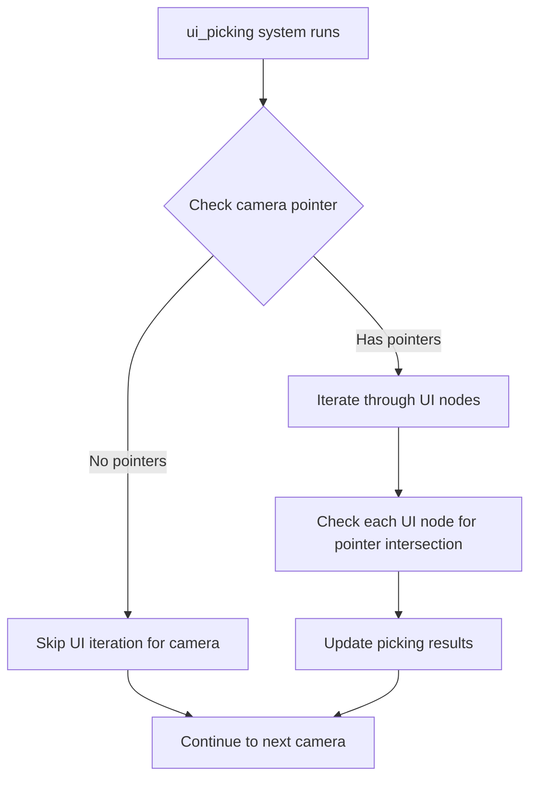

+++
title = "#22074 Skip picking for UI nodes if there is no pointer"
date = "2025-12-09T00:00:00"
draft = false
template = "pull_request_page.html"
in_search_index = true

[taxonomies]
list_display = ["show"]

[extra]
current_language = "en"
available_languages = {"en" = { name = "English", url = "/pull_request/bevy/2025-12/pr-22074-en-20251209" }, "zh-cn" = { name = "中文", url = "/pull_request/bevy/2025-12/pr-22074-zh-cn-20251209" }}
labels = ["D-Trivial", "A-UI", "A-Pointers"]
+++

# Skip picking for UI nodes if there is no pointer

## Basic Information
- **Title**: Skip picking for UI nodes if there is no pointer
- **PR Link**: https://github.com/bevyengine/bevy/pull/22074
- **Author**: ickshonpe
- **Status**: MERGED
- **Labels**: D-Trivial, A-UI, A-Pointers, S-Needs-Review
- **Created**: 2025-12-09T10:46:06Z
- **Merged**: 2025-12-09T11:52:11Z
- **Merged By**: mockersf

## Description Translation

# Objective

`ui_picking` always iterates through all the uinodes even if no hits are possible because there's no pointer above the current camera.

## Solution

Early continue if no pointers are found on the current camera.

## The Story of This Pull Request

This pull request addresses a performance optimization in Bevy's UI picking system. The problem is straightforward but has meaningful performance implications, particularly in scenes with many UI nodes.

At its core, the issue is that `ui_picking`, the system responsible for determining which UI elements are under the mouse pointer or touch input, was running unnecessary work. Before this change, the system would iterate through all UI nodes for every camera in the scene, regardless of whether there was actually any pointer input over that camera. For cameras without pointer input, this meant performing expensive calculations and bounds checks on every UI node, which is wasted CPU cycles.

The fix is a classic early-return pattern. The system now checks if there are any pointers associated with the current camera before proceeding with the expensive UI node iteration. If there are no pointers for a given camera, the system immediately continues to the next camera, skipping all the work that would have been performed on that camera's UI nodes.

Looking at the implementation details, the original code had a subtle bug or oversight in how it handled the pointer data structure. The `pointer_pos_by_camera` hashmap stores pointer positions keyed by camera entity. The original code retrieved this data with `let pointers_on_this_cam = pointer_pos_by_camera.get(&camera_entity);` but then proceeded to iterate through UI nodes even when `pointers_on_this_cam` was `None`. 

The fix does two things:
1. It adds an early continue when no pointers are found for the current camera
2. It simplifies the pointer iteration by removing unnecessary flat-mapping

The original code used `.flat_map(|h| h.iter())` to iterate over the pointer data, which was redundant because `pointers_on_this_cam` is already a hashmap when it exists (not a nested structure). The corrected code simply iterates over `pointers_on_this_cam.iter()` directly.

From an engineering perspective, this is a good example of optimizing for the common case. In many applications, especially games, there might be multiple cameras (for minimaps, split-screen multiplayer, etc.), but only one camera typically receives pointer input at any given time. This optimization ensures that UI picking work is only done where it's actually needed.

The performance impact depends on the specific scene composition. For scenes with many cameras and many UI nodes, this could provide significant savings. Even in simpler scenes, it's a clean optimization that follows the principle of "don't do work you don't need to do."

The implementation is minimal and focused, which is exactly what you want in a performance optimization. It doesn't change any APIs, doesn't introduce new complexity, and simply makes the existing code more efficient by adding a sensible early exit condition.

## Visual Representation



## Key Files Changed

### `crates/bevy_ui/src/picking_backend.rs` (+4/-3)

This is the only file modified in this PR. It contains the core UI picking system that determines which UI elements are under pointer input.

**Key Changes:**

1. **Early continue when no pointers are found**: Added a check to skip UI node iteration for cameras without pointer input
2. **Simplified pointer iteration**: Removed unnecessary flat-mapping when iterating over pointer data

**Code Changes:**

```rust
// Before (lines 174-176):
let pointers_on_this_cam = pointer_pos_by_camera.get(&camera_entity);

// Reverse the iterator to traverse the tree from closest nodes to furthest
for node_entity in uinodes.iter().rev().cloned() {

// Before (lines 203-204):
for (pointer_id, cursor_position) in pointers_on_this_cam.iter().flat_map(|h| h.iter())
{
```

```rust
// After (lines 174-177):
let Some(pointers_on_this_cam) = pointer_pos_by_camera.get(&camera_entity) else {
    continue;
};

// Reverse the iterator to traverse the tree from closest nodes to furthest
for node_entity in uinodes.iter().rev().cloned() {

// After (line 205):
for (pointer_id, cursor_position) in pointers_on_this_cam.iter() {
```

**Analysis:**
The change adds a pattern matching guard that extracts the pointer data from the Option returned by `get()`. If there's no pointer data for the camera (i.e., the result is `None`), the system continues to the next camera immediately, skipping all UI node processing for that camera.

Additionally, the pointer iteration is simplified. Since we now know `pointers_on_this_cam` is definitely `Some(hashmap)` when we reach the iteration (otherwise we would have continued), we can iterate directly over the hashmap without the flat_map that was handling the Option case.

## Further Reading

1. **Bevy ECS Optimization Patterns**: This PR demonstrates the importance of early returns in ECS systems to avoid unnecessary work
2. **Option Pattern Matching in Rust**: The use of `let Some(value) = option else { continue; }` is a common Rust idiom for handling optional values
3. **UI Picking Algorithms**: For more on how UI picking systems work, see resources on hit testing and bounding volume hierarchies
4. **Bevy Input System**: Understanding how Bevy handles pointer input and camera association provides context for why this optimization is effective
5. **Performance Profiling in Games**: This is a good example of the type of optimization that becomes visible when profiling frame times and identifying hotspots