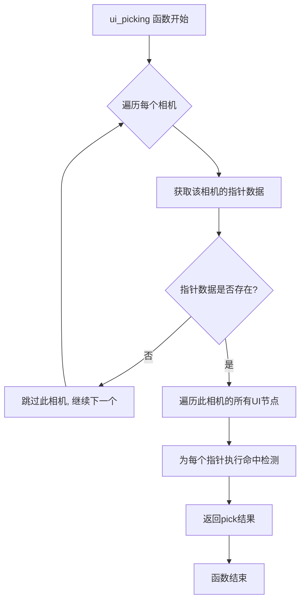

+++
title = "#22074 Skip picking for UI nodes if there is no pointer"
date = "2025-12-09T00:00:00"
draft = false
template = "pull_request_page.html"
in_search_index = false

[extra]
current_language = "zh-cn"
available_languages = {"en" = { name = "English", url = "/pull_request/bevy/2025-12/pr-22074-en-20251209" }, "zh-cn" = { name = "中文", url = "/pull_request/bevy/2025-12/pr-22074-zh-cn-20251209" }}
+++

# Skip picking for UI nodes if there is no pointer

## 基本信息
- **标题**: Skip picking for UI nodes if there is no pointer
- **PR链接**: https://github.com/bevyengine/bevy/pull/22074
- **作者**: ickshonpe
- **状态**: 已合并
- **标签**: D-Trivial, A-UI, A-Pointers, S-Needs-Review
- **创建时间**: 2025-12-09T10:46:06Z
- **合并时间**: 2025-12-09T11:52:11Z
- **合并者**: mockersf

## 描述翻译

# 目标

`ui_picking` 函数即使在没有指针悬停在当前相机上方时（意味着不可能有命中检测），也会遍历所有 UI 节点。

## 解决方案

如果当前相机上没有找到指针，则提前继续（跳过后续处理）。

## 这个 Pull Request 的故事

这个 PR 的核心是一个简单的性能优化。在 Bevy 的 UI 系统中，pick 检测（picking）功能负责判断鼠标或其他指针设备是否悬停在 UI 元素上。这个处理过程发生在每一帧，对于保持交互响应性至关重要。

问题出现在 `ui_picking` 函数的实现中。该函数会遍历场景中所有的相机，并为每个相机检查其关联的 UI 节点。然而，即使某个相机没有任何活动的指针设备（比如鼠标没有悬停在该相机的视口区域），函数仍然会遍历该相机的所有 UI 节点并进行 pick 检测计算。这是不必要的开销。

具体来看，原始的代码结构是这样的：函数首先获取每个相机对应的指针位置映射（`pointer_pos_by_camera`），然后对于每个相机，即使该映射中可能没有该相机的条目（即没有指针），代码仍然会继续执行，进入 UI 节点的遍历循环。在循环内部，代码会尝试从 `pointers_on_this_cam`（这是一个 `Option<&HashMap<...>>` 类型）创建一个迭代器，然后使用 `flat_map` 展开。当没有指针时，这个迭代器自然是空的，但创建迭代器和遍历 UI 节点的开销已经产生了。

开发者识别出了这个低效的模式。解决方案很直接：在开始遍历 UI 节点之前，先检查当前相机是否有任何指针。如果没有，就立即跳过该相机的后续处理（使用 `continue` 语句）。这样避免了为没有指针的相机执行任何 UI 节点遍历和命中检测计算。

从技术角度看，这个修改体现了几个重要的软件工程原则：

1. **提前返回/提前继续（Early Return/Early Continue）模式**：在条件不满足时尽早退出处理流程，避免不必要的计算。
2. **边界条件检查**：在处理数据集合之前验证其存在性和有效性。
3. **性能优化中的简单模式**：有时最有效的优化就是避免做不必要的工作。

这个修改特别有效，因为 UI 系统的 pick 检测通常每帧都要执行，而在复杂的 UI 场景中可能有成百上千个节点。如果一个相机没有指针活动，跳过整个处理流程可以节省可观的 CPU 时间。

实施这个优化时，开发者还注意到了代码可以进一步简化。原始代码中使用 `pointers_on_this_cam.iter().flat_map(|h| h.iter())` 的方式来遍历指针，但实际上由于 `pointers_on_this_cam` 现在是确定存在的 `HashMap`（否则在之前的检查中就已经跳过了），可以直接使用 `pointers_on_this_cam.iter()`。

这个修改虽然简单，但体现了良好的代码维护习惯：在修复问题的同时，也清理了不必要的复杂性。新的代码更易读，也更容易理解其意图。

在游戏引擎这样的性能敏感系统中，即使是小规模的优化也很重要，因为它们可能被频繁调用。这个修改对于拥有多个相机（比如分屏游戏）但只有部分相机有指针活动的场景特别有益。

## 可视化表示



## 关键文件变更

### `crates/bevy_ui/src/picking_backend.rs` (+4/-3)

这个文件包含了 UI 系统 pick 检测的后端实现。修改主要集中在 `ui_picking` 函数中，优化了没有指针时的处理逻辑。

**修改细节：**

1. **提前跳过无指针的相机**：添加了 `else { continue; }` 分支，在没有指针数据时跳过当前相机的处理
2. **简化指针迭代逻辑**：移除了不必要的 `flat_map` 调用，直接迭代 `HashMap`

```rust
// 修改前：
let pointers_on_this_cam = pointer_pos_by_camera.get(&camera_entity);

// 修改后：
let Some(pointers_on_this_cam) = pointer_pos_by_camera.get(&camera_entity) else {
    continue;
};
```

```rust
// 修改前：
for (pointer_id, cursor_position) in pointers_on_this_cam.iter().flat_map(|h| h.iter())

// 修改后：
for (pointer_id, cursor_position) in pointers_on_this_cam.iter()
```

## 进一步阅读

1. **Bevy UI 系统文档**：了解 Bevy 的 UI 系统架构和 pick 检测机制
2. **Early Return 模式**：学习这种常见的代码优化和清理模式
3. **Rust 中的 Option 处理**：深入理解 Rust 的 `Option` 类型和模式匹配
4. **游戏引擎中的性能优化**：了解实时系统中常见的性能优化技术

对于希望深入了解此修改背景的开发者，建议查看 Bevy 的输入系统和 UI 交互文档，以及相关的性能分析指南。