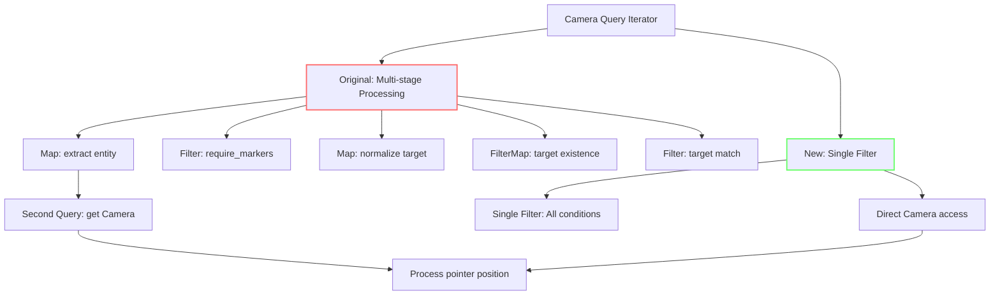

+++
title = "#22075 Simplify `ui_picking`'s camera search"
date = "2025-12-09T00:00:00"
draft = false
template = "pull_request_page.html"
in_search_index = true

[taxonomies]
list_display = ["show"]

[extra]
current_language = "en"
available_languages = {"en" = { name = "English", url = "/pull_request/bevy/2025-12/pr-22075-en-20251209" }, "zh-cn" = { name = "中文", url = "/pull_request/bevy/2025-12/pr-22075-zh-cn-20251209" }}
labels = ["D-Trivial", "A-UI", "C-Code-Quality", "A-Picking"]
+++

# Title
Simplify `ui_picking`'s camera search

## Basic Information
- **Title**: Simplify `ui_picking`'s camera search
- **PR Link**: https://github.com/bevyengine/bevy/pull/22075
- **Author**: ickshonpe
- **Status**: MERGED
- **Labels**: D-Trivial, A-UI, C-Code-Quality, S-Ready-For-Final-Review, A-Picking
- **Created**: 2025-12-09T11:25:08Z
- **Merged**: 2025-12-09T18:33:58Z
- **Merged By**: mockersf

## Description Translation
# Objective

In `ui_picking` the camera_query iterator is run through multiple filters and maps, which could be replaced by a single filter. Also camera_query retrieves the `Camera` component but then it is thrown away and queried for again. 

## Solution

* Just collapse all the maps and filters into one `filter`.
* Only query for `Camera` once and keep the result, remove the second query.

## The Story of This Pull Request

The `ui_picking` function in Bevy's UI system handles determining which UI elements are under the pointer for interaction. A key part of this process involves finding cameras that can see the render target where the pointer is located. The original implementation had a performance inefficiency and unnecessary complexity in how it filtered and processed camera entities.

The problem was straightforward but subtle. The code was using a chain of iterator operations - `filter`, `map`, `filter_map`, another `filter`, and another `map` - to process camera entities. This created multiple intermediate iterator stages that didn't add value. More importantly, the implementation was querying for camera data twice: once in the initial query that started the iterator chain, and then again inside the loop for each camera entity using `camera_query.get(camera)`. This double querying was unnecessary overhead since the camera data was already available from the initial query.

The solution took a more direct approach by consolidating all the filtering logic into a single `filter` operation. The key insight was that all the transformation steps in the original chain could be expressed as conditional checks in one filter. Instead of transforming data through multiple stages and then querying again, the new implementation keeps the camera component from the initial query and uses it directly.

Here's the technical transformation: the original code was normalizing camera targets, checking them against the pointer's target, and then extracting camera entities. The new implementation does all these checks in one filter predicate that:
1. Checks if camera markers are required (via `settings.require_markers`)
2. Normalizes the camera target and compares it with the pointer's target using `is_some_and`
3. Returns `true` only when all conditions are satisfied

This change eliminates the second query entirely. Inside the loop, the code now directly uses the `camera` component that was already retrieved in the filter, rather than querying for it again. This is more efficient and also makes the code easier to understand since the data flow is more linear.

The performance improvement comes from two factors: eliminating the second query per camera entity, and reducing iterator overhead by collapsing multiple operations into one. While the impact might be small for typical use cases, this optimization follows good practice for ECS (Entity Component System) patterns where avoiding redundant queries is important for maintaining performance as entity counts grow.

The architectural implication is that this change better aligns with Bevy's ECS philosophy of processing components efficiently in queries. By keeping components from the initial query and using them directly, the code follows the pattern of "query once, use many times" that's optimal for ECS systems.

## Visual Representation



## Key Files Changed

**File: `crates/bevy_ui/src/picking_backend.rs`** (+10/-19)

This file contains the `ui_picking` system which handles UI element picking (determining which UI elements are under the pointer). The changes refactor how cameras are filtered and processed for pointer position calculations.

**Before:**
```rust
for camera in camera_query
    .iter()
    .filter(|(_, _, cam_can_pick)| !settings.require_markers || *cam_can_pick)
    .map(|(entity, camera, _)| {
        (
            entity,
            camera.target.normalize(primary_window.single().ok()),
        )
    })
    .filter_map(|(entity, target)| Some(entity).zip(target))
    .filter(|(_entity, target)| target == &pointer_location.target)
    .map(|(cam_entity, _target)| cam_entity)
{
    let Ok((_, camera_data, _)) = camera_query.get(camera) else {
        continue;
    };
    let mut pointer_pos =
        pointer_location.position * camera_data.target_scaling_factor().unwrap_or(1.);
    // ... rest of processing
}
```

**After:**
```rust
for (entity, camera, _) in camera_query.iter().filter(|(_, camera, cam_can_pick)| {
    (!settings.require_markers || *cam_can_pick)
        && camera
            .target
            .normalize(primary_window.single().ok())
            .is_some_and(|target| target == pointer_location.target)
}) {
    let mut pointer_pos =
        pointer_location.position * camera.target_scaling_factor().unwrap_or(1.);
    // ... rest of processing
}
```

The key changes:
1. **Collapsed iterator chain**: Multiple `filter`, `map`, `filter_map` operations replaced with a single `filter` that combines all conditions
2. **Eliminated second query**: No more `camera_query.get(camera)` call inside the loop
3. **Direct component access**: The `camera` component is used directly from the filtered iterator
4. **Simplified logic**: The normalization and comparison are done inline using `is_some_and`

## Further Reading

1. **Bevy ECS Query Documentation**: Understanding how Bevy's query system works is essential for writing efficient systems
   - https://bevyengine.org/learn/quick-start/ecs/

2. **Iterator Methods in Rust**: The PR uses various iterator methods (`filter`, `map`, `filter_map`, `is_some_and`)
   - https://doc.rust-lang.org/std/iter/trait.Iterator.html

3. **Rust's `is_some_and` Method**: This method was stabilized in Rust 1.70 and provides a concise way to check and use `Option` values
   - https://doc.rust-lang.org/std/option/enum.Option.html#method.is_some_and

4. **Bevy UI Picking System**: Understanding the broader context of UI picking in Bevy
   - Source code: `crates/bevy_ui/src/picking_backend.rs`

5. **Performance Optimization Patterns in ECS**: Techniques for writing efficient ECS systems
   - Avoid redundant queries
   - Minimize iterator allocations
   - Process components in batches when possible