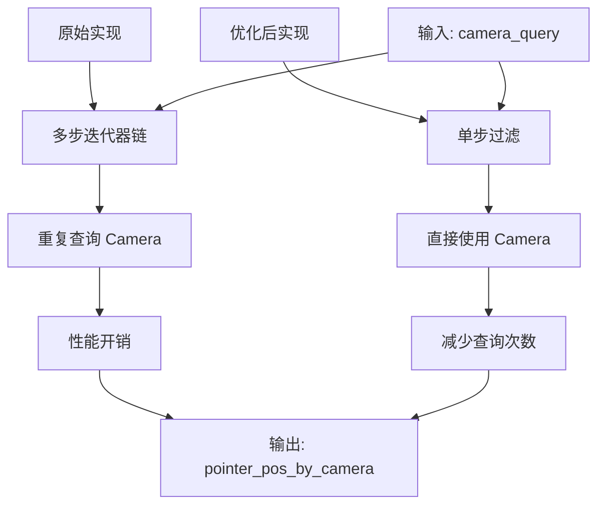

+++
title = "#22075 Simplify `ui_picking`'s camera search"
date = "2025-12-09T00:00:00"
draft = false
template = "pull_request_page.html"
in_search_index = false

[extra]
current_language = "zh-cn"
available_languages = {"en" = { name = "English", url = "/pull_request/bevy/2025-12/pr-22075-en-20251209" }, "zh-cn" = { name = "中文", url = "/pull_request/bevy/2025-12/pr-22075-zh-cn-20251209" }}
+++

# Simplify `ui_picking`'s camera search

## Basic Information
- **标题**: Simplify `ui_picking`'s camera search
- **PR链接**: https://github.com/bevyengine/bevy/pull/22075
- **作者**: ickshonpe
- **状态**: 已合并
- **标签**: D-Trivial, A-UI, C-Code-Quality, S-Ready-For-Final-Review, A-Picking
- **创建时间**: 2025-12-09T11:25:08Z
- **合并时间**: 2025-12-09T18:33:58Z
- **合并者**: mockersf

## 描述翻译
# 目标
在 `ui_picking` 中，camera_query 迭代器经过多个过滤器和映射操作，这可以用单个过滤器替换。此外，camera_query 检索了 `Camera` 组件但随后被丢弃并重新查询。

## 解决方案
* 将所有映射和过滤器合并为一个 `filter`。
* 仅查询一次 `Camera` 并保留结果，移除第二次查询。

## 这个 Pull Request 的故事

这个 PR 涉及 Bevy 引擎中 UI 拾取系统的优化。在分析 `crates/bevy_ui/src/picking_backend.rs` 文件的代码时，作者发现 `ui_picking` 函数中的相机查询存在可优化的空间。

### 问题与上下文
在 UI 拾取系统中，需要找到与当前指针位置匹配的相机。原始代码通过 `camera_query` 迭代器实现这一功能，但实现方式存在几个效率问题：

1. **迭代器链过长**：使用了多个串联的 `filter`、`map` 和 `filter_map` 操作，这种链式调用会产生多个中间迭代器，增加了抽象开销。
2. **重复查询问题**：代码先通过查询获取相机实体，然后立即丢弃相机组件，接着在循环内通过 `camera_query.get(camera)` 重新查询相同的相机数据。这种重复查询是不必要的性能浪费。

```rust
// 原始代码（简化）
for camera in camera_query
    .iter()
    .filter(|(_, _, cam_can_pick)| !settings.require_markers || *cam_can_pick)
    .map(|(entity, camera, _)| (entity, camera.target.normalize(...)))
    .filter_map(|(entity, target)| Some(entity).zip(target))
    .filter(|(_entity, target)| target == &pointer_location.target)
    .map(|(cam_entity, _target)| cam_entity)
{
    let Ok((_, camera_data, _)) = camera_query.get(camera) else { // 重复查询
        continue;
    };
    // 使用 camera_data 的代码...
}
```

### 解决方案
作者采取了两个直接的优化策略：

1. **合并过滤条件**：将所有的过滤和映射逻辑整合到一个 `filter` 闭包中。这不仅简化了代码结构，还减少了中间迭代器的创建。
2. **缓存相机组件**：在迭代器中直接保留 `Camera` 组件，避免后续重复查询。

### 实现细节
关键修改位于 `ui_picking` 函数的相机遍历部分。新的实现直接在迭代中检查所有条件，并保留 `camera` 组件的引用：

```rust
// 优化后的代码
for (entity, camera, _) in camera_query.iter().filter(|(_, camera, cam_can_pick)| {
    (!settings.require_markers || *cam_can_pick)
        && camera
            .target
            .normalize(primary_window.single().ok())
            .is_some_and(|target| target == pointer_location.target)
}) {
    let mut pointer_pos =
        pointer_location.position * camera.target_scaling_factor().unwrap_or(1.);
    if let Some(viewport) = camera.physical_viewport_rect() {
        // ... 后续处理
    }
    pointer_pos_by_camera
        .entry(entity)
        .or_default()
        .insert(pointer_id, pointer_pos);
}
```

这个重构有几个关键点：
- **条件合并**：将 `settings.require_markers` 检查和相机目标（target）检查合并到单个 `filter` 中
- **使用 `is_some_and`**：利用 Rust 1.70+ 的 `Option::is_some_and` 方法来优雅地处理 `Option` 类型的条件检查
- **直接使用 `camera`**：由于 `camera` 组件已经在迭代中可用，可以直接使用它而无需重新查询

### 技术洞察
这个 PR 展示了几个重要的代码优化原则：

1. **避免不必要的重复工作**：在 ECS（Entity-Component-System）系统中，查询操作是有成本的。通过缓存查询结果，可以避免不必要的系统开销。
2. **简化迭代器链**：过长的迭代器链不仅影响可读性，还可能引入性能开销。合并相关操作可以减少中间状态。
3. **利用现代 Rust 特性**：`is_some_and` 方法提供了一种更简洁的方式来处理 `Option` 值的条件检查，比先 `map` 再 `filter` 的模式更清晰。

从架构角度看，这个修改保持了 API 不变性，纯粹是内部实现的优化，不会影响系统的外部行为。

### 影响
这个优化的实际影响包括：
1. **性能提升**：消除了重复的相机查询，减少了迭代器链的开销
2. **代码简化**：将多行复杂的迭代器链简化为一个清晰的 `filter` 闭包
3. **可读性改善**：新代码更直接地表达了过滤条件，减少了认知负担

虽然这是一个小规模的优化，但它体现了良好的代码维护实践：不断审视现有代码，寻找简化机会，并利用语言特性编写更清晰的代码。

## 视觉表示



## 关键文件更改

### `crates/bevy_ui/src/picking_backend.rs` (+10/-19)

这个文件包含了 UI 拾取系统的主要实现。修改聚焦于 `ui_picking` 函数中的相机过滤逻辑。

**修改说明**：
优化了相机查询的迭代逻辑，将多步过滤合并为单步，并避免重复查询 Camera 组件。

```rust
// 修改前：
for camera in camera_query
    .iter()
    .filter(|(_, _, cam_can_pick)| !settings.require_markers || *cam_can_pick)
    .map(|(entity, camera, _)| {
        (
            entity,
            camera.target.normalize(primary_window.single().ok()),
        )
    })
    .filter_map(|(entity, target)| Some(entity).zip(target))
    .filter(|(_entity, target)| target == &pointer_location.target)
    .map(|(cam_entity, _target)| cam_entity)
{
    let Ok((_, camera_data, _)) = camera_query.get(camera) else {
        continue;
    };
    let mut pointer_pos =
        pointer_location.position * camera_data.target_scaling_factor().unwrap_or(1.);
    if let Some(viewport) = camera_data.physical_viewport_rect() {
        // 视口检查...
    }
    pointer_pos_by_camera
        .entry(camera)
        .or_default()
        .insert(pointer_id, pointer_pos);
}

// 修改后：
for (entity, camera, _) in camera_query.iter().filter(|(_, camera, cam_can_pick)| {
    (!settings.require_markers || *cam_can_pick)
        && camera
            .target
            .normalize(primary_window.single().ok())
            .is_some_and(|target| target == pointer_location.target)
}) {
    let mut pointer_pos =
        pointer_location.position * camera.target_scaling_factor().unwrap_or(1.);
    if let Some(viewport) = camera.physical_viewport_rect() {
        // 视口检查...
    }
    pointer_pos_by_camera
        .entry(entity)
        .or_default()
        .insert(pointer_id, pointer_pos);
}
```

## 延伸阅读

对于想了解更多相关概念的读者：

1. **Bevy ECS 查询系统**：了解 Bevy 的查询（Query）系统如何工作，有助于理解为什么避免重复查询是重要的优化
   - [Bevy ECS 文档](https://docs.rs/bevy_ecs/latest/bevy_ecs/)
   - [Bevy 查询指南](https://bevy-cheatbook.github.io/programming/queries.html)

2. **Rust 迭代器优化**：学习如何有效使用 Rust 迭代器，包括何时合并操作以及性能考虑
   - [Rust 迭代器文档](https://doc.rust-lang.org/std/iter/trait.Iterator.html)
   - [迭代器性能指南](https://github.com/rust-lang/rust/blob/master/src/etc/iterator-performance.md)

3. **`Option::is_some_and` 方法**：这个 Rust 1.70 引入的方法提供了更优雅的方式来组合 `Option` 检查和条件
   - [Rust 1.70 发布说明](https://blog.rust-lang.org/2023/06/01/Rust-1.70.0.html#optionis_some_and-and-resultis_ok_and-is_err_and)
   - [标准库文档](https://doc.rust-lang.org/std/option/enum.Option.html#method.is_some_and)

4. **UI 拾取系统**：了解 Bevy 中 UI 交互的工作原理
   - [Bevy UI 文档](https://docs.rs/bevy_ui/latest/bevy_ui/)
   - [交互系统指南](https://bevy-cheatbook.github.io/features/input.html)

# 完整代码差异
```diff
diff --git a/crates/bevy_ui/src/picking_backend.rs b/crates/bevy_ui/src/picking_backend.rs
index 99f00d5594f19..104219d1a66b5 100644
--- a/crates/bevy_ui/src/picking_backend.rs
+++ b/crates/bevy_ui/src/picking_backend.rs
@@ -119,25 +119,16 @@ pub fn ui_picking(
     {
         // This pointer is associated with a render target, which could be used by multiple
         // cameras. We want to ensure we return all cameras with a matching target.
-        for camera in camera_query
-            .iter()
-            .filter(|(_, _, cam_can_pick)| !settings.require_markers || *cam_can_pick)
-            .map(|(entity, camera, _)| {
-                (
-                    entity,
-                    camera.target.normalize(primary_window.single().ok()),
-                )
-            })
-            .filter_map(|(entity, target)| Some(entity).zip(target))
-            .filter(|(_entity, target)| target == &pointer_location.target)
-            .map(|(cam_entity, _target)| cam_entity)
-        {
-            let Ok((_, camera_data, _)) = camera_query.get(camera) else {
-                continue;
-            };
+        for (entity, camera, _) in camera_query.iter().filter(|(_, camera, cam_can_pick)| {
+            (!settings.require_markers || *cam_can_pick)
+                && camera
+                    .target
+                    .normalize(primary_window.single().ok())
+                    .is_some_and(|target| target == pointer_location.target)
+        }) {
             let mut pointer_pos =
-                pointer_location.position * camera_data.target_scaling_factor().unwrap_or(1.);
-            if let Some(viewport) = camera_data.physical_viewport_rect() {
+                pointer_location.position * camera.target_scaling_factor().unwrap_or(1.);
+            if let Some(viewport) = camera.physical_viewport_rect() {
                 if !viewport.as_rect().contains(pointer_pos) {
                     // The pointer is outside the viewport, skip it
                     continue;
@@ -145,7 +136,7 @@ pub fn ui_picking(
                 pointer_pos -= viewport.min.as_vec2();
             }
             pointer_pos_by_camera
-                .entry(camera)
+                .entry(entity)
                 .or_default()
                 .insert(pointer_id, pointer_pos);
         }
```