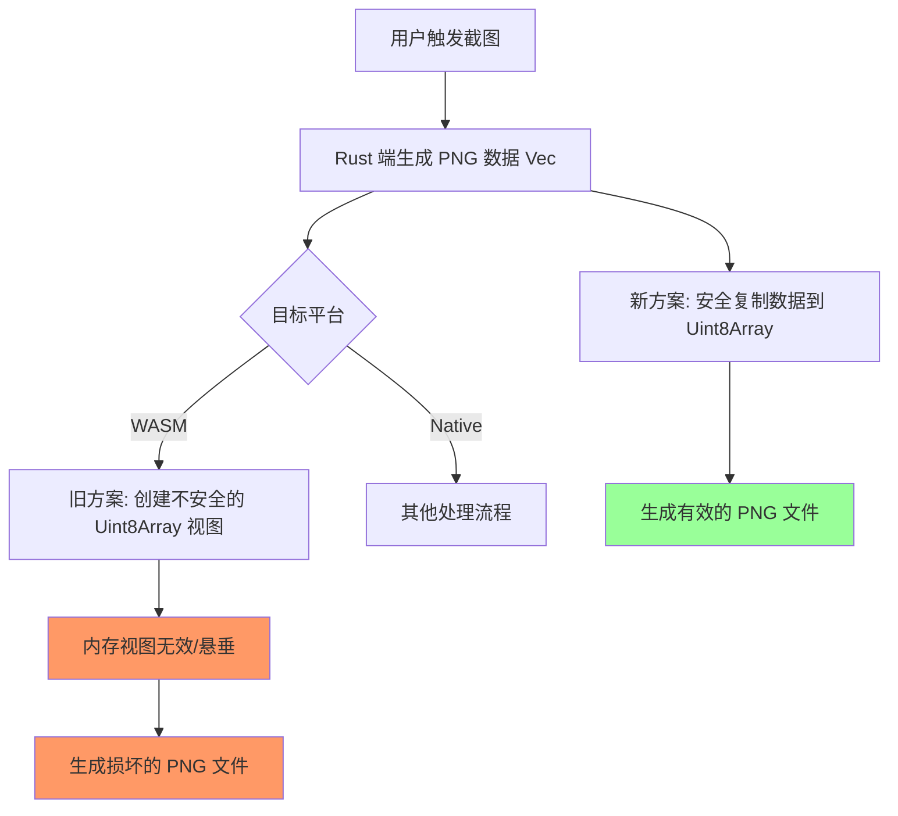

+++
title = "#22077 Fix undefined behavior in screenshots on WASM"
date = "2025-12-09T00:00:00"
draft = false
template = "pull_request_page.html"
in_search_index = false

[extra]
current_language = "zh-cn"
available_languages = {"en" = { name = "English", url = "/pull_request/bevy/2025-12/pr-22077-en-20251209" }, "zh-cn" = { name = "中文", url = "/pull_request/bevy/2025-12/pr-22077-zh-cn-20251209" }}
+++

# Title
## Fix undefined behavior in screenshots on WASM

## 基本信息
- **标题**: Fix undefined behavior in screenshots on WASM
- **PR链接**: https://github.com/bevyengine/bevy/pull/22077
- **作者**: kristoff3r
- **状态**: 已合并
- **标签**: C-Bug, D-Trivial, O-Web, P-Unsound, S-Needs-Review
- **创建时间**: 2025-12-09T16:02:44Z
- **合并时间**: 2025-12-09T18:33:58Z
- **合并者**: mockersf

## 描述翻译
# 目标

目前在 https://bevy.org/examples/window/screenshot/ 上的截图示例在我尝试时会产生无效的 PNG 文件。查看这些文件时，它们包含一些正确的字节，但也有一堆垃圾数据。该示例在原生环境下正常工作。

我将问题范围缩小到代码中唯一的 unsafe 块（感谢 Rust！）。我不完全理解为什么代码停止工作，或者它是否曾经有效，但在此期间，自从这段代码编写以来，已经添加了安全的 API，使用它使问题消失了。

## 解决方案

升级 `js-sys`，使用安全的 API。

## 测试

我使用 `bevy run --example screenshot web` 运行了示例。

---

## 本次 Pull Request 的技术分析

### 问题与背景
这个 PR 解决了一个在 WebAssembly (WASM) 目标上运行截图功能时产生的未定义行为（undefined behavior）问题。具体表现为，当用户在 WASM 环境下（例如在网页中）运行 Bevy 的截图示例时，生成的 PNG 文件是损坏的——文件包含部分正确的字节，但也混杂了大量垃圾数据，导致文件无法正常打开。这个问题在原生平台（如 Windows、macOS、Linux）上并不存在，表明它是一个特定于 WASM 环境的问题。

问题的根源在于代码中使用了一个 `unsafe` 块来创建 JavaScript 的 `Uint8Array` 视图。该代码尝试直接通过 `js_sys::Uint8Array::view` 方法，将一个 Rust 向量（`Vec<u8>`）的内存映射到 JavaScript 的 `Uint8Array`，而不进行数据复制。这种操作的本质是创建一个指向原始 Rust 内存的视图，而不是复制数据。然而，由于 Rust 的所有权（ownership）和生命周期（lifetime）规则，原始的内存缓冲区在函数调用结束后可能被释放或失效，导致 JavaScript 端访问到已释放或无效的内存地址，从而产生未定义行为。这解释了为什么生成的 PNG 文件包含垃圾数据。

### 解决方案与实现
解决此问题的方法是放弃不安全的直接内存视图操作，转而使用安全的、显式的数据复制。幸运的是，`js-sys` 库在较新的版本中提供了一个安全的 API：`Uint8Array::new_from_slice`。这个方法会接受一个 Rust 切片（`&[u8]`），并将其内容复制到一个新创建的 JavaScript `Uint8Array` 中。虽然这引入了微小的数据复制开销，但它完全避免了未定义行为的风险，并保证了内存安全。

实现此方案需要两个步骤：
1. **升级依赖版本**：`new_from_slice` 方法是 `js-sys` 库在 0.3.83 版本中引入的。因此，需要将 `Cargo.toml` 中对 `js-sys` 的版本约束从宽松的 "0.3" 提升到具体的 "0.3.83"，以确保该 API 可用。
2. **替换 unsafe 代码**：将原先使用 `Uint8Array::view` 的 `unsafe` 块替换为使用 `Uint8Array::new_from_slice` 的安全调用。

修改后的代码逻辑清晰：
```rust
let parts = js_sys::Array::of1(
    &js_sys::Uint8Array::new_from_slice(
        image_buffer.into_inner().as_bytes(),
    )
    .into(),
);
```
1. 将图像数据（PNG 字节）转换为切片 (`as_bytes()`)
2. 使用 `new_from_slice` 安全地创建一个包含该数据副本的 `Uint8Array`
3. 将其转换为 `JsValue` 并放入 `Array` 中，用于后续创建 Blob 和下载

### 技术洞察与考量
这是一个典型的“用安全 API 替换不安全代码”的修复案例，体现了 Rust 语言和生态系统在内存安全方面的持续改进。

**关键点**：
- **`Uint8Array::view` 的危险性**：该方法在 `js-sys` 中标记为 `unsafe` 是有充分理由的。它要求调用者确保被视图引用的底层内存在整个视图的生命周期内保持有效且不被修改。在跨语言（Rust/JavaScript）边界和异步操作（如文件下载）的复杂上下文中，手动保证这一点非常困难且容易出错。
- **WASM 内存模型的特殊性**：WebAssembly 程序运行在一个线性内存空间中，JavaScript 可以通过 `WebAssembly.Memory` 对象访问这块内存。`Uint8Array::view` 本质上是在这块线性内存上创建了一个视图。如果 Rust 端释放了某块内存（例如，`Vec` 被丢弃），而 JavaScript 端仍在尝试通过视图访问它，就会导致问题。
- **版本锁定的权衡**：将版本从 "0.3" 改为 "0.3.83" 是一个从宽泛版本约束到精确版本约束的变更。这确保了构建的可重现性（reproducibility）和 API 的可用性，但可能略微减少了依赖解析的灵活性。考虑到这是针对 WASM 目标的特定依赖，且修复的是内存安全问题，这种权衡是合理的。

### 影响与结论
这个修复直接解决了 WASM 环境下截图功能损坏的根本问题。用户现在可以在网页中正常运行截图示例并获得有效的 PNG 文件。更重要的是，它消除了一个潜在的未定义行为源，提升了整个代码库在 WASM 目标上的安全性和可靠性。

从更广泛的工程实践角度看，这个 PR 展示了几个有价值的经验：
1. **优先使用安全 API**：当有安全的替代方案时，应优先使用它们来避免潜在的内存安全问题。
2. **关注跨语言交互**：在 Rust 与 JavaScript 交互时，要特别注意数据所有权和生命周期的管理，避免跨语言边界的悬垂指针。
3. **利用类型系统**：Rust 的 `unsafe` 关键字是一个明确的危险信号。审查代码时，应特别关注 `unsafe` 块的使用是否合理，是否有更安全的替代方案。
4. **测试多平台**：功能在原生平台正常并不能保证在 WASM 或其他目标平台也正常。跨平台测试对于保证软件质量至关重要。

## 视觉表示



## 关键文件变更

### 1. `crates/bevy_render/Cargo.toml`
**变更描述**：升级 WASM 目标下的 `js-sys` 依赖版本，以确保可用的安全 API `Uint8Array::new_from_slice`。

**代码变更**：
```toml
# 变更前：
[target.'cfg(target_arch = "wasm32")'.dependencies]
js-sys = "0.3"

# 变更后：
[target.'cfg(target_arch = "wasm32")'.dependencies]
js-sys = "0.3.83"
```

### 2. `crates/bevy_render/src/view/window/screenshot.rs`
**变更描述**：将不安全的 `Uint8Array::view` 调用替换为安全的 `Uint8Array::new_from_slice` 调用，消除未定义行为。

**代码变更**：
```rust
// 变更前（存在未定义行为风险）：
// SAFETY: `image_buffer` only exist in this closure, and is not used after this line
let parts = js_sys::Array::of1(&unsafe {
    js_sys::Uint8Array::view(image_buffer.into_inner().as_bytes())
        .into()
});

// 变更后（安全的内存复制）：
let parts = js_sys::Array::of1(
    &js_sys::Uint8Array::new_from_slice(
        image_buffer.into_inner().as_bytes(),
    )
    .into(),
);
```

**关系说明**：文件中的修改是修复的核心逻辑变更，而 Cargo.toml 的修改是确保新 API 可用的前提条件。两者共同构成了完整的修复方案。

## 完整代码差异
```diff
diff --git a/crates/bevy_render/Cargo.toml b/crates/bevy_render/Cargo.toml
index 7b4fa6259f64b..6edeec51654c0 100644
--- a/crates/bevy_render/Cargo.toml
+++ b/crates/bevy_render/Cargo.toml
@@ -125,7 +125,7 @@ send_wrapper = { version = "0.6.0" }
 proptest = "1"
 
 [target.'cfg(target_arch = "wasm32")'.dependencies]
-js-sys = "0.3"
+js-sys = "0.3.83"
 web-sys = { version = "0.3.67", features = [
   'Blob',
   'Document',
diff --git a/crates/bevy_render/src/view/window/screenshot.rs b/crates/bevy_render/src/view/window/screenshot.rs
index 638d3cf7c6b68..4aba6c6cee791 100644
--- a/crates/bevy_render/src/view/window/screenshot.rs
+++ b/crates/bevy_render/src/view/window/screenshot.rs
@@ -151,11 +151,13 @@ pub fn save_to_disk(path: impl AsRef<Path>) -> impl FnMut(On<ScreenshotCaptured>
                             let mut image_buffer = std::io::Cursor::new(Vec::new());
                             img.write_to(&mut image_buffer, format)
                                 .map_err(|e| JsValue::from_str(&format!("{e}")))?;
-                            // SAFETY: `image_buffer` only exist in this closure, and is not used after this line
-                            let parts = js_sys::Array::of1(&unsafe {
-                                js_sys::Uint8Array::view(image_buffer.into_inner().as_bytes())
-                                    .into()
-                            });
+
+                            let parts = js_sys::Array::of1(
+                                &js_sys::Uint8Array::new_from_slice(
+                                    image_buffer.into_inner().as_bytes(),
+                                )
+                                .into(),
+                            );
                             let blob = web_sys::Blob::new_with_u8_array_sequence(&parts)?;
                             let url = web_sys::Url::create_object_url_with_blob(&blob)?;
                             let window = web_sys::window().unwrap();
```

## 扩展阅读
对于想要深入了解此 PR 中涉及概念的开发者，以下资源可能会有帮助：

1. **Rust 和 WebAssembly 官方文档**：
   - [The Rust and WebAssembly Book](https://rustwasm.github.io/docs/book/) - 全面介绍如何使用 Rust 编写 WebAssembly 应用
   - [wasm-bindgen 指南](https://rustwasm.github.io/docs/wasm-bindgen/) - 特别是关于 JavaScript 和 Rust 之间互操作的部分

2. **内存安全与 unsafe Rust**：
   - [Rustonomicon: The Dark Arts of Unsafe Rust](https://doc.rust-lang.org/nomicon/) - 深入讲解 unsafe Rust 的正确用法和风险
   - [Common Rust Lifetime Misconceptions](https://github.com/pretzelhammer/rust-blog/blob/master/posts/common-rust-lifetime-misconceptions.md) - 澄清关于生命周期的常见误解

3. **js-sys 和 web-sys 库**：
   - [js-sys API 文档](https://rustwasm.github.io/wasm-bindgen/api/js_sys/) - 查看 `Uint8Array` 可用的所有方法
   - [web-sys API 文档](https://rustwasm.github.io/wasm-bindgen/api/web_sys/) - 了解 Web API 的 Rust 绑定

4. **相关技术讨论**：
   - [Rust Wasm Working Group](https://github.com/rustwasm/team) - 关注 Rust 在 WebAssembly 领域的最新进展
   - [Bevy 引擎的 WASM 支持](https://bevyengine.org/learn/book/getting-started/setup/#wasm-web) - Bevy 官方对 WebAssembly 支持的说明