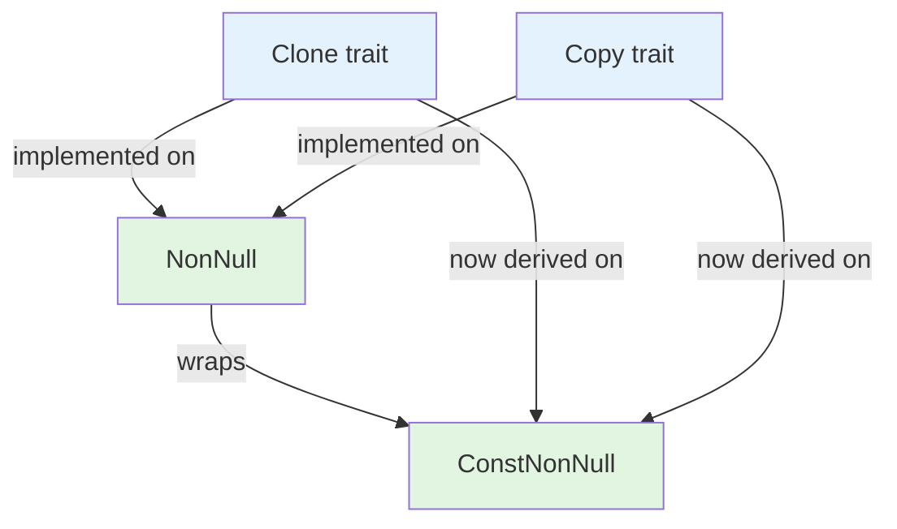

+++
title = "#22078 Implement `Clone` and `Copy` for bevy_ptr's `ConstNonNull` for parity with `NonNull`"
date = "2025-12-09T00:00:00"
draft = false
template = "pull_request_page.html"
in_search_index = true

[taxonomies]
list_display = ["show"]

[extra]
current_language = "en"
available_languages = {"en" = { name = "English", url = "/pull_request/bevy/2025-12/pr-22078-en-20251209" }, "zh-cn" = { name = "中文", url = "/pull_request/bevy/2025-12/pr-22078-zh-cn-20251209" }}
labels = ["D-Trivial", "C-Usability", "A-Pointers"]
+++

# Title

## Basic Information
- **Title**: Implement `Clone` and `Copy` for bevy_ptr's `ConstNonNull` for parity with `NonNull`
- **PR Link**: https://github.com/bevyengine/bevy/pull/22078
- **Author**: panpanpro888
- **Status**: MERGED
- **Labels**: D-Trivial, C-Usability, S-Ready-For-Final-Review, A-Pointers
- **Created**: 2025-12-09T16:41:12Z
- **Merged**: 2025-12-09T18:38:43Z
- **Merged By**: alice-i-cecile

## Description Translation

# Objective

Fixes #22059 

## Solution

Just `#[derive(Clone, Copy)]` on `ConstNonNull` since it's just a wrapper around `NonNull` which implements them

## Testing

Just tested if it compiles and functions as it should

## The Story of This Pull Request

This pull request addresses a straightforward consistency issue in Bevy's pointer abstraction layer. The problem was that `ConstNonNull`, a wrapper type for read-only non-null pointers, lacked the `Clone` and `Copy` trait implementations that its mutable counterpart `NonNull` already had. This inconsistency created unnecessary friction for developers using these types, requiring manual cloning or copying workarounds.

The issue was identified in GitHub issue #22059, which pointed out the missing trait implementations. The root cause was simply an oversight during the initial implementation of `ConstNonNull`. Since this type is defined as a thin wrapper around `NonNull` with transparent representation, there were no technical barriers preventing the addition of these traits.

The solution approach was minimal and correct: add `#[derive(Clone, Copy)]` to the `ConstNonNull` struct definition. This approach works because:

1. `ConstNonNull` is a `#[repr(transparent)]` wrapper around `NonNull`, meaning it has exactly the same memory layout
2. `NonNull` already implements both `Clone` and `Copy`, so deriving these traits for the wrapper is safe
3. The wrapper doesn't add any additional state or invariants that would interfere with copying

The implementation involved a one-line change in `crates/bevy_ptr/src/lib.rs`:

```rust
#[derive(Clone, Copy)]
#[repr(transparent)]
pub struct ConstNonNull<T: ?Sized>(NonNull<T>);
```

This change aligns `ConstNonNull` with Rust's standard library `NonNull` type and follows the principle of least surprise. Developers who are familiar with `NonNull` would naturally expect `ConstNonNull` to have the same basic trait implementations.

From a technical perspective, this change is safe because:
- `Clone` and `Copy` are automatically derived for types whose fields all implement those traits
- The transparent representation ensures no layout changes
- The pointer semantics remain unchanged - copying the pointer doesn't copy the pointed-to data

The impact of this change is primarily improved ergonomics. Developers can now:
- Pass `ConstNonNull` instances by value without explicit cloning
- Store them in collections that require `Clone` or `Copy`
- Use them in patterns where trait bounds require these implementations

This small fix demonstrates the importance of consistency in API design, especially for wrapper types that mirror functionality from standard library types. It also shows how even simple one-line changes can significantly improve developer experience by eliminating unnecessary friction points.

## Visual Representation



## Key Files Changed

**File:** `crates/bevy_ptr/src/lib.rs`

**Change:** Added `#[derive(Clone, Copy)]` to the `ConstNonNull` struct definition

**Before:**
```rust
/// A newtype around [`NonNull`] that only allows conversion to read-only borrows or pointers.
///
/// This type can be thought of as the `*const T` to [`NonNull<T>`]'s `*mut T`.
#[repr(transparent)]
pub struct ConstNonNull<T: ?Sized>(NonNull<T>);
```

**After:**
```rust
/// A newtype around [`NonNull`] that only allows conversion to read-only borrows or pointers.
///
/// This type can be thought of as the `*const T` to [`NonNull<T>`]'s `*mut T`.
#[derive(Clone, Copy)]
#[repr(transparent)]
pub struct ConstNonNull<T: ?Sized>(NonNull<T>);
```

**Why this change matters:**
1. **Consistency:** Aligns `ConstNonNull` with `NonNull`, which already had these traits
2. **Ergonomics:** Eliminates the need for manual `.clone()` calls or workarounds
3. **Compatibility:** Enables use in generic contexts requiring `Clone` or `Copy` bounds
4. **Principle of least surprise:** Developers expect wrapper types to inherit basic traits from their inner types

## Further Reading

1. **Rust Documentation:**
   - [`Clone` trait](https://doc.rust-lang.org/std/clone/trait.Clone.html)
   - [`Copy` trait](https://doc.rust-lang.org/std/marker/trait.Copy.html)
   - [`#[derive()]` attribute](https://doc.rust-lang.org/reference/attributes/derive.html)
   - [`#[repr(transparent)]`](https://doc.rust-lang.org/reference/type-layout.html#the-transparent-representation)

2. **Rustonomicon - Type Layout:**
   - Explanation of transparent representation and its implications for wrapper types

3. **Bevy Pointer Documentation:**
   - [bevy_ptr crate documentation](https://docs.rs/bevy_ptr/latest/bevy_ptr/) for understanding the broader context of pointer abstractions in Bevy

# Full Code Diff
```diff
diff --git a/crates/bevy_ptr/src/lib.rs b/crates/bevy_ptr/src/lib.rs
index f59a02496afda..ab05449566d0c 100644
--- a/crates/bevy_ptr/src/lib.rs
+++ b/crates/bevy_ptr/src/lib.rs
@@ -161,6 +161,7 @@ mod sealed {
 /// A newtype around [`NonNull`] that only allows conversion to read-only borrows or pointers.
 ///
 /// This type can be thought of as the `*const T` to [`NonNull<T>`]'s `*mut T`.
+#[derive(Clone, Copy)]
 #[repr(transparent)]
 pub struct ConstNonNull<T: ?Sized>(NonNull<T>);
```