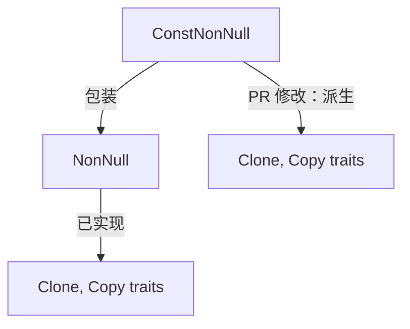

+++
title = "#22078 Implement `Clone` and `Copy` for bevy_ptr's `ConstNonNull` for parity with `NonNull"
date = "2025-12-09T00:00:00"
draft = false
template = "pull_request_page.html"
in_search_index = false

[extra]
current_language = "zh-cn"
available_languages = {"en" = { name = "English", url = "/pull_request/bevy/2025-12/pr-22078-en-20251209" }, "zh-cn" = { name = "中文", url = "/pull_request/bevy/2025-12/pr-22078-zh-cn-20251209" }}
+++

# Title

## 基本信息
- **标题**: Implement `Clone` and `Copy` for bevy_ptr's `ConstNonNull` for parity with `NonNull`
- **PR 链接**: https://github.com/bevyengine/bevy/pull/22078
- **作者**: panpanpro888
- **状态**: 已合并
- **标签**: D-Trivial, C-Usability, S-Ready-For-Final-Review, A-Pointers
- **创建时间**: 2025-12-09T16:41:12Z
- **合并时间**: 2025-12-09T18:38:43Z
- **合并者**: alice-i-cecile

## 描述翻译

### Objective (目标)

修复 #22059

### Solution (解决方案)

只需在 `ConstNonNull` 上添加 `#[derive(Clone, Copy)]`，因为它只是一个包装了 `NonNull` 的封装，而 `NonNull` 已经实现了这些 trait。

### Testing (测试)

仅测试了它能否编译并正常工作。

## The Story of This Pull Request

这个 PR 的起源很简单：`bevy_ptr` 模块中一个类型 `ConstNonNull` 缺少了 `Clone` 和 `Copy` trait 的实现。在 Rust 中，对于包含非所有权指针 (`NonNull<T>`) 的包装类型，如果底层类型本身已经实现了 `Copy`（这意味着它是按位复制的）和 `Clone`，那么为包装器自动派生这些 trait 通常是安全且符合预期的。`NonNull<T>` 本身已经实现了 `Copy` 和 `Clone`。

问题报告 #22059 指出，`ConstNonNull` 缺少这些实现，导致与 `NonNull` 的行为不一致。这种不一致性虽然小，但会带来不必要的使用障碍。例如，当开发者想要复制或克隆一个 `ConstNonNull` 实例时，如果没有 `Copy` trait，就必须显式地解引用或使用其他变通方法，这降低了代码的 ergonomics（使用便利性）。

解决方案直接明了。由于 `ConstNonNull` 被定义为 `#[repr(transparent)]`，并且其内部仅包含一个 `NonNull<T>`，直接为它派生 `Clone` 和 `Copy` 是安全的。派生 `Copy` 的前提是所有字段都实现了 `Copy`，而 `NonNull<T>` 确实实现了 `Copy`。`Clone` 的派生也是同理。这个修改只是让 `ConstNonNull` 具备了与其底层类型和对应可变指针类型 `NonNull` 相同的复制语义。

从技术角度来看，这个修改的风险极低。它没有改变类型的内存布局（得益于 `#[repr(transparent)]`），也没有引入任何新的运行时逻辑。它纯粹是编译器层面的扩展，为类型添加了 trait 实现。因此，测试也相对简单，主要验证修改后的代码能够编译通过，并且 `ConstNonNull` 实例现在可以像预期那样被复制和克隆。

这个 PR 的合并带来了代码一致性（与 `NonNull` 保持一致）并消除了一个微小的使用障碍。它体现了 Rust 社区对 API 一致性和开发者体验的重视。虽然改动很小，但这类“卫生改进”（hygiene improvements）对于维护一个高质量、易于使用的代码库至关重要。

## Visual Representation

这个 PR 的改动非常集中，仅涉及单个类型的 trait 派生。其关系可以表示如下：



## Key Files Changed

### `crates/bevy_ptr/src/lib.rs`
这个文件包含了 `bevy_ptr` 模块的核心定义。修改为 `ConstNonNull` 结构体添加了 `Clone` 和 `Copy` trait 的派生宏。

**代码变更：**
```rust
// 文件: crates/bevy_ptr/src/lib.rs
// 修改前：
/// A newtype around [`NonNull`] that only allows conversion to read-only borrows or pointers.
///
/// This type can be thought of as the `*const T` to [`NonNull<T>`]'s `*mut T`.
#[repr(transparent)]
pub struct ConstNonNull<T: ?Sized>(NonNull<T>);

// 修改后：
/// A newtype around [`NonNull`] that only allows conversion to read-only borrows or pointers.
///
/// This type can be thought of as the `*const T` to [`NonNull<T>`]'s `*mut T`.
#[derive(Clone, Copy)]
#[repr(transparent)]
pub struct ConstNonNull<T: ?Sized>(NonNull<T>);
```

**说明：**
`#[derive(Clone, Copy)]` 这一行是唯一的修改。它为 `ConstNonNull` 结构体自动生成了 `Clone` 和 `Copy` trait 的实现。由于 `NonNull<T>` 已经实现了这两个 trait，且 `ConstNonNull` 是透明包装（`#[repr(transparent)]`），这个派生是安全且正确的。这一改动直接满足了 PR 的目标：使 `ConstNonNull` 在 `Clone`/`Copy` 特性上与 `NonNull` 保持一致。

## Further Reading

1.  **Rust 官方文档 - `#[derive]` 属性**: https://doc.rust-lang.org/reference/attributes/derive.html
    *   解释了 `derive` 属性如何自动为结构体和枚举生成 trait 实现。

2.  **Rust 官方文档 - `Copy` 和 `Clone` traits**: https://doc.rust-lang.org/std/marker/trait.Copy.html 和 https://doc.rust-lang.org/std/clone/trait.Clone.html
    *   详细说明了 `Copy`（隐式按位复制）和 `Clone`（显式深度复制）trait 的区别与用法。

3.  **Rust 官方文档 - `#[repr(transparent)]`**: https://doc.rust-lang.org/reference/type-layout.html#the-transparent-representation
    *   解释了透明表示法，它保证包装类型与其单个非零大小字段具有完全相同的内存布局和 ABI。

4.  **Rustonomicon - 使用 `NonNull` 进行指针操作**: https://doc.rust-lang.org/nomicon/vec/vec-alloc.html
    *   深入探讨了 `NonNull` 指针在 unsafe Rust 中的使用，特别是在实现自定义集合时。

# Full Code Diff
diff --git a/crates/bevy_ptr/src/lib.rs b/crates/bevy_ptr/src/lib.rs
index f59a02496afda..ab05449566d0c 100644
--- a/crates/bevy_ptr/src/lib.rs
+++ b/crates/bevy_ptr/src/lib.rs
@@ -161,6 +161,7 @@ mod sealed {
 /// A newtype around [`NonNull`] that only allows conversion to read-only borrows or pointers.
 ///
 /// This type can be thought of as the `*const T` to [`NonNull<T>`]'s `*mut T`.
+#[derive(Clone, Copy)]
 #[repr(transparent)]
 pub struct ConstNonNull<T: ?Sized>(NonNull<T>);