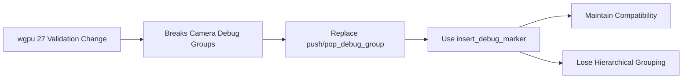

+++
title = "#22079 Use insert_debug_marker instead of debug_group"
date = "2025-12-09T00:00:00"
draft = false
template = "pull_request_page.html"
in_search_index = true

[taxonomies]
list_display = ["show"]

[extra]
current_language = "en"
available_languages = {"en" = { name = "English", url = "/pull_request/bevy/2025-12/pr-22079-en-20251209" }, "zh-cn" = { name = "中文", url = "/pull_request/bevy/2025-12/pr-22079-zh-cn-20251209" }}
labels = ["D-Trivial", "A-Rendering"]
+++

# Title

## Basic Information
- **Title**: Use insert_debug_marker instead of debug_group
- **PR Link**: https://github.com/bevyengine/bevy/pull/22079
- **Author**: IceSentry
- **Status**: MERGED
- **Labels**: D-Trivial, A-Rendering, S-Ready-For-Final-Review
- **Created**: 2025-12-09T18:03:01Z
- **Merged**: 2025-12-09T19:02:17Z
- **Merged By**: mockersf

## Description Translation
**Objective**
- wgpu 27 changed debug_group validation which breaks the camera debug_group

**Solution**
- Use insert_debug_marker until we find an alternative to using a debug_group

**Testing**
- I tested my change with the wgpu 27 branch

**Showcase**
Unfortunately, this means we lose the nice groupings for each camera but we can still see each marker when a camera is being rendered


## The Story of This Pull Request

This PR addresses a compatibility issue that arose from a validation change in wgpu version 27. The core problem was that Bevy's rendering system was using debug groups to mark the beginning and end of camera rendering operations in performance profiling tools. These debug groups were implemented using `push_debug_group` and `pop_debug_group` methods on the command encoder.

With the release of wgpu 27, the validation rules for debug groups were tightened. Specifically, the change made it impossible to have a debug group that spans multiple command encoders. This broke Bevy's camera debug groups because the render graph execution could potentially involve multiple command encoders.

The developer, IceSentry, identified that the issue originated from wgpu PR #8048, which introduced stricter validation for debug groups. The immediate solution was to replace the problematic `push_debug_group`/`pop_debug_group` calls with `insert_debug_marker` calls instead. 

The technical difference between these two approaches is significant. Debug groups create a hierarchical structure in profiling tools, allowing developers to collapse and expand sections of work. Debug markers, on the other hand, are simple timestamped labels that don't create hierarchical nesting. While debug markers are less visually organized in profiling tools, they don't have the same validation constraints as debug groups.

The implementation change was straightforward but had important implications for the developer experience. In the modified code, instead of pushing a debug group at the start of a camera render and popping it at the end, the code now inserts a "Start {debug_group}" marker at the beginning and an "End {debug_group}" marker at the conclusion. This maintains the ability to identify when specific cameras are being rendered in profiling tools, though without the hierarchical grouping that was previously available.

The trade-off here is clear: compatibility with wgpu 27 was prioritized over the organizational benefits of debug groups. The solution is explicitly marked as a workaround with a TODO comment indicating that a more permanent solution should be found later. This is a pragmatic approach - when facing a breaking change in a critical dependency like wgpu, it's often necessary to implement a minimal fix to restore functionality while deferring a more elegant solution for future consideration.

From an engineering perspective, this change demonstrates good practice in dependency management. When upstream dependencies introduce breaking changes, downstream projects need to adapt quickly. The solution here minimizes code changes while maintaining core functionality. The author also properly tested the change with the wgpu 27 branch before submitting the PR, which is essential when dealing with compatibility issues.

The visual examples provided in the PR description clearly show the difference in profiling output. With debug groups, camera renders would appear as nested, collapsible sections. With debug markers, each camera render appears as individual labeled entries in the timeline. While less organized, the markers still provide the essential information needed for performance analysis.

## Visual Representation



## Key Files Changed

### `crates/bevy_render/src/renderer/graph_runner.rs` (+11/-3)

This file contains the main rendering graph execution logic. The changes replace debug group operations with debug markers to maintain compatibility with wgpu 27's stricter validation rules.

**Key modifications:**

1. At the start of graph execution, instead of pushing a debug group, the code now inserts a debug marker:

```rust
// Before:
if let Some(debug_group) = debug_group.as_ref() {
    render_context
        .command_encoder()
        .push_debug_group(debug_group);
}

// After:
if let Some(debug_group) = debug_group.as_ref() {
    // wgpu 27 changed the debug_group validation which makes it impossible to have
    // a debug_group that spans multiple command encoders.
    //
    // <https://github.com/gfx-rs/wgpu/pull/8048>
    //
    // For now, we use a debug_marker as a workaround
    render_context
        .command_encoder()
        .insert_debug_marker(&format!("Start {debug_group}"));
}
```

2. At the end of graph execution, instead of popping the debug group, the code now inserts an ending debug marker:

```rust
// Before:
if debug_group.is_some() {
    render_context.command_encoder().pop_debug_group();
}

// After:
if let Some(debug_group) = debug_group {
    render_context
        .command_encoder()
        .insert_debug_marker(&format!("End {debug_group}"));
}
```

The changes are minimal but important for maintaining compatibility with the updated wgpu dependency. The comments clearly document why the change was necessary and reference the upstream wgpu PR that caused the issue.

## Further Reading

1. **wgpu Debug Groups Documentation**: Understanding the limitations and proper usage of debug groups in wgpu
2. **Rendering Profiling Tools**: How to use tools like RenderDoc and NVIDIA Nsight Graphics for GPU performance analysis
3. **Command Encoder Patterns**: Best practices for organizing rendering commands in modern graphics APIs
4. **wgpu PR #8048**: The upstream change that introduced the stricter validation (referenced in the code comments)