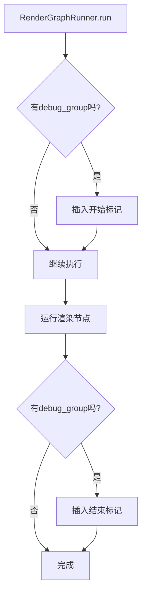

+++
title = "#22079 Use insert_debug_marker instead of debug_group"
date = "2025-12-09T00:00:00"
draft = false
template = "pull_request_page.html"
in_search_index = false

[extra]
current_language = "zh-cn"
available_languages = {"en" = { name = "English", url = "/pull_request/bevy/2025-12/pr-22079-en-20251209" }, "zh-cn" = { name = "中文", url = "/pull_request/bevy/2025-12/pr-22079-zh-cn-20251209" }}
+++

# 标题
## 基本信息
- **标题**: Use insert_debug_marker instead of debug_group
- **PR链接**: https://github.com/bevyengine/bevy/pull/22079
- **作者**: IceSentry
- **状态**: 已合并
- **标签**: D-Trivial, A-Rendering, S-Ready-For-Final-Review
- **创建时间**: 2025-12-09T18:03:01Z
- **合并时间**: 2025-12-09T19:02:17Z
- **合并者**: mockersf

## 描述翻译
### 目标
- wgpu 27 修改了 debug_group 的验证规则，导致相机 debug_group 无法正常工作

### 解决方案
- 在找到替代方案之前，使用 insert_debug_marker 代替 debug_group

### 测试
- 已在 wgpu 27 分支上测试了我的更改

---

### 展示
不幸的是，这意味着我们失去了每个相机的分组显示，但仍然可以看到每个相机渲染时的标记


## 这个PR的故事

这个PR解决了一个由wgpu 27版本升级引起的具体问题。wgpu是一个WebGPU的Rust实现，Bevy引擎使用它作为底层图形API抽象。在wgpu 27中，开发团队对debug_group的验证规则进行了修改，这使得之前Bevy中相机调试分组的实现方式不再可行。

debug_group是一个调试工具，用于在图形调试器（如RenderDoc或NVIDIA Nsight）中组织渲染命令。它们可以嵌套，帮助开发者理解渲染管线的结构。然而，wgpu 27引入了一个限制：debug_group不能跨多个command encoder（命令编码器）。在Bevy的渲染图系统中，不同的节点可能会使用不同的命令编码器，这导致原来的debug_group实现违反了新的验证规则。

开发者IceSentry面临的问题是：相机渲染的调试信息在wgpu 27下会触发验证错误。解决方案是暂时使用insert_debug_marker作为替代方案。debug_marker是另一种调试工具，它插入一个标记点但不创建嵌套组。这个更改是一个权宜之计，注释中明确提到"暂时使用debug_marker作为变通方案"，暗示将来可能需要更完整的解决方案。

从技术实现上看，这个修改很简单但很精准。原来使用push_debug_group和pop_debug_group来创建一个嵌套的调试组，现在改为在开始和结束处分别插入调试标记。这样避免了跨命令编码器的问题，因为每个标记都是独立的，不要求连续的嵌套结构。

这个更改的影响是双向的。正面来看，它解决了与wgpu 27的兼容性问题，避免了验证错误。负面来看，调试体验有所降级：在图形调试器中，相机渲染不再显示为嵌套的组，而是分散的标记点。这增加了调试时的认知负担，因为开发者无法一目了然地看到哪些命令属于哪个相机。

从代码质量的角度看，这个PR展示了良好的工程实践：
1. **最小化变更**：只修改了必需的部分
2. **清晰的注释**：解释了为什么需要更改并引用了相关PR
3. **明确的临时性**：注释表明这是一个临时解决方案

从架构角度看，这个PR揭示了Bevy渲染系统与底层图形API之间的抽象边界问题。当底层API的约束发生变化时，上层抽象可能需要调整。这也提示了未来可能的工作方向：要么等待wgpu提供更灵活的调试组支持，要么在Bevy层面重新组织命令编码器的使用方式以避免跨编码器的调试组。

## 视觉表示



## 关键文件更改

### `crates/bevy_render/src/renderer/graph_runner.rs` (+11/-3)

这个文件包含了渲染图运行器的核心逻辑。主要更改是在`run`方法中，将原来的debug_group操作替换为debug_marker操作。

**更改前的相关代码：**
```rust
if let Some(debug_group) = debug_group.as_ref() {
    render_context
        .command_encoder()
        .push_debug_group(debug_group);
}

// ... 渲染节点执行逻辑 ...

if debug_group.is_some() {
    render_context.command_encoder().pop_debug_group();
}
```

**更改后的相关代码：**
```rust
if let Some(debug_group) = debug_group.as_ref() {
    // wgpu 27 changed the debug_group validation which makes it impossible to have
    // a debug_group that spans multiple command encoders.
    //
    // <https://github.com/gfx-rs/wgpu/pull/8048>
    //
    // For now, we use a debug_marker as a workaround
    render_context
        .command_encoder()
        .insert_debug_marker(&format!("Start {debug_group}"));
}

// ... 渲染节点执行逻辑 ...

if let Some(debug_group) = debug_group {
    render_context
        .command_encoder()
        .insert_debug_marker(&format!("End {debug_group}"));
}
```

**更改说明：**
1. 开始时不再使用`push_debug_group`创建调试组，而是使用`insert_debug_marker`插入一个"开始"标记
2. 结束时不再使用`pop_debug_group`结束调试组，而是插入一个"结束"标记
3. 添加了详细的注释解释为什么需要这个更改，并引用了相关的wgpu PR

这个更改直接解决了PR描述中的问题：wgpu 27的debug_group验证更改导致相机debug_group无法工作。通过使用debug_marker替代，虽然调试体验有所降级，但保持了功能的可用性和兼容性。

## 进一步阅读

1. **WebGPU调试工具**：
   - [WebGPU Debugging Overview](https://gpuweb.github.io/gpuweb/#debugging) - WebGPU标准的调试功能说明
   - [RenderDoc](https://renderdoc.org/) - 常用的图形调试器，支持WebGPU/Vulkan/D3D等

2. **wgpu相关更改**：
   - [wgpu PR #8048](https://github.com/gfx-rs/wgpu/pull/8048) - 导致这个问题的wgpu更改
   - [wgpu Debug Groups Documentation](https://docs.rs/wgpu/latest/wgpu/struct.CommandEncoder.html#method.push_debug_group) - wgpu调试组API文档

3. **Bevy渲染系统**：
   - [Bevy Render Graph Documentation](https://docs.rs/bevy_render/latest/bevy_render/render_graph/index.html) - Bevy渲染图系统文档
   - [Command Encoders in Rendering](https://github.com/bevyengine/bevy/blob/main/crates/bevy_render/src/renderer/mod.rs) - Bevy中命令编码器的使用

4. **图形API调试最佳实践**：
   - [GPU Debugging Techniques](https://developer.nvidia.com/nsight-graphics) - NVIDIA的图形调试指南
   - [Debugging Graphics API Issues](https://alextardif.com/Debugging.html) - 图形API调试实用技巧