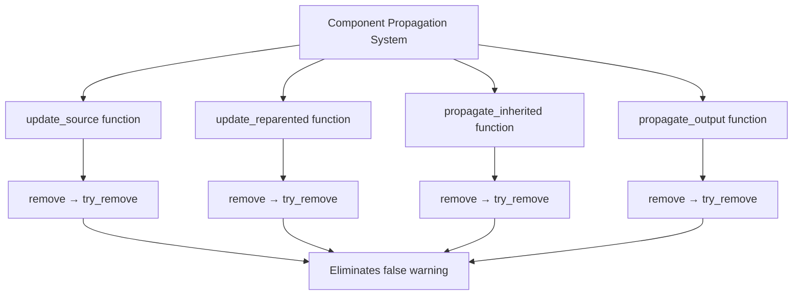

+++
title = "#22084 Fixing Warning Regressions in Component Propagation System"
date = "2025-12-10T00:00:00"
draft = false
template = "pull_request_page.html"
in_search_index = true

[taxonomies]
list_display = ["show"]

[extra]
current_language = "en"
available_languages = {"en" = { name = "English", url = "/pull_request/bevy/2025-12/pr-22084-en-20251210" }, "zh-cn" = { name = "中文", url = "/pull_request/bevy/2025-12/pr-22084-zh-cn-20251210" }}
labels = ["A-ECS", "C-Usability"]
+++

# Title: Fixing Warning Regressions in Component Propagation System

## Basic Information
- **Title**: :bug: Fixes Warning regression in Propagate
- **PR Link**: https://github.com/bevyengine/bevy/pull/22084
- **Author**: ekwoka
- **Status**: MERGED
- **Labels**: A-ECS, C-Usability, S-Ready-For-Final-Review
- **Created**: 2025-12-10T13:12:28Z
- **Merged**: 2025-12-10T20:11:24Z
- **Merged By**: alice-i-cecile

## Description
# Objective

Solves #22067 

It was just a warning, but no reason to emit warnings for internals.

Seemed safe to just use `try_remove` everywhere in place of `remove`.

## The Story of This Pull Request

This PR addresses a warning regression in Bevy's component propagation system. The issue (#22067) was straightforward: the ECS system was emitting unnecessary warnings when attempting to remove components that might not exist on entities. While these warnings didn't break functionality, they created noise in the development process and could mask other, more important warnings.

The core problem stemmed from the difference between `remove()` and `try_remove()` operations in Bevy's Entity Commands API. The `remove()` method emits a warning when you attempt to remove a component that doesn't exist on an entity, while `try_remove()` silently handles this case without warning. This distinction matters because the propagation system often needs to conditionally remove components - sometimes the component exists and needs removal, other times it doesn't.

Looking at the four modified functions in `propagate.rs`, we can see a pattern. Each function handles component inheritance and propagation through entity relationships. These functions use queries to determine which entities should have certain components added or removed based on their relationships to other entities. The logic is conditional: if an entity should have an inherited component based on its relationship, we add it; if it shouldn't, we try to remove it. But here's the catch - the entity might not have had the component to begin with.

Before the fix, the code used `remove()` operations in these conditional paths. Consider the logic in `update_source()`:
```rust
if let Some(inherited) = maybe_inherited {
    commands.insert(inherited.clone());
} else {
    commands.remove::<Inherited<C>>();
}
```

The issue is that `remove()` assumes the component exists, but in this conditional flow, we're removing based on whether the entity *should* have the component, not whether it *does* have it. The same pattern appears in `update_reparented()`, `propagate_inherited()`, and `propagate_output()`.

The fix is simple but important: replace all `remove()` calls with `try_remove()` in these propagation functions. This change acknowledges that we're operating in a conditional context where the component's presence isn't guaranteed. It's a defensive programming practice that eliminates false positive warnings while maintaining the same functional behavior.

From an engineering perspective, this change reflects a good understanding of Bevy's API semantics. The `try_remove()` method is designed exactly for this use case - when you want to remove a component if it exists, but don't want warnings if it doesn't. The fact that this was a regression (indicated by the PR title) suggests that either the warning behavior changed or these specific code paths were recently modified to use `remove()` instead of `try_remove()`.

The implementation is minimal and focused: five line changes across four functions in a single file. Each change follows the same pattern, showing consistency in the fix. This consistency is important because it ensures that all propagation logic behaves the same way regarding warning emissions.

One technical insight worth noting is that this fix doesn't just eliminate warnings - it also makes the code's intent clearer. Using `try_remove()` explicitly communicates that the component's presence is uncertain, while `remove()` suggests the component is expected to exist. This improves code readability and helps other developers understand the conditional nature of these operations.

The impact of this change is purely on developer experience. No functional behavior changes, no performance implications - just cleaner console output during development and testing. However, this shouldn't be underestimated in its importance. Warning fatigue is real in large codebases, and eliminating unnecessary warnings helps ensure that developers pay attention to the warnings that do matter.

## Visual Representation



## Key Files Changed

**crates/bevy_app/src/propagate.rs** (+5/-5)

This file contains the component propagation logic in Bevy's ECS system. The changes replace `remove()` calls with `try_remove()` calls in four functions that handle conditional component removal during propagation.

Key modifications:

1. **In `update_source()` function**:
```rust
// Before:
commands.remove::<Inherited<C>>();

// After:
commands.try_remove::<Inherited<C>>();
```

2. **In `update_reparented()` function** (two occurrences):
```rust
// First occurrence:
// Before:
commands.entity(entity).remove::<Inherited<C>>();

// After:
commands.entity(entity).try_remove::<Inherited<C>>();

// Second occurrence:
// Before:
commands.entity(orphan).remove::<Inherited<C>>();

// After:
commands.entity(orphan).try_remove::<Inherited<C>>();
```

3. **In `propagate_inherited()` function**:
```rust
// Before:
commands.entity(entity).remove::<Inherited<C>>();

// After:
commands.entity(entity).try_remove::<Inherited<C>>();
```

4. **In `propagate_output()` function**:
```rust
// Before:
commands.entity(removed).remove::<C>();

// After:
commands.entity(removed).try_remove::<C>();
```

These changes collectively eliminate unnecessary warnings when the propagation system attempts to remove components that may not exist on entities. Each change follows the same pattern and maintains the original functional behavior while improving the developer experience by reducing console noise.

## Further Reading

1. [Bevy Entity Commands Documentation](https://docs.rs/bevy-ecs/latest/bevy_ecs/system/struct.EntityCommands.html) - Details on `remove()` vs `try_remove()` methods
2. [Bevy Component Inheritance System](https://bevyengine.org/learn/quick-start/ecs-inheritance/) - Overview of component propagation in Bevy
3. [Issue #22067](https://github.com/bevyengine/bevy/issues/22067) - Original issue report describing the warning regression
4. [Defensive Programming Practices](https://en.wikipedia.org/wiki/Defensive_programming) - General programming concepts relevant to this fix

## Full Code Diff
```diff
diff --git a/crates/bevy_app/src/propagate.rs b/crates/bevy_app/src/propagate.rs
index ecdfa74b9dfda..06d445aa75e1e 100644
--- a/crates/bevy_app/src/propagate.rs
+++ b/crates/bevy_app/src/propagate.rs
@@ -176,7 +176,7 @@ pub fn update_source<C: Component + Clone + PartialEq, F: QueryFilter, R: Relati
             {
                 commands.insert(inherited.clone());
             } else {
-                commands.remove::<Inherited<C>>();
+                commands.try_remove::<Inherited<C>>();
             }
         }
     }
@@ -193,12 +193,12 @@ pub fn update_reparented<C: Component + Clone + PartialEq, F: QueryFilter, R: Re
         if let Ok(inherited) = relations.get(relation.get()) {
             commands.entity(entity).try_insert(inherited.clone());
         } else if maybe_inherited.is_some() {
-            commands.entity(entity).remove::<Inherited<C>>();
+            commands.entity(entity).try_remove::<Inherited<C>>();
         }
     }
 
     for orphan in &orphaned {
-        commands.entity(orphan).remove::<Inherited<C>>();
+        commands.entity(orphan).try_remove::<Inherited<C>>();
     }
 }
 
@@ -279,7 +279,7 @@ pub fn propagate_inherited<C: Component + Clone + PartialEq, F: QueryFilter, R:
         if let Some(inherited) = maybe_inherited {
             commands.entity(entity).try_insert(inherited);
         } else {
-            commands.entity(entity).remove::<Inherited<C>>();
+            commands.entity(entity).try_remove::<Inherited<C>>();
         }
     }
 }
@@ -304,7 +304,7 @@ pub fn propagate_output<C: Component + Clone + PartialEq, F: QueryFilter>(
 
     for removed in removed.read() {
         if skip.get(removed).is_err() {
-            commands.entity(removed).remove::<C>();
+            commands.entity(removed).try_remove::<C>();
         }
     }
 }
```