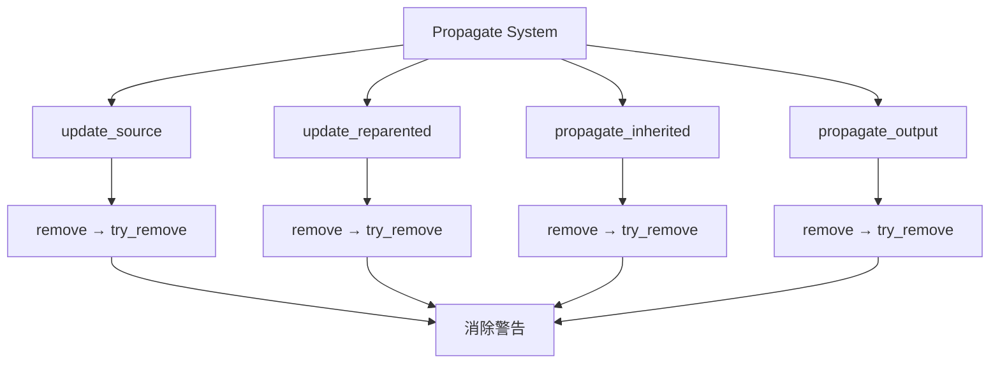

+++
title = "#22084 :bug: Fixes Warning regression in Propagate"
date = "2025-12-10T00:00:00"
draft = false
template = "pull_request_page.html"
in_search_index = false

[extra]
current_language = "zh-cn"
available_languages = {"en" = { name = "English", url = "/pull_request/bevy/2025-12/pr-22084-en-20251210" }, "zh-cn" = { name = "中文", url = "/pull_request/bevy/2025-12/pr-22084-zh-cn-20251210" }}
labels = ["A-ECS", "C-Usability"]
+++

# Title
:bug: Fixes Warning regression in Propagate

## Basic Information
- **Title**: :bug: Fixes Warning regression in Propagate
- **PR Link**: https://github.com/bevyengine/bevy/pull/22084
- **Author**: ekwoka
- **Status**: MERGED
- **Labels**: A-ECS, C-Usability, S-Ready-For-Final-Review
- **Created**: 2025-12-10T13:12:28Z
- **Merged**: 2025-12-10T20:11:24Z
- **Merged By**: alice-i-cecile

## Description Translation
**目标**

解决 #22067

这只是一个警告，但没有必要为内部操作发出警告。

看起来在所有地方用 `try_remove` 替换 `remove` 是安全的。

## The Story of This Pull Request

这个PR的核心是一个简单的修复，但它揭示了在处理ECS（Entity Component System）命令时需要更精确的API使用方式。问题出现在组件传播系统的内部逻辑中，当代码尝试移除一个可能不存在的组件时，会产生不必要的警告。

在Bevy的ECS架构中，组件传播系统负责处理组件之间的继承和传播关系。具体来说，当父实体拥有某个组件时，子实体可能会自动继承这个组件；当父实体移除该组件时，子实体也应该相应地移除继承的组件。这个逻辑在多个函数中实现，包括`update_source`、`update_reparented`、`propagate_inherited`和`propagate_output`。

问题的根源在于这些函数中使用了`remove`方法来移除组件。`remove`方法有一个特点：如果目标实体没有该组件，它会输出一个警告。虽然这有助于调试，但在内部系统逻辑中，我们经常需要安全地移除可能不存在的组件，而不希望看到警告信息污染日志。

开发者遇到了一个具体的回归问题（#22067），其中组件传播系统产生了不必要的警告。经过分析，发现最简单的解决方案是将所有相关的`remove`调用替换为`try_remove`。`try_remove`方法在组件不存在时会静默地返回`None`，而不是发出警告。

这个变化在技术上是安全的，因为：
1. 这些函数中的逻辑本来就是条件性的：它们只在组件应该被移除时才调用移除操作
2. 如果组件不存在，移除操作本质上就是无操作，不会影响系统状态
3. 使用`try_remove`避免了不必要的警告，使日志更加清晰，便于调试真正的问题

从实现角度看，这个PR只修改了一个文件（`crates/bevy_app/src/propagate.rs`），在五个位置将`remove`替换为`try_remove`。这是一个最小化的修复，专注于解决具体问题而不引入不必要的复杂性。

这种修复方式展示了API设计的微妙之处：当同一个操作有多个变体时，选择正确的变体对于保持代码的整洁和可维护性至关重要。`remove`和`try_remove`的行为差异虽然微小，但在特定上下文中会产生不同的影响。

## Visual Representation



## Key Files Changed

### `crates/bevy_app/src/propagate.rs` (+5/-5)

这个文件包含了组件传播系统的核心逻辑。所有更改都是将`remove`方法替换为`try_remove`方法，以避免在不必要的情况下产生警告。

**关键修改：**

1. **`update_source` 函数**：
```rust
// 修改前：
commands.remove::<Inherited<C>>();

// 修改后：
commands.try_remove::<Inherited<C>>();
```

2. **`update_reparented` 函数**：
```rust
// 修改前：
commands.entity(entity).remove::<Inherited<C>>();

// 修改后：
commands.entity(entity).try_remove::<Inherited<C>>();
```

3. **`propagate_inherited` 函数**：
```rust
// 修改前：
commands.entity(entity).remove::<Inherited<C>>();

// 修改后：
commands.entity(entity).try_remove::<Inherited<C>>();
```

4. **`propagate_output` 函数**：
```rust
// 修改前：
commands.entity(removed).remove::<C>();

// 修改后：
commands.entity(removed).try_remove::<C>();
```

这些修改确保了当组件不存在时，移除操作会静默失败，而不是产生警告。这种处理方式对于内部系统逻辑更为合适，因为这些情况是预期的行为而非错误。

## Further Reading

1. **Bevy ECS 命令系统**：了解Bevy中如何通过命令队列对ECS进行修改
   - [Bevy Cheatbook: Commands](https://bevy-cheatbook.github.io/programming/commands.html)
   
2. **组件传播系统**：深入理解Bevy中的组件继承和传播机制
   - [Bevy源码：propagate.rs](https://github.com/bevyengine/bevy/blob/main/crates/bevy_app/src/propagate.rs)

3. **错误处理与静默失败模式**：了解何时适合使用静默失败而非显式错误处理
   - [Rust设计模式：错误处理](https://rust-unofficial.github.io/patterns/patterns/error-handling.html)

# Full Code Diff
```diff
diff --git a/crates/bevy_app/src/propagate.rs b/crates/bevy_app/src/propagate.rs
index ecdfa74b9dfda..06d445aa75e1e 100644
--- a/crates/bevy_app/src/propagate.rs
+++ b/crates/bevy_app/src/propagate.rs
@@ -176,7 +176,7 @@ pub fn update_source<C: Component + Clone + PartialEq, F: QueryFilter, R: Relati
             {
                 commands.insert(inherited.clone());
             } else {
-                commands.remove::<Inherited<C>>();
+                commands.try_remove::<Inherited<C>>();
             }
         }
     }
@@ -193,12 +193,12 @@ pub fn update_reparented<C: Component + Clone + PartialEq, F: QueryFilter, R: Re
         if let Ok(inherited) = relations.get(relation.get()) {
             commands.entity(entity).try_insert(inherited.clone());
         } else if maybe_inherited.is_some() {
-            commands.entity(entity).remove::<Inherited<C>>();
+            commands.entity(entity).try_remove::<Inherited<C>>();
         }
     }
 
     for orphan in &orphaned {
-        commands.entity(orphan).remove::<Inherited<C>>();
+        commands.entity(orphan).try_remove::<Inherited<C>>();
     }
 }
 
@@ -279,7 +279,7 @@ pub fn propagate_inherited<C: Component + Clone + PartialEq, F: QueryFilter, R:
         if let Some(inherited) = maybe_inherited {
             commands.entity(entity).try_insert(inherited);
         } else {
-            commands.entity(entity).remove::<Inherited<C>>();
+            commands.entity(entity).try_remove::<Inherited<C>>();
         }
     }
 }
@@ -304,7 +304,7 @@ pub fn propagate_output<C: Component + Clone + PartialEq, F: QueryFilter>(
 
     for removed in removed.read() {
         if skip.get(removed).is_err() {
-            commands.entity(removed).remove::<C>();
+            commands.entity(removed).try_remove::<C>();
         }
     }
 }
```