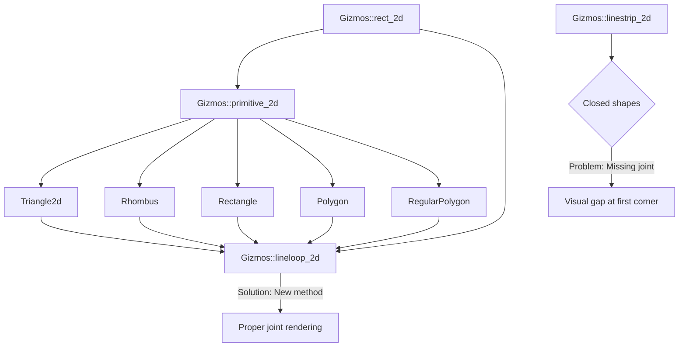

+++
title = "#22085 Make Gizmos::rect_2d and primitive_2d draw the joint of the first corner of closed shapes"
date = "2025-12-11T00:00:00"
draft = false
template = "pull_request_page.html"
in_search_index = true

[taxonomies]
list_display = ["show"]

[extra]
current_language = "en"
available_languages = {"en" = { name = "English", url = "/pull_request/bevy/2025-12/pr-22085-en-20251211" }, "zh-cn" = { name = "中文", url = "/pull_request/bevy/2025-12/pr-22085-zh-cn-20251211" }}
labels = ["C-Bug", "A-Gizmos", "D-Straightforward"]
+++

# Make Gizmos::rect_2d and primitive_2d draw the joint of the first corner of closed shapes

## Basic Information
- **Title**: Make Gizmos::rect_2d and primitive_2d draw the joint of the first corner of closed shapes
- **PR Link**: https://github.com/bevyengine/bevy/pull/22085
- **Author**: uckelman
- **Status**: MERGED
- **Labels**: C-Bug, S-Ready-For-Final-Review, A-Gizmos, D-Straightforward
- **Created**: 2025-12-10T20:58:34Z
- **Merged**: 2025-12-11T01:46:51Z
- **Merged By**: alice-i-cecile

## Description Translation
Make `Gizmos::rect_2d` and `primitive_2d` draw the joint of the first corner of closed shapes

# Objective

- `Gizmos::rect_2d` and `primitive_2d` do not draw the line joint between the first and last segments. This looks odd when the line joint is not `GizmoLineJoint::None`. (This affects `Triangle2d`, `Rhombus`, `Rectangle`, `Polygon`, and `RegularPolygon`.)
- Fixes #22081.

## Solution

- `Gizmos::rect_2d` and `primitive_2d` draw using `Gizmos::linestrip_2d`, which doesn't draw a closed shape. 
-  In order to make `linestrip_2d` to draw a joint at a corner, that corner has to be in the points list with a predecessor and a successor.
-  There is no predecessor for the first element in the list, and no successor when it is repeated as the last.
-  Appending the second point to the list is enough to put the first point between two other points, which causes the joint to be rendered.
- I added a `Gizmos::lineloop_2d` function which handles the final joint for all closed shapes.
- Draw closed shapes with the `lineloop_2d` function, rather than manually adding closing vertices in each case.

## Testing

- I tested my change against this demo:

```
use bevy::prelude::*;

fn main() {
    App::new()
        .add_plugins(DefaultPlugins)
        .add_systems(Startup, setup)
        .add_systems(Update, draw_shapes)
        .run();
}

fn setup(
    mut config_store: ResMut<GizmoConfigStore>,
    mut commands: Commands
)
{
    let (config, _) = config_store.config_mut::<DefaultGizmoConfigGroup>();
    config.line.width = 10.0;
    config.line.joints = GizmoLineJoint::Miter;

    commands.spawn(Camera2d);
}

fn draw_shapes(mut gizmos: Gizmos) {
    gizmos.rect_2d(
        Vec2::new(-200.0, 0.0),
        Vec2::new(50.0, 50.0),
        Color::srgb_u8(0xFF, 0, 0)
    );

    gizmos.primitive_2d(
        &Rhombus { half_diagonals: Vec2::new(20.0, 35.0) },
        Vec2::new(-100.0, 0.0),
        Color::srgb_u8(0xFF, 0, 0)
    );

    gizmos.primitive_2d(
        &Triangle2d { vertices: [Vec2::ZERO, Vec2::new(50.0, 0.), Vec2::new(0.0, 60.0) ] },
        Vec2::new(-20.0, -30.0),
        Color::srgb_u8(0xFF, 0, 0)
    );

    gizmos.primitive_2d(
        &Rectangle { half_size: Vec2::new(25.0, 25.0) },
        Vec2::new(100.0, 0.0),
        Color::srgb_u8(0xFF, 0, 0)
    );

     gizmos.primitive_2d(
        &RegularPolygon { sides: 5, circumcircle: Circle::new(40.0) },
        Vec2::new(200.0, 0.0),
        Color::srgb_u8(0xFF, 0, 0)
    );

    gizmos.primitive_2d(
        &Polygon { vertices: vec![Vec2::ZERO, Vec2::new(90.0, 0.), Vec2::new(75.0, 60.0), Vec2::new(15.0, 60.0) ] },
        Vec2::new(275.0, -30.0),
        Color::srgb_u8(0xFF, 0, 0)
    );
}
```

---

## Showcase

Before:


After:


## The Story of This Pull Request

This PR addresses a visual inconsistency in Bevy's 2D gizmo drawing system. When drawing closed shapes like rectangles, triangles, and polygons with non-default line joints, the joint at the first corner wasn't being rendered, resulting in a visible gap in the shape's outline.

The problem originated from how closed shapes were being drawn. The `rect_2d` and `primitive_2d` methods were using `linestrip_2d` to draw shape outlines. A line strip draws segments between consecutive points but doesn't automatically connect the last point back to the first. To close the shape, implementations were manually adding a duplicate of the first point at the end of the point list.

However, this approach had a subtle issue: line joints are only drawn when a point has both a predecessor and a successor in the point list. When the first point only appears as the last element (as the closing point), it has a predecessor (the actual last point) but no successor. Similarly, when it appears as the first element, it has a successor but no predecessor. This meant the joint at the first corner was never drawn with proper miter or bevel joints.

The solution introduces a new `lineloop_2d` method that handles closed shapes correctly. Instead of just duplicating the first point, this method creates a point sequence that places the first point between two other points in the list. By including the second point again at the end of the sequence, the first point gains both a predecessor (the last unique point) and a successor (the duplicated second point), triggering the joint rendering.

The implementation demonstrates good API design by creating a dedicated method for closed shapes rather than patching each shape individually. This centralizes the logic and ensures consistency across all closed shapes. The method efficiently handles the point sequence using iterator chains without requiring intermediate collections.

All affected shape drawing methods (rectangle, rhombus, triangle, rectangle primitive, polygon, and regular polygon) were updated to use `lineloop_2d` instead of `linestrip_2d`. The polygon implementation also got a cleanup - it previously had special logic to handle potentially duplicated closing points, which became unnecessary with the new approach.

The fix is minimal and focused: it addresses the specific rendering issue without changing the broader gizmo system architecture. The new `lineloop_2d` method follows the existing API patterns and integrates cleanly with the rest of the codebase.

## Visual Representation



## Key Files Changed

1. **`crates/bevy_gizmos/src/gizmos.rs`** (+41/-1)
   - Added new `lineloop_2d` method for drawing closed shapes with proper joints
   - Updated `rect_2d` to use `lineloop_2d` instead of `linestrip_2d`

   Key changes:
   ```rust
   // File: crates/bevy_gizmos/src/gizmos.rs
   // Before (in rect_2d method):
   self.linestrip_2d([tl, tr, br, bl, tl], color);
   
   // After (in rect_2d method):
   self.lineloop_2d([tl, tr, br, bl], color);
   
   // New method added:
   pub fn lineloop_2d(
       &mut self,
       positions: impl IntoIterator<Item = Vec2>,
       color: impl Into<Color>,
   ) {
       if !self.enabled {
           return;
       }
   
       // Loop back to the start; second is needed to ensure that
       // the joint on the first corner is drawn.
       let mut positions = positions.into_iter();
       let first = positions.next();
       let second = positions.next();
   
       self.linestrip(
           first
               .into_iter()
               .chain(second)
               .chain(positions)
               .chain(first)
               .chain(second)
               .map(|vec2| vec2.extend(0.)),
           color,
       );
   }
   ```

2. **`crates/bevy_gizmos/src/primitives/dim2.rs`** (+14/-24)
   - Updated all 2D primitive drawing methods to use `lineloop_2d`
   - Simplified polygon handling by removing special closing-point logic

   Key changes (examples):
   ```rust
   // File: crates/bevy_gizmos/src/primitives/dim2.rs
   // Before (in Triangle2d implementation):
   let positions = [a, b, c, a].map(|vec2| isometry * vec2);
   self.linestrip_2d(positions, color);
   
   // After:
   let positions = [a, b, c].map(|vec2| isometry * vec2);
   self.lineloop_2d(positions, color);
   
   // Before (in Polygon implementation - complex logic):
   let closing_point = {
       let first = primitive.vertices.first();
       (primitive.vertices.last() != first)
           .then_some(first)
           .flatten()
           .cloned()
   };
   self.linestrip_2d(
       primitive
           .vertices
           .iter()
           .copied()
           .chain(closing_point)
           .map(|vec2| isometry * vec2),
       color,
   );
   
   // After (simplified):
   let vertices = if primitive.vertices.first() == primitive.vertices.last() {
       &primitive.vertices[..primitive.vertices.len() - 1]
   } else {
       &primitive.vertices[..]
   };
   self.lineloop_2d(vertices.iter().map(|&vec2| isometry * vec2), color);
   ```

## Further Reading

1. **Bevy Gizmos Documentation**: The official Bevy documentation covers the gizmo system and its various drawing methods
2. **Line Joint Algorithms**: Research on miter, bevel, and round joint algorithms in computer graphics
3. **Iterator Chains in Rust**: Understanding how Rust's iterator methods like `chain()` work for efficient sequence manipulation
4. **2D Geometry Transformations**: Concepts like isometries and coordinate transformations used in the primitive drawing methods
5. **Graphics Pipeline Fundamentals**: How line rendering works in modern graphics pipelines, including segment joining and caps