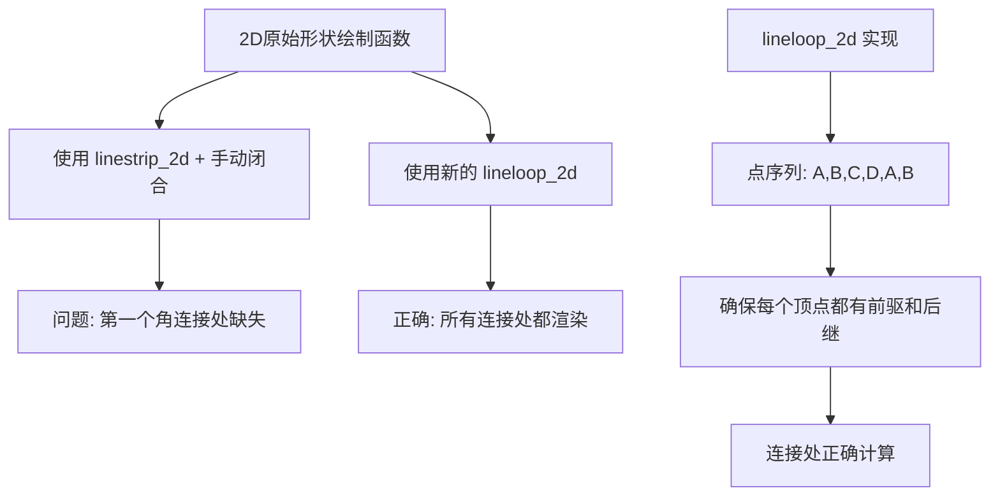

+++
title = "#22085 Make Gizmos::rect_2d and primitive_2d draw the joint of the first corner of closed shapes"
date = "2025-12-11T00:00:00"
draft = false
template = "pull_request_page.html"
in_search_index = false

[extra]
current_language = "zh-cn"
available_languages = {"en" = { name = "English", url = "/pull_request/bevy/2025-12/pr-22085-en-20251211" }, "zh-cn" = { name = "中文", url = "/pull_request/bevy/2025-12/pr-22085-zh-cn-20251211" }}
+++

# 标题

## 基本信息
- **标题**: Make Gizmos::rect_2d and primitive_2d draw the joint of the first corner of closed shapes
- **PR 链接**: https://github.com/bevyengine/bevy/pull/22085
- **作者**: uckelman
- **状态**: 已合并
- **标签**: C-Bug, S-Ready-For-Final-Review, A-Gizmos, D-Straightforward
- **创建时间**: 2025-12-10T20:58:34Z
- **合并时间**: 2025-12-11T01:46:51Z
- **合并者**: alice-i-cecile

## 描述翻译
修复 `Gizmos::rect_2d` 和 `primitive_2d` 绘制封闭形状时第一个角连接处不显示的问题

# 目标

- `Gizmos::rect_2d` 和 `primitive_2d` 不绘制第一个和最后一个线段之间的连接处（joint）。当线条连接方式不是 `GizmoLineJoint::None` 时，这看起来很奇怪。（这影响了 `Triangle2d`、`Rhombus`、`Rectangle`、`Polygon` 和 `RegularPolygon`。）
- 修复 #22081。

## 解决方案

- `Gizmos::rect_2d` 和 `primitive_2d` 使用 `Gizmos::linestrip_2d` 进行绘制，而 `linestrip_2d` 不绘制封闭形状。
- 为了让 `linestrip_2d` 在角落处绘制连接处，该角落必须出现在点列表中，并且有前驱点和后继点。
- 列表中的第一个元素没有前驱点，当它作为最后一个点重复出现时也没有后继点。
- 将第二个点追加到列表末尾就足以让第一个点位于另外两个点之间，从而使连接处被渲染。
- 我添加了一个 `Gizmos::lineloop_2d` 函数，用于处理所有封闭形状的最后一个连接处。
- 使用 `lineloop_2d` 函数绘制封闭形状，而不是在每个情况下手动添加闭合顶点。

## 测试

- 我针对以下演示测试了我的更改：

```
use bevy::prelude::*;

fn main() {
    App::new()
        .add_plugins(DefaultPlugins)
        .add_systems(Startup, setup)
        .add_systems(Update, draw_shapes)
        .run();
}

fn setup(
    mut config_store: ResMut<GizmoConfigStore>,
    mut commands: Commands
)
{
    let (config, _) = config_store.config_mut::<DefaultGizmoConfigGroup>();
    config.line.width = 10.0;
    config.line.joints = GizmoLineJoint::Miter;

    commands.spawn(Camera2d);
}

fn draw_shapes(mut gizmos: Gizmos) {
    gizmos.rect_2d(
        Vec2::new(-200.0, 0.0),
        Vec2::new(50.0, 50.0),
        Color::srgb_u8(0xFF, 0, 0)
    );

    gizmos.primitive_2d(
        &Rhombus { half_diagonals: Vec2::new(20.0, 35.0) },
        Vec2::new(-100.0, 0.0),
        Color::srgb_u8(0xFF, 0, 0)
    );

    gizmos.primitive_2d(
        &Triangle2d { vertices: [Vec2::ZERO, Vec2::new(50.0, 0.), Vec2::new(0.0, 60.0) ] },
        Vec2::new(-20.0, -30.0),
        Color::srgb_u8(0xFF, 0, 0)
    );

    gizmos.primitive_2d(
        &Rectangle { half_size: Vec2::new(25.0, 25.0) },
        Vec2::new(100.0, 0.0),
        Color::srgb_u8(0xFF, 0, 0)
    );

     gizmos.primitive_2d(
        &RegularPolygon { sides: 5, circumcircle: Circle::new(40.0) },
        Vec2::new(200.0, 0.0),
        Color::srgb_u8(0xFF, 0, 0)
    );

    gizmos.primitive_2d(
        &Polygon { vertices: vec![Vec2::ZERO, Vec2::new(90.0, 0.), Vec2::new(75.0, 60.0), Vec2::new(15.0, 60.0) ] },
        Vec2::new(275.0, -30.0),
        Color::srgb_u8(0xFF, 0, 0)
    );
}
```

---

## 展示

修改前：


修改后：


## 本 PR 的技术分析

这个 PR 解决了一个关于 Bevy 中 gizmo（调试绘图工具）绘制 2D 几何形状时的视觉问题。当使用非 `None` 的连接样式（joint style，如 `Miter`）绘制封闭形状时，第一个角的连接处无法正确渲染，导致形状看起来不完整。

问题的根源在于 `linestrip_2d` 函数的实现逻辑。这个函数按顺序绘制点之间的线段，但它主要设计用于绘制开放的折线（polyline），而不是封闭的形状。当用它来绘制封闭形状时，开发人员通常会将第一个点重复添加到列表末尾来"闭合"形状。然而，这种处理方式存在一个细微的问题：连接处的渲染需要每个顶点都同时作为一条线段的终点和下一条线段的起点。对于第一个顶点来说，它虽然是第一条线段的起点，但在绘制时没有明确的前一条线段以它为终点。

PR 的作者 uckelman 仔细分析了这个问题。他们发现，要让第一个角的连接处被渲染，必须确保该顶点在点列表中出现在两个其他顶点之间。具体来说，如果点列表是 `[A, B, C, D, A]`，那么顶点 A 只作为 `D->A` 线段的终点和 `A->B` 线段的起点。但是 `linestrip_2d` 的内部实现可能没有将第一个 A 视为一个"中间"顶点来处理连接处的计算。

解决方案很巧妙：添加一个新的 `lineloop_2d` 函数专门处理封闭形状。这个函数不仅重复第一个点，还重复第二个点，创建点列表 `[A, B, C, D, A, B]`。这样做的结果是：
- 第一个 A 是 `D->A` 线段的终点和 `A->B` 线段的起点
- 最后一个 B 是 `A->B` 线段的终点
- 形状被正确闭合，且第一个角的连接处可以被计算和渲染

这种实现方式确保了所有顶点都有正确的前驱和后继关系，使得连接处渲染算法能够正确处理每个角落。

从架构角度看，这个 PR 引入了适当的抽象层级。之前，每个 2D 原始形状的绘制函数都自己处理闭合逻辑，通过手动添加第一个点来闭合形状。现在，这些函数都委托给 `lineloop_2d`，后者封装了正确的闭合和连接处渲染逻辑。这遵循了 DRY（不要重复自己）原则，也使得未来的维护更加容易。

值得注意的是，对于 `Polygon` 类型的处理。原来的代码已经考虑了多边形可能已经包含闭合点的情况（即第一个点和最后一个点相同）。新的实现保留了这一检查，但简化了逻辑：如果存在闭合点，就去掉它，然后使用 `lineloop_2d` 绘制。

这个修复虽然看起来是视觉上的小改进，但它体现了良好的 API 设计原则。通过添加专门的 `lineloop_2d` 函数，代码库现在有了更明确的意图表达：当你想要绘制一个封闭的线环时，就使用这个函数，而不是用 `linestrip_2d` 并手动处理闭合。

从工程实践的角度看，这个 PR 也展示了良好的测试方法。作者提供了完整的演示代码来重现问题并验证修复效果。通过设置较粗的线宽和使用 `Miter` 连接样式，连接处缺失的问题变得非常明显，修复后的对比也很清晰。

## 视觉表示



## 关键文件变更

### `crates/bevy_gizmos/src/gizmos.rs` (+41/-1)

这个文件的主要变更是添加了 `lineloop_2d` 函数并修改 `rect_2d` 函数使用它。

```rust
// 添加的新函数
pub fn lineloop_2d(
    &mut self,
    positions: impl IntoIterator<Item = Vec2>,
    color: impl Into<Color>,
) {
    if !self.enabled {
        return;
    }

    // 循环回到起点；需要第二个点来确保第一个角的连接处被绘制
    let mut positions = positions.into_iter();
    let first = positions.next();
    let second = positions.next();

    self.linestrip(
        first
            .into_iter()
            .chain(second)
            .chain(positions)
            .chain(first)
            .chain(second)
            .map(|vec2| vec2.extend(0.)),
        color,
    );
}

// rect_2d 函数的修改
pub fn rect_2d(&mut self, position: Vec2, size: Vec2, color: impl Into<Color>) {
    // ... 省略部分代码 ...
    let [tl, tr, br, bl] = rect_inner(size).map(|vec2| isometry * vec2);
    // 之前: self.linestrip_2d([tl, tr, br, bl, tl], color);
    self.lineloop_2d([tl, tr, br, bl], color); // 现在使用 lineloop_2d
}
```

### `crates/bevy_gizmos/src/primitives/dim2.rs` (+14/-24)

这个文件修改了多个 2D 原始形状的绘制函数，统一使用 `lineloop_2d` 代替 `linestrip_2d`。

```rust
// Rhombus 的修改示例
// 之前:
let positions = [a, b, c, d, a].map(|vec2| isometry * vec2);
self.linestrip_2d(positions, color);
// 之后:
let positions = [a, b, c, d].map(|vec2| isometry * vec2);
self.lineloop_2d(positions, color);

// Polygon 的修改示例（更复杂，因为需要处理可能已有的闭合点）
// 之前:
let closing_point = {
    let first = primitive.vertices.first();
    (primitive.vertices.last() != first)
        .then_some(first)
        .flatten()
        .cloned()
};

self.linestrip_2d(
    primitive
        .vertices
        .iter()
        .copied()
        .chain(closing_point)
        .map(|vec2| isometry * vec2),
    color,
);
// 之后:
let vertices = if primitive.vertices.first() == primitive.vertices.last() {
    // 如果已经有闭合点，去掉它
    &primitive.vertices[..primitive.vertices.len() - 1]
} else {
    &primitive.vertices[..]
};

self.lineloop_2d(vertices.iter().map(|&vec2| isometry * vec2), color);

// RegularPolygon 的修改示例
// 之前:
let points = (0..=primitive.sides)  // 注意这里包含结束值
    .map(|n| single_circle_coordinate(primitive.circumcircle.radius, primitive.sides, n))
    .map(|vec2| isometry * vec2);
self.linestrip_2d(points, color);
// 之后:
let points = (0..primitive.sides)  // 现在不包含结束值
    .map(|n| single_circle_coordinate(primitive.circumcircle.radius, primitive.sides, n))
    .map(|vec2| isometry * vec2);
self.lineloop_2d(points, color);
```

## 进一步阅读

1. **Bevy Gizmos 文档**: https://docs.rs/bevy_gizmos/latest/bevy_gizmos/
2. **2D 图形中的线连接样式**: 了解不同连接样式（Miter、Bevel、Round）的实现和视觉效果
3. **计算机图形学中的折线和多边形渲染**: 学习顶点处理、线段生成和连接处计算的基础算法
4. **API 设计原则**: 特别关注何时创建新函数而不是修改现有函数，以及如何设计清晰的抽象边界