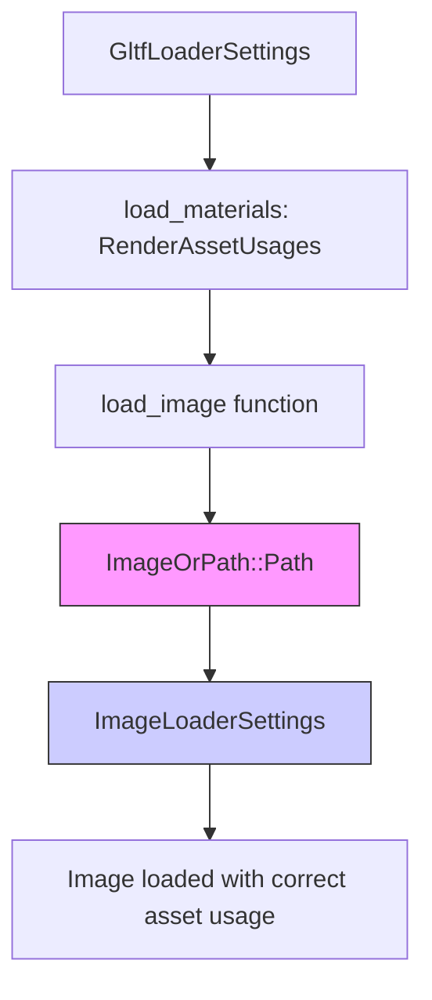

+++
title = "#22086 fix gltf path texture usages"
date = "2025-12-11T00:00:00"
draft = false
template = "pull_request_page.html"
in_search_index = true

[taxonomies]
list_display = ["show"]

[extra]
current_language = "en"
available_languages = {"en" = { name = "English", url = "/pull_request/bevy/2025-12/pr-22086-en-20251211" }, "zh-cn" = { name = "中文", url = "/pull_request/bevy/2025-12/pr-22086-zh-cn-20251211" }}
labels = ["C-Bug", "D-Trivial", "A-glTF"]
+++

# Title

## Basic Information
- **Title**: fix gltf path texture usages
- **PR Link**: https://github.com/bevyengine/bevy/pull/22086
- **Author**: robtfm
- **Status**: MERGED
- **Labels**: C-Bug, D-Trivial, S-Ready-For-Final-Review, A-glTF
- **Created**: 2025-12-11T00:05:56Z
- **Merged**: 2025-12-11T00:53:18Z
- **Merged By**: alice-i-cecile

## Description Translation
# Objective

the asset usages from `GltfLoaderSettings::load_materials` are not respected when loading path-based / non-embedded textures.

## Solution

use them

## The Story of This Pull Request

The PR addresses a specific bug in Bevy's glTF loader where asset usage settings were not being properly applied to path-based textures. When loading glTF files with external texture references (textures stored in separate files rather than embedded in the glTF binary), the loader was ignoring the `RenderAssetUsages` configuration specified in `GltfLoaderSettings::load_materials`. This meant that path-based textures would default to standard asset usage patterns regardless of user configuration, while embedded textures correctly respected the settings.

The core issue was in the data flow through the texture loading pipeline. The glTF loader handles two types of textures differently: embedded textures (stored within the glTF file) and path-based textures (referenced by external file paths). For embedded textures, the asset usage settings were correctly passed through, but for path-based textures, this configuration was being dropped during the image loading process.

The fix involved modifying the `ImageOrPath` enum to include a `render_asset_usages` field in its `Path` variant. Previously, when creating an `ImageOrPath::Path` instance to represent an external texture file, only the path, srgb setting, and sampler descriptor were included. The asset usage setting from `GltfLoaderSettings::load_materials` was missing.

The change was straightforward but important: when the `ImageOrPath::load` method processes a `Path` variant, it now passes the `render_asset_usages` value to the `ImageLoaderSettings` via a closure that configures the loader. This ensures that external texture files receive the same asset usage configuration as embedded textures.

From an engineering perspective, this fix maintains consistency across different texture loading paths. The `GltfLoaderSettings::load_materials` setting controls whether materials (and their textures) should be marked for CPU access, GPU-only usage, or other combinations. This is particularly important for optimization - for example, textures that don't need CPU access can be stored in more efficient GPU memory formats.

The implementation is minimal and surgical, changing only what's necessary to fix the bug without refactoring the surrounding code. The diff shows exactly four lines added: one to store the setting when creating the `ImageOrPath::Path`, and three to consume it when loading the image. This approach minimizes the risk of introducing new bugs while ensuring the existing configuration system works as intended across all texture loading scenarios.

## Visual Representation



## Key Files Changed

**crates/bevy_gltf/src/loader/mod.rs** (+4/-0)

This was the only file modified in the PR. The changes ensure that the `render_asset_usages` setting from `GltfLoaderSettings::load_materials` is properly passed through to path-based texture loading.

**Key changes:**

1. **When creating ImageOrPath::Path in load_image function**:
```rust
// In load_image function
ImageOrPath::Path {
    path: image_path,
    is_srgb,
    sampler_descriptor,
    render_asset_usages: settings.load_materials, // ← Added this line
}
```

2. **Updated ImageOrPath enum definition**:
```rust
enum ImageOrPath {
    // ... other variants ...
    Path {
        path: AssetPath<'static>,
        is_srgb: bool,
        sampler_descriptor: ImageSamplerDescriptor,
        render_asset_usages: RenderAssetUsages, // ← Added this field
    },
}
```

3. **When loading the image from ImageOrPath::Path**:
```rust
impl ImageOrPath {
    pub fn load(&self, load_context: &LoadContext) -> UntypedHandle {
        match self {
            // ... other variants ...
            ImageOrPath::Path {
                path,
                is_srgb,
                sampler_descriptor,
                render_asset_usages, // ← Now available here
            } => load_context
                .loader()
                .with_settings(move |settings: &mut ImageLoaderSettings| {
                    settings.is_srgb = is_srgb;
                    settings.sampler = ImageSampler::Descriptor(sampler_descriptor.clone());
                    settings.asset_usage = render_asset_usages; // ← Passed to loader
                })
                .load(path),
        }
    }
}
```

The changes ensure that when loading path-based textures, the asset usage settings from the glTF loader configuration are properly forwarded to the image loader, maintaining consistency with how embedded textures are handled.

## Further Reading

- [Bevy Asset System Documentation](https://docs.rs/bevy/latest/bevy/asset/index.html) - Understanding how assets are loaded and managed in Bevy
- [glTF Specification](https://www.khronos.org/gltf/) - Official glTF file format specification
- [Bevy Render Asset Usages](https://docs.rs/bevy/latest/bevy/render/render_resource/enum.RenderAssetUsages.html) - Documentation on different render asset usage patterns
- [Image Loading in Bevy](https://docs.rs/bevy/latest/bevy/render/texture/struct.ImageLoader.html) - How images are loaded with different settings