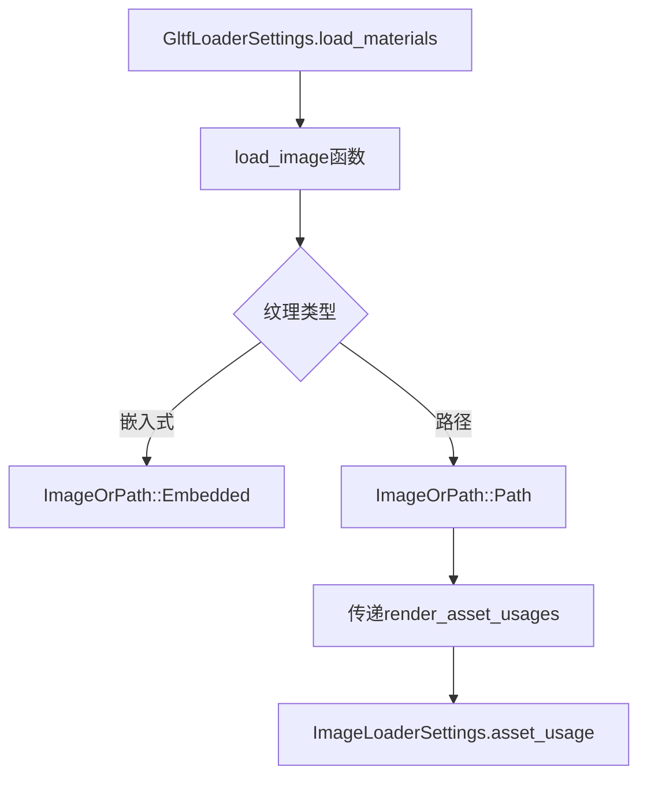

+++
title = "#22086 fix gltf path texture usages"
date = "2025-12-11T00:00:00"
draft = false
template = "pull_request_page.html"
in_search_index = false

[extra]
current_language = "zh-cn"
available_languages = {"en" = { name = "English", url = "/pull_request/bevy/2025-12/pr-22086-en-20251211" }, "zh-cn" = { name = "中文", url = "/pull_request/bevy/2025-12/pr-22086-zh-cn-20251211" }}
labels = ["C-Bug", "D-Trivial", "A-glTF"]
+++

# Title
fix gltf path texture usages

## Basic Information
- **Title**: fix gltf path texture usages
- **PR Link**: https://github.com/bevyengine/bevy/pull/22086
- **Author**: robtfm
- **Status**: MERGED
- **Labels**: C-Bug, D-Trivial, S-Ready-For-Final-Review, A-glTF
- **Created**: 2025-12-11T00:05:56Z
- **Merged**: 2025-12-11T00:53:18Z
- **Merged By**: alice-i-cecile

## Description Translation
修复了在使用路径纹理（非嵌入式纹理）时，`GltfLoaderSettings::load_materials` 中设置的资产用途（asset usages）未被遵守的问题。

## The Story of This Pull Request

这个Pull Request修复了一个在使用glTF加载器时的配置传递问题。在Bevy引擎中，glTF加载器允许通过`GltfLoaderSettings`配置材质加载行为，其中包括设置`load_materials`字段来指定纹理的渲染资产用途（RenderAssetUsages）。这个配置决定了加载的纹理资产将如何被使用，例如是否用于CPU侧访问或仅用于GPU渲染。

问题出现在加载非嵌入式纹理（即引用外部文件的纹理）时。代码中有两种加载纹理的方式：一种处理嵌入式纹理（数据直接包含在glTF文件中），另一种处理路径纹理（通过文件路径引用）。在路径纹理的加载路径中，代码没有将`GltfLoaderSettings::load_materials`配置传递给底层的图像加载器。

具体来说，在`crates/bevy_gltf/src/loader/mod.rs`文件的`load_image`函数中，当处理`ImageOrPath::Path`情况时，创建了`ImageOrPath`枚举的`Path`变体，但漏传了`render_asset_usages`参数。这导致后续在`ImageOrPath::load`方法中，无法将正确的资产用途设置传递给`ImageLoaderSettings`。

问题的技术本质是配置传递链路的中断。`GltfLoaderSettings::load_materials`字段的类型是`RenderAssetUsages`，它控制着资产的生命周期和可用性。当这个配置没有正确传递时，路径纹理会使用图像加载器的默认资产用途，而不是用户通过glTF加载器设置指定的用途。

修复方案直接明了：在创建`ImageOrPath::Path`时添加`render_asset_usages`参数，并在后续加载过程中将其设置到`ImageLoaderSettings`的`asset_usage`字段。这个改动只有4行代码的添加（+4/-0），但确保了配置的一致性。

从架构角度看，这个修复维护了配置的传递完整性。glTF加载器作为一个高层抽象，应该将用户的配置意图正确传递到底层加载组件。资产用途的设置对内存管理和性能有实际影响，例如，如果纹理不需要CPU访问，可以节省内存并避免不必要的数据传输。

这个bug属于配置传播不完整的问题，在涉及多层抽象和委托的系统中较为常见。修复确保了无论纹理来源（嵌入式或外部文件），都能获得一致的行为，符合用户通过`GltfLoaderSettings`表达的预期。

## Visual Representation



## Key Files Changed

### `crates/bevy_gltf/src/loader/mod.rs`

这个文件包含了glTF加载器的核心实现。修改涉及两个部分：在`load_image`函数中添加参数传递，以及在`ImageOrPath`枚举和其`load`方法中添加相应处理。

**关键修改：**

1. 在`load_image`函数中，创建`ImageOrPath::Path`时添加`render_asset_usages`参数：

```rust
// 修改后：
ImageOrPath::Path {
    path: image_path,
    is_srgb,
    sampler_descriptor,
    render_asset_usages: settings.load_materials,  // 新增
}
```

2. 更新`ImageOrPath`枚举的`Path`变体定义，添加`render_asset_usages`字段：

```rust
// 修改后：
enum ImageOrPath {
    // ... 其他变体
    Path {
        path: AssetPath<'static>,
        is_srgb: bool,
        sampler_descriptor: ImageSamplerDescriptor,
        render_asset_usages: RenderAssetUsages,  // 新增
    },
}
```

3. 在`ImageOrPath::load`方法的模式匹配中，解构出`render_asset_usages`字段：

```rust
// 修改后：
ImageOrPath::Path {
    path,
    is_srgb,
    sampler_descriptor,
    render_asset_usages,  // 新增
} => // ... 后续代码
```

4. 在加载器设置中配置`asset_usage`：

```rust
// 修改后：
load_context
    .loader()
    .with_settings(move |settings: &mut ImageLoaderSettings| {
        settings.is_srgb = is_srgb;
        settings.sampler = ImageSampler::Descriptor(sampler_descriptor.clone());
        settings.asset_usage = render_asset_usages;  // 新增
    })
    .load(path)
```

这些修改确保了从`GltfLoaderSettings`到`ImageLoaderSettings`的配置完整传递，解决了路径纹理资产用途不正确的问题。

## Further Reading

1. [Bevy 资产系统文档](https://docs.rs/bevy/latest/bevy/asset/index.html) - 了解Bevy的资产加载和管理机制
2. [glTF 2.0 规范](https://www.khronos.org/gltf/) - 了解glTF格式的纹理嵌入和外部引用机制
3. [RenderAssetUsages 枚举文档](https://docs.rs/bevy/latest/bevy/render/render_resource/enum.RenderAssetUsages.html) - 理解不同的渲染资产用途及其影响

# Full Code Diff
diff --git a/crates/bevy_gltf/src/loader/mod.rs b/crates/bevy_gltf/src/loader/mod.rs
index 7c6c0eaa56ca9..73df951299f1b 100644
--- a/crates/bevy_gltf/src/loader/mod.rs
+++ b/crates/bevy_gltf/src/loader/mod.rs
@@ -1137,6 +1137,7 @@ async fn load_image<'a, 'b>(
                     path: image_path,
                     is_srgb,
                     sampler_descriptor,
+                    render_asset_usages: settings.load_materials,
                 })
             }
         }
@@ -1811,6 +1812,7 @@ enum ImageOrPath {
         path: AssetPath<'static>,
         is_srgb: bool,
         sampler_descriptor: ImageSamplerDescriptor,
+        render_asset_usages: RenderAssetUsages,
     },
 }
 
@@ -1833,11 +1835,13 @@ impl ImageOrPath {
                 path,
                 is_srgb,
                 sampler_descriptor,
+                render_asset_usages,
             } => load_context
                 .loader()
                 .with_settings(move |settings: &mut ImageLoaderSettings| {
                     settings.is_srgb = is_srgb;
                     settings.sampler = ImageSampler::Descriptor(sampler_descriptor.clone());
+                    settings.asset_usage = render_asset_usages;
                 })
                 .load(path),
         };