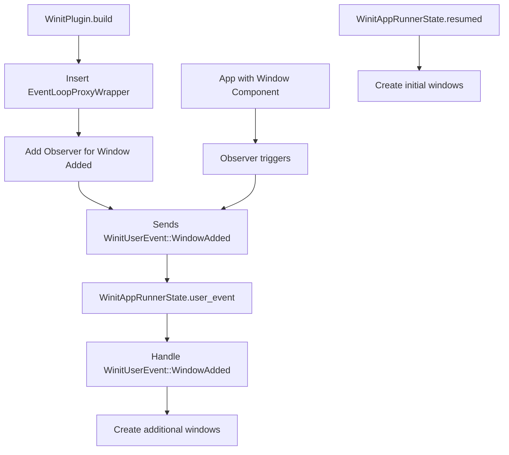

+++
title = "#22088 Refactor window creation logic"
date = "2025-12-16T00:00:00"
draft = false
template = "pull_request_page.html"
in_search_index = true

[taxonomies]
list_display = ["show"]

[extra]
current_language = "en"
available_languages = {"en" = { name = "English", url = "/pull_request/bevy/2025-12/pr-22088-en-20251216" }, "zh-cn" = { name = "中文", url = "/pull_request/bevy/2025-12/pr-22088-zh-cn-20251216" }}
labels = ["C-Bug", "A-Windowing", "D-Modest"]
+++

# Title: Refactor window creation logic

## Basic Information
- **Title**: Refactor window creation logic
- **PR Link**: https://github.com/bevyengine/bevy/pull/22088
- **Author**: kristoff3r
- **Status**: MERGED
- **Labels**: C-Bug, A-Windowing, D-Modest, S-Needs-Review
- **Created**: 2025-12-11T10:17:09Z
- **Merged**: 2025-12-16T04:00:33Z
- **Merged By**: alice-i-cecile

## Description Translation

# Objective

Fixes #21948

Currently we tell winit to spawn any new `Window`s during the `about_to_wait` lifecycle method, but that's unreliable: if no new events appear while we're already waiting it could take an arbitrarily long time, or no new events could appear at all so we never spawn the window. This is especially bad when going from 0 to 1 `Window`s, as many events are related to the existing window. 

## Solution

Check for new windows in `resumed` for the initial window (which is also what winit examples do) and in `user_event` for new windows.

I also did some other improvements while I was investigating this:
* Inlined  the `Added<Window>` query filter into `CreateWindowParams`, as the logic didn't make sense with any other filter.
* Insert the `EventLoopProxyWrapper` resource when the plugin builds instead of inside the `winit_runner`. This currently makes no practical difference, but in another version of this PR I had a crash because the observer tried to use the resource before the runner started. It's also a more natural way to do it.
* Made `WinitPlugin` no longer generic, and removed the `custom_user_event` example. The functionality it provides (being able to send events into bevy from the outside) only works in one direction, and I don't see why it needs to go via winit instead of a dedicated plugin with channels. ~~If this feature is useful for reasons I've missed then I'm happy to re-add it.~~ edit: winit is removing custom user events in 0.31, which made me even more confident it's the right direction for us too.

## Testing

Run different examples and see that the window spawns in a timely fashion, edit the `multiple_windows` example as in #21948 and see that the window spawns.

## The Story of This Pull Request

The core issue this PR addresses is a timing problem in window creation within the Bevy engine. Previously, Bevy relied on winit's `about_to_wait` lifecycle method to create new windows. This approach had a fundamental flaw: if no new events were arriving while the event loop was waiting, window creation could be delayed indefinitely. This was particularly problematic when creating the first window, as many system events depend on an existing window being present.

The developer recognized that this was an unreliable mechanism. The solution was to reorganize when and how windows are created. For the initial window, the code now creates it during the `resumed` event, which matches winit's own examples and ensures immediate creation when the application starts. For additional windows created after startup, the implementation uses a new event-based approach where an observer detects when a `Window` component is added and triggers creation via a winit user event.

While investigating the window creation issue, the developer made several related improvements. The `Added<Window>` query filter was inlined into `CreateWindowParams` since it didn't make sense with any other filter. The `EventLoopProxyWrapper` resource insertion was moved from the `winit_runner` function to the plugin's `build` method, which is more logical and prevents potential timing issues where observers might try to use the resource before it exists.

The most significant architectural change was removing the generic parameter from `WinitPlugin`. Previously, users could define custom user events that would be passed through winit into Bevy's ECS. However, this feature had limitations—it only worked in one direction (external → Bevy) and winit itself was planning to remove custom user events in version 0.31. The developer reasoned that bidirectional communication could be better handled through dedicated channels rather than piggybacking on winit's event system. This simplification made the codebase more straightforward and aligned with winit's future direction.

The implementation required changes across multiple components. The `WinitAppRunnerState` was updated to handle the new `WinitUserEvent` enum with `WakeUp` and `WindowAdded` variants. In the `resumed` method, the state now explicitly creates the initial window. In the `user_event` handler, it processes window creation requests. The observer pattern was used to detect new windows being added to the ECS and trigger the appropriate winit events.

This refactoring makes window creation more reliable and predictable. Windows now appear immediately when expected, rather than potentially waiting for unrelated events. The simplification of the generic types also makes the API cleaner and reduces complexity for both maintainers and users. The changes demonstrate good engineering practice: fixing the immediate bug while also cleaning up related technical debt and aligning with external library roadmaps.

## Visual Representation



## Key Files Changed

### `crates/bevy_winit/src/lib.rs` (+39/-15)
This file saw significant changes to remove the generic parameter from `WinitPlugin` and introduce the new `WinitUserEvent` enum.

**Key changes:**
```rust
// Before:
pub struct WinitPlugin<M: Message = WakeUp> {
    pub run_on_any_thread: bool,
    marker: PhantomData<M>,
}

// After:
pub struct WinitPlugin {
    pub run_on_any_thread: bool,
}

// New enum introduced:
pub enum WinitUserEvent {
    WakeUp,
    WindowAdded,
}
```

The plugin now inserts the `EventLoopProxyWrapper` resource during build and adds an observer for window addition events.

### `crates/bevy_winit/src/state.rs` (+25/-25)
This file contains the main logic changes for window creation timing.

**Key changes in the `ApplicationHandler` implementation:**
```rust
// In the resumed method:
fn resumed(&mut self, event_loop: &ActiveEventLoop) {
    self.lifecycle = AppLifecycle::WillResume;
    
    // Create the initial window if needed
    let mut create_window = SystemState::<CreateWindowParams>::from_world(self.world_mut());
    create_windows(event_loop, create_window.get_mut(self.world_mut()));
    create_window.apply(self.world_mut());
}

// In the user_event method:
fn user_event(&mut self, event_loop: &ActiveEventLoop, event: WinitUserEvent) {
    self.user_event_received = true;

    match event {
        WinitUserEvent::WakeUp => {
            self.redraw_requested = true;
        }
        WinitUserEvent::WindowAdded => {
            let mut create_window =
                SystemState::<CreateWindowParams>::from_world(self.world_mut());
            create_windows(event_loop, create_window.get_mut(self.world_mut()));
            create_window.apply(self.world_mut());
        }
    }
}
```

### `examples/window/custom_user_event.rs` (+0/-113)
This entire example file was removed since the custom user event functionality was deprecated.

### `release-content/migration-guides/winit_user_events_removed.md` (+26/-0)
A new migration guide was added to help users transition from the old generic event system to the new approach.

### `Cargo.toml` (+0/-11)
The custom_user_event example was removed from the example listings.

## Further Reading

1. **Winit Event Loop Documentation**: For understanding the winit event lifecycle methods like `resumed`, `about_to_wait`, and `user_event`.
2. **Bevy ECS Observers**: To learn about the observer pattern used to detect component additions.
3. **Rust Generic Programming**: For understanding why removing the generic parameter simplifies the API.
4. **Winit 0.31 Release Notes**: To understand winit's decision to remove custom user events, which informed this PR's direction.