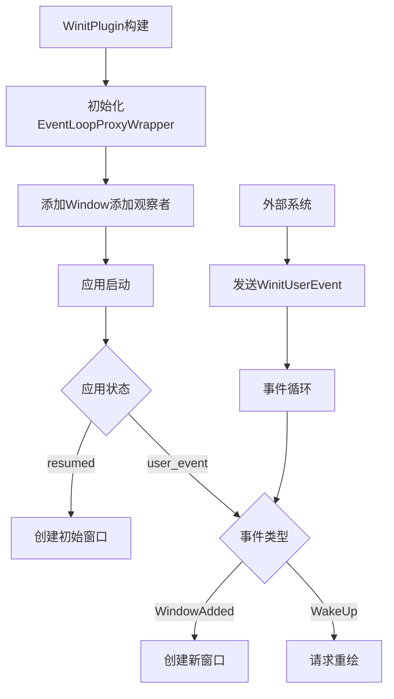

+++
title = "#22088 Refactor window creation logic"
date = "2025-12-16T00:00:00"
draft = false
template = "pull_request_page.html"
in_search_index = false

[extra]
current_language = "zh-cn"
available_languages = {"en" = { name = "English", url = "/pull_request/bevy/2025-12/pr-22088-en-20251216" }, "zh-cn" = { name = "中文", url = "/pull_request/bevy/2025-12/pr-22088-zh-cn-20251216" }}
+++

# Title

## 基本信息
- **标题**: Refactor window creation logic
- **PR链接**: https://github.com/bevyengine/bevy/pull/22088
- **作者**: kristoff3r
- **状态**: 已合并
- **标签**: C-Bug, A-Windowing, D-Modest, S-Needs-Review
- **创建时间**: 2025-12-11T10:17:09Z
- **合并时间**: 2025-12-16T04:00:33Z
- **合并者**: alice-i-cecile

## 描述翻译

### 目标
修复 #21948

目前我们在 `about_to_wait` 生命周期方法中告诉 winit 生成新的 `Window`，但这是不可靠的：如果在我们等待时没有新事件出现，可能需要任意长的时间，或者可能根本没有新事件出现，导致我们永远不会生成窗口。这在从 0 个窗口到 1 个窗口时尤其糟糕，因为许多事件都与现有窗口相关。

### 解决方案
在 `resumed` 中检查初始窗口（这也是 winit 示例的做法），在 `user_event` 中检查新窗口。

我在调查这个问题时还做了一些其他改进：
* 将 `Added<Window>` 查询过滤器内联到 `CreateWindowParams` 中，因为该逻辑与其他过滤器一起使用时没有意义。
* 在插件构建时插入 `EventLoopProxyWrapper` 资源，而不是在 `winit_runner` 内部。目前这在实际使用中没有区别，但在这个 PR 的另一个版本中，由于观察者在运行器启动前尝试使用该资源，导致了崩溃。这也是更自然的做法。
* 使 `WinitPlugin` 不再通用，并移除了 `custom_user_event` 示例。它提供的功能（能够从外部向 bevy 发送事件）仅适用于一个方向，我不明白为什么需要通过 winit 而不是使用通道的专用插件来实现。~~如果这个功能对我遗漏的原因有用，那么我很乐意重新添加它。~~ 编辑：winit 在 0.31 版本中移除了自定义用户事件，这让我更加确信这对我们来说也是正确的方向。

### 测试
运行不同的示例，观察窗口是否及时生成；按照 #21948 中的描述编辑 `multiple_windows` 示例，观察窗口是否生成。

## 这个PR的技术故事

### 问题和背景
这个PR源于一个窗口创建时机的问题（#21948）。在Bevy的窗口管理系统中，当应用启动或需要创建新窗口时，系统依赖于winit事件循环的特定阶段来触发窗口创建。具体来说，窗口创建逻辑被放在了 `about_to_wait` 生命周期方法中。

这种方法存在一个根本性的问题：`about_to_wait` 只有在事件循环即将进入等待状态时才会被调用。如果系统已经处于等待状态，或者没有新事件触发循环，窗口创建可能会被无限期延迟。这种情况在从0个窗口启动应用时尤其明显——由于没有现有窗口，许多与窗口相关的事件（如重绘请求）都不会发生，导致 `about_to_wait` 可能根本不会被调用。

从技术角度来看，这个问题暴露了事件驱动架构中的一个时序问题：窗口创建逻辑与事件循环的特定阶段过度耦合，而没有考虑到初始状态和动态窗口创建的实际需求。

### 解决方案方法
开发者采取了多重策略来解决这个问题：

1. **改变窗口创建触发点**：将初始窗口创建移到 `resumed` 阶段（与winit官方示例保持一致），并将后续窗口创建通过自定义事件触发。
2. **简化类型系统**：移除 `WinitPlugin` 的泛型参数，使用固定的事件类型 `WinitUserEvent`。
3. **资源初始化时机优化**：将 `EventLoopProxyWrapper` 资源的创建提前到插件构建阶段。
4. **查询过滤器内联**：将 `Added<Window>` 查询过滤器硬编码到 `CreateWindowParams` 类型中，因为其他过滤器在这个上下文中没有意义。

这个方案的核心思想是：初始窗口创建应该在应用恢复时立即进行，而后续窗口创建应该通过显式的事件机制触发，而不是依赖事件循环的特定阶段。

### 实现细节
实现涉及多个组件的重构。首先，开发者创建了新的 `WinitUserEvent` 枚举来替代之前的泛型消息类型：

```rust
#[derive(Debug, Clone, Copy, Reflect)]
#[reflect(Debug, Clone)]
pub enum WinitUserEvent {
    /// Dummy event that just wakes up the winit event loop
    WakeUp,
    /// Tell winit that a window needs to be created
    WindowAdded,
}
```

这个枚举提供了两种功能：唤醒事件循环和请求创建新窗口。通过统一的事件类型，简化了类型系统的复杂性。

在 `WinitPlugin` 的构建过程中，现在会添加一个观察者来监听窗口添加事件：

```rust
app.add_observer(
    |_window: On<Add, Window>, event_loop_proxy: Res<EventLoopProxyWrapper>| -> Result {
        event_loop_proxy.send_event(WinitUserEvent::WindowAdded)?;
        Ok(())
    },
);
```

这个观察者确保每当有新的 `Window` 组件被添加到世界中时，就会发送一个 `WindowAdded` 事件到winit事件循环。

窗口创建逻辑现在分散在两个地方。初始窗口在 `resumed` 回调中创建：

```rust
fn resumed(&mut self, event_loop: &ActiveEventLoop) {
    self.lifecycle = AppLifecycle::WillResume;
    
    // Create the initial window if needed
    let mut create_window = SystemState::<CreateWindowParams>::from_world(self.world_mut());
    create_windows(event_loop, create_window.get_mut(self.world_mut()));
    create_window.apply(self.world_mut());
}
```

后续窗口则在 `user_event` 回调中响应 `WindowAdded` 事件：

```rust
fn user_event(&mut self, event_loop: &ActiveEventLoop, event: WinitUserEvent) {
    self.user_event_received = true;

    match event {
        WinitUserEvent::WakeUp => {
            self.redraw_requested = true;
        }
        WinitUserEvent::WindowAdded => {
            let mut create_window =
                SystemState::<CreateWindowParams>::from_world(self.world_mut());
            create_windows(event_loop, create_window.get_mut(self.world_mut()));
            create_window.apply(self.world_mut());
        }
    }
}
```

同时，从 `about_to_wait` 中移除了窗口创建逻辑，只保留显示器创建逻辑：

```rust
fn about_to_wait(&mut self, event_loop: &ActiveEventLoop) {
    let mut create_monitor = SystemState::<CreateMonitorParams>::from_world(self.world_mut());
    create_monitors(event_loop, create_monitor.get_mut(self.world_mut()));
    create_monitor.apply(self.world_mut());
    // ... 其他逻辑
}
```

### 技术洞察
这个PR展示了几个重要的软件工程原则：

1. **事件驱动的正确时序**：将窗口创建从被动的 `about_to_wait` 阶段移到主动的 `resumed` 和事件响应阶段，确保了窗口创建的及时性。这种改变体现了对事件循环生命周期的更深入理解。

2. **类型系统简化**：通过移除泛型参数，`WinitPlugin` 的API变得更加简单和直观。虽然损失了一定的灵活性，但考虑到winit 0.31也将移除自定义用户事件，这个决定具有前瞻性。

3. **资源生命周期管理**：将 `EventLoopProxyWrapper` 资源的创建提前到插件构建阶段，避免了潜在的竞态条件。这种"尽早初始化"的模式在系统编程中很常见，可以避免复杂的初始化顺序问题。

4. **观察者模式的应用**：使用观察者来监听窗口添加事件，而不是在查询中手动检查，这是一种更声明式和响应式的编程模式。它减少了手动状态管理的复杂性。

### 影响和意义
这些改变带来了几个实际的改进：

1. **解决了窗口创建延迟问题**：应用启动时窗口能够立即创建，而不是等待不确定的事件触发。
2. **代码简化**：移除泛型减少了类型系统的复杂性，使代码更容易理解和维护。
3. **更好的架构分离**：通过统一的事件类型和清晰的触发机制，窗口创建逻辑与事件循环的耦合度降低。

从更广泛的角度看，这个PR展示了如何通过理解底层系统（winit）的行为模式来优化上层框架（Bevy）的设计决策。它强调了在异步事件处理系统中，时序和触发机制的重要性。

## 视觉表示



## 关键文件变更

### `crates/bevy_winit/src/lib.rs` (+39/-15)
这是变化最大的文件之一，主要进行了以下修改：

**移除泛型参数**：
```rust
// 之前:
pub struct WinitPlugin<M: Message = WakeUp> {
    marker: PhantomData<M>,
}

// 之后:
pub struct WinitPlugin {
    // 移除了泛型参数
}
```

**引入统一事件类型**：
```rust
#[derive(Debug, Clone, Copy, Reflect)]
pub enum WinitUserEvent {
    WakeUp,
    WindowAdded,
}
```

**资源初始化提前**：
```rust
// 在build方法中:
app.insert_resource(EventLoopProxyWrapper(event_loop.create_proxy()))
```

**添加窗口创建观察者**：
```rust
app.add_observer(
    |_window: On<Add, Window>, event_loop_proxy: Res<EventLoopProxyWrapper>| -> Result {
        event_loop_proxy.send_event(WinitUserEvent::WindowAdded)?;
        Ok(())
    },
);
```

### `crates/bevy_winit/src/state.rs` (+25/-25)
这个文件包含了事件循环状态管理的主要逻辑：

**窗口创建逻辑重构**：
```rust
// 在resumed方法中创建初始窗口:
fn resumed(&mut self, event_loop: &ActiveEventLoop) {
    self.lifecycle = AppLifecycle::WillResume;
    
    let mut create_window = SystemState::<CreateWindowParams>::from_world(self.world_mut());
    create_windows(event_loop, create_window.get_mut(self.world_mut()));
    create_window.apply(self.world_mut());
}

// 在user_event中处理WindowAdded事件:
fn user_event(&mut self, event_loop: &ActiveEventLoop, event: WinitUserEvent) {
    match event {
        WinitUserEvent::WindowAdded => {
            let mut create_window =
                SystemState::<CreateWindowParams>::from_world(self.world_mut());
            create_windows(event_loop, create_window.get_mut(self.world_mut()));
            create_window.apply(self.world_mut());
        }
        // ...
    }
}

// 从about_to_wait中移除窗口创建:
fn about_to_wait(&mut self, event_loop: &ActiveEventLoop) {
    // 只保留显示器创建逻辑
    let mut create_monitor = SystemState::<CreateMonitorParams>::from_world(self.world_mut());
    create_monitors(event_loop, create_monitor.get_mut(self.world_mut()));
    create_monitor.apply(self.world_mut());
    // 窗口创建逻辑已移除
}
```

### `examples/window/custom_user_event.rs` (+0/-113)
这个示例文件被完全移除，因为相关功能（自定义用户事件）不再被支持。删除的理由是：
1. 该功能只支持单向通信
2. 可以通过专用插件和通道实现相同功能
3. winit 0.31将移除自定义用户事件支持

### `release-content/migration-guides/winit_user_events_removed.md` (+26/-0)
新增的迁移指南，帮助用户从旧版本迁移：

```markdown
---
title: Winit user events removed
pull_requests: [22088]
---

在 Bevy 0.17 及更早版本中，`WinitPlugin` 和 `EventLoopProxyWrapper` 对 `M: Message` 类型是泛型的，可用于唤醒 winit 事件循环，然后转发到 ECS 世界。在 0.18 版本中，对此的支持已被移除，这些类型不再具有泛型。

如果你通过事件循环代理使用默认的 `WakeUp` 类型，仍然可以通过新的 `WinitUserEvent` 类型来实现：

// 0.17
fn wakeup_system(event_loop_proxy: Res<EventLoopProxyWrapper<WakeUp>>) -> Result {
    event_loop_proxy.send_event(WakeUp)?;
    Ok(())
}

// 0.18
fn wakeup_system(event_loop_proxy: Res<EventLoopProxyWrapper>) -> Result {
    event_loop_proxy.send_event(WinitUserEvent::WakeUp)?;
    Ok(())
}
```

如果你使用它从 Bevy 外部向 ECS 世界发送信息，你需要创建自己的通道和转发消息的系统。
```

### `Cargo.toml` (+0/-11)
移除了对 `custom_user_event` 示例的引用。

## 扩展阅读

1. **winit事件循环文档**：了解winit事件循环的生命周期和不同阶段的含义
   - [winit::event_loop::EventLoop](https://docs.rs/winit/latest/winit/event_loop/struct.EventLoop.html)
   - [winit::application::ApplicationHandler](https://docs.rs/winit/latest/winit/application/trait.ApplicationHandler.html)

2. **Bevy观察者模式**：了解Bevy中观察者的工作原理和使用场景
   - [Bevy ECS Observers](https://bevyengine.org/learn/quick-start/ecs/observers/)

3. **事件驱动架构模式**：深入了解事件驱动系统设计原则
   - [Event-driven architecture patterns](https://learn.microsoft.com/en-us/azure/architecture/guide/architecture-styles/event-driven)

4. **winit 0.31变化**：了解winit未来版本中自定义用户事件的移除
   - [winit changelog](https://github.com/rust-windowing/winit/blob/main/CHANGELOG.md)

5. **系统编程中的资源管理**：了解不同资源初始化时机的权衡
   - [Resource Management in Systems Programming](https://rust-unofficial.github.io/patterns/patterns/creational/raii.html)