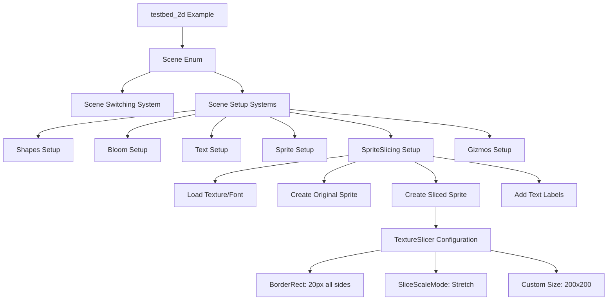

+++
title = "#22089 Add sprite slicing scene to testbed_2d example"
date = "2025-12-14T00:00:00"
draft = false
template = "pull_request_page.html"
in_search_index = true

[taxonomies]
list_display = ["show"]

[extra]
current_language = "en"
available_languages = {"en" = { name = "English", url = "/pull_request/bevy/2025-12/pr-22089-en-20251214" }, "zh-cn" = { name = "中文", url = "/pull_request/bevy/2025-12/pr-22089-zh-cn-20251214" }}
labels = ["A-Rendering", "C-Testing", "D-Straightforward"]
+++

# Title
## Add sprite slicing scene to testbed_2d example

## Basic Information
- **Title**: Add sprite slicing scene to testbed_2d example
- **PR Link**: https://github.com/bevyengine/bevy/pull/22089
- **Author**: snk-git-hub
- **Status**: MERGED
- **Labels**: A-Rendering, S-Ready-For-Final-Review, C-Testing, X-Uncontroversial, D-Straightforward
- **Created**: 2025-12-11T10:25:07Z
- **Merged**: 2025-12-14T22:04:11Z
- **Merged By**: alice-i-cecile

## Description Translation

# Objective

- Sprite slicing doesn't have any example with the screenshot CI.
- Fixes #22083

## Solution

- Added a new `sprite_slicing` module to `examples/testbed/2d.rs`

## Testing
- Ran the testbed with `cargo run --example testbed_2d`
- Cycled through all scenes using spacebar
- Verified the sprite slicing scene displays correctly with both original and sliced sprites
- Confirmed labels and positioning are correct

---

## Showcase


## The Story of This Pull Request

This PR addresses a gap in Bevy's example coverage for sprite slicing functionality. While Bevy already had sprite slicing implemented, it lacked a scene in the 2D testbed example that demonstrated this feature. This omission was identified in issue #22083, which noted that sprite slicing didn't have any example integrated with the screenshot CI system.

The solution was straightforward but important: add a new scene to the existing `testbed_2d` example that showcases sprite slicing alongside the original sprite for visual comparison. This approach leverages the existing example infrastructure, which already handles multiple 2D rendering scenes that users can cycle through using the spacebar.

The implementation centers around three main changes to the `examples/testbed/2d.rs` file:

1. **System registration**: The new `sprite_slicing::setup` system is registered to run when entering the `SpriteSlicing` scene state.

2. **Scene enumeration**: A new `SpriteSlicing` variant is added to the `Scene` enum, and the `Next` trait implementation is updated to include this scene in the cycling order.

3. **Scene implementation**: A new `sprite_slicing` module is created with a `setup` function that spawns the necessary entities.

The technical implementation demonstrates several Bevy sprite slicing concepts. The setup function loads a test texture (`slice_square_2.png`) and creates two sprites side by side. The left sprite displays the original texture scaled up by a factor of 2, while the right sprite uses `SpriteImageMode::Sliced` with a `TextureSlicer` configuration. This slicer defines a 20-pixel border around all edges and uses the `Stretch` scaling mode for the center region. The sliced sprite also has a fixed custom size of 200x200 pixels, which causes the borders to maintain their thickness while the center region stretches to fill the remaining space.

This approach effectively shows the practical application of sprite slicing - creating UI elements or game assets that can scale without distorting their borders. The example includes text labels ("Original" and "Sliced") positioned below each sprite for clarity, using the same font loading pattern as other scenes in the testbed.

From an architectural perspective, this PR follows established patterns in the codebase. It uses `DespawnOnExit` components to ensure entities are properly cleaned up when leaving the scene, and it leverages the existing state management system for scene transitions. The implementation is minimal and focused, adding only what's necessary to demonstrate the feature without overcomplicating the example.

The screenshot CI integration mentioned in the PR description is particularly valuable for Bevy's development workflow. By having this example scene, automated testing can capture screenshots to verify that sprite slicing continues to work correctly across changes to the rendering system. This provides a visual regression test that complements unit tests.

This PR represents a typical enhancement to an example system: identifying missing feature coverage and implementing a clear, focused demonstration that follows existing patterns while providing immediate value to both users exploring Bevy's capabilities and developers maintaining the codebase.

## Visual Representation



## Key Files Changed

### `examples/testbed/2d.rs` (+62/-1)

This file was modified to add a new sprite slicing demonstration scene to the existing 2D testbed example. The changes integrate seamlessly with the existing scene management system.

**Key modifications:**

1. **Scene registration and state management:**

```rust
// Before: Scene enum and Next trait implementation
enum Scene {
    Shapes,
    Bloom,
    Text,
    Sprite,
    Gizmos,
}

impl Next for Scene {
    fn next(&self) -> Self {
        match self {
            Scene::Shapes => Scene::Bloom,
            Scene::Bloom => Scene::Text,
            Scene::Text => Scene::Sprite,
            Scene::Sprite => Scene::Gizmos,
            Scene::Gizmos => Scene::Shapes,
        }
    }
}
```

```rust
// After: Added SpriteSlicing variant
enum Scene {
    Shapes,
    Bloom,
    Text,
    Sprite,
    SpriteSlicing,  // New variant added
    Gizmos,
}

impl Next for Scene {
    fn next(&self) -> Self {
        match self {
            Scene::Shapes => Scene::Bloom,
            Scene::Bloom => Scene::Text,
            Scene::Text => Scene::Sprite,
            Scene::Sprite => Scene::SpriteSlicing,  // Updated to include new scene
            Scene::SpriteSlicing => Scene::Gizmos,  // New transition added
            Scene::Gizmos => Scene::Shapes,
        }
    }
}
```

2. **System registration:**

```rust
// Before: Existing system registration
        .add_systems(OnEnter(Scene::Bloom), bloom::setup)
        .add_systems(OnEnter(Scene::Text), text::setup)
        .add_systems(OnEnter(Scene::Sprite), sprite::setup)
```

```rust
// After: Added sprite_slicing system registration
        .add_systems(OnEnter(Scene::Bloom), bloom::setup)
        .add_systems(OnEnter(Scene::Text), text::setup)
        .add_systems(OnEnter(Scene::Sprite), sprite::setup)
        .add_systems(OnEnter(Scene::SpriteSlicing), sprite_slicing::setup)  // New system added
```

3. **New sprite_slicing module implementation:**

```rust
mod sprite_slicing {
    use bevy::prelude::*;
    use bevy::sprite::{BorderRect, SliceScaleMode, SpriteImageMode, TextureSlicer};

    pub fn setup(mut commands: Commands, asset_server: Res<AssetServer>) {
        commands.spawn((Camera2d, DespawnOnExit(super::Scene::SpriteSlicing)));

        let texture = asset_server.load("textures/slice_square_2.png");
        let font = asset_server.load("fonts/FiraSans-Bold.ttf");

        // Original sprite (left side)
        commands.spawn((
            Sprite {
                image: texture.clone(),
                ..default()
            },
            Transform::from_translation(Vec3::new(-150.0, 50.0, 0.0)).with_scale(Vec3::splat(2.0)),
            DespawnOnExit(super::Scene::SpriteSlicing),
        ));

        // Sliced sprite (right side)
        commands.spawn((
            Sprite {
                image: texture,
                image_mode: SpriteImageMode::Sliced(TextureSlicer {
                    border: BorderRect::all(20.0),
                    center_scale_mode: SliceScaleMode::Stretch,
                    ..default()
                }),
                custom_size: Some(Vec2::new(200.0, 200.0)),
                ..default()
            },
            Transform::from_translation(Vec3::new(150.0, 50.0, 0.0)),
            DespawnOnExit(super::Scene::SpriteSlicing),
        ));

        // Text labels
        commands.spawn((
            Text2d::new("Original"),
            TextFont {
                font: font.clone(),
                font_size: 20.0,
                ..default()
            },
            Transform::from_translation(Vec3::new(-150.0, -80.0, 0.0)),
            DespawnOnExit(super::Scene::SpriteSlicing),
        ));

        commands.spawn((
            Text2d::new("Sliced"),
            TextFont {
                font,
                font_size: 20.0,
                ..default()
            },
            Transform::from_translation(Vec3::new(150.0, -80.0, 0.0)),
            DespawnOnExit(super::Scene::SpriteSlicing),
        ));
    }
}
```

## Further Reading

- [Bevy Sprite Slicing Documentation](https://docs.rs/bevy/latest/bevy/sprite/struct.TextureSlicer.html) - Official documentation for the TextureSlicer struct
- [9-Slice Scaling on Wikipedia](https://en.wikipedia.org/wiki/9-slice_scaling) - Background on the sprite slicing technique
- [Bevy Examples Repository](https://github.com/bevyengine/bevy/tree/main/examples) - Other example implementations in Bevy
- [Issue #22083](https://github.com/bevyengine/bevy/issues/22083) - The original issue that this PR addresses