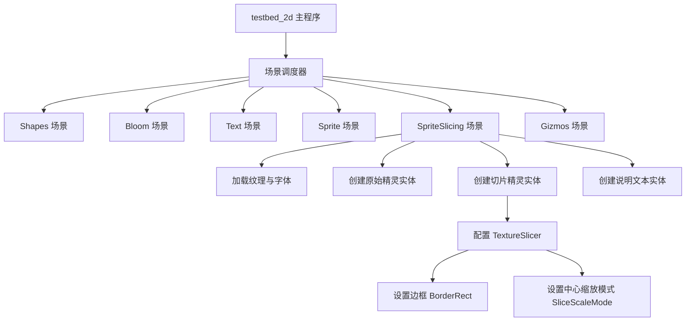

+++
title = "#22089 Add sprite slicing scene to testbed_2d example"
date = "2025-12-14T00:00:00"
draft = false
template = "pull_request_page.html"
in_search_index = false

[extra]
current_language = "zh-cn"
available_languages = {"en" = { name = "English", url = "/pull_request/bevy/2025-12/pr-22089-en-20251214" }, "zh-cn" = { name = "中文", url = "/pull_request/bevy/2025-12/pr-22089-zh-cn-20251214" }}
+++

# Title

## 基本信息
- **标题**: Add sprite slicing scene to testbed_2d example
- **PR 链接**: https://github.com/bevyengine/bevy/pull/22089
- **作者**: snk-git-hub
- **状态**: 已合并
- **标签**: A-Rendering, S-Ready-For-Final-Review, C-Testing, X-Uncontroversial, D-Straightforward
- **创建时间**: 2025-12-11T10:25:07Z
- **合并时间**: 2025-12-14T22:04:11Z
- **合并者**: alice-i-cecile

## 描述翻译

**目标**
- Sprite slicing（精灵切片）功能在截图 CI（持续集成）中没有任何示例。
- 修复 #22083

**解决方案**
- 在 `examples/testbed/2d.rs` 中添加了一个新的 `sprite_slicing` 模块。

**测试**
- 使用 `cargo run --example testbed_2d` 运行了 testbed
- 使用空格键在所有场景间循环切换
- 验证了精灵切片场景能正确显示原始精灵和切片后的精灵
- 确认标签和位置正确

---

**展示**


## 本次 PR 的故事

这个 PR 源于一个简单但重要的问题：Bevy 引擎的 `SpriteImageMode::Sliced` 功能缺乏一个官方的、可运行的示例，特别是在用于自动化验证的截图 CI（Screenshot CI）流程中。虽然精灵切片功能本身已经存在，但没有一个专门的场景来直观地展示它的工作效果并与原始精灵进行对比。这对于新用户理解该功能，以及对于维护者确保该功能在代码变更后仍然正常工作，都造成了一个缺口。Issue #22083 明确指出了这个问题。

解决方案是直接且务实的：在现有的 `testbed_2d` 示例程序中添加一个新的场景。`testbed_2d` 是 Bevy 的一个综合性 2D 示例，它包含多个可以通过键盘切换的场景（如 `Shapes`、`Bloom`、`Text`、`Sprite`、`Gizmos`），用于集中展示不同的 2D 渲染功能。将精灵切片示例集成到这里，既符合项目的代码组织惯例，也便于用户在一个统一的环境中查看和比较所有 2D 特性。

实现过程遵循了 `testbed_2d` 已有的模式。首先，在顶层的 `Scene` 枚举中新增了 `SpriteSlicing` 变体。这是连接场景切换逻辑和具体场景设置的枢纽。

```rust
// File: examples/testbed/2d.rs
// 之前:
enum Scene {
    Shapes,
    Bloom,
    Text,
    Sprite,
    Gizmos,
}

// 之后:
enum Scene {
    Shapes,
    Bloom,
    Text,
    Sprite,
    SpriteSlicing, // 新增
    Gizmos,
}
```

接着，更新了为 `Scene` 实现的 `Next` trait 中的 `next` 方法，将新的 `SpriteSlicing` 场景插入到场景循环链中，具体位置在 `Sprite` 场景之后，`Gizmos` 场景之前。这一步确保了用户使用空格键切换场景时，能自然地进入新的精灵切片演示。

```rust
impl Next for Scene {
    fn next(self) -> Self {
        match self {
            Scene::Shapes => Scene::Bloom,
            Scene::Bloom => Scene::Text,
            Scene::Text => Scene::Sprite,
            Scene::Sprite => Scene::SpriteSlicing, // 新增跳转
            Scene::SpriteSlicing => Scene::Gizmos, // 新增跳转
            Scene::Gizmos => Scene::Shapes,
        }
    }
}
```

然后，在主应用程序构建流程中，注册了新场景的入口系统。这是通过 `add_systems` 方法，在 `OnEnter(Scene::SpriteSlicing)` 状态下调用新增的 `sprite_slicing::setup` 函数来完成的。这套模式与注册其他场景（如 `sprite::setup`）完全一致，保持了代码的整洁和可维护性。

核心部分是新创建的 `sprite_slicing` 模块及其 `setup` 函数。这个函数的实现清晰地展示了精灵切片的使用方法：
1.  **加载资源**：使用 `AssetServer` 加载了同一个纹理 `"textures/slice_square_2.png"` 和所需字体。
2.  **创建原始精灵实体**：第一个实体使用默认的 `Sprite` 组件显示原始纹理，并应用了一个缩放变换（`Vec3::splat(2.0)`），将其放置在左侧（`x = -150`）。
3.  **创建切片精灵实体**：第二个实体是关键。它的 `Sprite` 组件中设置了 `image_mode: SpriteImageMode::Sliced(TextureSlicer { ... })`。
    -   `TextureSlicer` 的 `border` 字段被设置为 `BorderRect::all(20.0)`，这表示从纹理边缘向内 20 像素的区域被定义为边框（border），中间部分则是中心（center）区域。
    -   `center_scale_mode` 设置为 `SliceScaleMode::Stretch`，这意味着当精灵被拉伸时，中心区域的内容会被拉伸，而边框区域则保持其原始宽度或高度不变。这是实现“九宫格”（9-slice）缩放效果的核心。
    -   通过 `custom_size: Some(Vec2::new(200.0, 200.0))` 明确指定了该切片精灵的渲染尺寸，从而触发缩放行为。这个实体被放置在右侧（`x = 150`）。
4.  **添加说明文本**：创建了两个 `Text2d` 实体，分别标注“Original”和“Sliced”，并放置在对应精灵的下方，使演示一目了然。
5.  **生命周期管理**：所有新生成的实体都附加了 `DespawnOnExit(super::Scene::SpriteSlicing)` 组件。这是一个重要的优化，确保在离开该场景时，这些临时实体能被自动清理，避免内存泄漏和残留渲染。

从技术角度看，这个 PR 的改动非常典型，属于“功能演示补充”类别。它没有修改任何引擎核心逻辑，而是扩展了示例应用程序。其价值在于：
1.  **完善文档**：提供了一个可运行、可观察的代码范例，是学习 `SpriteImageMode::Sliced` API 的最佳实践。
2.  **支持自动化测试**：截图 CI 现在可以捕捉到这个场景的输出，未来如果精灵切片渲染出现回归（regression），CI 能够通过图片比对及时发现。
3.  **遵循项目模式**：整个实现严格遵循了 `testbed_2d` 示例的现有架构和编码风格，使得代码易于理解和审查。

总而言之，这个 PR 高效地填补了项目文档和测试覆盖中的一个空白。它通过添加一个精心设计、对比清晰的演示场景，使精灵切片这一实用功能对用户更加可见和易懂，同时也为项目的质量保障增加了一道自动化检查。

## 视觉表示



## 关键文件变更

- `examples/testbed/2d.rs` (+62/-1)

**变更说明与代码片段：**

1.  **场景枚举与切换逻辑扩展**：在 `Scene` 枚举中添加了新变体，并更新了 `Next` trait 的实现以将其纳入循环。
    ```rust
    // 文件: examples/testbed/2d.rs
    // 场景枚举变更 (代码节选)
    enum Scene {
        // ... 其他已有变体
        Sprite,
        SpriteSlicing, // 新增行
        Gizmos,
    }
    
    // Next trait 实现变更 (代码节选)
    impl Next for Scene {
        fn next(self) -> Self {
            match self {
                // ... 其他匹配分支
                Scene::Sprite => Scene::SpriteSlicing, // 修改行：原先跳转到 Gizmos
                Scene::SpriteSlicing => Scene::Gizmos, // 新增行
                Scene::Gizmos => Scene::Shapes,
            }
        }
    }
    ```

2.  **系统注册**：在主函数中注册了新场景的入口系统。
    ```rust
    // 文件: examples/testbed/2d.rs
    // 主函数 App 构建部分 (代码节选)
    fn main() {
        App::new()
            // ... 其他系统注册
            .add_systems(OnEnter(Scene::Sprite), sprite::setup)
            .add_systems(OnEnter(Scene::SpriteSlicing), sprite_slicing::setup) // 新增行
            .add_systems(OnEnter(Scene::Gizmos), gizmos::setup)
            // ... 其余代码
    }
    ```

3.  **新增 `sprite_slicing` 模块**：这是本次 PR 的核心，包含了完整的场景设置逻辑。
    ```rust
    // 文件: examples/testbed/2d.rs
    // 新增的完整模块
    mod sprite_slicing {
        use bevy::prelude::*;
        use bevy::sprite::{BorderRect, SliceScaleMode, SpriteImageMode, TextureSlicer};
    
        pub fn setup(mut commands: Commands, asset_server: Res<AssetServer>) {
            commands.spawn((Camera2d, DespawnOnExit(super::Scene::SpriteSlicing)));
    
            let texture = asset_server.load("textures/slice_square_2.png");
            let font = asset_server.load("fonts/FiraSans-Bold.ttf");
    
            // 左侧原始精灵
            commands.spawn((
                Sprite {
                    image: texture.clone(),
                    ..default()
                },
                Transform::from_translation(Vec3::new(-150.0, 50.0, 0.0)).with_scale(Vec3::splat(2.0)),
                DespawnOnExit(super::Scene::SpriteSlicing),
            ));
    
            // 右侧切片精灵
            commands.spawn((
                Sprite {
                    image: texture,
                    image_mode: SpriteImageMode::Sliced(TextureSlicer {
                        border: BorderRect::all(20.0),
                        center_scale_mode: SliceScaleMode::Stretch,
                        ..default()
                    }),
                    custom_size: Some(Vec2::new(200.0, 200.0)),
                    ..default()
                },
                Transform::from_translation(Vec3::new(150.0, 50.0, 0.0)),
                DespawnOnExit(super::Scene::SpriteSlicing),
            ));
    
            // “Original” 标签
            commands.spawn((
                Text2d::new("Original"),
                TextFont {
                    font: font.clone(),
                    font_size: 20.0,
                    ..default()
                },
                Transform::from_translation(Vec3::new(-150.0, -80.0, 0.0)),
                DespawnOnExit(super::Scene::SpriteSlicing),
            ));
    
            // “Sliced” 标签
            commands.spawn((
                Text2d::new("Sliced"),
                TextFont {
                    font,
                    font_size: 20.0,
                    ..default()
                },
                Transform::from_translation(Vec3::new(150.0, -80.0, 0.0)),
                DespawnOnExit(super::Scene::SpriteSlicing),
            ));
        }
    }
    ```

## 进一步阅读

1.  **Bevy 官方文档 - Sprite Slicing**:
    - 链接: https://docs.rs/bevy/latest/bevy/sprite/struct.TextureSlicer.html (查看 `TextureSlicer`、`BorderRect`、`SliceScaleMode` 的详细 API 文档)

2.  **“九宫格缩放”（9-slice scaling）图形学概念**:
    -   维基百科: https://en.wikipedia.org/wiki/9-slice_scaling
    -   这是一个通用的 UI/2D 图形技术，Bevy 的 `SpriteImageMode::Sliced` 是其一种实现。

3.  **Bevy 示例库**:
    -   运行 `cargo run --example testbed_2d` 来交互式地查看所有 2D 示例场景，包括本次新增的精灵切片场景。
    -   Bevy 示例代码库是学习各种 API 用法的绝佳资源。