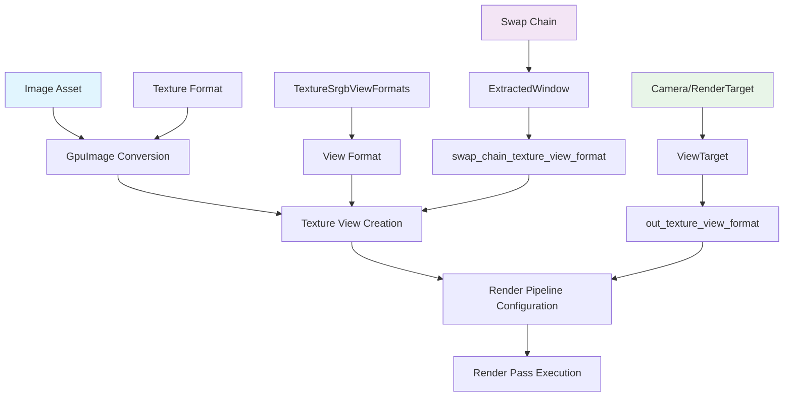

+++
title = "#22090 Fix non-srgb `RenderTarget::Image`"
date = "2025-12-14T00:00:00"
draft = false
template = "pull_request_page.html"
in_search_index = true

[taxonomies]
list_display = ["show"]

[extra]
current_language = "en"
available_languages = {"en" = { name = "English", url = "/pull_request/bevy/2025-12/pr-22090-en-20251214" }, "zh-cn" = { name = "中文", url = "/pull_request/bevy/2025-12/pr-22090-zh-cn-20251214" }}
labels = ["C-Bug", "A-Rendering", "P-Regression"]
+++

# Title: Fix non-srgb `RenderTarget::Image`

## Basic Information
- **Title**: Fix non-srgb `RenderTarget::Image`
- **PR Link**: https://github.com/bevyengine/bevy/pull/22090
- **Author**: beicause
- **Status**: MERGED
- **Labels**: C-Bug, A-Rendering, S-Ready-For-Final-Review, P-Regression
- **Created**: 2025-12-11T21:53:31Z
- **Merged**: 2025-12-14T23:22:16Z
- **Merged By**: alice-i-cecile

## Description
Fixes https://github.com/bevyengine/bevy/pull/22031#issuecomment-3640036590. Fixes #15201.
#22031 makes `ViewTarget::out_texture_format` to return the underlying texture's format, which causes some issues:
1. `ExtractedWindow::swap_chain_texture_view` always uses srgb view. But the underlying swap chain texture in WebGPU can be Bgra8unorm, leading to format mismatch between the render pipeline and the render pass.
2. We can no longer use srgb view for non-srgb target texture, it will panic due to incompatible pipeline:
```rs
    let mut image = Image::new_target_texture(512, 512, TextureFormat::Rgba8Unorm);
    image.texture_view_descriptor = Some(bevy_render::render_resource::TextureViewDescriptor {
        format: Some(TextureFormat::Rgba8UnormSrgb),
        ..Default::default()
    });
    image.texture_descriptor.view_formats = &[TextureFormat::Rgba8UnormSrgb];
```

## Solution

Reverts #22031.
Renames some `format` to `view_format` explicitly.
Adds `view_format` to `GpuImage` and `Image::new_target_texture` so we can make render pipeline match render pass texture view.

## Testing
Tested `render_to_texture` and `screenshot`  examples on linux and webgpu.
<details>
<summary>The rendered Rgba8Unorm texture with or without srgb view in MeshMaterial3d looks the same, but the underlaying data is different:</summary>

With srgb view:


Without srgb view:


</details>

## The Story of This Pull Request

This PR addresses a regression introduced by PR #22031 that caused format mismatches between render pipelines and render passes when dealing with non-sRGB render targets. The issue surfaced in two specific scenarios: WebGPU compatibility problems and crashes when using sRGB views on non-sRGB textures.

The core problem stemmed from a change in `ViewTarget::out_texture_format()` that started returning the underlying texture's format instead of considering the texture view format. This broke the distinction between a texture's storage format and how it's interpreted during rendering.

The solution involves reverting the problematic change from #22031 and introducing a clearer separation between texture format and view format. The implementation adds a new `texture_view_format` field to `GpuImage` and updates the `Image::new_target_texture` function to accept an optional view format parameter. This allows the render system to properly match pipeline expectations with actual render pass configurations.

One key insight driving this fix is that textures can have multiple view formats, allowing the same underlying texture data to be interpreted differently (e.g., as sRGB or linear color space). The PR introduces a `TextureSrgbViewFormats` trait that provides the sRGB view formats for texture formats that support them. This is crucial for maintaining compatibility across different graphics APIs and hardware configurations.

The changes cascade through the rendering pipeline, affecting how textures are prepared, how render targets are configured, and how screenshots are captured. Each component that interacts with texture formats needed updating to distinguish between the base format and the view format.

An important aspect of this fix is that it maintains backward compatibility while fixing the regression. The example code updates show how to properly create render target textures with sRGB views, demonstrating the correct usage pattern for developers.

The fix also addresses WebGPU compatibility issues where swap chain textures might be in non-sRGB formats (like `Bgra8Unorm`) but the rendering pipeline expects sRGB views. By properly tracking the view format separately, the system can ensure compatibility across different platforms and graphics APIs.

## Visual Representation



## Key Files Changed

### `crates/bevy_image/src/image.rs` (+138/-3)
Added the `TextureSrgbViewFormats` trait and updated `Image::new_target_texture` to support separate texture and view formats. The trait provides a mapping from base texture formats to their sRGB view format equivalents.

```rust
// Key addition: TextureSrgbViewFormats trait
pub trait TextureSrgbViewFormats {
    fn srgb_view_formats(&self) -> &'static [TextureFormat];
}

// Updated function signature
pub fn new_target_texture(
    width: u32,
    height: u32,
    format: TextureFormat,
    view_format: Option<TextureFormat>,  // New parameter
) -> Self {
    // ...
    texture_descriptor: TextureDescriptor {
        // ...
        view_formats: match view_format {
            Some(_) => format.srgb_view_formats(),  // Use sRGB view formats if specified
            None => &[],
        },
    },
    texture_view_descriptor: view_format.map(|f| TextureViewDescriptor {
        format: Some(f),  // Set the view format
        ..Default::default()
    }),
    // ...
}
```

### `crates/bevy_render/src/texture/gpu_image.rs` (+6/-1)
Added `texture_view_format` field to `GpuImage` struct to track the view format separately from the texture format.

```rust
pub struct GpuImage {
    pub texture: Texture,
    pub texture_view: TextureView,
    pub texture_format: TextureFormat,
    pub texture_view_format: Option<TextureFormat>,  // New field
    // ...
}
```

### `crates/bevy_render/src/view/mod.rs` (+4/-6)
Changed `ViewTarget::out_texture_format()` to `out_texture_view_format()` to return the view format instead of the texture format.

```rust
// Before:
pub fn out_texture_format(&self) -> TextureFormat {
    self.out_texture.format
}

// After:
pub fn out_texture_view_format(&self) -> TextureFormat {
    self.out_texture.view_format  // Returns the view format
}
```

### `crates/bevy_render/src/view/window/mod.rs` (+14/-5)
Added `swap_chain_texture_view_format` to `ExtractedWindow` and updated surface creation to properly handle view formats.

```rust
pub struct ExtractedWindow {
    // ...
    pub swap_chain_texture_format: Option<TextureFormat>,
    pub swap_chain_texture_view_format: Option<TextureFormat>,  // New field
    // ...
}

impl ExtractedWindow {
    fn set_swapchain_texture(&mut self, frame: wgpu::SurfaceTexture) {
        self.swap_chain_texture_view_format = Some(frame.texture.format().add_srgb_suffix());
        // ...
    }
}
```

### `crates/bevy_render/src/camera.rs` (+6/-6)
Renamed `get_texture_format` to `get_texture_view_format` and updated it to return the view format when available.

```rust
// Updated method name and implementation
fn get_texture_view_format<'a>(
    &self,
    windows: &'a ExtractedWindows,
    images: &'a RenderAssets<GpuImage>,
    manual_texture_views: &'a ManualTextureViews,
) -> Option<TextureFormat> {
    match self {
        NormalizedRenderTarget::Window(window_ref) => windows
            .get(&window_ref.entity())
            .and_then(|window| window.swap_chain_texture_view_format),  // Use view format
        NormalizedRenderTarget::Image(image_target) => images
            .get(&image_target.handle)
            .map(|image| image.texture_view_format.unwrap_or(image.texture_format)),
        // ...
    }
}
```

## Further Reading

- [WebGPU Texture Formats Documentation](https://gpuweb.github.io/gpuweb/#texture-formats)
- [sRGB Color Space](https://en.wikipedia.org/wiki/SRGB)
- [Bevy Render Targets Documentation](https://docs.rs/bevy/latest/bevy/render/camera/enum.RenderTarget.html)
- [wgpu Texture View Formats](https://docs.rs/wgpu/latest/wgpu/struct.TextureDescriptor.html#structfield.view_formats)
- [GPU Texture Compression Formats](https://docs.rs/wgpu/latest/wgpu/enum.TextureFormat.html)