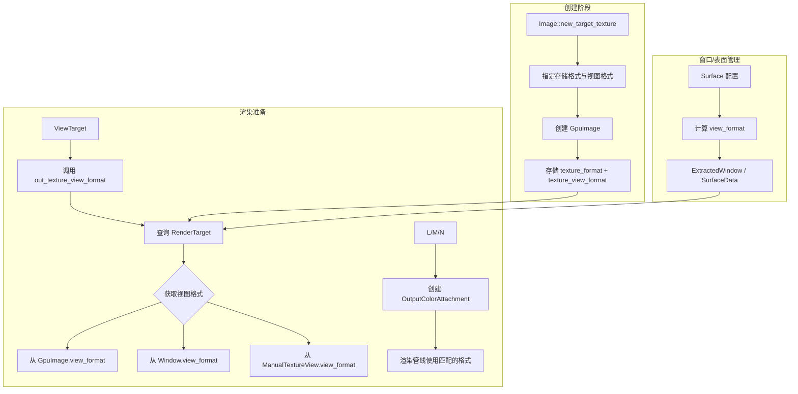

+++
title = "#22090 Fix non-srgb `RenderTarget::Image`"
date = "2025-12-14T00:00:00"
draft = false
template = "pull_request_page.html"
in_search_index = false

[extra]
current_language = "zh-cn"
available_languages = {"en" = { name = "English", url = "/pull_request/bevy/2025-12/pr-22090-en-20251214" }, "zh-cn" = { name = "中文", url = "/pull_request/bevy/2025-12/pr-22090-zh-cn-20251214" }}
labels = ["C-Bug", "A-Rendering", "P-Regression"]
+++

# Title

## Basic Information
- **Title**: Fix non-srgb `RenderTarget::Image`
- **PR Link**: https://github.com/bevyengine/bevy/pull/22090
- **Author**: beicause
- **Status**: MERGED
- **Labels**: C-Bug, A-Rendering, S-Ready-For-Final-Review, P-Regression
- **Created**: 2025-12-11T21:53:31Z
- **Merged**: 2025-12-14T23:22:16Z
- **Merged By**: alice-i-cecile

## Description Translation
### 目标 (Objective)

修复 https://github.com/bevyengine/bevy/pull/22031#issuecomment-3640036590。修复 #15201。
#22031 使 `ViewTarget::out_texture_format` 返回底层纹理的格式，这导致了一些问题：
1. `ExtractedWindow::swap_chain_texture_view` 始终使用 srgb 视图。但在 WebGPU 中，底层的交换链纹理可能是 Bgra8unorm，这导致渲染管线（pipeline）和渲染通道（render pass）之间的格式不匹配。
2. 我们无法再为非 srgb 的目标纹理使用 srgb 视图，否则会因管线不兼容而崩溃（panic）：
```rs
    let mut image = Image::new_target_texture(512, 512, TextureFormat::Rgba8Unorm);
    image.texture_view_descriptor = Some(bevy_render::render_resource::TextureViewDescriptor {
        format: Some(TextureFormat::Rgba8UnormSrgb),
        ..Default::default()
    });
    image.texture_descriptor.view_formats = &[TextureFormat::Rgba8UnormSrgb];
```

### 解决方案 (Solution)

撤销（Reverts）#22031。
显式地将一些 `format` 重命名为 `view_format`。
在 `GpuImage` 和 `Image::new_target_texture` 中添加 `view_format`，以便我们可以使渲染管线与渲染通道的纹理视图（texture view）匹配。

### 测试 (Testing)

在 linux 和 webgpu 上测试了 `render_to_texture` 和 `screenshot` 示例。
<details>
<summary>带有或不带 srgb 视图的 Rgba8Unorm 纹理在 MeshMaterial3d 中看起来是一样的，但底层数据是不同的：</summary>

带有 srgb 视图：


不带 srgb 视图：


</details>

## The Story of This Pull Request

这个 PR 始于一个由先前优化引入的回归问题。PR #22031 试图清理代码，让 `ViewTarget::out_texture_format()` 返回底层纹理的真实格式。这个改动意图良好，但却无意中破坏了一个关键假设：渲染管线应该与纹理视图（TextureView）的格式匹配，而不是与底层纹理存储的格式匹配。

问题的核心在于 sRGB 色彩空间处理。在许多图形 API（如 WebGPU）和硬件上，纹理可以以线性格式（如 `Rgba8Unorm`）存储，但通过一个 sRGB 格式的视图（如 `Rgba8UnormSrgb`）来读取或渲染。这个视图在采样时自动进行伽马校正（gamma correction）。在 PR #22031 之前，系统隐含地假设渲染目标会使用其 sRGB 视图格式（如果可用）。该 PR 打破了这一假设，导致两个具体问题：
1.  在 WebGPU 上，交换链（swapchain）表面可能使用 `Bgra8Unorm` 格式，但 Bevy 总是为其创建 `Bgra8UnormSrgb` 视图。管线期望的格式（基于 `out_texture_format()` 返回的 `Bgra8Unorm`）与渲染通道附件（attachment）的实际格式（`Bgra8UnormSrgb`）不匹配，造成错误。
2.  对于用户手动创建的、指定了 sRGB 视图的非 sRGB 渲染目标图像，同样会出现管线格式不匹配，导致 panic。

解决方案需要清晰地分离两个概念：纹理的底层存储格式（`texture_format`）和用于创建渲染管线时使用的视图格式（`view_format`）。修复方案采取了以下步骤：

首先，**回退有问题的更改**。这意味着 `ViewTarget::out_texture_format()` 方法被重命名为 `out_texture_view_format()`，以更准确地反映其返回的是视图格式。同时，相关调用点被更新。

其次，**将视图格式信息显式地传递整个渲染流程**。这是修复的关键。在 `Image` 和 `GpuImage` 结构体中添加了 `view_format` 字段。`Image::new_target_texture` 函数签名被修改，增加了一个 `view_format: Option<TextureFormat>` 参数，允许在创建渲染目标时指定一个不同于存储格式的视图格式。

```rust
// crates/bevy_image/src/image.rs
// 关键修改：函数签名和内部处理
pub fn new_target_texture(
    width: u32,
    height: u32,
    format: TextureFormat, // 底层存储格式
    view_format: Option<TextureFormat>, // 新增：视图格式
) -> Self {
    // ...
    texture_view_descriptor: view_format.map(|f| TextureViewDescriptor {
        format: Some(f), // 使用传入的视图格式
        ..Default::default()
    }),
    // ...
}
```

第三，**建立纹理格式到其 sRGB 视图格式的映射**。新增的 `TextureSrgbViewFormats` trait 及其为 `TextureFormat` 实现的 `srgb_view_formats()` 方法，提供了一个集中的地方来定义哪些格式有对应的 sRGB 视图。这被用于在创建交换链和渲染目标时自动填充 `view_formats` 列表，这是 WebGPU 等 API 允许创建不同格式视图所必需的。

```rust
// crates/bevy_image/src/image.rs
// 新增的 trait 和实现
pub trait TextureSrgbViewFormats {
    fn srgb_view_formats(&self) -> &'static [TextureFormat];
}
impl TextureSrgbViewFormats for TextureFormat {
    fn srgb_view_formats(&self) -> &'static [TextureFormat] {
        match self {
            TextureFormat::Rgba8Unorm => &[TextureFormat::Rgba8UnormSrgb],
            TextureFormat::Bgra8Unorm => &[TextureFormat::Bgra8UnormSrgb],
            // ... 其他格式的映射
            _ => &[],
        }
    }
}
```

第四，**更新所有相关组件以使用正确的视图格式**。这涉及到多个文件：
-   `ExtractedWindow` 现在除了存储 `swap_chain_texture_format`（底层格式），还存储 `swap_chain_texture_view_format`（视图格式）。
-   `SurfaceData` 也存储 `texture_view_format`，用于后续的截图等操作。
-   在 `prepare_view_attachments` 和截图系统中，现在使用 `get_texture_view_format` 来获取视图格式以创建 `OutputColorAttachment`，而不是对底层格式调用 `add_srgb_suffix()`。这确保了一致性。
-   `ManualTextureView` 和 `OutputColorAttachment` 中的字段从 `format` 被重命名为 `view_format` 以明确其含义。

最后，**更新示例代码**。示例 `render_to_texture.rs` 被修改，在调用 `new_target_texture` 时明确传递 sRGB 视图格式 (`Some(TextureFormat::Rgba8UnormSrgb)`)，演示了如何正确创建一个使用 sRGB 视图的非 sRGB 渲染目标。其他示例（如 `headless_renderer`）则传递 `None`，表示使用与存储格式相同的视图格式。

从工程角度看，这个修复方案是直接且有效的。它通过回退引入问题的变更并强化类型和信息流，解决了格式不匹配的根本原因。明确的命名（`view_format`）有助于防止未来的混淆。将格式映射集中到 `TextureSrgbViewFormats` trait 也是一个良好的设计，提高了代码的可维护性和可扩展性。

这个 PR 的教训是，在图形编程中，对资源视图（View）和底层资源（Resource）的区分至关重要。看似简单的“清理”或“统一”操作，如果不考虑渲染管线与视图状态（包括格式）的紧密耦合，就可能破坏渲染流程。此修复确保了 Bevy 渲染管线能够正确处理 sRGB 色彩空间转换，并与 WebGPU 等现代图形 API 兼容。

## Visual Representation



## Key Files Changed

1.  **`crates/bevy_image/src/image.rs` (+138/-3)**
    -   **变化原因**：这是修复的核心，引入了视图格式的概念并提供了创建渲染目标图像的接口。
    -   **关键修改**：
        -   新增 `TextureSrgbViewFormats` trait 及实现，用于映射格式到其 sRGB 视图格式。
        -   修改 `Image::new_target_texture` 函数签名，增加 `view_format` 参数，并据此设置 `texture_view_descriptor` 和 `texture_descriptor.view_formats`。
    -   **代码片段**:
        ```rust
        pub fn new_target_texture(
            width: u32,
            height: u32,
            format: TextureFormat,
            view_format: Option<TextureFormat>, // 新增参数
        ) -> Self {
            // ...
            texture_view_descriptor: view_format.map(|f| TextureViewDescriptor {
                format: Some(f), // 使用指定的视图格式
                ..Default::default()
            }),
            // ...
        }
        ```

2.  **`crates/bevy_render/src/texture/gpu_image.rs` (+8/-3)**
    -   **变化原因**：`GpuImage` 是渲染资产，需要携带视图格式信息供渲染系统查询。
    -   **关键修改**：
        -   在 `GpuImage` 结构体中新增 `pub texture_view_format: Option<TextureFormat>` 字段。
        -   在 `impl RenderAsset for GpuImage` 中，从 `Image` 的 `texture_view_descriptor` 提取并设置该字段。
    -   **代码片段**:
        ```rust
        pub struct GpuImage {
            // ...
            pub texture_format: TextureFormat,
            pub texture_view_format: Option<TextureFormat>, // 新增字段
            // ...
        }
        impl RenderAsset for GpuImage {
            fn to_render_asset(&self, image: &Image) -> Result<Self::ExtractedAsset, Self::Error> {
                // ...
                Ok(GpuImage {
                    // ...
                    texture_view_format: image.texture_view_descriptor.and_then(|v| v.format), // 提取视图格式
                    // ...
                })
            }
        }
        ```

3.  **`crates/bevy_render/src/view/mod.rs` (+4/-6)**
    -   **变化原因**：`ViewTarget` 需要提供正确的视图格式给上采样（upscaling）等后处理管线。
    -   **关键修改**：将 `out_texture_format()` 方法重命名为 `out_texture_view_format()`，并修改其实现以返回 `OutputColorAttachment` 的 `view_format`。
    -   **代码片段**:
        ```rust
        impl ViewTarget {
            // 之前: pub fn out_texture_format(&self) -> TextureFormat { self.out_texture.format }
            // 之后:
            pub fn out_texture_view_format(&self) -> TextureFormat {
                self.out_texture.view_format // 返回视图格式
            }
        }
        ```

4.  **`crates/bevy_render/src/camera.rs` (+6/-6)**
    -   **变化原因**：`NormalizedRenderTargetExt` trait 定义了如何从各种渲染目标获取信息，需要能获取视图格式。
    -   **关键修改**：将 `get_texture_format` 方法重命名为 `get_texture_view_format`，并更新其实现：对于 `Image` 类型，优先返回 `texture_view_format`，否则回退到 `texture_format`。
    -   **代码片段**:
        ```rust
        pub trait NormalizedRenderTargetExt {
            // 重命名并修改语义
            fn get_texture_view_format<'a>(/* ... */) -> Option<TextureFormat>;
        }
        impl NormalizedRenderTargetExt for NormalizedRenderTarget {
            fn get_texture_view_format<'a>(/* ... */) -> Option<TextureFormat> {
                match self {
                    // ...
                    NormalizedRenderTarget::Image(image_target) => images
                        .get(&image_target.handle)
                        .map(|image| image.texture_view_format.unwrap_or(image.texture_format)), // 关键逻辑
                    // ...
                }
            }
        }
        ```

5.  **`crates/bevy_render/src/view/window/mod.rs` (+14/-5)**
    -   **变化原因**：窗口交换链需要管理其纹理的视图格式。
    -   **关键修改**：
        -   在 `ExtractedWindow` 中新增 `swap_chain_texture_view_format: Option<TextureFormat>`。
        -   在 `SurfaceData` 中新增 `texture_view_format: Option<TextureFormat>` 并在表面配置时计算其值。
        -   更新 `set_swapchain_texture` 和 `create_surfaces` 函数来设置这些字段。
    -   **代码片段**:
        ```rust
        pub struct ExtractedWindow {
            // ...
            pub swap_chain_texture_view_format: Option<TextureFormat>, // 新增
        }
        struct SurfaceData {
            // ...
            texture_view_format: Option<TextureFormat>, // 新增
        }
        ```

6.  **`examples/3d/render_to_texture.rs`**
    -   **变化原因**：演示如何正确创建和使用带有 sRGB 视图的非 sRGB 渲染目标。
    -   **关键修改**：更新 `Image::new_target_texture` 的调用，明确传递 sRGB 视图格式。
    -   **代码片段**:
        ```rust
        // 之前: let image = Image::new_target_texture(512, 512, TextureFormat::bevy_default());
        // 之后:
        let image = Image::new_target_texture(
            512,
            512,
            TextureFormat::Rgba8Unorm,          // 存储格式
            Some(TextureFormat::Rgba8UnormSrgb), // 视图格式
        );
        ```

## Further Reading

1.  **wgpu 纹理视图格式 (Texture View Formats)**: 了解 `view_formats` 在 WebGPU/wgpu 中的作用，它允许纹理以不同于其存储格式的格式被视图访问。
    -   [WebGPU Spec - Texture View Creation](https://www.w3.org/TR/webgpu/#texture-view-creation)
    -   [wgpu documentation on `TextureDescriptor::view_formats`](https://docs.rs/wgpu/latest/wgpu/struct.TextureDescriptor.html#structfield.view_formats)
2.  **sRGB 色彩空间与伽马校正 (sRGB Color Space & Gamma Correction)**: 理解为什么需要 sRGB 视图以及在图形管线中如何进行色彩空间转换。
    -   [GPU Gem: The Importance of Being Linear](https://developer.nvidia.com/gpugems/gpugems3/part-iv-image-effects/chapter-24-importance-being-linear)
    -   [sRGB - Wikipedia](https://en.wikipedia.org/wiki/SRGB)
3.  **Bevy 渲染目标与相机 (Bevy RenderTarget & Camera)**: 深入了解 Bevy 中 `Camera`, `RenderTarget`, `ViewTarget` 的工作原理。
    -   [Bevy Cheatbook - Camera](https://bevy-cheatbook.github.io/features/camera.html)
    -   [Bevy 源码 - `camera.rs`](https://github.com/bevyengine/bevy/blob/main/crates/bevy_render/src/camera.rs)