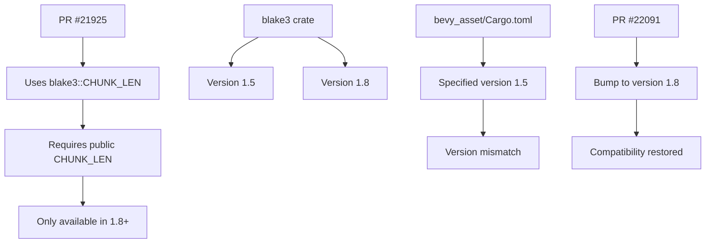

+++
title = "#22091 Fix incorrect blake3 version bound"
date = "2025-12-12T00:00:00"
draft = false
template = "pull_request_page.html"
in_search_index = true

[taxonomies]
list_display = ["show"]

[extra]
current_language = "en"
available_languages = {"en" = { name = "English", url = "/pull_request/bevy/2025-12/pr-22091-en-20251212" }, "zh-cn" = { name = "中文", url = "/pull_request/bevy/2025-12/pr-22091-zh-cn-20251212" }}
labels = ["D-Trivial", "C-Dependencies"]
+++

# Title
Fix incorrect blake3 version bound

## Basic Information
- **Title**: Fix incorrect blake3 version bound
- **PR Link**: https://github.com/bevyengine/bevy/pull/22091
- **Author**: kristoff3r
- **Status**: MERGED
- **Labels**: D-Trivial, C-Dependencies, S-Ready-For-Final-Review, P-Compile-Failure
- **Created**: 2025-12-11T22:25:49Z
- **Merged**: 2025-12-12T19:11:25Z
- **Merged By**: mockersf

## Description Translation
**Objective**

The PR #21925 introduced some code using the constant `blake3::CHUNK_LEN`, but that wasn't public before version 1.8, and bevy_asset currently depends on version 1.5. This breaks users with an older version in their lock file.

**Solution**

Bump blake3 to 1.8

## The Story of This Pull Request

This PR fixes a version compatibility issue that emerged from a simple oversight in dependency management. The problem started when PR #21925 added code that depended on a specific constant from the `blake3` crate. Specifically, it used `blake3::CHUNK_LEN`, which is a constant representing the chunk length used in the BLAKE3 hash algorithm.

The issue was that `blake3::CHUNK_LEN` wasn't exposed as a public constant until version 1.8 of the `blake3` crate. The `bevy_asset` crate was still declaring a dependency on version 1.5 in its Cargo.toml file. This created a mismatch: the code was written against version 1.8's API, but the dependency specification allowed older versions that didn't have that API.

This type of problem often surfaces in CI environments or when new contributors clone the repository and run `cargo build`. If Cargo resolves the `blake3` dependency to version 1.5 (which might happen if it's already in a global cache or if version resolution picks an older compatible version), the build fails with a compilation error indicating that `CHUNK_LEN` doesn't exist in the `blake3` module.

The solution was straightforward: update the version requirement in Cargo.toml to explicitly require at least version 1.8, which contains the public `CHUNK_LEN` constant that the code now depends on. This ensures that anyone building the project will get a compatible version of the `blake3` crate.

This fix highlights an important aspect of Rust dependency management. When you add code that uses a specific feature from a dependency, you need to ensure your version bounds reflect the minimum version where that feature became available. The Cargo.lock file pins exact versions, but the version bounds in Cargo.toml determine what versions are considered compatible. If the bounds are too loose, different environments might resolve to incompatible versions, leading to compilation failures.

The change is minimal but important for maintaining build reliability across different environments. It follows the standard practice of keeping dependency versions in sync with the actual API usage in the codebase.

## Visual Representation



## Key Files Changed

**crates/bevy_asset/Cargo.toml** (+1/-1)
This file contains the dependency declaration for the `bevy_asset` crate. The change updates the version requirement for the `blake3` dependency from 1.5 to 1.8.

**Code Change:**
```toml
# Before:
blake3 = { version = "1.5", default-features = false }

# After:
blake3 = { version = "1.8", default-features = false }
```

The change ensures that the `blake3` crate resolves to a version that includes the public `CHUNK_LEN` constant used elsewhere in the codebase. This is a direct fix for the compilation error that occurred when the dependency resolved to version 1.5 or any version before 1.8.

## Further Reading

1. **Rust Dependency Management**: The [Cargo Book section on dependencies](https://doc.rust-lang.org/cargo/reference/specifying-dependencies.html) provides detailed information about version specifications and how Cargo resolves dependencies.

2. **Semantic Versioning in Rust**: Understanding how Rust crates use semantic versioning can help prevent similar issues. The [SemVer Compatibility](https://doc.rust-lang.org/cargo/reference/semver.html) section in the Cargo documentation explains what constitutes a breaking change in Rust.

3. **BLAKE3 Algorithm**: The [BLAKE3 specification](https://github.com/BLAKE3-team/BLAKE3-specs) provides technical details about the hash algorithm, including the chunk size constant that was the source of this issue.

4. **Rust Crates.io**: The [blake3 crate page](https://crates.io/crates/blake3) shows the version history and release notes, which would indicate when `CHUNK_LEN` became public.

# Full Code Diff
```diff
diff --git a/crates/bevy_asset/Cargo.toml b/crates/bevy_asset/Cargo.toml
index d20e9c0974ee7..fb19e7e841d5a 100644
--- a/crates/bevy_asset/Cargo.toml
+++ b/crates/bevy_asset/Cargo.toml
@@ -58,7 +58,7 @@ futures-util = { version = "0.3", default-features = false, features = [
 ] }
 futures-io = { version = "0.3", default-features = false }
 futures-lite = { version = "2.0.1", default-features = false }
-blake3 = { version = "1.5", default-features = false }
+blake3 = { version = "1.8", default-features = false }
 ron = { version = "0.12", default-features = false }
 serde = { version = "1", default-features = false, features = ["derive"] }
 thiserror = { version = "2", default-features = false }
```