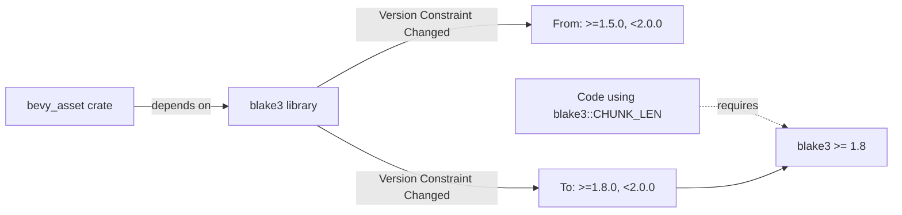

+++
title = "#22091 Fix incorrect blake3 version bound"
date = "2025-12-12T00:00:00"
draft = false
template = "pull_request_page.html"
in_search_index = false

[extra]
current_language = "zh-cn"
available_languages = {"en" = { name = "English", url = "/pull_request/bevy/2025-12/pr-22091-en-20251212" }, "zh-cn" = { name = "中文", url = "/pull_request/bevy/2025-12/pr-22091-zh-cn-20251212" }}
labels = ["D-Trivial", "C-Dependencies"]
+++

# Title
Fix incorrect blake3 version bound

## Basic Information
- **Title**: Fix incorrect blake3 version bound
- **PR Link**: https://github.com/bevyengine/bevy/pull/22091
- **Author**: kristoff3r
- **Status**: MERGED
- **Labels**: D-Trivial, C-Dependencies, S-Ready-For-Final-Review, P-Compile-Failure
- **Created**: 2025-12-11T22:25:49Z
- **Merged**: 2025-12-12T19:11:25Z
- **Merged By**: mockersf

## Description Translation
**目标**

PR #21925 引入了一些使用常量 `blake3::CHUNK_LEN` 的代码，但这个常量在 1.8 版本之前并不是公开的 (public)，而 bevy_asset 当前依赖的是 1.5 版本。这会导致那些在 lock 文件中锁定了旧版本的用户构建失败。

**解决方案**

将 blake3 的依赖版本更新至 1.8。

## The Story of This Pull Request

这次提交源于一个典型的依赖管理问题：一个库的公共API（Application Programming Interface）在不同版本间的变更导致了编译时的不兼容。

问题的根本原因是PR #21925向代码库中引入了一项新功能，该功能使用了`blake3`这个加密哈希库的一个常量——`blake3::CHUNK_LEN`。在引入这个常量时，代码假设`blake3`库至少提供了1.8版本的功能，因为`CHUNK_LEN`常量直到`blake3`的1.8版本才被标记为`pub`，对外部使用者可见。然而，项目中对`blake3`的版本约束仍然停留在`“1.5”`。在Rust的Cargo语义化版本（semver）规则下，`version = “1.5”`等价于 `>=1.5.0, <2.0.0`。这意味着构建系统会尝试在1.5到2.0之间选择一个满足所有依赖关系的版本，可能会选择1.5、1.6或1.7等。如果Cargo的解析器最终选择了1.8以下的版本，那么`CHUNK_LEN`常量将不可访问，从而导致编译错误：“error[E0599]: no associated item named `CHUNK_LEN` found for struct `blake3`”。

这种情况通常不会在拥有全新`Cargo.lock`文件的项目中发生，因为Cargo解析器会直接选取最新的1.x版本（例如1.8）。问题主要影响那些已经存在`Cargo.lock`文件的项目，该文件将依赖版本锁定在了较早的1.5版本。当这些项目拉取（pull）了最新的Bevy代码（包含了PR #21925的更改）并尝试编译时，由于锁文件中的版本约束，Cargo会继续使用旧的`blake3 1.5`，从而触发上述编译错误。

解决方案非常直接：更新`crates/bevy_asset/Cargo.toml`文件中的版本约束，明确要求至少是1.8版本。将依赖声明从`blake3 = { version = “1.5”, … }`修改为`blake3 = { version = “1.8”, … }`。这个改动将最低兼容版本提升至1.8，确保了`CHUNK_LEN`常量在API上是可用的。修改之后，Cargo的版本解析范围变成了`>=1.8.0, <2.0.0`，从根本上杜绝了使用1.8以下不兼容版本的可能性。

这是一个在软件开发中常见的教训：在引入对某个依赖项的新功能（尤其是其公开API）的调用时，必须同步检查并更新对该依赖的版本约束。自动化测试，特别是针对最低版本依赖的持续集成（CI）测试，有助于及早发现这类问题。虽然这个PR的改动很小，只涉及一行版本号，但它修复了一个会导致部分用户构建失败的阻断性问题（P-Compile-Failure），维持了项目的可用性。

## Visual Representation

这个PR的改动非常简单，只涉及一个依赖关系的版本约束调整。下图描述了这一核心变更：


## Key Files Changed

- `crates/bevy_asset/Cargo.toml` (+1/-1)
  这是本次PR中唯一被修改的文件。改动内容是将`blake3`依赖的版本号从`1.5`提升到`1.8`，以确保代码中使用的`blake3::CHUNK_LEN`常量在所选版本中是公开可访问的。

```toml
# File: crates/bevy_asset/Cargo.toml
# Before:
blake3 = { version = "1.5", default-features = false }

# After:
blake3 = { version = "1.8", default-features = false }
```

## Further Reading

1.  **Cargo 文档：指定依赖项** (https://doc.rust-lang.org/cargo/reference/specifying-dependencies.html) - 了解Rust中版本约束（如`^1.5`）的精确含义。
2.  **Semantic Versioning (Semver)** (https://semver.org/) - 理解语义化版本控制的基本规则，这对于管理库依赖和公共API变更至关重要。
3.  **blake3 crate 的 Changelog** (https://github.com/BLAKE3-team/BLAKE3/blob/master/CHANGELOG.md) - 查看`blake3`库各个版本的变更，特别是1.8版本中`CHUNK_LEN`被公开的记录，有助于理解此类问题的背景。
4.  **Rust 编译器错误 E0599** (https://doc.rust-lang.org/error_codes/E0599.html) - 本PR修复的编译错误的官方解释，即“未找到关联项”。

# Full Code Diff
```
diff --git a/crates/bevy_asset/Cargo.toml b/crates/bevy_asset/Cargo.toml
index d20e9c0974ee7..fb19e7e841d5a 100644
--- a/crates/bevy_asset/Cargo.toml
+++ b/crates/bevy_asset/Cargo.toml
@@ -58,7 +58,7 @@ futures-util = { version = "0.3", default-features = false, features = [
 ] }
 futures-io = { version = "0.3", default-features = false }
 futures-lite = { version = "2.0.1", default-features = false }
-blake3 = { version = "1.5", default-features = false }
+blake3 = { version = "1.8", default-features = false }
 ron = { version = "0.12", default-features = false }
 serde = { version = "1", default-features = false, features = ["derive"] }
 thiserror = { version = "2", default-features = false }
```