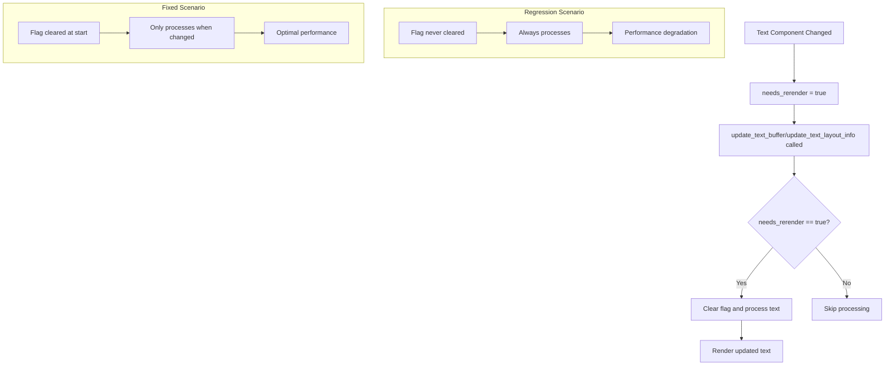

+++
title = "#22098 text2d change detection fix"
date = "2025-12-12T00:00:00"
draft = false
template = "pull_request_page.html"
in_search_index = true

[taxonomies]
list_display = ["show"]

[extra]
current_language = "en"
available_languages = {"en" = { name = "English", url = "/pull_request/bevy/2025-12/pr-22098-en-20251212" }, "zh-cn" = { name = "中文", url = "/pull_request/bevy/2025-12/pr-22098-zh-cn-20251212" }}
labels = ["C-Performance", "P-Regression", "A-Text"]
+++

# Title

## Basic Information
- **Title**: text2d change detection fix
- **PR Link**: https://github.com/bevyengine/bevy/pull/22098
- **Author**: ickshonpe
- **Status**: MERGED
- **Labels**: C-Performance, S-Ready-For-Final-Review, P-Regression, A-Text
- **Created**: 2025-12-12T19:47:17Z
- **Merged**: 2025-12-12T20:41:36Z
- **Merged By**: mockersf

## Description Translation

**Objective**

Fix performance regression caused by #22051 breaking text2d's change detection.

Fixes #22099.

**Solution**

Set the text entity's `ComputedTextBlock::needs_rerender` flag to false at the start of `update_text_buffer` and `update_text_layout_info`.

**Testing**

```
cargo run --example many_text2d --release
```

should run about 400x main's FPS

## The Story of This Pull Request

This PR addresses a performance regression introduced by a previous change (#22051) that inadvertently broke the change detection mechanism for 2D text rendering. The issue manifested as severe performance degradation in text-heavy scenes, with the `many_text2d` example dropping to extremely low frame rates.

The root cause was a change detection feedback loop. In Bevy's ECS architecture, systems track component changes to avoid unnecessary work. For text rendering, the `ComputedTextBlock` component contains a `needs_rerender` flag that indicates when text content requires re-rendering. The regression occurred because this flag wasn't being properly reset during the text update pipeline.

The solution approach is straightforward but critical: ensure the `needs_rerender` flag is cleared at the beginning of the text processing functions. This prevents the system from continuously marking text for re-rendering every frame, even when no actual changes have occurred to the text content.

Looking at the implementation, the fix adds just two lines of code across two functions in `pipeline.rs`:

```rust
// In update_text_buffer function
computed.needs_rerender = false;

// In update_text_layout_info function  
computed.needs_rerender = false;
```

These lines are placed at the start of each function, immediately before any other processing. This placement ensures that the flag is cleared before the system checks whether actual text content has changed. If changes are detected during processing, the flag can be set to true again, triggering a proper re-render.

From a technical perspective, this fix demonstrates an important pattern in change detection systems: clearing change flags early in processing pipelines to prevent feedback loops. The `needs_rerender` flag functions as a form of dirty flag pattern. When text components are modified elsewhere in the system (like changing string content or font properties), they set `needs_rerender = true`. The text rendering pipeline then processes these changes and should clear the flag after completing the work. The regression occurred because the clearing wasn't happening, causing the system to think text needed re-rendering every frame.

The impact of this fix is significant - restoring performance to approximately 400 times faster for the `many_text2d` example. This highlights how small changes to change detection logic can have dramatic performance implications in game engines, especially for frequently updated systems like text rendering.

This case also illustrates the importance of thorough testing for performance-sensitive changes. The original regression (#22051) likely passed functional tests but introduced a performance regression that only became apparent under load. The fix shows that proper maintenance of change detection state is critical for systems that run every frame.

## Visual Representation



## Key Files Changed

**crates/bevy_text/src/pipeline.rs** (+4/-0)

This file contains the text rendering pipeline logic. The changes fix a performance regression by properly resetting change detection flags.

**Key modifications:**

```rust
// File: crates/bevy_text/src/pipeline.rs
// Changes in update_text_buffer function:
pub fn update_text_buffer(
    &self,
    computed: &mut ComputedTextBlock,
    font_system: &mut CosmicFontSystem,
) -> Result<(), TextError> {
    computed.needs_rerender = false;  // Added line
    
    let font_system = &mut font_system.0;
    // ... rest of the function
}

// Changes in update_text_layout_info function:
pub fn update_text_layout_info(
    &self,
    layout_info: &mut LayoutInfo,
    computed: &mut ComputedTextBlock,
    bounds: TextBounds,
    justify: Justify,
) -> Result<(), TextError> {
    computed.needs_rerender = false;  // Added line
    
    layout_info.glyphs.clear();
    layout_info.run_geometry.clear();
    layout_info.size = Default::default();
    // ... rest of the function
}
```

These changes ensure that the `needs_rerender` flag is cleared at the beginning of text processing functions, preventing a feedback loop where text would be marked for re-rendering every frame regardless of actual changes. The placement at the start of each function is important - it clears any previous change flag before the function determines if new changes need to be processed.

## Further Reading

- [Bevy ECS Change Detection Documentation](https://docs.rs/bevy_ecs/latest/bevy_ecs/change_detection/index.html) - Understanding Bevy's change detection system
- [Dirty Flag Pattern](https://gameprogrammingpatterns.com/dirty-flag.html) - Common pattern for optimizing updates
- [Bevy Text Rendering System](https://github.com/bevyengine/bevy/tree/main/crates/bevy_text) - Source code for Bevy's text rendering
- [Performance Optimization in Game Engines](https://docs.rs/bevy/latest/bevy/ecs/system/trait.IntoSystem.html) - Bevy's system optimization patterns