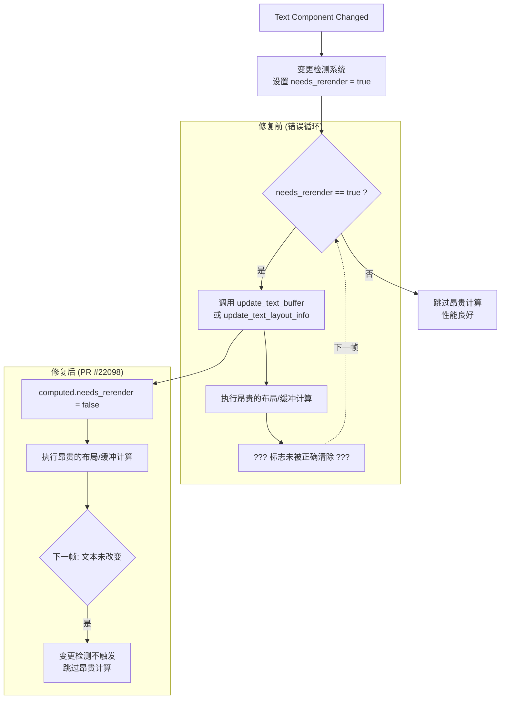

+++
title = "#22098 text2d change detection fix"
date = "2025-12-12T00:00:00"
draft = false
template = "pull_request_page.html"
in_search_index = false

[extra]
current_language = "zh-cn"
available_languages = {"en" = { name = "English", url = "/pull_request/bevy/2025-12/pr-22098-en-20251212" }, "zh-cn" = { name = "中文", url = "/pull_request/bevy/2025-12/pr-22098-zh-cn-20251212" }}
labels = ["C-Performance", "P-Regression", "A-Text"]
+++

# Title
text2d change detection fix

## Basic Information
- **Title**: text2d change detection fix
- **PR Link**: https://github.com/bevyengine/bevy/pull/22098
- **Author**: ickshonpe
- **Status**: MERGED
- **Labels**: C-Performance, S-Ready-For-Final-Review, P-Regression, A-Text
- **Created**: 2025-12-12T19:47:17Z
- **Merged**: 2025-12-12T20:41:36Z
- **Merged By**: mockersf

## Description Translation
**目标**

修复由于 #22051 破坏了 text2d 的变更检测而导致的性能回归问题。

修复 #22099。

**解决方案**

在 `update_text_buffer` 和 `update_text_layout_info` 函数的开始处，将文本实体的 `ComputedTextBlock::needs_rerender` 标志设置为 false。

**测试**

```
cargo run --example many_text2d --release
```

运行时的帧率应该大约是 main 分支的 400 倍。

## The Story of This Pull Request

这是一个关于性能回归修复的典型故事。它始于一个为了修复其他问题而进行的修改，但却无意中引入了一个严重得多的问题。PR #22051 原本旨在改进 Bevy 的变更检测机制，但它的改动影响了文本渲染流水线，特别是与 `text2d` 组件相关的部分，导致了一个严重的性能退化。具体表现是，`many_text2d` 示例的运行帧率大幅下降。

问题的根源在于变更检测逻辑中的一个微妙状态管理错误。在 Bevy 的 ECS 框架中，变更检测是优化性能的关键机制。它确保系统只在组件数据实际发生变化时才执行相应的工作。对于文本渲染，相关的状态被封装在 `ComputedTextBlock` 结构中，其中一个关键的布尔标志 `needs_rerender` 用于指示该文本块是否需要重新计算其布局和缓冲区。

当 PR #22051 修改了变更检测的行为后，它可能影响了 `needs_rerender` 标志的清除时机或逻辑。结果就是，系统误以为文本内容在每一帧都发生了变化。这触发了两个计算密集型的函数——`update_text_buffer`（更新顶点缓冲区和字形数据）和 `update_text_layout_info`（计算文本布局信息）——在每一帧都被调用，即使文本内容实际上是静态的。这正是 #22099 中报告的性能灾难的原因：帧率暴跌，因为每一帧都在不必要地重新计算和上传所有文本数据。

修复方案直接而有效。开发者 `ickshonpe` 没有尝试去调整复杂的变更检测交互逻辑，而是采取了更可靠的方法：在每次执行这两个核心更新函数时，都显式地将 `needs_rerender` 标志重置为 `false`。这个修复的逻辑是合理的：既然这些函数已经被调用（无论是由于变更检测的触发还是其他原因），它们就会完成文本所需的更新工作。在函数开始处重置标志，确保了在本次更新完成后，系统不会错误地认为文本“仍需要渲染”，从而避免了下一帧的无效重计算循环。

这个修复的优雅之处在于它的极简性。整个修改只涉及在 `crates/bevy_text/src/pipeline.rs` 文件的两个函数开头各添加一行代码：`computed.needs_rerender = false;`。代码的其余部分保持不变。这种“手术刀式”的修复最大限度地减少了引入新错误的可能性，并且完全专注于纠正错误的状态管理。

这个事件提供了一个关于软件维护的重要教训：即使是看似良性的、旨在修复其他问题的修改，也可能在系统的其他部分引发连锁反应，尤其是像变更检测这样贯穿整个引擎的核心机制。它也展示了有效的性能问题调试方法——识别出导致不必要工作的核心循环（这里是不当的标志状态），然后直接打断它。

最终，这个修复将 `many_text2d` 示例的性能恢复到了正常水平，正如描述中所说，帧率提升到了 main 分支（指修复前有问题的版本）的约 400 倍。这凸显了正确管理内部状态标志对于渲染性能的极端重要性。

## Visual Representation

下面的 Mermaid 图展示了本 PR 修复的核心流程，重点说明了 `needs_rerender` 标志的错误循环以及修复如何中断它：



## Key Files Changed

### `crates/bevy_text/src/pipeline.rs` (+4/-0)

这个文件是文本渲染流水线的核心。本次修改只增加了两行完全相同的代码，分别位于两个关键的函数中，用以修复 `needs_rerender` 标志的状态管理问题。

1.  **修改内容与原因**：在 `update_text_buffer` 和 `update_text_layout_info` 函数的开始处，显式地将 `computed.needs_rerender` 标志设置为 `false`。这确保了在完成文本更新后，该标志被正确清除，从而防止变更检测系统在下一帧误判文本需要再次更新，避免了昂贵的重复计算。

2.  **代码片段**：
    ```rust
    // 文件: crates/bevy_text/src/pipeline.rs
    // 在 `update_text_buffer` 函数中添加：
    pub fn update_text_buffer(
        &self,
        computed: &mut ComputedTextBlock,
        font_system: &mut CosmicFontSystem,
    ) -> Result<(), TextError> {
        computed.needs_rerender = false; // <-- 新增行
        // ... 函数的其余部分保持不变
    }

    // 在 `update_text_layout_info` 函数中添加：
    pub fn update_text_layout_info(
        &self,
        computed: &mut ComputedTextBlock,
        layout_info: &mut LayoutInfo,
        bounds: TextBounds,
        justify: Justify,
    ) -> Result<(), TextError> {
        computed.needs_rerender = false; // <-- 新增行
        // ... 函数的其余部分保持不变
    }
    ```

3.  **与PR目标的关联**：这两行简单的代码直接解决了性能回归问题。它们通过强制重置内部状态，打破了导致 `text2d` 实体在每一帧都进行不必要重绘的循环，从而恢复了正常的渲染性能。

## Further Reading

1.  **Bevy 变更检测官方文档**：了解 Bevy ECS 中变更检测系统的工作原理是理解此类问题的关键。可以查阅 Bevy 官方文档中关于 `Component` 和 `Query` 的章节，特别是过滤器如 `Changed`。
2.  **GitHub Issue #22099**: 查看原始的问题报告，可以了解性能回归的具体表现和用户反馈。
3.  **GitHub PR #22051**: 研究引入此回归的原始 PR，有助于理解看似不相关的修改如何影响核心系统，是学习软件工程中“蝴蝶效应”的典型案例。
4.  **Rendering Pipeline Optimization**: 对于更广泛的图形性能主题，可以学习关于减少状态变更、避免每帧重复提交静态数据等渲染优化技术。