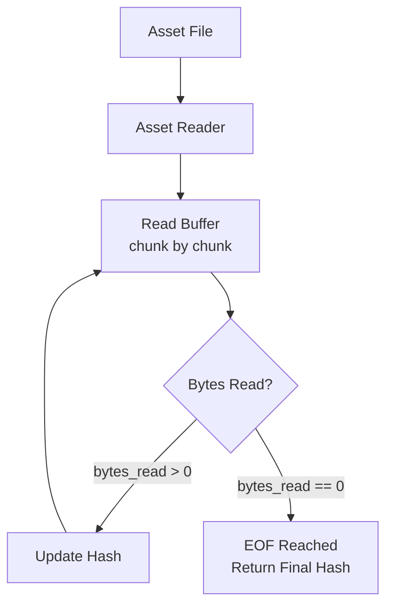

+++
title = "#22100 Fix wrong termination for asset hash reads."
date = "2025-12-13T00:00:00"
draft = false
template = "pull_request_page.html"
in_search_index = true

[taxonomies]
list_display = ["show"]

[extra]
current_language = "en"
available_languages = {"en" = { name = "English", url = "/pull_request/bevy/2025-12/pr-22100-en-20251213" }, "zh-cn" = { name = "中文", url = "/pull_request/bevy/2025-12/pr-22100-zh-cn-20251213" }}
labels = ["C-Bug", "D-Trivial", "A-Assets"]
+++

# Title

## Basic Information
- **Title**: Fix wrong termination for asset hash reads.
- **PR Link**: https://github.com/bevyengine/bevy/pull/22100
- **Author**: andriyDev
- **Status**: MERGED
- **Labels**: C-Bug, D-Trivial, A-Assets, S-Ready-For-Final-Review
- **Created**: 2025-12-12T20:33:24Z
- **Merged**: 2025-12-13T00:15:34Z
- **Merged By**: mockersf

## Description Translation
**Objective**
- #21925 changed the hash computation to read the file piece by piece. Unfortunately, the termination condition is wrong for this loop. We should only exit once the reader has no more bytes (`bytes_read == 0`), otherwise, the reader might partially fill the buffer, and that may be interpreted as an EOF.
- I originally did this check, but something was failing due to never terminating the read. Unclear what happened, maybe I got mixed up!

**Solution**
- Check if there are no bytes left rather than if the buffer is partially filled.

**Testing**
- Ran the asset tests with --all-features
- Ran the `asset_processor` example and it seems to work!

## The Story of This Pull Request

This PR addresses a specific bug in Bevy's asset hashing logic. The issue stems from a change made in a previous PR (#21925), which modified how file hashes are computed for assets. Instead of reading entire files into memory, the implementation was updated to process files in chunks for better memory efficiency when handling large assets. However, this change introduced an incorrect termination condition in the reading loop.

The core problem was in the loop termination logic within the `get_asset_hash` function. When reading a file piece by piece, the code needs to determine when it has reached the end of the file (EOF). The original implementation after PR #21925 used the condition `if bytes_read < buffer.len()` to break the loop. This condition is flawed because it triggers a break whenever the buffer isn't completely filled, which doesn't necessarily mean the end of the file has been reached.

Consider a scenario where a file is being read and the final chunk of data is smaller than the buffer size. In this case, the condition `bytes_read < buffer.len()` would correctly identify that we've reached EOF. However, the same condition would also trigger a break if the file read operation returned a partial buffer for any other reason before reaching EOF, such as network latency or file system behavior. This would cause the hashing to stop prematurely, resulting in an incorrect hash value being computed for the asset.

The correct approach, which is standard for stream reading patterns, is to continue reading until the read operation returns zero bytes. This is the definitive signal that the end of the stream has been reached. The fix changes the termination condition to `if bytes_read == 0`, ensuring the loop only exits when there are genuinely no more bytes to read.

This bug could have significant consequences in a real application. Asset hashes are used for caching, versioning, and change detection. An incorrect hash means the engine might fail to detect that an asset has changed, leading to stale cached data being used. Conversely, it might incorrectly flag unchanged assets as modified, causing unnecessary re-processing and performance degradation.

The implementation change is minimal but important. It's a single-line modification in the `meta.rs` file within the asset system. The author notes they originally considered this correct approach but encountered issues during testing that led them to use the incorrect condition instead. This highlights a common challenge in asynchronous I/O programming: understanding exactly when a read operation indicates EOF versus just a partial read. The solution follows standard Rust I/O patterns where a read returning `Ok(0)` indicates EOF.

## Visual Representation



## Key Files Changed

**File: `crates/bevy_asset/src/meta.rs`**

This file contains the asset metadata handling code, including the `get_asset_hash` function which computes hash values for asset files. The change fixes a logic error in the file reading loop that could cause premature termination of hash computation.

**Code Change:**
```rust
// File: crates/bevy_asset/src/meta.rs
// Before:
loop {
    let bytes_read = asset_reader.read(&mut buffer).await?;
    hasher.update(&buffer[..bytes_read]);
    if bytes_read < buffer.len() {
        // This means we've reached EOF, so we're done consuming asset bytes.
        break;
    }
}

// After:
loop {
    let bytes_read = asset_reader.read(&mut buffer).await?;
    hasher.update(&buffer[..bytes_read]);
    if bytes_read == 0 {
        // This means we've reached EOF, so we're done consuming asset bytes.
        break;
    }
}
```

The change replaces the condition `bytes_read < buffer.len()` with `bytes_read == 0`. This ensures the loop continues until the reader returns exactly zero bytes, which is the correct indicator that the end of the file has been reached. The previous condition would break the loop prematurely if the buffer was only partially filled, even if more data was available in the file.

## Further Reading

1. **Rust Async I/O Patterns**: The `tokio::io::AsyncRead` trait documentation provides details on how read operations signal EOF by returning `Ok(0)`.
2. **Bevy Asset System**: The Bevy book's section on assets explains how the asset system uses hashes for caching and change detection.
3. **Stream Processing**: General patterns for processing large files in chunks without loading them entirely into memory.
4. **Hash Functions in Rust**: How cryptographic and non-cryptographic hash functions work and their use cases in game engines for asset identification.