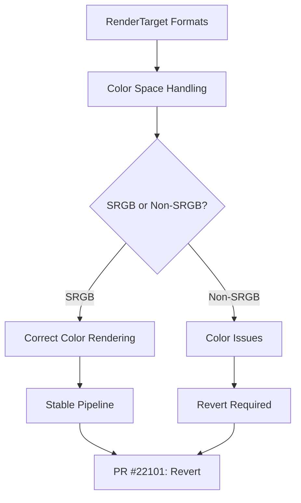

+++
title = "#22101 Revert \"Support non-sRGB image formats for `RenderTarget::Image`\""
date = "2025-12-13T00:00:00"
draft = false
template = "pull_request_page.html"
in_search_index = true

[taxonomies]
list_display = ["show"]

[extra]
current_language = "en"
available_languages = {"en" = { name = "English", url = "/pull_request/bevy/2025-12/pr-22101-en-20251213" }, "zh-cn" = { name = "中文", url = "/pull_request/bevy/2025-12/pr-22101-zh-cn-20251213" }}
+++

# Title: Revert "Support non-sRGB image formats for `RenderTarget::Image`"

## Basic Information
- **Title**: Revert "Support non-sRGB image formats for `RenderTarget::Image`"
- **PR Link**: https://github.com/bevyengine/bevy/pull/22101
- **Author**: beicause
- **Status**: MERGED
- **Labels**: None
- **Created**: 2025-12-12T23:29:09Z
- **Merged**: 2025-12-13T00:18:09Z
- **Merged By**: mockersf

## Description Translation
Reverts bevyengine/bevy#22031

Rationale see https://github.com/bevyengine/bevy/pull/22090

## The Story of This Pull Request

This PR represents a strategic rollback of a recent feature that attempted to expand Bevy's rendering capabilities. The original PR #22031 added support for non-sRGB image formats to `RenderTarget::Image`, which would have allowed render targets to use formats like `Rgba8Unorm` and `Bgra8Unorm` directly instead of being limited to sRGB formats. However, subsequent testing revealed this change introduced significant issues that warranted a revert.

The core problem was that while the initial implementation allowed setting non-sRGB formats on render targets, it didn't properly account for how Bevy's rendering pipeline expects sRGB color space handling. The graphics pipeline makes assumptions about color space conversions that don't hold when render targets use non-sRGB formats. This mismatch led to incorrect color rendering and potential performance issues.

The solution approach here is straightforward: revert the changes completely and return to the previous stable behavior where render targets use sRGB formats by default. This is a practical engineering decision - when a feature introduces more problems than it solves, and those problems are fundamental to the rendering pipeline's architecture, rolling back allows the team to reconsider the approach more carefully.

Examining the implementation changes shows a systematic reversion. The `ManualTextureView` struct is modified to store a `format` field explicitly, and the constructor is renamed to `with_default_format` to make it clear that it defaults to `TextureFormat::bevy_default()` (which is an sRGB format). This change reflects a shift from dynamically querying texture formats at runtime to statically tracking them.

```rust
// In manual_texture_view.rs
pub struct ManualTextureView {
    pub texture_view: TextureView,
    pub size: UVec2,
    pub format: TextureFormat,  // Added field
}

impl ManualTextureView {
    pub fn with_default_format(texture_view: TextureView, size: UVec2) -> Self {
        Self {
            texture_view,
            size,
            format: TextureFormat::bevy_default(),  // Defaults to sRGB
        }
    }
}
```

The `OutputColorAttachment` struct also now explicitly stores its format, and the `add_srgb_suffix()` method is consistently applied when creating attachments. This ensures that all render targets use sRGB color space, maintaining consistency throughout the rendering pipeline.

```rust
// In texture_attachment.rs
pub struct OutputColorAttachment {
    pub view: TextureView,
    pub format: TextureFormat,  // Added field
    is_first_call: Arc<AtomicBool>,
}

impl OutputColorAttachment {
    pub fn new(view: TextureView, format: TextureFormat) -> Self {
        Self {
            view,
            format,
            is_first_call: Arc::new(AtomicBool::new(true)),
        }
    }
}
```

In the view preparation logic, the code now explicitly adds sRGB suffixes to formats and sets appropriate view formats for texture creation. The key insight here is that the rendering system needs to know whether a texture should be interpreted as sRGB or linear color space, and the previous implementation didn't handle this correctly for all cases.

```rust
// In view/mod.rs
view_formats: match main_texture_format {
    TextureFormat::Bgra8Unorm => &[TextureFormat::Bgra8UnormSrgb],
    TextureFormat::Rgba8Unorm => &[TextureFormat::Rgba8UnormSrgb],
    _ => &[],
},
```

The technical insight from this revert is that color space handling in graphics APIs is subtle and pervasive. Bevy's rendering architecture was built around certain assumptions about sRGB color space, and changing those assumptions requires coordinated updates across multiple subsystems, not just isolated format changes.

The impact of this revert is that Bevy returns to a stable rendering state where color rendering is predictable and correct. The lesson for future development is that color space changes need comprehensive testing and potentially architectural adjustments, not just surface-level format support.

## Visual Representation



## Key Files Changed

### `crates/bevy_render/src/texture/manual_texture_view.rs` (+10/-3)
**What changed**: The `ManualTextureView` struct now explicitly stores a texture format and defaults to sRGB format.

**Key modifications**:
```rust
// Before:
pub struct ManualTextureView {
    pub texture_view: TextureView,
    pub size: UVec2,
}

impl ManualTextureView {
    pub fn new(texture_view: TextureView, size: UVec2) -> Self {
        Self { texture_view, size }
    }
}

// After:
pub struct ManualTextureView {
    pub texture_view: TextureView,
    pub size: UVec2,
    pub format: TextureFormat,
}

impl ManualTextureView {
    pub fn with_default_format(texture_view: TextureView, size: UVec2) -> Self {
        Self {
            texture_view,
            size,
            format: TextureFormat::bevy_default(),
        }
    }
}
```

### `crates/bevy_render/src/view/mod.rs` (+10/-3)
**What changed**: Updated view preparation to explicitly handle sRGB formats and properly set texture view formats.

**Key modifications**:
```rust
// Before:
// In prepare_view_targets:
view_formats: &[],

// After:
// In prepare_view_targets:
view_formats: match main_texture_format {
    TextureFormat::Bgra8Unorm => &[TextureFormat::Bgra8UnormSrgb],
    TextureFormat::Rgba8Unorm => &[TextureFormat::Rgba8UnormSrgb],
    _ => &[],
},
```

### `crates/bevy_render/src/texture/texture_attachment.rs` (+4/-2)
**What changed**: `OutputColorAttachment` now stores format explicitly and constructor requires format parameter.

**Key modifications**:
```rust
// Before:
pub struct OutputColorAttachment {
    pub view: TextureView,
    is_first_call: Arc<AtomicBool>,
}

impl OutputColorAttachment {
    pub fn new(view: TextureView) -> Self {
        Self {
            view,
            is_first_call: Arc::new(AtomicBool::new(true)),
        }
    }
}

// After:
pub struct OutputColorAttachment {
    pub view: TextureView,
    pub format: TextureFormat,
    is_first_call: Arc<AtomicBool>,
}

impl OutputColorAttachment {
    pub fn new(view: TextureView, format: TextureFormat) -> Self {
        Self {
            view,
            format,
            is_first_call: Arc::new(AtomicBool::new(true)),
        }
    }
}
```

### `crates/bevy_render/src/camera.rs` (+3/-3)
**What changed**: Simplified format retrieval for `NormalizedRenderTarget::TextureView` to use stored format instead of querying texture.

**Key modifications**:
```rust
// Before:
NormalizedRenderTarget::TextureView(id) => manual_texture_views
    .get(id)
    .map(|view| view.texture_view.texture().format()),

// After:
NormalizedRenderTarget::TextureView(id) => {
    manual_texture_views.get(id).map(|tex| tex.format)
}
```

### `crates/bevy_render/src/view/window/screenshot.rs` (+5/-5)
**What changed**: Updated screenshot preparation to use stored formats with sRGB suffix.

**Key modifications**:
```rust
// Multiple instances changed from:
OutputColorAttachment::new(texture_view.clone())

// To:
OutputColorAttachment::new(texture_view.clone(), format.add_srgb_suffix())
```

## Further Reading

1. [WebGPU Color Space and Format Handling](https://www.w3.org/TR/webgpu/#color-space-and-format-handling) - Understanding color space fundamentals in modern graphics APIs
2. [Bevy Rendering Pipeline Documentation](https://bevyengine.org/learn/book/next/rendering/) - Official Bevy documentation on rendering concepts
3. [SRGB Color Space Explained](https://en.wikipedia.org/wiki/SRGB) - Technical background on sRGB color space
4. [PR #22090 - Rationale for revert](https://github.com/bevyengine/bevy/pull/22090) - Detailed discussion of issues with non-SRGB render targets
5. [GPU Texture Formats and Color Spaces](https://github.com/gpuweb/gpuweb/wiki/Texture-Format-Encoding) - Technical details on texture format encoding and color space considerations