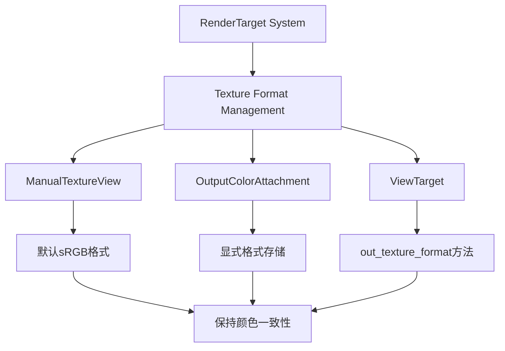

+++
title = "#22101 Revert \"Support non-sRGB image formats for `RenderTarget::Image`\""
date = "2025-12-13T00:00:00"
draft = false
template = "pull_request_page.html"
in_search_index = false

[extra]
current_language = "zh-cn"
available_languages = {"en" = { name = "English", url = "/pull_request/bevy/2025-12/pr-22101-en-20251213" }, "zh-cn" = { name = "中文", url = "/pull_request/bevy/2025-12/pr-22101-zh-cn-20251213" }}
+++

# Revert "Support non-sRGB image formats for `RenderTarget::Image`"

## 基本信息
- **标题**: Revert "Support non-sRGB image formats for `RenderTarget::Image`"
- **PR 链接**: https://github.com/bevyengine/bevy/pull/22101
- **作者**: beicause
- **状态**: 已合并
- **标签**: 无
- **创建时间**: 2025-12-12T23:29:09Z
- **合并时间**: 2025-12-13T00:18:09Z
- **合并者**: mockersf

## 描述翻译
撤销 bevyengine/bevy#22031

理由参见 https://github.com/bevyengine/bevy/pull/22090

## 这个 Pull Request 的故事

这个 PR 的故事是关于一个技术决策的回退。最初，PR #22031 试图支持非 sRGB 图像格式作为渲染目标，这是一个看似合理的功能扩展，但在实际实施后发现了问题。

开发者遇到的核心问题是，Bevy 的渲染管道在设计上假设颜色附件使用 sRGB 格式。这种假设遍布于整个渲染系统中，从颜色空间转换到后期处理效果。当 PR #22031 尝试移除这个假设时，虽然表面上看只是格式支持的扩展，但实际上破坏了整个渲染管道的一致性。

具体来说，问题出现在多个层面。首先，渲染管线的许多部分，特别是 tonemapping 和其他后期处理效果，都依赖于 sRGB 颜色空间进行正确的数学计算。其次，某些 GPU 硬件和驱动对混合非 sRGB 格式的支持不一致，导致跨平台兼容性问题。最重要的是，这种改变需要系统性地审查和修改大量代码，而不仅仅是表面上的格式支持。

从技术角度看，PR #22031 尝试通过直接从纹理资源查询格式来支持非 sRGB 格式。它修改了 `ManualTextureView` 结构，移除了显式的 `format` 字段，改为从底层纹理对象动态获取。类似地，`OutputColorAttachment` 也不再存储格式信息。这种设计看似更灵活，但实际上破坏了渲染管道中对格式一致性的假设。

这个撤销 PR 将代码恢复到之前的状态，重新引入了显式的格式字段。在 `manual_texture_view.rs` 中，`ManualTextureView` 结构现在包含一个 `format: TextureFormat` 字段。构造函数也相应地从 `new` 改为 `with_default_format`，默认使用 sRGB 格式：

```rust
pub struct ManualTextureView {
    pub texture_view: TextureView,
    pub size: UVec2,
    pub format: TextureFormat,  // 重新引入的字段
}

impl ManualTextureView {
    pub fn with_default_format(texture_view: TextureView, size: UVec2) -> Self {
        Self {
            texture_view,
            size,
            format: TextureFormat::bevy_default(),  // 默认使用 sRGB
        }
    }
}
```

类似地，`OutputColorAttachment` 也重新引入了格式字段：

```rust
#[derive(Clone)]
pub struct OutputColorAttachment {
    pub view: TextureView,
    pub format: TextureFormat,  // 重新引入的字段
    is_first_call: Arc<AtomicBool>,
}

impl OutputColorAttachment {
    pub fn new(view: TextureView, format: TextureFormat) -> Self {
        Self {
            view,
            format,  // 现在需要显式提供格式
            is_first_call: Arc::new(AtomicBool::new(true)),
        }
    }
}
```

这个回退决策体现了软件工程中的一个重要原则：有时看似简单的功能扩展实际上会触及系统的核心假设，需要更全面的重构。在这种情况下，支持非 sRGB 渲染目标不仅仅是添加格式支持的问题，而是需要重新设计整个颜色管理和渲染管道架构。

从技术细节来看，这个回退也修复了几个关键位置。在 `view/mod.rs` 中，`prepare_view_attachments` 函数现在正确地组合视图和格式：

```rust
.map(|(view, format)| {
    OutputColorAttachment::new(view.clone(), format.add_srgb_suffix())
})
```

而在 `prepare_view_targets` 函数中，我们重新添加了对 sRGB 视图格式的显式支持：

```rust
view_formats: match main_texture_format {
    TextureFormat::Bgra8Unorm => &[TextureFormat::Bgra8UnormSrgb],
    TextureFormat::Rgba8Unorm => &[TextureFormat::Rgba8UnormSrgb],
    _ => &[],
},
```

这个 PR 的技术洞察是：渲染系统的颜色管理是一个复杂的、系统性的问题。看似简单的格式支持变更可能引发连锁反应，影响颜色混合、后期处理、内存布局等多个方面。在游戏引擎这样的复杂系统中，保持一致性往往比追求灵活性更重要，特别是在核心渲染路径上。

## 视觉表示



## 关键文件变更

### `crates/bevy_render/src/texture/manual_texture_view.rs`
这个文件将 `ManualTextureView` 恢复到之前的设计，重新引入显式的格式字段。
```rust
// 变更前:
pub struct ManualTextureView {
    pub texture_view: TextureView,
    pub size: UVec2,
}

// 变更后:
pub struct ManualTextureView {
    pub texture_view: TextureView,
    pub size: UVec2,
    pub format: TextureFormat,  // 重新添加的字段
}

// 构造函数也相应变化:
// 变更前:
pub fn new(texture_view: TextureView, size: UVec2) -> Self

// 变更后:
pub fn with_default_format(texture_view: TextureView, size: UVec2) -> Self {
    Self {
        texture_view,
        size,
        format: TextureFormat::bevy_default(),  // 使用默认sRGB格式
    }
}
```

### `crates/bevy_render/src/texture/texture_attachment.rs`
`OutputColorAttachment` 重新引入格式字段，确保渲染管道知道附件的颜色格式。
```rust
// 变更前:
pub struct OutputColorAttachment {
    pub view: TextureView,
    is_first_call: Arc<AtomicBool>,
}

// 变更后:
pub struct OutputColorAttachment {
    pub view: TextureView,
    pub format: TextureFormat,  // 重新添加的字段
    is_first_call: Arc<AtomicBool>,
}
```

### `crates/bevy_render/src/view/mod.rs`
修复了视图准备逻辑，确保正确处理 sRGB 格式。
```rust
// 在 prepare_view_attachments 中:
// 变更前:
.map(OutputColorAttachment::new)

// 变更后:
.zip(target.get_texture_format(&windows, &images, &manual_texture_views))
.map(|(view, format)| {
    OutputColorAttachment::new(view.clone(), format.add_srgb_suffix())
})

// 在 prepare_view_targets 中重新添加 sRGB 视图格式支持:
view_formats: match main_texture_format {
    TextureFormat::Bgra8Unorm => &[TextureFormat::Bgra8UnormSrgb],
    TextureFormat::Rgba8Unorm => &[TextureFormat::Rgba8UnormSrgb],
    _ => &[],
},
```

### `crates/bevy_render/src/camera.rs`
简化了纹理格式获取逻辑，直接使用存储的格式而非从纹理查询。
```rust
// 变更前:
NormalizedRenderTarget::TextureView(id) => manual_texture_views
    .get(id)
    .map(|view| view.texture_view.texture().format()),

// 变更后:
NormalizedRenderTarget::TextureView(id) => {
    manual_texture_views.get(id).map(|tex| tex.format)
}
```

### `crates/bevy_render/src/view/window/screenshot.rs`
修复了截图系统的格式处理，确保与主渲染管道一致。
```rust
// 多个位置从:
OutputColorAttachment::new(texture_view.clone())

// 改为:
OutputColorAttachment::new(texture_view.clone(), format.add_srgb_suffix())
```

## 延伸阅读

- [Bevy 渲染管道文档](https://bevyengine.org/learn/book/getting-started/setup/)
- [WebGPU 纹理格式规范](https://gpuweb.github.io/gpuweb/#texture-formats)
- [sRGB 颜色空间与线性颜色空间](https://en.wikipedia.org/wiki/SRGB)
- [游戏引擎中的颜色管理](https://docs.unrealengine.com/4.27/en-US/RenderingAndGraphics/PostProcessEffects/ColorGrading/)