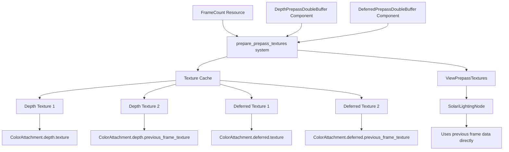

+++
title = "#22102 Solari: Double buffer prepass textures"
date = "2025-12-14T00:00:00"
draft = false
template = "pull_request_page.html"
in_search_index = true

[taxonomies]
list_display = ["show"]

[extra]
current_language = "en"
available_languages = {"en" = { name = "English", url = "/pull_request/bevy/2025-12/pr-22102-en-20251214" }, "zh-cn" = { name = "中文", url = "/pull_request/bevy/2025-12/pr-22102-zh-cn-20251214" }}
labels = ["C-Bug", "A-Rendering"]
+++

# Title

## Basic Information
- **Title**: Solari: Double buffer prepass textures
- **PR Link**: https://github.com/bevyengine/bevy/pull/22102
- **Author**: JMS55
- **Status**: MERGED
- **Labels**: C-Bug, A-Rendering, S-Ready-For-Final-Review
- **Created**: 2025-12-13T03:49:13Z
- **Merged**: 2025-12-14T21:49:27Z
- **Merged By**: alice-i-cecile

## Description Translation
Fixes Solari crashing with `Partial copy of 0..1600 on X dimension with size 3200 is not supported for the Source texture format Depth32Float with 1 samples` after #21746.

Also slightly better performance by avoiding the copy.

Code is extremely cludgy though, we're just piling hacks upon hacks for the prepass texture stuff.

## The Story of This Pull Request

This pull request addresses a critical crash in Bevy's Solari rendering system and introduces a double-buffering mechanism for prepass textures. The issue manifested after a previous change (#21746) and represents a practical optimization to avoid texture copies while fixing a compatibility problem with GPU texture operations.

The problem originated in the Solari lighting system, which relies on temporal data from previous frames. Before this PR, Solari would create separate textures to store the previous frame's g-buffer and depth data, then copy the current frame's prepass textures into these staging textures at the end of the render pass. This copy operation used `command_encoder.copy_texture_to_texture()` to transfer data from the prepass textures to dedicated "previous frame" textures.

The crash occurred because recent changes in the prepass system removed `COPY_SRC` usage flags from depth textures in certain configurations. When Solari attempted to copy from these depth textures, it would fail with an error about unsupported partial copies on `Depth32Float` formatted textures. The error message indicated a mismatch between the copy source range (0..1600) and the texture's actual size (3200), suggesting the system was attempting to copy only a portion of the texture, which isn't supported for depth formats.

The developer's solution was to implement double-buffering for prepass textures instead of using explicit copies. This approach maintains two textures for each prepass type (depth and deferred), alternating their use between frames. On even frames, texture A serves as the current frame and texture B as the previous frame; on odd frames, they swap roles. This eliminates the need for explicit copies entirely since the previous frame's data is already available in the other texture.

The implementation required changes across several systems. New marker components were added: `DepthPrepassDoubleBuffer` and `DeferredPrepassDoubleBuffer`. These components are automatically added when Solari lighting is enabled and signal that the system should allocate double-buffered textures. The texture preparation system in `core_3d/mod.rs` was modified to conditionally create two textures instead of one when these components are present.

A key design change was the extension of the `ColorAttachment` struct to include a `previous_frame_texture` field. This allows the render graph to pass both the current and previous frame's textures through a single attachment object. The `ViewPrepassTextures` struct was updated with methods like `previous_depth_view()` and `previous_deferred_view()` to access the historical data.

In the Solari lighting node, the code was significantly simplified by removing the texture copy operations and the associated texture management. Instead of managing its own separate "previous" textures, Solari now directly uses the double-buffered textures provided by the prepass system. This reduces memory usage, eliminates GPU copy operations, and fixes the compatibility issue.

The developer acknowledges in the PR description that this solution is "extremely cludgy" and represents "hacks upon hacks for the prepass texture stuff." This comment highlights technical debt in Bevy's rendering architecture, where prepass texture management has evolved through incremental patches rather than a cohesive design. The double-buffering logic is tied to frame count parity checks (`frame_count.is_multiple_of(2)`), which works but isn't the most elegant solution.

Performance-wise, this change provides a small improvement by removing the texture copy operations, which consume both GPU time and memory bandwidth. The elimination of these copies is particularly beneficial for high-resolution rendering where texture data transfer can be expensive.

The fix demonstrates a common pattern in graphics programming: when explicit data transfers become problematic or inefficient, double-buffering often provides a cleaner solution. By maintaining two buffers and alternating their roles, systems can access historical data without expensive copies or synchronization barriers.

From an architectural perspective, this PR shows the challenges of evolving a complex rendering pipeline. The prepass system wasn't originally designed with temporal techniques in mind, leading to workarounds like texture copies that eventually broke. The double-buffering approach integrates better with the existing prepass infrastructure while supporting temporal rendering needs.

## Visual Representation



## Key Files Changed

### `crates/bevy_core_pipeline/src/core_3d/mod.rs` (+123/-22)
This file contains the core implementation of the double-buffering logic. The key changes include:
1. Adding import for `FrameCount` resource to track frame parity
2. Modifying `prepare_prepass_textures` to create two textures when double-buffering is enabled
3. Implementing the `package_double_buffered_texture` helper function to select which texture is current/previous based on frame count

```rust
// File: crates/bevy_core_pipeline/src/core_3d/mod.rs
// Key change: Texture creation with double-buffering support
let cached_depth_texture1 = depth_prepass.then(|| {
    depth_textures1
        .entry(camera.target.clone())
        .or_insert_with(|| {
            let descriptor = TextureDescriptor {
                label: Some("prepass_depth_texture_1"),
                size,
                mip_level_count: 1,
                sample_count: msaa.samples(),
                dimension: TextureDimension::D2,
                format: CORE_3D_DEPTH_FORMAT,
                usage: TextureUsages::COPY_DST
                    | TextureUsages::RENDER_ATTACHMENT
                    | TextureUsages::TEXTURE_BINDING,
                view_formats: &[],
            };
            texture_cache.get(&render_device, descriptor)
        })
        .clone()
});

let cached_depth_texture2 = depth_prepass_double_buffer.then(|| {
    depth_textures2
        .entry(camera.target.clone())
        .or_insert_with(|| {
            let descriptor = TextureDescriptor {
                label: Some("prepass_depth_texture_2"),
                size,
                mip_level_count: 1,
                sample_count: msaa.samples(),
                dimension: TextureDimension::D2,
                format: CORE_3D_DEPTH_FORMAT,
                usage: TextureUsages::COPY_DST
                    | TextureUsages::RENDER_ATTACHMENT
                    | TextureUsages::TEXTURE_BINDING,
                view_formats: &[],
            };
            texture_cache.get(&render_device, descriptor)
        })
        .clone()
});
```

### `crates/bevy_core_pipeline/src/prepass/mod.rs` (+24/-0)
This file defines the new marker components and adds methods to access previous frame textures.

```rust
// File: crates/bevy_core_pipeline/src/prepass/mod.rs
// New component definitions
#[derive(Component, Default, Reflect, Clone)]
#[reflect(Component, Default, Clone)]
#[require(DepthPrepass)]
pub struct DepthPrepassDoubleBuffer;

#[derive(Component, Default, Reflect, Clone)]
#[reflect(Component, Default, Clone)]
#[require(DeferredPrepass)]
pub struct DeferredPrepassDoubleBuffer;

// New accessor methods
pub fn previous_depth_view(&self) -> Option<&TextureView> {
    self.depth
        .as_ref()
        .and_then(|t| t.previous_frame_texture.as_ref().map(|t| &t.default_view))
}
```

### `crates/bevy_solari/src/realtime/node.rs` (+6/-28)
This file removes the texture copy operations that were causing the crash.

```rust
// File: crates/bevy_solari/src/realtime/node.rs
// Before: Texture copy operations that caused the crash
command_encoder.copy_texture_to_texture(
    view_prepass_textures
        .deferred
        .clone()
        .unwrap()
        .texture
        .texture
        .as_image_copy(),
    solari_lighting_resources.previous_gbuffer.0.as_image_copy(),
    solari_lighting_resources.view_size.to_extents(),
);
command_encoder.copy_texture_to_texture(
    view_prepass_textures
        .depth
        .clone()
        .unwrap()
        .texture
        .texture
        .as_image_copy(),
    solari_lighting_resources.previous_depth.0.as_image_copy(),
    solari_lighting_resources.view_size.to_extents(),
);

// After: No copy operations - uses double-buffered textures directly
// The node now accesses previous frame textures via:
// view_prepass_textures.previous_deferred_view()
// view_prepass_textures.previous_depth_view()
```

### `crates/bevy_solari/src/realtime/prepare.rs` (+0/-29)
This file removes the creation of separate previous frame textures, since they're now provided by the prepass system.

### `crates/bevy_solari/src/realtime/mod.rs` (+12/-2)
This file updates the `SolariLighting` component to require the new double-buffer components.

```rust
// File: crates/bevy_solari/src/realtime/mod.rs
// Updated component requirements
#[require(
    Hdr,
    DeferredPrepass,
    DepthPrepass,
    MotionVectorPrepass,
    DeferredPrepassDoubleBuffer,
    DepthPrepassDoubleBuffer
)]
pub struct SolariLighting {
    // ...
}
```

### `crates/bevy_render/src/texture/texture_attachment.rs`
This file was modified to add the `previous_frame_texture` field to `ColorAttachment`, enabling the double-buffering data flow.

## Further Reading

1. **Bevy Rendering Documentation**: The Bevy book's rendering section covers the prepass system and how it integrates with the render graph.
2. **Temporal Anti-Aliasing (TAA)**: Solari uses temporal data similar to TAA techniques. Understanding TAA helps explain why previous frame data is needed.
3. **GPU Texture Double-Buffering**: This is a common technique in graphics programming to avoid synchronization and copy operations between frames.
4. **wgpu Texture Usage Flags**: The `TextureUsages` enum documentation explains the constraints around different texture operations and why certain formats can't be copied partially.
5. **Bevy PR #21746**: The previous change that removed `COPY_SRC` usage from prepass textures, which necessitated this fix.