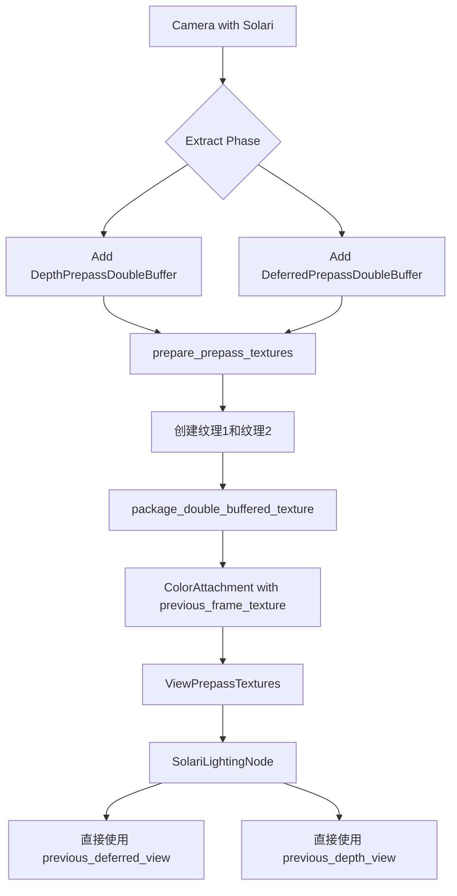

+++
title = "#22102 Solari: Double buffer prepass textures"
date = "2025-12-14T00:00:00"
draft = false
template = "pull_request_page.html"
in_search_index = false

[extra]
current_language = "zh-cn"
available_languages = {"en" = { name = "English", url = "/pull_request/bevy/2025-12/pr-22102-en-20251214" }, "zh-cn" = { name = "中文", url = "/pull_request/bevy/2025-12/pr-22102-zh-cn-20251214" }}
+++

# Title

## Basic Information
- **Title**: Solari: Double buffer prepass textures
- **PR链接**: https://github.com/bevyengine/bevy/pull/22102
- **作者**: JMS55
- **状态**: 已合并
- **标签**: C-Bug, A-Rendering, S-Ready-For-Final-Review
- **创建时间**: 2025-12-13T03:49:13Z
- **合并时间**: 2025-12-14T21:49:27Z
- **合并者**: alice-i-cecile

## 描述翻译
修复了 Solari 在 #21746 之后崩溃的问题，错误信息为 `Partial copy of 0..1600 on X dimension with size 3200 is not supported for the Source texture format Depth32Float with 1 samples`。

同时通过避免拷贝操作，略微提升了性能。

代码目前非常粗糙，我们只是在 prepass 纹理处理上堆叠 hack。

## 这个 PR 的故事

这个 PR 解决了一个由 #21746 引入的、在特定渲染配置下导致 Solari 崩溃的问题。根本原因在于纹理拷贝操作与某些纹理格式（如 `Depth32Float`）不兼容。开发者没有仅仅修复这个崩溃，而是选择实施一个更彻底的解决方案：为 prepass 纹理实现双缓冲机制。

### 问题与背景

在 #21746 之后，Solari 渲染技术在特定条件下会崩溃，具体错误是尝试对深度纹理（`Depth32Float` 格式）进行部分拷贝，但该操作不被支持。这个错误发生在 `bevy_solari` 模块的 `node.rs` 文件中，其中存在显式的 `copy_texture_to_texture` 调用，用于将当前帧的深度和延迟 prepass 纹理拷贝到专门的"上一帧"纹理中，以供下一帧进行时间性（temporal）计算使用。

这种做法存在几个问题：
1. **兼容性问题**：某些纹理格式（尤其是深度格式）不支持部分拷贝。
2. **性能开销**：每次渲染都需要进行全纹理拷贝。
3. **代码冗余**：维护单独的"上一帧"纹理增加了资源管理的复杂性。

### 解决方案

开发者采用了双缓冲（double buffering）的方案。核心思想是：为每个需要时间性数据的 prepass 纹理（深度和延迟）创建两个纹理缓冲区，然后在每一帧交替使用它们作为"当前帧"和"上一帧"的纹理。

实现策略包括：
1. **新增组件标记**：引入 `DepthPrepassDoubleBuffer` 和 `DeferredPrepassDoubleBuffer` 组件来标记需要双缓冲的相机。
2. **扩展纹理管理**：在 `prepare_prepass_textures` 系统中为需要双缓冲的相机创建两套纹理。
3. **修改纹理附件结构**：扩展 `ColorAttachment` 结构以包含 `previous_frame_texture` 字段。
4. **交替逻辑**：根据帧数的奇偶性决定哪套纹理是"当前帧"的，哪套是"上一帧"的。
5. **移除冗余拷贝**：删除 `bevy_solari` 中显式的纹理拷贝代码，直接使用双缓冲提供的"上一帧"纹理。

### 技术实现细节

让我们深入几个关键的技术点：

**双缓冲纹理的包装逻辑**：
```rust
fn package_double_buffered_texture(
    texture1: Option<CachedTexture>,
    texture2: Option<CachedTexture>,
    frame_count: u32,
) -> Option<ColorAttachment> {
    match (texture1, texture2) {
        (Some(t1), None) => Some(ColorAttachment::new(
            t1,
            None,
            None,
            Some(LinearRgba::BLACK),
        )),
        (Some(t1), Some(t2)) if frame_count.is_multiple_of(2) => Some(ColorAttachment::new(
            t1,
            None,
            Some(t2),
            Some(LinearRgba::BLACK),
        )),
        (Some(t1), Some(t2)) => Some(ColorAttachment::new(
            t2,
            None,
            Some(t1),
            Some(LinearRgba::BLACK),
        )),
        _ => None,
    }
}
```
这个函数根据帧数决定纹理的当前/上一帧关系。当帧数为偶数时，`texture1` 作为当前帧纹理，`texture2` 作为上一帧纹理；奇数帧时则相反。这种交替确保了每一帧都能访问到前一帧的数据。

**Solari 节点的简化**：
修改前的 Solari 节点需要显式拷贝纹理：
```rust
// 修改前：显式拷贝操作
command_encoder.copy_texture_to_texture(
    view_prepass_textures.deferred.clone().unwrap().texture.texture.as_image_copy(),
    solari_lighting_resources.previous_gbuffer.0.as_image_copy(),
    solari_lighting_resources.view_size.to_extents(),
);
```

修改后，Solari 节点直接从 prepass 纹理中获取上一帧的视图：
```rust
// 修改后：直接使用双缓冲提供的上一帧纹理
view_prepass_textures.previous_deferred_view(),
view_prepass_textures.previous_depth_view(),
```

**纹理使用标志的清理**：
双缓冲实现后，prepass 纹理不再需要 `COPY_SRC` 使用标志：
```rust
// 修改前：需要 COPY_SRC 用于拷贝
usage: TextureUsages::COPY_DST | TextureUsages::RENDER_ATTACHMENT | TextureUsages::TEXTURE_BINDING | TextureUsages::COPY_SRC,

// 修改后：移除了 COPY_SRC
usage: TextureUsages::COPY_DST | TextureUsages::RENDER_ATTACHMENT | TextureUsages::TEXTURE_BINDING,
```

### 技术洞察

这个实现展示了几个重要的渲染技术概念：

1. **双缓冲模式**：这是一种常见的时间性抗锯齿和时间性特效技术。通过交替使用两套缓冲区，避免了数据竞争和昂贵的拷贝操作。

2. **纹理格式限制**：不同纹理格式支持的操作不同。`Depth32Float` 格式的纹理通常不支持部分区域拷贝，这是导致原始崩溃的根本原因。

3. **渲染图（Render Graph）集成**：这个修改需要跨多个渲染图节点协调，包括 prepass 节点和 Solari 光照节点。通过扩展 `ViewPrepassTextures` 的 API，提供了统一的访问接口。

4. **条件性双缓冲**：不是所有相机都需要双缓冲，只有启用 Solari 光照的相机才需要。这通过条件性组件添加来实现，避免了不必要的资源分配。

### 影响与改进

这个 PR 带来的具体改进包括：

1. **修复崩溃**：彻底解决了深度纹理拷贝不支持的问题。
2. **性能提升**：移除了每帧的全纹理拷贝操作，减少了 GPU 带宽使用。
3. **代码简化**：移除了 `bevy_solari` 中维护独立"上一帧"纹理的复杂逻辑。
4. **更好的架构**：将时间性数据的处理统一到核心渲染管线中，减少了模块间的耦合。

然而，作者也明确指出了当前的实现仍然"非常粗糙"，是在已有 prepass 纹理处理上的"堆叠 hack"。这表明未来可能需要更系统性的重构来改进 prepass 纹理的管理架构。

## 可视化表示



## 关键文件变更

### `crates/bevy_core_pipeline/src/core_3d/mod.rs` (+123/-22)
**变更描述**：实现了 prepass 纹理的双缓冲逻辑，包括纹理创建、打包和条件性启用。

**关键代码片段**：
```rust
// 新增：双缓冲纹理打包函数
fn package_double_buffered_texture(
    texture1: Option<CachedTexture>,
    texture2: Option<CachedTexture>,
    frame_count: u32,
) -> Option<ColorAttachment> {
    // 根据帧数交替使用两套纹理
    match (texture1, texture2) {
        (Some(t1), None) => Some(ColorAttachment::new(t1, None, None, Some(LinearRgba::BLACK))),
        (Some(t1), Some(t2)) if frame_count.is_multiple_of(2) => 
            Some(ColorAttachment::new(t1, None, Some(t2), Some(LinearRgba::BLACK))),
        (Some(t1), Some(t2)) => 
            Some(ColorAttachment::new(t2, None, Some(t1), Some(LinearRgba::BLACK))),
        _ => None,
    }
}
```

### `crates/bevy_core_pipeline/src/prepass/mod.rs` (+24/-0)
**变更描述**：新增双缓冲组件和访问上一帧纹理的方法。

**关键代码片段**：
```rust
// 新增：深度prepass双缓冲组件
#[derive(Component, Default, Reflect, Clone)]
#[reflect(Component, Default, Clone)]
#[require(DepthPrepass)]
pub struct DepthPrepassDoubleBuffer;

// 新增：访问上一帧纹理的方法
pub fn previous_depth_view(&self) -> Option<&TextureView> {
    self.depth
        .as_ref()
        .and_then(|t| t.previous_frame_texture.as_ref().map(|t| &t.default_view))
}
```

### `crates/bevy_solari/src/realtime/node.rs` (+6/-28)
**变更描述**：Solari光照节点现在直接使用双缓冲提供的上一帧纹理，移除了显式的纹理拷贝。

**关键代码片段**：
```rust
// 修改前：需要显式拷贝纹理
command_encoder.copy_texture_to_texture(...);

// 修改后：直接使用上一帧纹理视图
Some(previous_gbuffer),
Some(previous_depth_buffer),
```

### `crates/bevy_solari/src/realtime/prepare.rs` (+0/-29)
**变更描述**：移除了为上一帧纹理分配独立资源的代码，因为现在这些纹理由核心管线管理。

**关键代码片段**：
```rust
// 删除的代码：不再需要独立创建和存储上一帧纹理
pub previous_gbuffer: (Texture, TextureView),
pub previous_depth: (Texture, TextureView),
```

### `crates/bevy_render/src/texture/texture_attachment.rs` (+1/-0)
**变更描述**：扩展`ColorAttachment`结构以支持双缓冲，添加了`previous_frame_texture`字段。

**关键代码片段**：
```rust
pub struct ColorAttachment {
    pub texture: CachedTexture,
    pub resolve_target: Option<CachedTexture>,
    pub previous_frame_texture: Option<CachedTexture>, // 新增字段
    clear_color: Option<LinearRgba>,
    is_first_call: Arc<AtomicBool>,
}
```

## 进一步阅读

1. **Bevy渲染图文档**：了解Bevy的渲染图系统如何组织渲染操作
   - https://bevyengine.org/learn/quick-start/introduction/

2. **时间性渲染技术**：双缓冲在时间性抗锯齿和光照中的应用
   - "Temporal Antialiasing in Unreal 4" - Brian Karis

3. **WebGPU纹理操作限制**：理解不同纹理格式支持的操作
   - https://www.w3.org/TR/webgpu/#texture-format-caps

4. **双缓冲模式**：计算机图形学中的经典双缓冲技术
   - "Double Buffering" pattern in game programming

5. **Bevy Solari模块**：Solari实时全局光照系统的实现原理
   - Bevy源码中的`bevy_solari`模块文档