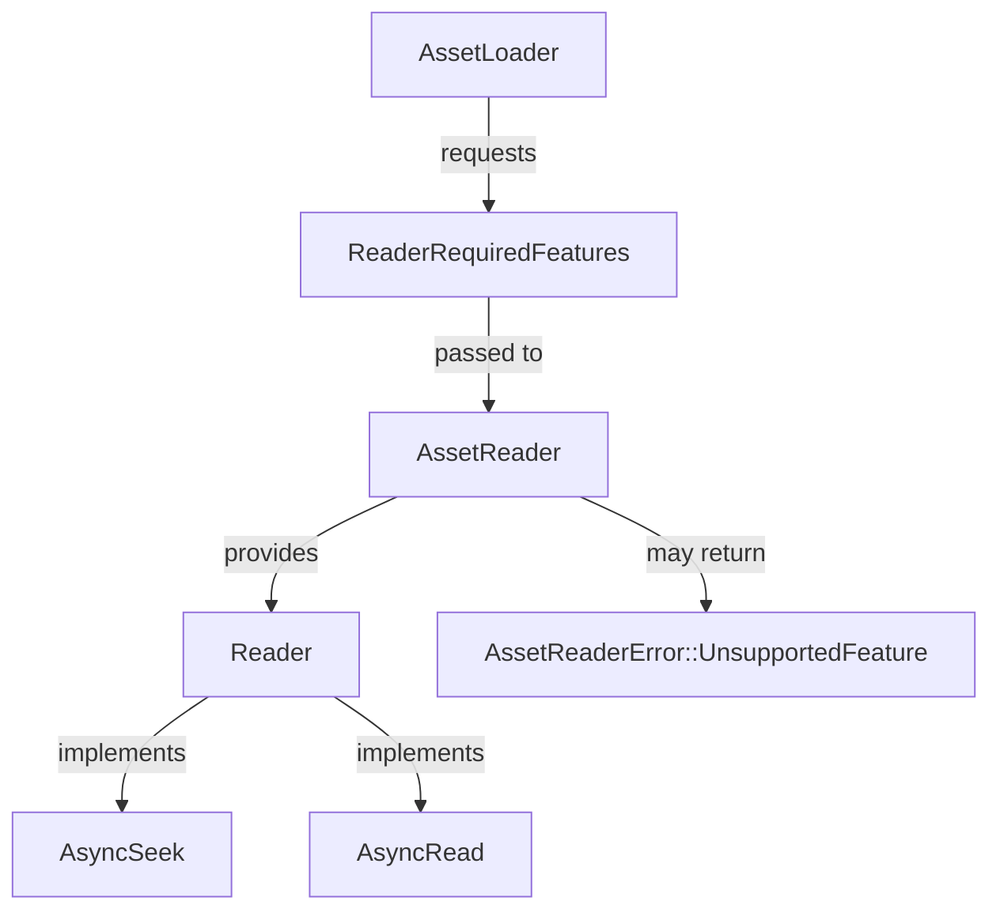

+++
title = "#22104 Allow `Reader` to implement `AsyncSeek` and provide a way for loaders to \"ask\" for a compatible reader."
date = "2025-12-16T00:00:00"
draft = false
template = "pull_request_page.html"
in_search_index = true

[taxonomies]
list_display = ["show"]

[extra]
current_language = "en"
available_languages = {"en" = { name = "English", url = "/pull_request/bevy/2025-12/pr-22104-en-20251216" }, "zh-cn" = { name = "中文", url = "/pull_request/bevy/2025-12/pr-22104-zh-cn-20251216" }}
labels = ["C-Feature", "A-Assets", "M-Migration-Guide", "M-Release-Note", "D-Straightforward"]
+++

# Title: Allow `Reader` to implement `AsyncSeek` and provide a way for loaders to "ask" for a compatible reader.

## Basic Information
- **Title**: Allow `Reader` to implement `AsyncSeek` and provide a way for loaders to "ask" for a compatible reader.
- **PR Link**: https://github.com/bevyengine/bevy/pull/22104
- **Author**: andriyDev
- **Status**: MERGED
- **Labels**: C-Feature, A-Assets, S-Ready-For-Final-Review, M-Migration-Guide, M-Release-Note, D-Straightforward
- **Created**: 2025-12-13T08:20:13Z
- **Merged**: 2025-12-16T04:08:21Z
- **Merged By**: cart

## Description Translation
# Objective

- In #14194, we replaced `AsyncSeek` with `AsyncSeekForward`. This allowed us to support more kinds of sources, but the cost was that loaders were more limited in what they could do with the reader.
- Archive-like things generally use offsets relative to the start of the file. `AsyncSeekForward` made it difficult to deal with this (or impossible in some cases).
- This is a step towards #21641.
- Fixes #12880.

## Solution

- Allow `AssetLoader` to say which "features" of a reader it needs.
- Pass that list of features to `AssetReader` so it can decide how to handle it.
- Add a new `AssetReaderError::UnsupportedFeature`.

This design is kind of "weak" - there's no guarantee that a loader that requests `AnySeek` will get a reader that actually implements `AsyncSeek`. Or on the other side, there's no guarantee that a loader actually requests the features that it uses. However, in practice it's likely enough: errors are likely to guide users to the correct situation. In the future, we could perhaps have a "sieve reader", which blocks any features the loader didn't explicitly request. Perhaps this is a debug only feature, or something that can be toggled.

## Testing

- Ran the modified examples. They still seem to work!

## The Story of This Pull Request

The asset system in Bevy has an abstraction layer where asset loaders read data through a `Reader` trait. Previously, in PR #14194, the system moved from requiring `AsyncSeek` to requiring `AsyncSeekForward` to support asset sources that only allow forward seeking (like HTTP streams). This change solved the immediate problem but created a new limitation: asset loaders that needed to seek arbitrarily (not just forward) could no longer do so.

The specific issue was that archive formats and other complex asset types often need to seek relative to the start of a file or seek backward, which `AsyncSeekForward` didn't support. This made certain asset types difficult or impossible to load through the standard asset system.

The solution in this PR introduces a negotiation mechanism between asset loaders and asset readers. Instead of hardcoding the seeking capabilities, we now allow loaders to specify what features they need from a reader, and readers can decide how to handle those requests. This is implemented through a new `ReaderRequiredFeatures` struct that gets passed from the loader to the reader.

At the core of this change is the reintroduction of the standard `AsyncSeek` trait requirement on `Reader`, replacing the custom `AsyncSeekForward` trait. However, we don't require all readers to fully implement all seeking operations. Instead, readers can choose to implement only partial seeking support and return errors for operations they don't support. The `ReaderRequiredFeatures` mechanism helps ensure that loaders only request features that the reader can provide.

The implementation involves changes across multiple layers of the asset system:

1. **Trait changes**: The `Reader` trait now requires `AsyncSeek` instead of `AsyncSeekForward`. The `AssetReader::read` method now takes a `ReaderRequiredFeatures` parameter.

2. **Loader communication**: Asset loaders can now implement a `reader_required_features` method to specify what kind of seeking they need. This defaults to forward-only seeking.

3. **Reader adaptation**: All existing reader implementations were updated to:
   - Implement `AsyncSeek` (often by delegating to the underlying implementation or providing custom logic)
   - Handle the new `required_features` parameter in their `read` methods
   - Return appropriate errors for unsupported features

4. **Error handling**: A new `AssetReaderError::UnsupportedFeature` error type was added to communicate when a reader cannot satisfy the loader's requirements.

The design is intentionally "weak" in the sense that there's no compile-time guarantee that a loader's feature requests will be honored. However, in practice, the runtime error messages will guide users to the correct configuration. The system could be strengthened in the future with a "sieve reader" that actively prevents loaders from using features they didn't request.

One notable technical detail is how the implementation handles the transition from `AsyncSeekForward` to `AsyncSeek`. For many reader implementations, the change was straightforward because they were already wrapping types that implement `AsyncSeek`. For others, like the memory-based readers, helper functions were added (`slice_read`, `slice_seek`, `read_to_end`) to reduce code duplication.

The changes also affected the asset processor, which needed to be updated to pass the correct feature requirements when loading assets for processing. This ensures that processors can use the same seeking capabilities as regular asset loaders.

From an architectural perspective, this change makes the asset system more flexible without sacrificing backward compatibility. Loaders that only need forward seeking continue to work as before, while loaders that need arbitrary seeking can now request it and get appropriate support or clear error messages.

## Visual Representation



## Key Files Changed

### `crates/bevy_asset/src/io/mod.rs` (+184/-157)
This is the core file where the major trait changes happened. The `AsyncSeekForward` trait was removed and replaced with the standard `AsyncSeek` trait requirement on `Reader`. New types were added: `ReaderRequiredFeatures`, `SeekKind`, and `UnsupportedReaderFeature` error.

**Key changes:**
```rust
// Before: Reader required AsyncSeekForward
pub trait Reader: AsyncRead + AsyncSeekForward + Unpin + Send + Sync { ... }

// After: Reader requires AsyncSeek
pub trait Reader: AsyncRead + AsyncSeek + Unpin + Send + Sync { ... }

// New type for loader to specify needs
pub struct ReaderRequiredFeatures {
    pub seek: SeekKind,
}

pub enum SeekKind {
    #[default]
    OnlyForward,
    AnySeek,
}

// AssetReader::read now takes required_features
pub trait AssetReader: Send + Sync + 'static {
    fn read<'a>(
        &'a self,
        path: &'a Path,
        required_features: ReaderRequiredFeatures,
    ) -> impl AssetReaderFuture<Value: Reader + 'a>;
}
```

### `crates/bevy_asset/src/io/memory.rs` (+33/-43)
Updated the memory-based reader implementations to use the new helper functions for consistency and to properly implement `AsyncSeek`.

**Key changes:**
```rust
// Before: Custom AsyncSeekForward implementation
impl AsyncSeekForward for DataReader {
    fn poll_seek_forward(
        mut self: Pin<&mut Self>,
        _cx: &mut core::task::Context<'_>,
        offset: u64,
    ) -> Poll<std::io::Result<u64>> { ... }
}

// After: Uses helper function for AsyncSeek
impl AsyncSeek for DataReader {
    fn poll_seek(
        self: Pin<&mut Self>,
        _cx: &mut core::task::Context<'_>,
        pos: SeekFrom,
    ) -> Poll<std::io::Result<u64>> {
        let this = self.get_mut();
        Poll::Ready(crate::io::slice_seek(
            this.data.value(),
            &mut this.bytes_read,
            pos,
        ))
    }
}
```

### `crates/bevy_asset/src/loader.rs` (+45/-21)
Updated the asset loader trait to include the `reader_required_features` method and modified how loaders interact with readers.

**Key changes:**
```rust
pub trait AssetLoader: TypePath + Send + Sync + 'static {
    // ... existing methods ...
    
    fn reader_required_features(_settings: &Self::Settings) -> ReaderRequiredFeatures {
        ReaderRequiredFeatures::default()
    }
}

pub trait ErasedAssetLoader: Send + Sync + 'static {
    // ... existing methods ...
    
    fn reader_required_features(&self, settings: &dyn Settings) -> ReaderRequiredFeatures;
}
```

### `crates/bevy_asset/src/processor/mod.rs` (+41/-20)
Updated the asset processor to handle the new feature requirements when loading assets for processing.

**Key changes:**
```rust
// When processing assets, now use the processor's required features
let reader_features = processor.reader_required_features(settings)?;
let reader_for_process = reader
    .read(path, reader_features)
    .await
    .map_err(reader_err)?;
```

### `release-content/migration-guides/readers_impl_async_seek.md` (+53/-0)
Added migration guide for users implementing custom readers and loaders.

**Key content:**
```markdown
The `Reader` trait no longer requires implementing `AsyncSeekForward` and instead requires
implementing `AsyncSeek`. Each reader will have its own unique implementation so implementing this
will be case specific.
```

## Further Reading

1. **Original issue**: #12880 - Details the problem with archive-like assets needing arbitrary seeking
2. **Previous change**: #14194 - The PR that introduced `AsyncSeekForward` and removed `AsyncSeek`
3. **Future direction**: #21641 - The larger goal this PR is a step toward
4. **Async traits in Rust**: Understanding `AsyncRead`, `AsyncSeek`, and how to implement them properly
5. **Bevy Asset System**: The overall architecture of Bevy's asset loading pipeline

# Full Code Diff
*(Provided in the original prompt)*